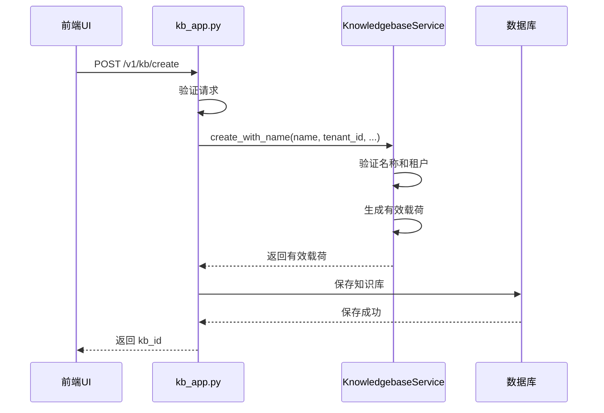
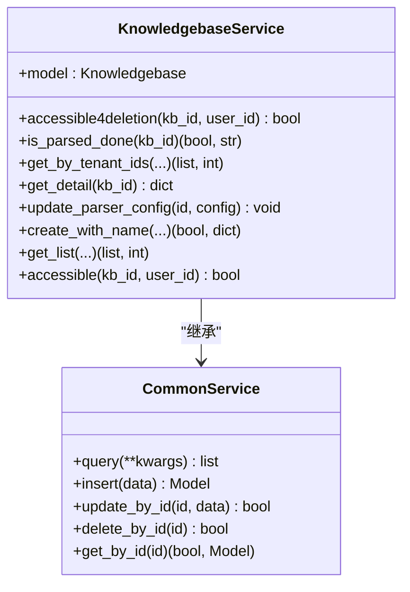
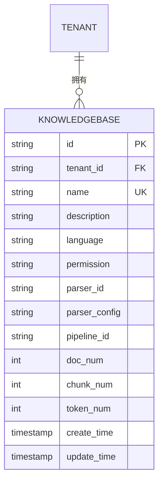
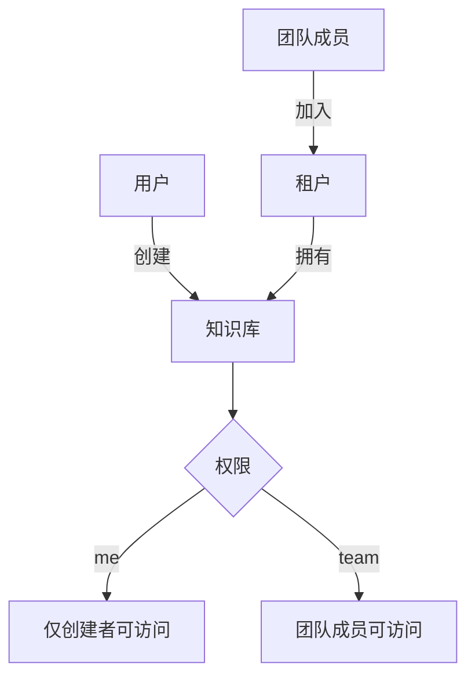
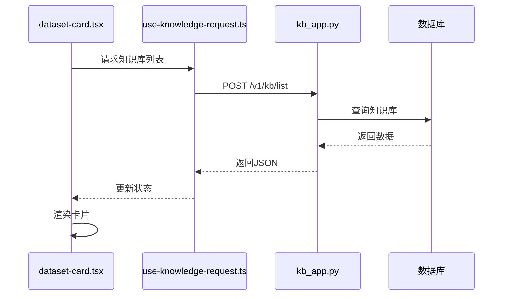

# 知识库管理

<cite>
**本文档引用的文件**   
- [knowledgebase_service.py](file://api/db/services/knowledgebase_service.py)
- [kb_app.py](file://api/apps/kb_app.py)
- [db_models.py](file://api/db/db_models.py)
- [dataset-card.tsx](file://web/src/pages/datasets/dataset-card.tsx)
- [dataset-table.tsx](file://web/src/pages/dataset/dataset/dataset-table.tsx)
- [chunk-method-dialog.tsx](file://web/src/components/chunk-method-dialog/index.tsx)
- [permission.ts](file://web/src/constants/permission.ts)
- [check_team_permission.py](file://api/common/check_team_permission.py)
</cite>

## 目录
1. [简介](#简介)
2. [知识库生命周期管理](#知识库生命周期管理)
3. [核心服务与数据库模型](#核心服务与数据库模型)
4. [配置选项与解析器](#配置选项与解析器)
5. [权限与团队共享](#权限与团队共享)
6. [前端UI与API集成](#前端ui与api集成)
7. [常见问题与故障排除](#常见问题与故障排除)
8. [结论](#结论)

## 简介
知识库是RAGFlow系统的核心组件，用于存储、组织和检索文档信息。本指南详细阐述了知识库的创建、配置、文档上传、权限管理以及与团队共享的完整流程。我们将深入分析`KnowledgebaseService`类的核心方法，如`create_kb`、`update_kb`和`delete_kb`，以及它们如何与数据库模型交互。此外，本文档还将说明知识库的配置选项（如分块策略、解析器选择和元数据设置），并提供实际的API调用示例，阐述知识库与文档处理流水线的集成点，以及前端UI组件（如`dataset-table.tsx`）如何与后端API通信。

**Section sources**
- [knowledgebase_service.py](file://api/db/services/knowledgebase_service.py#L32-L566)

## 知识库生命周期管理
知识库的生命周期管理涵盖了从创建到删除的全过程，包括更新和详细信息查询。这些操作主要通过`kb_app.py`中的API端点和`KnowledgebaseService`中的业务逻辑来实现。

### 创建知识库
创建知识库是通过`kb_app.py`中的`/create` API端点触发的。该端点首先验证请求，然后调用`KnowledgebaseService.create_with_name`方法来准备知识库的初始数据。此方法会进行名称验证、租户验证，并构建包含唯一ID、名称、租户ID等信息的有效载荷。最终，该有效载荷被保存到数据库中。

**Diagram sources **
- [kb_app.py](file://api/apps/kb_app.py#L48-L68)
- [knowledgebase_service.py](file://api/db/services/knowledgebase_service.py#L374-L429)

### 更新知识库
更新知识库通过`/update` API端点实现。在执行更新前，系统会进行严格的权限检查，确保只有知识库的创建者或拥有删除权限的用户才能进行修改。更新操作会修改知识库的名称、描述、解析器ID等属性，并在必要时更新Elasticsearch中的优先级信息。

**Section sources**
- [kb_app.py](file://api/apps/kb_app.py#L71-L150)

### 删除知识库
删除知识库是一个级联操作。`/rm` API端点首先检查删除权限，然后遍历并删除该知识库下的所有文档。在删除文档的同时，相关的文件记录和文件到文档的映射也会被清除。最后，知识库本身从数据库中移除，并从文档存储（如Elasticsearch）中删除其索引。

**Section sources**
- [kb_app.py](file://api/apps/kb_app.py#L219-L258)

## 核心服务与数据库模型
知识库管理的核心是`KnowledgebaseService`类和`Knowledgebase`数据库模型。它们定义了知识库的结构、行为和数据持久化方式。

### KnowledgebaseService 类
`KnowledgebaseService`是管理知识库操作的核心服务类。它继承自`CommonService`，并提供了专门用于知识库管理的方法。

**Diagram sources **
- [knowledgebase_service.py](file://api/db/services/knowledgebase_service.py#L32-L566)

### Knowledgebase 数据库模型
`Knowledgebase`模型定义了知识库在数据库中的结构。它包含了知识库的元数据，如名称、描述、语言、权限设置，以及统计信息，如文档数量、分块数量和token数量。

**Diagram sources **
- [db_models.py](file://api/db/db_models.py#L600-L650)

## 配置选项与解析器
知识库的配置是其功能的核心，决定了文档如何被解析和分块。配置主要通过`parser_id`和`parser_config`字段进行管理。

### 分块策略与解析器选择
知识库支持多种解析器，每种解析器对应不同的分块策略。例如，`naive`解析器进行简单的文本分块，而`table`解析器则专门用于处理表格数据。用户可以在创建或更新知识库时选择解析器。

| 解析器类型 | 描述 | 适用场景 |
| :--- | :--- | :--- |
| `naive` | 基于token数量的简单分块 | 通用文本 |
| `qa` | 将文档解析为问答对 | FAQ、问答文档 |
| `table` | 识别并保留表格结构 | Excel、CSV、PDF表格 |
| `paper` | 识别学术论文结构 | 研究论文、技术报告 |
| `book` | 处理书籍的章节结构 | 电子书、长篇文档 |
| `picture` | 提取图片中的文本 | 扫描件、图像文件 |

**Section sources**
- [chunk-method-dialog.tsx](file://web/src/components/chunk-method-dialog/index.tsx#L68-L75)
- [chunk-method-form.tsx](file://web/src/pages/dataset/dataset-setting/chunk-method-form.tsx#L21-L37)

### 元数据设置
`parser_config`是一个JSON字段，允许用户为特定解析器配置详细的参数。例如，可以设置`chunk_token_num`来控制每个分块的最大token数，或设置`topn_tags`来指定自动标签提取的数量。

**Section sources**
- [test_update_document.py](file://test/testcases/test_sdk_api/test_file_management_within_dataset/test_update_document.py#L201-L403)

## 权限与团队共享
知识库的权限管理确保了数据的安全性和协作性。系统通过`permission`字段和租户（tenant）模型来控制访问。

### 权限模型
知识库的权限分为两种：
- **个人 (`me`)**：只有创建者可以访问。
- **团队 (`team`)**：同一租户（团队）内的所有成员都可以访问。

**Diagram sources **
- [permission.ts](file://web/src/constants/permission.ts#L1-L4)
- [check_team_permission.py](file://api/common/check_team_permission.py#L25-L59)

### 团队共享流程
要与团队共享知识库，用户需要在知识库设置中将权限从“仅我”更改为“团队”。后端通过`check_kb_team_permission`函数验证用户是否属于知识库所属的租户，从而决定其访问权限。

**Section sources**
- [share_agents.md](file://docs/guides/team/share_agents.md#L12-L17)
- [permission-form-field.tsx](file://web/src/pages/dataset/dataset-setting/permission-form-field.tsx#L1-L31)

## 前端UI与API集成
前端UI组件与后端API紧密协作，为用户提供直观的知识库管理界面。

### 知识库列表与卡片视图
`datasets/index.tsx`组件负责渲染知识库列表。它通过`useFetchNextKnowledgeListByPage` Hook调用`list_kbs` API来获取知识库数据，并使用`DatasetCard`组件展示每个知识库的摘要信息，包括文档数量和所有者。

**Diagram sources **
- [index.tsx](file://web/src/pages/datasets/index.tsx#L21-L127)
- [dataset-card.tsx](file://web/src/pages/datasets/dataset-card.tsx#L1-L55)
- [use-knowledge-request.ts](file://web/src/hooks/use-knowledge-request.ts#L128-L176)

### 文档管理与分块配置
`dataset-table.tsx`组件提供了对知识库内文档的管理功能。`chunk-method-dialog.tsx`组件则允许用户为文档选择分块方法和配置解析器参数，这些配置最终通过API传递给`KnowledgebaseService`进行处理。

**Section sources**
- [dataset-table.tsx](file://web/src/pages/dataset/dataset/dataset-table.tsx#L43-L103)
- [chunk-method-dialog.tsx](file://web/src/components/chunk-method-dialog/index.tsx#L40-L257)

## 常见问题与故障排除
以下是使用知识库时可能遇到的常见问题及其解决方案。

### 上传失败
**问题**：文档上传后状态长时间为“解析中”。
**原因**：文档解析任务可能因资源不足或解析器错误而卡住。
**解决方案**：
1. 检查系统日志以获取错误信息。
2. 确认文档格式是否被支持。
3. 尝试重新上传文档。

### 权限错误
**问题**：用户无法访问或修改知识库。
**原因**：用户没有相应的权限，或知识库权限设置不正确。
**解决方案**：
1. 确认用户是否属于正确的租户。
2. 检查知识库的`permission`设置，确保其为“团队”以便共享。
3. 确保用户是知识库的创建者（对于个人知识库）。

### 配置不生效
**问题**：更改了分块策略或解析器配置，但新上传的文档未按预期处理。
**原因**：配置可能未正确保存，或文档在配置更改前已开始解析。
**解决方案**：
1. 确认`parser_config`已通过`update_parser_config`方法成功更新。
2. 对于已存在的文档，可能需要重新解析。
3. 检查API调用的响应，确保没有返回错误。

## 结论
RAGFlow的知识库管理系统提供了一套强大而灵活的工具，用于组织和利用非结构化数据。通过理解`KnowledgebaseService`的核心方法、数据库模型、配置选项和权限机制，用户可以有效地创建和管理知识库。前端UI与后端API的紧密集成确保了操作的流畅性，而清晰的故障排除指南则帮助用户快速解决常见问题。掌握这些知识将使用户能够充分利用RAGFlow的潜力，构建高效的智能应用。