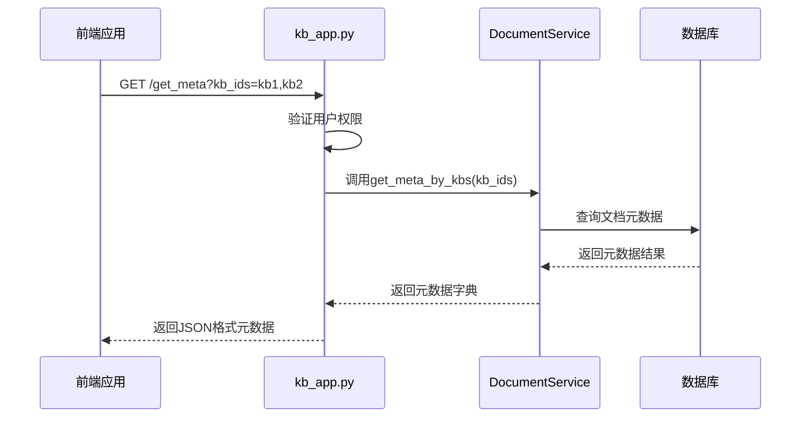
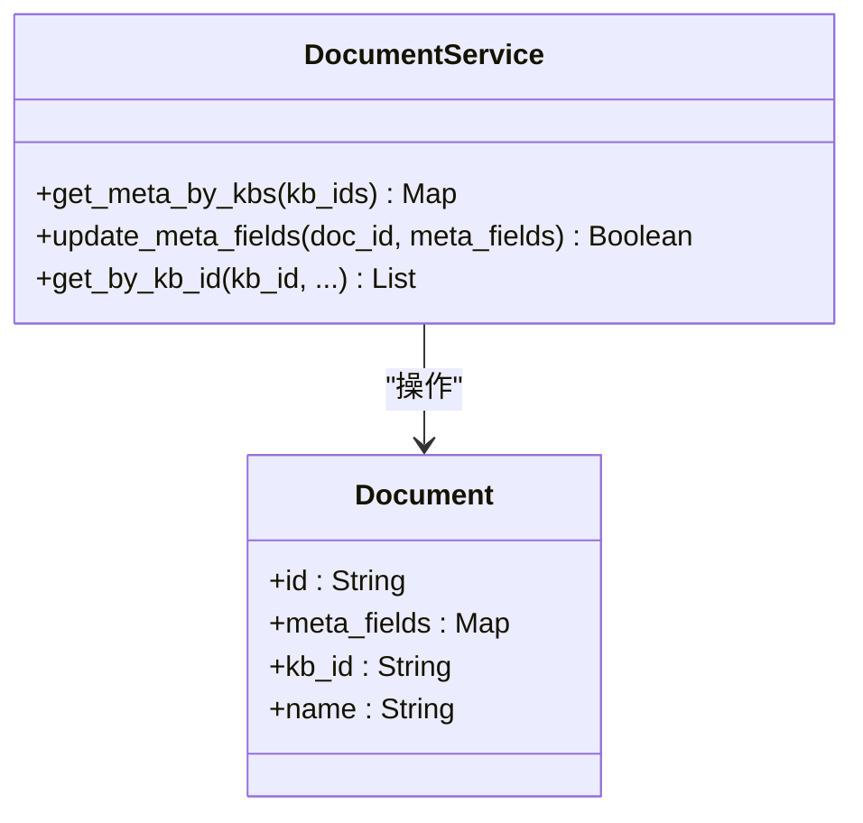
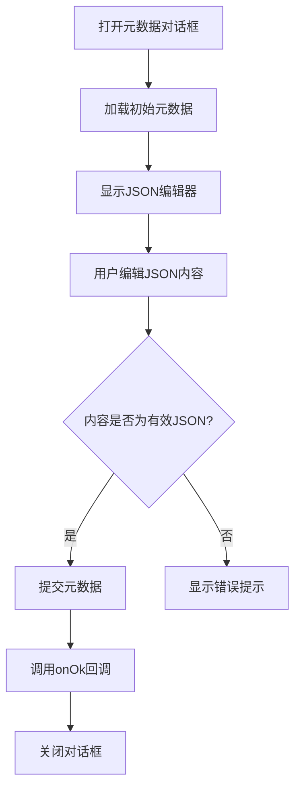
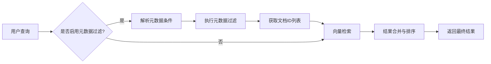

# 元数据管理

<cite>
**本文档引用的文件**   
- [kb_app.py](file://api/apps/kb_app.py)
- [knowledgebase_service.py](file://api/db/services/knowledgebase_service.py)
- [document_service.py](file://api/db/services/document_service.py)
- [set-meta-dialog.tsx](file://web/src/pages/dataset/dataset/set-meta-dialog.tsx)
- [use-save-meta.ts](file://web/src/pages/dataset/dataset/use-save-meta.ts)
- [metadata-filter.tsx](file://web/src/components/metadata-filter/index.tsx)
- [metadata-filter-conditions.tsx](file://web/src/components/metadata-filter/metadata-filter-conditions.tsx)
- [meta_filter.md](file://rag/prompts/meta_filter.md)
- [metadata_utils.py](file://common/metadata_utils.py)
- [ob_conn.py](file://rag/utils/ob_conn.py)
- [generator.py](file://rag/prompts/generator.py)
</cite>

## 更新摘要
**变更内容**   
- 重构了元数据过滤逻辑，修复了数值类型过滤的TypeError问题
- 新增了元数据提取的严格提示模板以确保准确性
- 更新了`meta_filter`函数的数值比较逻辑
- 增强了`get_metadata_filter_expression`函数的数据库查询表达式生成能力

## 目录
1. [元数据配置概述](#元数据配置概述)
2. [API端点与业务逻辑](#api端点与业务逻辑)
3. [前端用户交互流程](#前端用户交互流程)
4. [高级检索最佳实践](#高级检索最佳实践)
5. [常见问题与解决方案](#常见问题与解决方案)

## 元数据配置概述

元数据配置功能允许用户为知识库和文档设置自定义元数据字段，这些字段在检索和过滤过程中发挥重要作用。系统支持通过JSON格式为单个文档添加元数据，如作者、日期、部门等信息。这些元数据不会被直接用于向量检索，但会在检索到相关文档后，将其内容注入到LLM的提示词（prompt）中，从而增强生成内容的上下文信息。

根据文档指南，元数据必须以有效的JSON格式输入，否则更新将不会生效。值得注意的是，系统目前不支持批量设置元数据，必须为每个文档单独配置。当用户在聊天中查询时，如果检索到的文档包含元数据，系统会自动将这些信息添加到提示词中，例如显示文档名称、作者和日期等。

**Section sources**
- [set_metadata.md](file://docs/guides/dataset/set_metadata.md#L1-L32)
- [vi.ts](file://web/src/locales/vi.ts#L178-L182)

## API端点与业务逻辑

### 元数据更新API端点

`kb_app.py`文件中定义了处理元数据操作的API端点。核心功能包括获取知识库元数据和更新文档元数据。

`get_meta`端点（`/get_meta`）用于获取指定知识库的元数据信息。该端点首先验证用户对知识库的访问权限，然后调用`DocumentService.get_meta_by_kbs`方法从数据库中检索元数据。此端点接受`kb_ids`参数，支持同时查询多个知识库的元数据。

**Diagram sources**
- [kb_app.py](file://api/apps/kb_app.py#L394-L406)
- [document_service.py](file://api/db/services/document_service.py#L644-L661)

### KnowledgebaseService业务逻辑

`KnowledgebaseService`类提供了知识库管理的核心业务逻辑。虽然该服务本身不直接处理文档元数据的CRUD操作，但它提供了访问控制和数据查询的基础功能。

`accessible`方法用于检查用户是否可以访问特定知识库，这是所有元数据操作的前提条件。该方法通过查询用户租户关系来验证权限，确保只有授权用户才能进行元数据操作。

`get_by_id`和`get_by_ids`方法用于获取知识库实例，这些实例包含了知识库的基本信息，为元数据操作提供了上下文环境。服务还提供了`get_by_tenant_ids`等批量查询方法，支持基于租户的多知识库操作。

**Section sources**
- [knowledgebase_service.py](file://api/db/services/knowledgebase_service.py#L472-L487)
- [knowledgebase_service.py](file://api/db/services/knowledgebase_service.py#L250-L292)

### DocumentService元数据处理

`DocumentService`类负责具体的文档元数据处理逻辑。`get_meta_by_kbs`方法是元数据检索的核心，它从数据库中查询指定知识库的所有文档元数据，并将其组织成特定的数据结构。

该方法返回一个字典，其结构为：`{元数据键: {元数据值: [文档ID列表]}}`。这种结构优化了基于元数据的过滤查询，使得系统能够快速找到具有特定元数据值的文档集合。

**Diagram sources**
- [document_service.py](file://api/db/services/document_service.py#L644-L661)
- [document_service.py](file://api/db/services/document_service.py#L48-L77)

## 前端用户交互流程

### SetMetaDialog组件分析

`set-meta-dialog.tsx`组件实现了元数据设置的用户界面。该组件使用React Hook Form进行表单管理，并集成Monaco Editor提供JSON编辑功能。

组件的主要流程包括：
1. 接收`initialMetaData`属性，将其序列化为格式化的JSON字符串并填充到编辑器中
2. 使用Zod进行表单验证，确保输入内容为有效的JSON格式
3. 提交时将JSON字符串传递给`onOk`回调函数
4. 提供实时的输入验证和错误提示

**Diagram sources**
- [set-meta-dialog.tsx](file://web/src/pages/dataset/dataset/set-meta-dialog.tsx#L32-L129)

### 元数据保存Hook

`use-save-meta.ts`文件定义了`useSaveMeta` Hook，它封装了元数据保存的业务逻辑。该Hook通过`useSetDocumentMeta` Hook与后端API进行通信。

主要功能包括：
- 管理"设置元数据"对话框的显示状态
- 处理表单提交逻辑
- 调用API更新文档元数据
- 管理加载状态

当用户点击保存按钮时，`onSetMetaModalOk`函数会被触发，它将JSON字符串作为`meta`参数传递给`setDocumentMeta`函数，完成元数据更新操作。

**Section sources**
- [use-save-meta.ts](file://web/src/pages/dataset/dataset/use-save-meta.ts#L6-L45)

### 元数据过滤组件

前端还提供了元数据过滤功能，允许用户基于元数据条件进行文档检索。`metadata-filter.tsx`和`metadata-filter-conditions.tsx`组件共同实现了这一功能。

过滤器支持两种模式：
- **自动模式**：系统根据用户查询自动推断过滤条件
- **手动模式**：用户手动设置过滤条件

`useFetchKnowledgeMetadata` Hook用于获取知识库中所有文档的元数据结构，为过滤器提供可用的元数据字段选项。

**Section sources**
- [metadata-filter.tsx](file://web/src/components/metadata-filter/index.tsx#L30-L81)
- [metadata-filter-conditions.tsx](file://web/src/components/metadata-filter/metadata-filter-conditions.tsx#L28-L161)

## 高级检索最佳实践

### 元数据驱动的检索策略

利用元数据实现高级检索的最佳实践包括：

1. **作者过滤**：为文档添加"author"字段，实现按作者检索特定内容
2. **日期范围查询**：使用"date"字段结合">="和"<"操作符实现时间范围过滤
3. **部门分类**：通过"department"字段对文档进行部门分类，支持按部门检索
4. **状态标记**：使用"status"字段标记文档状态（如草稿、已审核等），实现状态过滤

### 检索流程优化

系统通过`meta_filter`函数实现元数据过滤。该函数接受元数据结构、过滤条件和逻辑操作符（and/or），返回符合条件的文档ID列表。

对于复杂查询，建议采用以下策略：
- 使用"and"逻辑确保所有条件都满足
- 使用"or"逻辑扩大检索范围
- 结合向量相似度检索和元数据过滤，实现混合检索

**Diagram sources**
- [meta_filter.md](file://rag/prompts/meta_filter.md#L3-L67)
- [chunk_app.py](file://api/apps/chunk_app.py#L316-L333)

## 常见问题与解决方案

### 元数据不显示问题

**问题原因**：
- 元数据格式不是有效的JSON
- 前端缓存未及时更新
- 权限不足导致无法读取元数据

**解决方案**：
1. 确保元数据输入为有效的JSON格式
2. 刷新页面或重新加载知识库
3. 检查用户对知识库的访问权限

### 过滤无效问题

**问题原因**：
- 元数据字段名称拼写错误
- 过滤条件与实际元数据值不匹配
- 逻辑操作符使用不当

**解决方案**：
1. 使用`get_meta`API验证实际的元数据结构
2. 确保过滤条件中的字段名和值与元数据完全匹配
3. 正确使用逻辑操作符（and/or）

### 文档内容不同步问题

**问题原因**：
- 文档更新后未重新解析
- 元数据更新未触发索引更新
- 缓存机制导致数据延迟

**解决方案**：
1. 在更新文档内容后重新执行解析流程
2. 确保元数据更新操作触发相应的索引更新
3. 实现适当的缓存失效策略，保证数据一致性

**Section sources**
- [dify_retrieval.py](file://api/apps/sdk/dify_retrieval.py#L73-L124)
- [test_update_document.py](file://test/testcases/test_http_api/test_file_management_within_dataset/test_update_document.py#L132-L144)