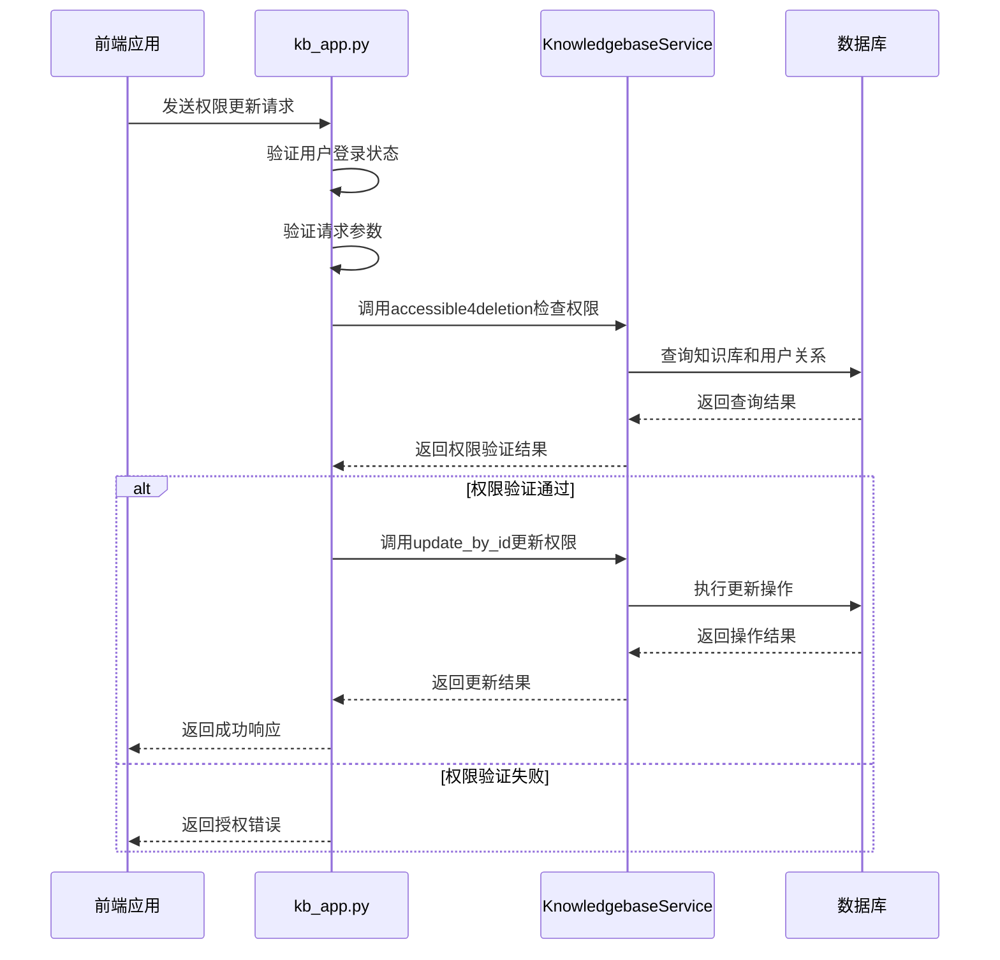
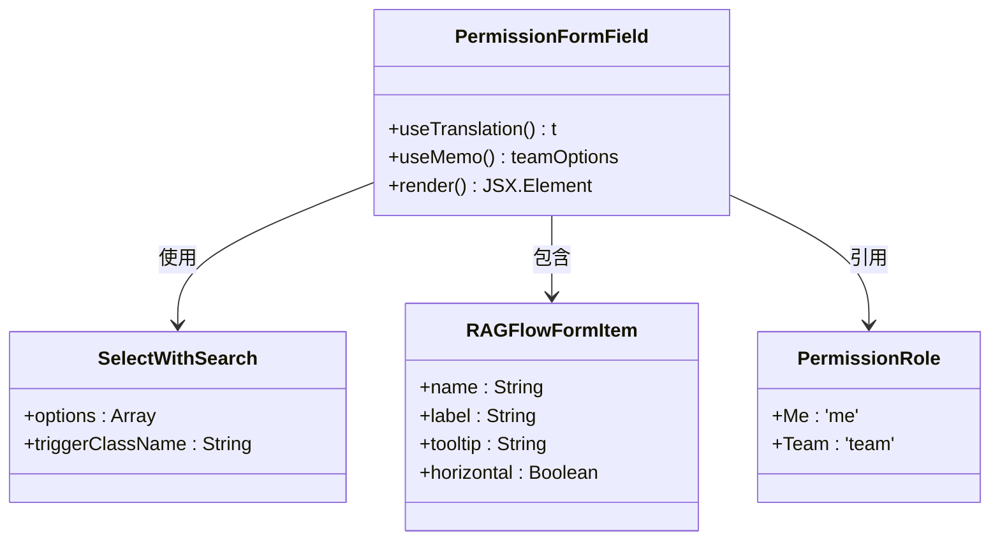

# 权限配置

<cite>
**本文档中引用的文件**  
- [kb_app.py](file://api/apps/kb_app.py)
- [knowledgebase_service.py](file://api/db/services/knowledgebase_service.py)
- [permission.ts](file://web/src/constants/permission.ts)
- [permission-form-field.tsx](file://web/src/pages/dataset/dataset-setting/permission-form-field.tsx)
- [db_models.py](file://api/db/db_models.py)
- [check_team_permission.py](file://api/common/check_team_permission.py)
</cite>

## 目录
1. [简介](#简介)
2. [权限模型](#权限模型)
3. [API接口分析](#api接口分析)
4. [前端组件实现](#前端组件实现)
5. [团队协作最佳实践](#团队协作最佳实践)
6. [常见问题排查](#常见问题排查)
7. [结论](#结论)

## 简介
RAGFlow系统提供了一套完整的知识库权限配置机制，支持公开、私有和团队共享等多种权限级别。该系统通过后端API服务、数据库模型和前端UI组件的协同工作，实现了细粒度的访问控制。权限配置不仅决定了知识库的可见性和可访问性，还影响着团队成员之间的协作效率。本文档将深入分析权限系统的架构设计、核心实现和最佳实践，帮助用户更好地理解和使用这一功能。

## 权限模型
RAGFlow的权限模型基于租户（Tenant）和团队（Team）的概念，通过`TenantPermission`枚举定义了两种主要的权限级别：`ME`（仅自己）和`TEAM`（团队共享）。知识库的权限控制主要通过`Knowledgebase`数据库模型中的`permission`字段实现，该字段的默认值为"me"，表示知识库创建者独享访问权限。

当权限设置为"team"时，知识库将对同一租户下的所有团队成员开放。权限验证逻辑分布在多个服务层中，核心验证方法包括`accessible`和`accessible4deletion`。`accessible`方法检查用户是否可以访问特定知识库，而`accessible4deletion`则专门用于验证删除权限，要求用户必须是知识库的创建者。

权限模型还与用户租户关系（UserTenant）紧密结合，通过`UserTenantService`服务查询用户加入的租户列表，并据此判断用户是否有权访问特定知识库。这种设计实现了灵活的团队协作机制，既保证了数据安全，又促进了知识共享。

**Section sources**
- [db_models.py](file://api/db/db_models.py#L733-L768)
- [knowledgebase_service.py](file://api/db/services/knowledgebase_service.py#L32-L84)
- [check_team_permission.py](file://api/common/check_team_permission.py#L25-L38)

## API接口分析
知识库权限相关的API接口主要集中在`kb_app.py`文件中，通过Flask路由装饰器定义了一系列HTTP端点。这些接口在执行前都会进行权限验证，确保只有授权用户才能执行相应操作。

创建知识库的`/create`接口要求用户登录，并验证请求中的名称参数。更新知识库的`/update`接口不仅验证用户身份，还检查用户是否为知识库所有者，防止未授权的修改。删除知识库的`/rm`接口同样需要所有者权限，通过`accessible4deletion`方法进行验证。

获取知识库详情的`/detail`接口实现了细粒度的访问控制，通过查询用户加入的租户列表来判断访问权限。列表查询接口`/list`则根据用户身份返回相应的知识库集合，普通用户只能看到自己创建或有权访问的知识库。

所有权限相关接口都遵循统一的错误处理规范，当权限验证失败时，返回包含`RetCode.AUTHENTICATION_ERROR`的JSON响应，提示"无授权"信息。这种一致的错误处理机制简化了前端的错误处理逻辑。

**Diagram sources**
- [kb_app.py](file://api/apps/kb_app.py#L48-L262)
- [knowledgebase_service.py](file://api/db/services/knowledgebase_service.py#L51-L84)

**Section sources**
- [kb_app.py](file://api/apps/kb_app.py#L48-L262)
- [knowledgebase_service.py](file://api/db/services/knowledgebase_service.py#L51-L84)

## 前端组件实现
前端权限选择器组件`permission-form-field.tsx`实现了直观的UI界面，让用户能够轻松配置知识库权限。该组件使用React函数式组件和Hooks，通过`useTranslation`钩子实现国际化支持，确保不同语言环境下的用户体验一致性。

组件的核心是一个`SelectWithSearch`下拉选择器，其选项通过`useMemo`钩子缓存，提高了渲染性能。选项数据来源于`PermissionRole`枚举，通过`Object.values`方法转换为选项数组，并使用国际化函数`t`动态生成标签文本。

UI布局采用`RAGFlowFormItem`表单项包装，提供了标签、工具提示和水平布局等特性。工具提示文本"knowledgeConfiguration.permissionsTip"为用户提供了操作指导，增强了可用性。组件的`name`属性设置为"permission"，与后端API的参数名称保持一致，确保了前后端的数据交互一致性。

**Diagram sources**
- [permission-form-field.tsx](file://web/src/pages/dataset/dataset-setting/permission-form-field.tsx#L7-L31)
- [permission.ts](file://web/src/constants/permission.ts#L1-L4)

**Section sources**
- [permission-form-field.tsx](file://web/src/pages/dataset/dataset-setting/permission-form-field.tsx#L7-L31)
- [permission.ts](file://web/src/constants/permission.ts#L1-L4)

## 团队协作最佳实践
在团队协作环境中配置知识库权限时，应遵循以下最佳实践以确保安全性和协作效率。首先，建议为不同项目创建独立的知识库，并根据项目成员设置相应的权限级别。对于敏感项目，应保持"仅自己"的权限设置，限制访问范围。

当需要团队协作时，应明确指定知识库的共享范围。通过将权限设置为"团队"，可以让所有团队成员访问和贡献知识库内容。建议在共享知识库时，同时建立清晰的文档规范和更新流程，避免内容冲突和重复工作。

定期审查知识库权限设置是维护数据安全的重要措施。团队管理员应定期检查知识库的访问权限，确保离职成员的访问权限已被及时撤销。对于长期未使用的知识库，建议归档或删除，以减少管理负担。

在跨团队协作场景中，可以利用租户（Tenant）机制创建专门的协作空间。通过邀请其他团队成员加入特定租户，可以实现更精细的权限控制。同时，建议为共享知识库设置详细的描述信息，帮助团队成员快速了解其用途和内容范围。

## 常见问题排查
权限设置不生效的问题通常源于缓存或同步延迟。当更改权限后，建议刷新页面或重新登录以确保权限变更生效。如果问题持续存在，检查后端日志中的权限验证记录，确认权限更新操作是否成功写入数据库。

成员无法访问知识库的问题可能由多种原因引起。首先确认该成员是否已正确加入相关租户，然后检查知识库的权限设置是否为"团队"。如果使用邀请机制，确保邀请流程已完成，且被邀请成员已接受邀请。

权限冲突问题通常发生在多团队协作场景中。当一个用户属于多个租户时，系统会根据租户关系判断其访问权限。如果出现权限冲突，建议检查`UserTenant`表中的记录，确认用户与租户的关系是否正确。在极端情况下，可能需要手动调整数据库记录以解决冲突。

对于API调用返回授权错误的情况，首先验证请求头中的认证信息是否正确。然后检查请求参数中的知识库ID是否有效，以及当前用户是否具有相应操作的权限。使用系统提供的调试工具查看详细的权限验证日志，可以帮助快速定位问题根源。

## 结论
RAGFlow的权限配置机制通过前后端的紧密协作，实现了灵活而安全的知识库访问控制。系统采用基于租户的权限模型，支持私有和团队共享两种主要权限级别，满足了不同场景下的协作需求。API接口设计遵循RESTful原则，提供了完整的权限管理功能，同时通过统一的错误处理机制简化了客户端的开发。

前端组件提供了直观的用户界面，使权限配置变得简单易用。通过与国际化系统的集成，确保了全球用户的良好体验。在团队协作实践中，合理的权限配置不仅能保护敏感数据，还能促进知识共享和团队协作。

未来可以考虑引入更细粒度的权限控制，如基于角色的访问控制（RBAC），以支持更复杂的协作场景。同时，增强权限审计功能，记录权限变更历史，将有助于提高系统的安全性和可追溯性。