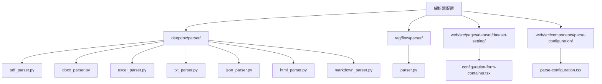
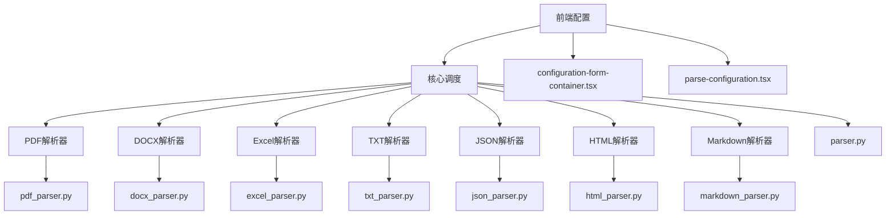
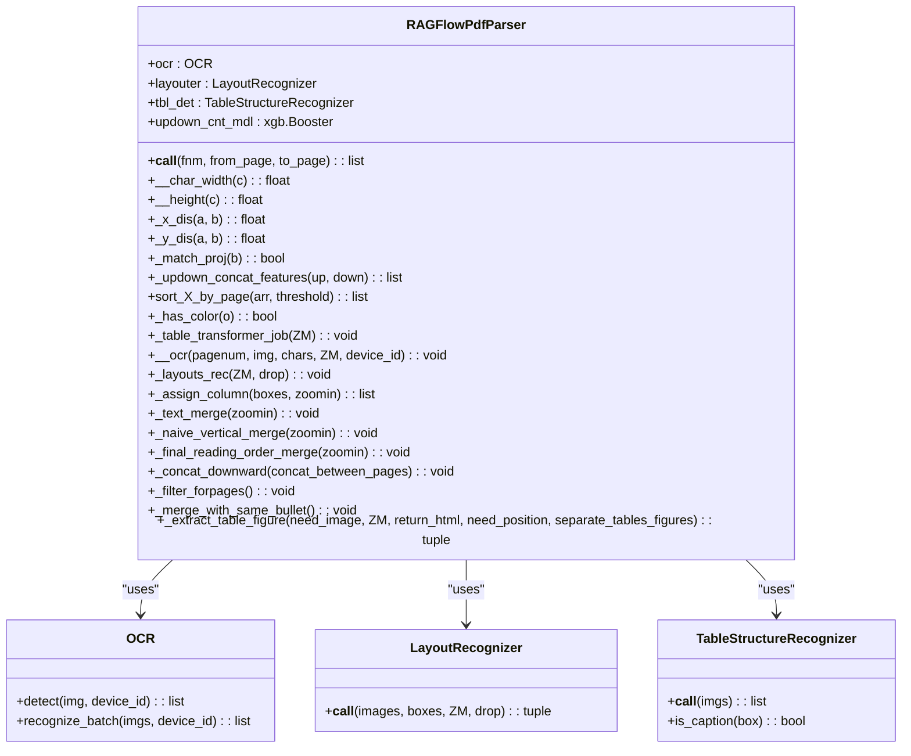
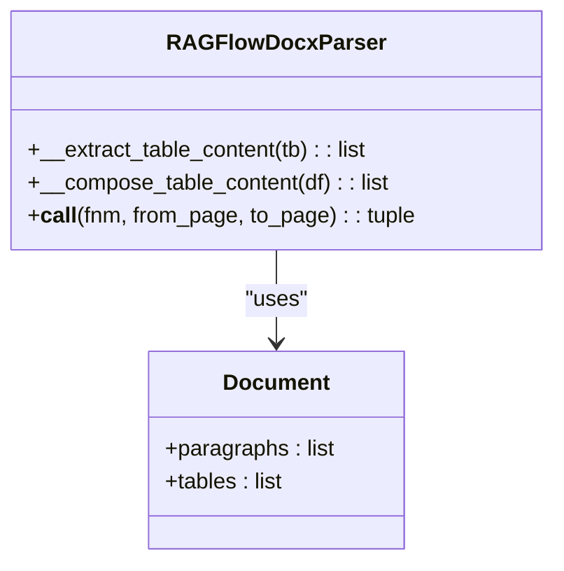
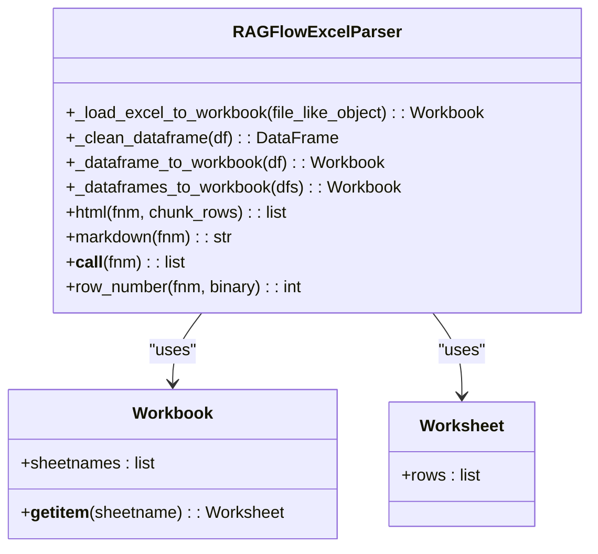
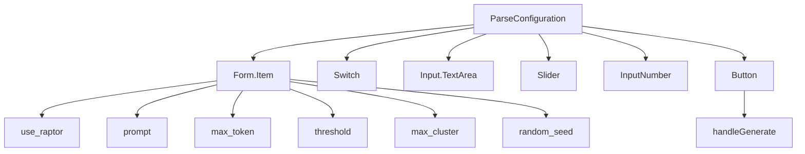
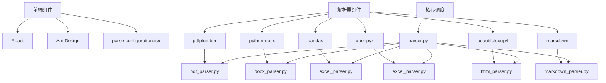

# 解析器配置

<cite>
**本文档中引用的文件**   
- [pdf_parser.py](file://deepdoc/parser/pdf_parser.py)
- [docx_parser.py](file://deepdoc/parser/docx_parser.py)
- [excel_parser.py](file://deepdoc/parser/excel_parser.py)
- [txt_parser.py](file://deepdoc/parser/txt_parser.py)
- [json_parser.py](file://deepdoc/parser/json_parser.py)
- [html_parser.py](file://deepdoc/parser/html_parser.py)
- [markdown_parser.py](file://deepdoc/parser/markdown_parser.py)
- [parser.py](file://rag/flow/parser/parser.py)
- [configuration-form-container.tsx](file://web/src/pages/dataset/dataset-setting/configuration-form-container.tsx)
- [parse-configuration.tsx](file://web/src/components/parse-configuration/index.tsx)
- [knowledge.ts](file://web/src/constants/knowledge.ts)
</cite>

## 目录
1. [简介](#简介)
2. [项目结构](#项目结构)
3. [核心组件](#核心组件)
4. [架构概述](#架构概述)
5. [详细组件分析](#详细组件分析)
6. [依赖分析](#依赖分析)
7. [性能考虑](#性能考虑)
8. [故障排除指南](#故障排除指南)
9. [结论](#结论)

## 简介
本文档全面介绍RAGFlow系统的文档解析器配置。系统支持多种解析器，包括PDF、DOCX、Excel、HTML、Markdown、JSON和TXT等格式的文档解析。核心调度逻辑由`parser.py`实现，不同解析器根据文档类型进行特定处理。前端通过`configuration-form-container.tsx`中的解析器选择组件实现动态加载和配置项渲染。文档还提供了为不同文档类型选择最佳解析器的指南，并解决了常见的解析问题，如解析失败、格式丢失、特殊字符乱码和解析速度慢等。

## 项目结构
RAGFlow项目的解析器功能主要分布在`deepdoc/parser/`目录下，包含针对不同文档格式的专用解析器。核心调度逻辑位于`rag/flow/parser/parser.py`。前端配置界面位于`web/src/pages/dataset/dataset-setting/`和`web/src/components/parse-configuration/`目录下。

**Diagram sources**
- [pdf_parser.py](file://deepdoc/parser/pdf_parser.py)
- [docx_parser.py](file://deepdoc/parser/docx_parser.py)
- [excel_parser.py](file://deepdoc/parser/excel_parser.py)
- [txt_parser.py](file://deepdoc/parser/txt_parser.py)
- [json_parser.py](file://deepdoc/parser/json_parser.py)
- [html_parser.py](file://deepdoc/parser/html_parser.py)
- [markdown_parser.py](file://deepdoc/parser/markdown_parser.py)
- [parser.py](file://rag/flow/parser/parser.py)
- [configuration-form-container.tsx](file://web/src/pages/dataset/dataset-setting/configuration-form-container.tsx)
- [parse-configuration.tsx](file://web/src/components/parse-configuration/index.tsx)

**Section sources**
- [pdf_parser.py](file://deepdoc/parser/pdf_parser.py)
- [docx_parser.py](file://deepdoc/parser/docx_parser.py)
- [excel_parser.py](file://deepdoc/parser/excel_parser.py)
- [txt_parser.py](file://deepdoc/parser/txt_parser.py)
- [json_parser.py](file://deepdoc/parser/json_parser.py)
- [html_parser.py](file://deepdoc/parser/html_parser.py)
- [markdown_parser.py](file://deepdoc/parser/markdown_parser.py)
- [parser.py](file://rag/flow/parser/parser.py)
- [configuration-form-container.tsx](file://web/src/pages/dataset/dataset-setting/configuration-form-container.tsx)
- [parse-configuration.tsx](file://web/src/components/parse-configuration/index.tsx)

## 核心组件
系统的核心组件包括多种文档解析器，每种解析器针对特定的文档格式进行优化。`RAGFlowPdfParser`使用OCR和布局识别技术处理PDF文档，`RAGFlowDocxParser`解析DOCX文档中的文本和表格，`RAGFlowExcelParser`处理Excel和CSV文件，`RAGFlowTxtParser`处理纯文本文件，`RAGFlowJsonParser`处理JSON和JSONL文件，`RAGFlowHtmlParser`解析HTML文档，`RAGFlowMarkdownParser`处理Markdown文件。这些解析器通过`parser.py`进行统一调度。

**Section sources**
- [pdf_parser.py](file://deepdoc/parser/pdf_parser.py#L51-L802)
- [docx_parser.py](file://deepdoc/parser/docx_parser.py#L25-L140)
- [excel_parser.py](file://deepdoc/parser/excel_parser.py#L28-L224)
- [txt_parser.py](file://deepdoc/parser/txt_parser.py#L23-L65)
- [json_parser.py](file://deepdoc/parser/json_parser.py#L27-L180)
- [html_parser.py](file://deepdoc/parser/html_parser.py#L39-L214)
- [markdown_parser.py](file://deepdoc/parser/markdown_parser.py#L23-L322)

## 架构概述
系统的架构分为前端配置层、核心调度层和具体解析层。前端配置层通过React组件实现解析器的选择和配置。核心调度层由`parser.py`实现，根据文档类型选择合适的解析器。具体解析层包含多个专用解析器，每个解析器针对特定文档格式进行深度处理。

**Diagram sources**
- [parser.py](file://rag/flow/parser/parser.py)
- [configuration-form-container.tsx](file://web/src/pages/dataset/dataset-setting/configuration-form-container.tsx)
- [parse-configuration.tsx](file://web/src/components/parse-configuration/index.tsx)
- [pdf_parser.py](file://deepdoc/parser/pdf_parser.py)
- [docx_parser.py](file://deepdoc/parser/docx_parser.py)
- [excel_parser.py](file://deepdoc/parser/excel_parser.py)
- [txt_parser.py](file://deepdoc/parser/txt_parser.py)
- [json_parser.py](file://deepdoc/parser/json_parser.py)
- [html_parser.py](file://deepdoc/parser/html_parser.py)
- [markdown_parser.py](file://deepdoc/parser/markdown_parser.py)

## 详细组件分析

### PDF解析器分析
`RAGFlowPdfParser`是系统中最复杂的解析器，它结合了OCR、布局识别和表格结构识别等多种技术。解析器首先使用`pdfplumber`提取文本和布局信息，然后使用OCR处理扫描版PDF，最后通过机器学习模型进行文本合并和阅读顺序优化。

#### 类图

**Diagram sources**
- [pdf_parser.py](file://deepdoc/parser/pdf_parser.py#L51-L802)

**Section sources**
- [pdf_parser.py](file://deepdoc/parser/pdf_parser.py#L51-L802)

### DOCX解析器分析
`RAGFlowDocxParser`负责解析DOCX文档，提取文本内容和表格数据。解析器使用`python-docx`库读取文档，将段落文本和表格内容分别处理。

#### 类图

**Diagram sources**
- [docx_parser.py](file://deepdoc/parser/docx_parser.py#L25-L140)

**Section sources**
- [docx_parser.py](file://deepdoc/parser/docx_parser.py#L25-L140)

### Excel解析器分析
`RAGFlowExcelParser`处理Excel和CSV文件，支持多种文件格式和编码。解析器能够将表格数据转换为HTML或Markdown格式。

#### 类图

**Diagram sources**
- [excel_parser.py](file://deepdoc/parser/excel_parser.py#L28-L224)

**Section sources**
- [excel_parser.py](file://deepdoc/parser/excel_parser.py#L28-L224)

### 前端解析配置组件分析
前端的解析配置组件实现了动态加载和配置项渲染，允许用户根据需要选择和配置不同的解析器。

#### 组件结构

**Diagram sources**
- [parse-configuration.tsx](file://web/src/components/parse-configuration/index.tsx#L34-L218)

**Section sources**
- [parse-configuration.tsx](file://web/src/components/parse-configuration/index.tsx#L34-L218)

## 依赖分析
系统各组件之间的依赖关系清晰，前端组件依赖于React和Ant Design库，解析器组件依赖于各种第三方库如`pdfplumber`、`python-docx`、`pandas`等，核心调度组件依赖于所有具体的解析器。

**Diagram sources**
- [pdf_parser.py](file://deepdoc/parser/pdf_parser.py)
- [docx_parser.py](file://deepdoc/parser/docx_parser.py)
- [excel_parser.py](file://deepdoc/parser/excel_parser.py)
- [html_parser.py](file://deepdoc/parser/html_parser.py)
- [markdown_parser.py](file://deepdoc/parser/markdown_parser.py)
- [parser.py](file://rag/flow/parser/parser.py)
- [parse-configuration.tsx](file://web/src/components/parse-configuration/index.tsx)

**Section sources**
- [pdf_parser.py](file://deepdoc/parser/pdf_parser.py)
- [docx_parser.py](file://deepdoc/parser/docx_parser.py)
- [excel_parser.py](file://deepdoc/parser/excel_parser.py)
- [html_parser.py](file://deepdoc/parser/html_parser.py)
- [markdown_parser.py](file://deepdoc/parser/markdown_parser.py)
- [parser.py](file://rag/flow/parser/parser.py)
- [parse-configuration.tsx](file://web/src/components/parse-configuration/index.tsx)

## 性能考虑
系统在设计时充分考虑了性能因素。PDF解析器使用多线程和GPU加速来提高处理速度。Excel解析器支持流式处理大文件。JSON解析器采用分块处理策略避免内存溢出。前端组件使用React的shouldUpdate优化渲染性能。

## 故障排除指南
### 解析失败
- 检查文件格式是否支持
- 确认文件编码是否正确
- 验证文件是否损坏

### 格式丢失
- PDF文件：尝试使用不同的布局识别器
- DOCX文件：检查表格格式是否复杂
- Excel文件：确认公式和图表是否需要特殊处理

### 特殊字符乱码
- 检查文件编码设置
- 使用`find_codec`函数自动检测编码
- 手动指定正确的编码格式

### 解析速度慢
- 对于PDF文件：减少OCR处理的页面范围
- 对于大文件：启用分块处理
- 使用GPU加速（如果可用）

**Section sources**
- [pdf_parser.py](file://deepdoc/parser/pdf_parser.py)
- [docx_parser.py](file://deepdoc/parser/docx_parser.py)
- [excel_parser.py](file://deepdoc/parser/excel_parser.py)
- [txt_parser.py](file://deepdoc/parser/txt_parser.py)
- [json_parser.py](file://deepdoc/parser/json_parser.py)
- [html_parser.py](file://deepdoc/parser/html_parser.py)
- [markdown_parser.py](file://deepdoc/parser/markdown_parser.py)

## 结论
RAGFlow系统的解析器配置提供了全面的文档处理能力，支持多种格式的文档解析。通过合理的架构设计和优化，系统能够在保证解析质量的同时提供良好的性能表现。前端配置界面的灵活性使得用户可以根据具体需求选择和配置最适合的解析器。