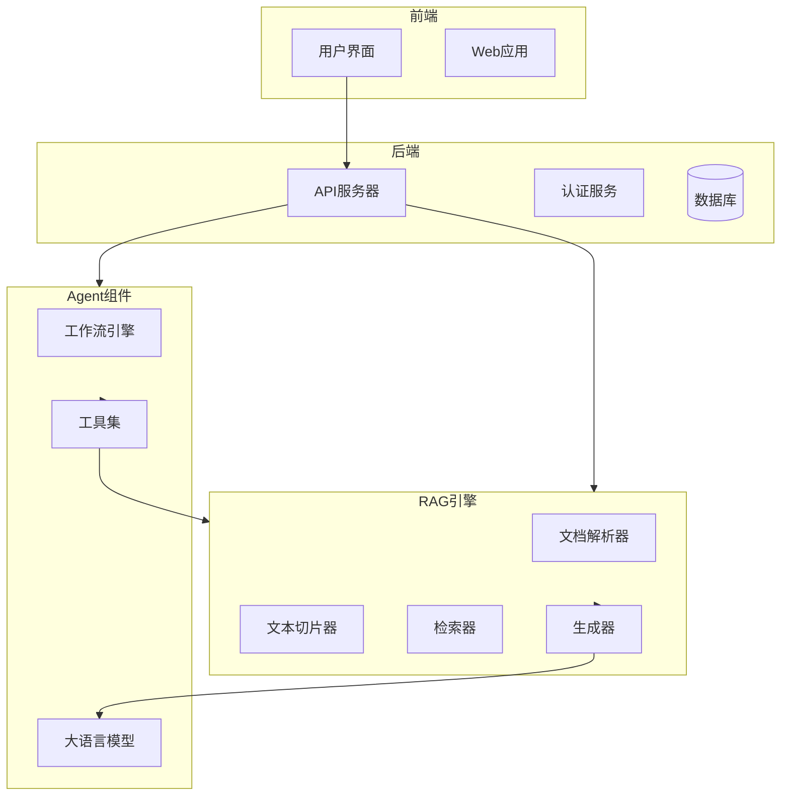

# 系统概述

<cite>
**本文档中引用的文件**   
- [README.md](file://README.md)
- [README_zh.md](file://README_zh.md)
- [ragflow_server.py](file://api/ragflow_server.py)
- [kb_app.py](file://api/apps/kb_app.py)
- [document_app.py](file://api/apps/document_app.py)
- [canvas.py](file://agent/canvas.py)
- [one.py](file://rag/app/one.py)
- [query.py](file://rag/nlp/query.py)
- [base.py](file://agent/component/base.py)
- [knowledgebase_service.py](file://api/db/services/knowledgebase_service.py)
- [settings.py](file://common/settings.py)
</cite>

## 目录
1. [引言](#引言)
2. [核心功能](#核心功能)
3. [系统架构](#系统架构)
4. [知识库管理](#知识库管理)
5. [文档理解](#文档理解)
6. [智能问答](#智能问答)
7. [Agent工作流](#agent工作流)
8. [企业级应用价值](#企业级应用价值)
9. [总结](#总结)

## 引言

RAGFlow是一款领先的开源检索增强生成（RAG）引擎，通过融合前沿的RAG技术与Agent能力，为大型语言模型（LLM）提供卓越的上下文层。它提供可适配任意规模企业的端到端RAG工作流，凭借融合式上下文引擎与预置的Agent模板，助力开发者以极致效率与精度将复杂数据转化为高可信、生产级的人工智能系统。

作为一款功能强大的AI应用平台，RAGFlow不仅支持从各类复杂格式的非结构化数据中提取真知灼见，还能在无限上下文（token）的场景下快速完成“大海捞针”测试。其兼容各类异构数据源，支持Word、PPT、Excel、PDF、图片、网页等多种文件类型，为用户提供全程无忧、自动化的RAG工作流。

**Section sources**
- [README.md](file://README.md#L73-L75)
- [README_zh.md](file://README_zh.md#L73-L75)

## 核心功能

RAGFlow系统提供了一系列强大的核心功能，旨在提升AI应用的效率和准确性。

### **"质量输入，质量输出"**

基于深度文档理解（Deep document understanding），RAGFlow能够从各类复杂格式的非结构化数据中提取真知灼见。无论是扫描件、影印件还是结构化数据，系统都能准确分析并提取关键信息。此外，RAGFlow能在无限上下文（token）的场景下快速完成“大海捞针”测试，确保在海量数据中精准定位所需信息。

### **基于模板的文本切片**

RAGFlow提供智能且可解释的文本切片功能，支持多种模板选项。用户可以根据具体需求选择合适的切片模板，确保文本切片过程既智能又可控。这种基于模板的切片方法不仅提高了切片的准确性，还增强了过程的透明度。

### **有理有据、最大程度降低幻觉**

通过可视化文本切片过程，RAGFlow支持手动调整，确保切片结果符合预期。在回答问题时，系统提供关键引用的快照并支持追根溯源，从而最大程度降低大语言模型的幻觉问题，确保回答的准确性和可靠性。

### **兼容各类异构数据源**

RAGFlow支持丰富的文件类型，包括Word文档、PPT、Excel表格、txt文件、图片、PDF、影印件、复印件、结构化数据、网页等。这种广泛的兼容性使得用户可以轻松地将各种数据源集成到系统中，构建全面的知识库。

### **全程无忧、自动化的RAG工作流**

RAGFlow提供全面优化的RAG工作流，支持从个人应用到超大型企业的各类生态系统。用户可以配置大语言模型（LLM）以及向量模型，利用多路召回和融合重排序技术，快速构建高效的AI应用。系统还提供易用的API，可以轻松集成到各类企业系统中。

**Section sources**
- [README.md](file://README.md#L109-L134)
- [README_zh.md](file://README_zh.md#L110-L134)

## 系统架构

RAGFlow的系统架构由前端、后端、RAG引擎和Agent组件组成，各组件之间协同工作，共同实现强大的AI应用功能。

**Diagram sources**
- [README.md](file://README.md#L139)
- [README_zh.md](file://README_zh.md#L139)

## 知识库管理

知识库是RAGFlow系统的核心，用于存储和管理用户的各种文档和数据。通过知识库，用户可以方便地组织和检索信息，构建个性化的AI应用。

### 创建和管理知识库

用户可以通过API或Web界面创建和管理知识库。每个知识库都有唯一的ID，并可以配置不同的解析器和参数。系统支持多种解析器，如通用解析器、问答解析器、简历解析器等，用户可以根据文档类型选择合适的解析器。

### 文档上传和解析

RAGFlow支持多种文件格式的上传和解析，包括Word、PPT、Excel、PDF、txt、图片等。上传文档后，系统会自动进行解析，提取文本、表格和图片等内容，并生成相应的文本块。用户还可以通过Web爬虫功能，将网页内容抓取并解析为文档。

### 数据同步

RAGFlow支持从Confluence、S3、Notion、Discord、Google Drive等数据源进行数据同步。用户可以配置数据同步任务，定期将外部数据源的内容同步到知识库中，确保知识库的实时性和完整性。

**Section sources**
- [kb_app.py](file://api/apps/kb_app.py#L48-L200)
- [document_app.py](file://api/apps/document_app.py#L51-L200)
- [knowledgebase_service.py](file://api/db/services/knowledgebase_service.py#L32-L200)

## 文档理解

文档理解是RAGFlow的核心能力之一，通过深度文档理解技术，系统能够从复杂格式的文档中提取关键信息。

### 深度文档理解

RAGFlow使用深度文档理解技术，结合OCR、布局识别和表格结构识别（TSR）等方法，准确分析文档内容。系统能够识别文档中的文本、标题、图片、表格、页眉、页脚等元素，并理解它们之间的关系。

### OCR和布局识别

对于扫描件或图片格式的文档，RAGFlow使用OCR技术提取文本内容。同时，系统通过布局识别技术，分析文档的版面结构，判断文本部分是否连续，以及哪些部分需要表格结构识别处理。

### 表格结构识别

RAGFlow支持复杂的表格结构识别，能够处理层次化表头、跨单元格和投影行表头等复杂情况。系统将表格内容重新组装成自然语言句子，便于大语言模型理解和生成。

**Section sources**
- [deepdoc/README.md](file://deepdoc/README.md#L45-L105)
- [one.py](file://rag/app/one.py#L28-L167)

## 智能问答

RAGFlow的智能问答功能基于检索增强生成技术，能够提供准确、可靠的回答。

### 检索增强生成

系统首先通过检索器从知识库中检索相关文档片段，然后将这些片段与用户问题一起输入到大语言模型中，生成最终的回答。这种方法结合了检索的准确性和生成的灵活性，确保回答既准确又自然。

### 多路召回和融合重排序

RAGFlow采用多路召回技术，从不同角度检索相关文档，并通过融合重排序技术，综合评估各文档的相关性，确保最相关的内容排在前面。

### 有理有据的回答

在生成回答时，系统会提供关键引用的快照，并支持追根溯源，用户可以查看回答所依据的原始文档内容，确保回答的可信度。

**Section sources**
- [query.py](file://rag/nlp/query.py#L26-L200)
- [one.py](file://rag/app/one.py#L151-L157)

## Agent工作流

Agent工作流是RAGFlow的另一大特色，通过预置的Agent模板和可编排的工作流，用户可以构建复杂的自动化任务。

### Agent组件

RAGFlow的Agent组件包括开始、检索、生成、分类、循环等基本组件。用户可以通过拖拽方式，将这些组件组合成复杂的工作流，实现自动化任务。

### 工作流编排

系统支持可编排的数据管道，用户可以定义数据处理的各个环节，如数据清洗、特征提取、模型训练等。通过工作流编排，用户可以轻松构建复杂的AI应用。

### 工具集

RAGFlow提供丰富的工具集，包括代码执行器、网络搜索、邮件发送等。用户可以在工作流中调用这些工具，实现更复杂的功能。

**Section sources**
- [canvas.py](file://agent/canvas.py#L40-L200)
- [base.py](file://agent/component/base.py#L37-L200)

## 企业级应用价值

RAGFlow在企业级AI应用中具有重要的价值，能够帮助企业提升效率、降低成本、增强竞争力。

### 提升决策效率

通过构建企业知识库，RAGFlow可以帮助企业快速检索和分析内部文档，为决策提供有力支持。无论是市场分析、客户支持还是产品开发，系统都能提供准确的信息，提升决策效率。

### 降低运营成本

RAGFlow的自动化工作流和智能问答功能，可以替代部分人工操作，降低运营成本。例如，通过自动化客服系统，企业可以24小时为客户提供服务，减少人力投入。

### 增强客户体验

通过智能问答和个性化推荐，RAGFlow可以提供更优质的客户服务，增强客户体验。系统能够快速响应客户问题，提供准确的答案，提升客户满意度。

### 支持创新应用

RAGFlow的灵活性和可扩展性，使其能够支持各种创新应用。无论是智能搜索、知识图谱构建还是自动化报告生成，系统都能提供强大的技术支持。

**Section sources**
- [README.md](file://README.md#L75)
- [README_zh.md](file://README_zh.md#L75)

## 总结

RAGFlow是一款功能强大的开源RAG引擎，通过融合RAG技术和Agent能力，为大语言模型提供卓越的上下文层。系统支持知识库管理、文档理解、智能问答和自动化工作流等核心功能，能够帮助企业提升效率、降低成本、增强竞争力。无论是个人用户还是大型企业，RAGFlow都能提供高效、可靠的AI应用解决方案。

**Section sources**
- [README.md](file://README.md#L73-L75)
- [README_zh.md](file://README_zh.md#L73-L75)