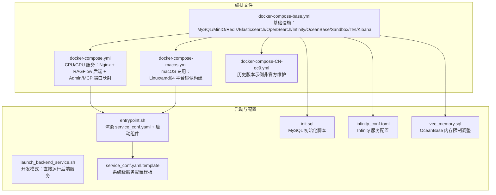
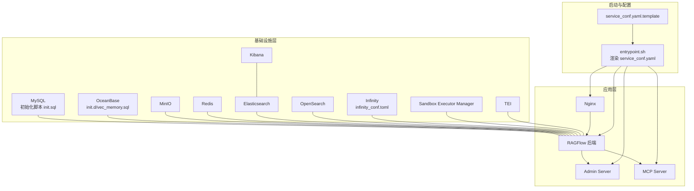
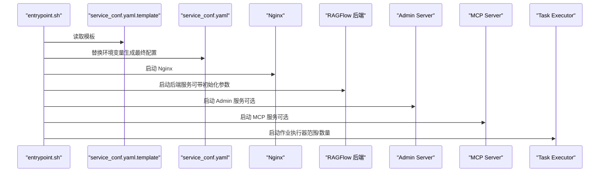
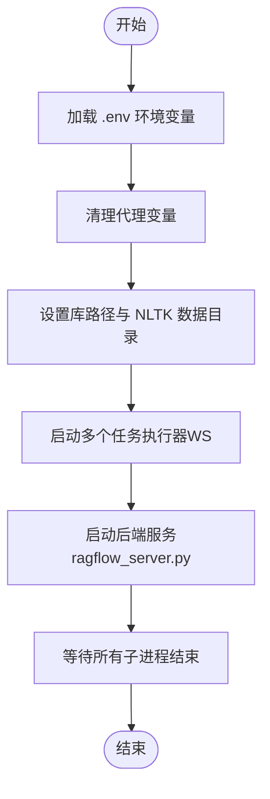
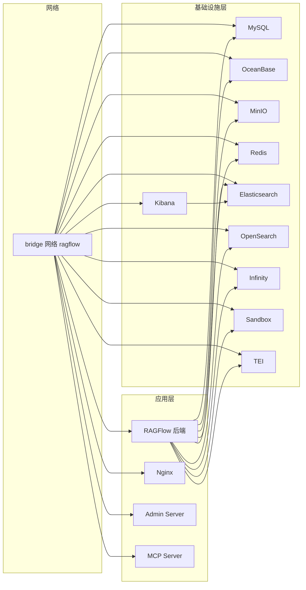

# Docker Compose 部署

<cite>
**本文引用的文件**
- [docker-compose.yml](file://docker/docker-compose.yml)
- [docker-compose-base.yml](file://docker/docker-compose-base.yml)
- [docker-compose-macos.yml](file://docker/docker-compose-macos.yml)
- [docker-compose-CN-oc9.yml](file://docker/docker-compose-CN-oc9.yml)
- [entrypoint.sh](file://docker/entrypoint.sh)
- [launch_backend_service.sh](file://docker/launch_backend_service.sh)
- [service_conf.yaml.template](file://docker/service_conf.yaml.template)
- [init.sql](file://docker/init.sql)
- [infinity_conf.toml](file://docker/infinity_conf.toml)
- [README.md（docker 目录）](file://docker/README.md)
- [README.md（项目根目录）](file://README.md)
- [README.md（docker/oceanbase/init.d/vec_memory.sql）](file://docker/oceanbase/init.d/vec_memory.sql)
</cite>

## 目录
1. [简介](#简介)
2. [项目结构](#项目结构)
3. [核心组件](#核心组件)
4. [架构总览](#架构总览)
5. [详细组件分析](#详细组件分析)
6. [依赖关系分析](#依赖关系分析)
7. [性能与资源建议](#性能与资源建议)
8. [故障排查指南](#故障排查指南)
9. [结论](#结论)
10. [附录：环境变量与端口映射](#附录环境变量与端口映射)

## 简介
本指南面向希望使用 Docker Compose 在本地或生产环境中部署 RAGFlow 的用户。文档围绕以下目标展开：
- 解释 docker-compose-base.yml 作为“基础设施”基础配置的作用
- 说明如何在不同环境下选择合适的 Compose 文件（如 docker-compose.yml、docker-compose-macos.yml、docker-compose-CN-oc9.yml）
- 指导如何通过 service_conf.yaml.template 配置服务参数，并结合 entrypoint.sh/launch_backend_service.sh 启动后端服务
- 提供网络、服务依赖、端口映射与持久化存储的最佳实践
- 总结常见部署问题的排查思路（容器启动失败、数据库初始化错误等）

## 项目结构
RAGFlow 的 Docker Compose 相关文件位于 docker/ 目录下，核心文件包括：
- 基础编排：docker-compose-base.yml
- 主编排：docker-compose.yml（CPU/GPU 两套服务）
- macOS 专用：docker-compose-macos.yml
- 历史版本示例：docker-compose-CN-oc9.yml
- 启动脚本：entrypoint.sh、launch_backend_service.sh
- 服务配置模板：service_conf.yaml.template
- 初始化 SQL：init.sql
- Infinity 配置：infinity_conf.toml
- OceanBase 初始化 SQL：vec_memory.sql

图表来源
- [docker-compose-base.yml](file://docker/docker-compose-base.yml#L1-L300)
- [docker-compose.yml](file://docker/docker-compose.yml#L1-L135)
- [docker-compose-macos.yml](file://docker/docker-compose-macos.yml#L1-L47)
- [docker-compose-CN-oc9.yml](file://docker/docker-compose-CN-oc9.yml#L1-L63)
- [entrypoint.sh](file://docker/entrypoint.sh#L150-L162)
- [service_conf.yaml.template](file://docker/service_conf.yaml.template#L1-L154)
- [init.sql](file://docker/init.sql#L1-L2)
- [infinity_conf.toml](file://docker/infinity_conf.toml#L1-L57)
- [vec_memory.sql](file://docker/oceanbase/init.d/vec_memory.sql#L1-L1)

章节来源
- [docker-compose.yml](file://docker/docker-compose.yml#L1-L135)
- [docker-compose-base.yml](file://docker/docker-compose-base.yml#L1-L300)
- [docker-compose-macos.yml](file://docker/docker-compose-macos.yml#L1-L47)
- [docker-compose-CN-oc9.yml](file://docker/docker-compose-CN-oc9.yml#L1-L63)
- [entrypoint.sh](file://docker/entrypoint.sh#L150-L162)
- [service_conf.yaml.template](file://docker/service_conf.yaml.template#L1-L154)
- [init.sql](file://docker/init.sql#L1-L2)
- [infinity_conf.toml](file://docker/infinity_conf.toml#L1-L57)
- [README.md（docker 目录）](file://docker/README.md#L1-L269)
- [README.md（项目根目录）](file://README.md#L140-L250)

## 核心组件
- 基础设施（docker-compose-base.yml）
  - 数据库：MySQL（初始化 SQL）、OceanBase（含初始化脚本）
  - 存储：MinIO（对象存储）、Redis（缓存）
  - 检索引擎：Elasticsearch、OpenSearch、Infinity（可选）
  - Sandbox 执行器管理器、TEI（文本嵌入推理服务）、Kibana（可选）
  - 网络与卷：统一桥接网络 ragflow，持久化数据卷
- 应用层（docker-compose.yml）
  - ragflow-cpu/ragflow-gpu：Nginx + RAGFlow 后端 + Admin/MCP 端口映射
  - 依赖：MySQL 健康检查通过后才启动
  - 卷挂载：日志、Nginx 配置、service_conf.yaml.template、入口脚本
- macOS 专用（docker-compose-macos.yml）
  - 强制平台为 linux/amd64，本地构建镜像，简化端口映射
- 启动与配置
  - entrypoint.sh：渲染 service_conf.yaml，按参数启动 Nginx、后端服务、Admin/MCP、任务执行器
  - launch_backend_service.sh：开发模式直接运行后端服务（不依赖 Compose）
  - service_conf.yaml.template：系统级服务配置模板，由 entrypoint.sh 渲染为最终配置

章节来源
- [docker-compose-base.yml](file://docker/docker-compose-base.yml#L152-L218)
- [docker-compose.yml](file://docker/docker-compose.yml#L1-L135)
- [docker-compose-macos.yml](file://docker/docker-compose-macos.yml#L1-L47)
- [entrypoint.sh](file://docker/entrypoint.sh#L150-L162)
- [launch_backend_service.sh](file://docker/launch_backend_service.sh#L1-L130)
- [service_conf.yaml.template](file://docker/service_conf.yaml.template#L1-L154)

## 架构总览
RAGFlow 的 Compose 架构由“基础设施层 + 应用层 + 启动与配置层”构成。应用层服务依赖基础设施层健康状态；启动脚本负责将模板配置渲染为最终配置并启动各组件。

图表来源
- [docker-compose-base.yml](file://docker/docker-compose-base.yml#L1-L300)
- [docker-compose.yml](file://docker/docker-compose.yml#L1-L135)
- [entrypoint.sh](file://docker/entrypoint.sh#L244-L297)
- [service_conf.yaml.template](file://docker/service_conf.yaml.template#L1-L154)
- [init.sql](file://docker/init.sql#L1-L2)
- [infinity_conf.toml](file://docker/infinity_conf.toml#L1-L57)
- [vec_memory.sql](file://docker/oceanbase/init.d/vec_memory.sql#L1-L1)

## 详细组件分析

### 基础设施层（docker-compose-base.yml）
- MySQL
  - 使用初始化脚本 init.sql 创建默认数据库
  - 健康检查基于 ping
- OceanBase
  - 含 init.d/vec_memory.sql 调整向量内存限制
  - 健康检查通过执行 SQL 创建数据库
- MinIO
  - 对外暴露 Console 与 API 端口
  - 健康检查验证存活接口
- Redis
  - 设置密码与内存策略
  - 健康检查基于 ping
- Elasticsearch/OpenSearch
  - 可选，用于检索与可视化
- Infinity
  - 通过 infinity_conf.toml 配置网络与存储
  - 健康检查访问管理端点
- Sandbox Executor Manager
  - 挂载 Docker Socket，支持沙箱执行器池
- TEI
  - 文本嵌入推理服务，CPU/GPU 两套镜像
- Kibana
  - 依赖 Elasticsearch，健康检查验证 API

章节来源
- [docker-compose-base.yml](file://docker/docker-compose-base.yml#L152-L218)
- [init.sql](file://docker/init.sql#L1-L2)
- [infinity_conf.toml](file://docker/infinity_conf.toml#L1-L57)
- [vec_memory.sql](file://docker/oceanbase/init.d/vec_memory.sql#L1-L1)

### 应用层（docker-compose.yml）
- ragflow-cpu/ragflow-gpu
  - 依赖 MySQL 健康检查
  - 映射 Web/API/Admin/MCP 端口
  - 挂载日志、Nginx 配置、service_conf.yaml.template、entrypoint.sh
  - extra_hosts 指向 host.docker.internal
  - GPU 版本启用 NVIDIA 设备保留
- 服务依赖
  - 通过 depends_on + service_healthy 控制启动顺序
- 端口映射
  - Web: 80/443
  - API: 9380
  - Admin: 9381
  - MCP: 9382

章节来源
- [docker-compose.yml](file://docker/docker-compose.yml#L1-L135)

### macOS 专用（docker-compose-macos.yml）
- 强制平台 linux/amd64
- 本地构建镜像（Dockerfile 上下文 ../）
- 简化端口映射（Web: 80/443，API: 9380）
- extra_hosts 指向 host.docker.internal

章节来源
- [docker-compose-macos.yml](file://docker/docker-compose-macos.yml#L1-L47)

### 历史版本示例（docker-compose-CN-oc9.yml）
- 仅作参考，包含 CPU/GPU 两套服务，映射端口与 extra_hosts
- 该文件非官方维护，使用需自担风险

章节来源
- [docker-compose-CN-oc9.yml](file://docker/docker-compose-CN-oc9.yml#L1-L63)

### 启动流程（entrypoint.sh）
- 渲染 service_conf.yaml：读取 service_conf.yaml.template，替换环境变量生成最终配置
- 组件启动
  - Nginx + RAGFlow 后端（可带初始化超级用户参数）
  - 数据同步（可选）
  - Admin Server（可选）
  - MCP Server（可选）
  - 任务执行器（可按范围或固定数量启动）
- 参数控制
  - 支持禁用 WebServer/TaskExecutor/DataSync
  - 支持启用 MCP/Admin Server
  - 支持设置 MCP 参数与传输标志位
  - 支持设置消费者范围或工作线程数

图表来源
- [entrypoint.sh](file://docker/entrypoint.sh#L150-L162)
- [entrypoint.sh](file://docker/entrypoint.sh#L244-L297)
- [service_conf.yaml.template](file://docker/service_conf.yaml.template#L1-L154)

章节来源
- [entrypoint.sh](file://docker/entrypoint.sh#L1-L297)

### 开发模式启动（launch_backend_service.sh）
- 加载 .env，清理代理变量，设置库路径与 NLTK 数据目录
- 启动多个任务执行器（WS），每个执行器重试 MAX_RETRIES 次
- 启动主后端服务（ragflow_server.py），重试 MAX_RETRIES 次
- 捕获终止信号，清理子进程

图表来源
- [launch_backend_service.sh](file://docker/launch_backend_service.sh#L1-L130)

章节来源
- [launch_backend_service.sh](file://docker/launch_backend_service.sh#L1-L130)

### 服务配置（service_conf.yaml.template）
- 关键配置项
  - ragflow/admin：监听地址与端口
  - mysql：数据库名、用户名、密码、主机、端口、连接上限、超时
  - minio：用户名、密码、主机:端口
  - es/os：主机、用户名、密码
  - infinity：URI、数据库名
  - oceanbase：scheme、db_name/user/password/host/port
  - redis：db、用户名、密码、主机:端口
  - user_default_llm：默认嵌入模型工厂与 base_url（TEI）
- 渲染逻辑
  - entrypoint.sh 将模板中的环境变量替换为实际值，生成 service_conf.yaml

章节来源
- [service_conf.yaml.template](file://docker/service_conf.yaml.template#L1-L154)
- [entrypoint.sh](file://docker/entrypoint.sh#L150-L162)

## 依赖关系分析
- 服务依赖
  - ragflow-cpu/ragflow-gpu 依赖 mysql 健康检查通过
  - Kibana 依赖 Elasticsearch 启动
  - Sandbox Executor Manager 依赖 Docker Socket
- 网络
  - 所有服务加入统一网络 ragflow，便于内部通信
- 存储
  - MySQL/MinIO/Redis/Elasticsearch/OpenSearch/Infinity/OceanBase/Sandbox/TEI/Kibana 均使用持久化卷
- 端口
  - Web/API/Admin/MCP 端口在应用层映射
  - 基础设施端口在基础编排中映射

图表来源
- [docker-compose.yml](file://docker/docker-compose.yml#L1-L135)
- [docker-compose-base.yml](file://docker/docker-compose-base.yml#L1-L300)

章节来源
- [docker-compose.yml](file://docker/docker-compose.yml#L1-L135)
- [docker-compose-base.yml](file://docker/docker-compose-base.yml#L1-L300)

## 性能与资源建议
- 内存与并发
  - MySQL：max_connections、stale_timeout、max_allowed_packet
  - Redis：maxmemory 与策略
  - Infinity：buffer、storage、wal 等配置
- GPU 加速
  - ragflow-gpu 使用 NVIDIA 设备保留，确保宿主机安装 NVIDIA 驱动与 nvidia-docker
- 端到端性能
  - TEI 作为嵌入服务，建议与 RAGFlow 同网络，减少跨网络延迟
  - MinIO/MySQL/Redis 建议独立卷与合理 IO 配置

章节来源
- [service_conf.yaml.template](file://docker/service_conf.yaml.template#L1-L154)
- [infinity_conf.toml](file://docker/infinity_conf.toml#L1-L57)
- [docker-compose.yml](file://docker/docker-compose.yml#L102-L135)

## 故障排查指南
- 容器启动失败
  - 检查 depends_on 条件是否满足（如 mysql 健康检查）
  - 查看容器日志：docker logs -f <container>
  - 确认端口未被占用（Web/API/Admin/MCP 端口）
- 数据库初始化错误
  - MySQL：确认 init.sql 是否正确创建数据库并被加载
  - OceanBase：确认 init.d/vec_memory.sql 已挂载且执行成功
- Nginx/后端服务无法访问
  - 确认 service_conf.yaml 是否由 template 正确渲染
  - 确认 entrypoint.sh 是否已启动 Nginx 与后端服务
- 端口映射问题
  - 检查 docker-compose.yml 中的端口映射与 .env 中的端口变量
  - macOS 下使用 docker-compose-macos.yml，注意平台与构建方式
- HTTPS 配置
  - 按 docker/README.md 中 HTTPS 步骤挂载证书并切换配置文件
- 开发模式
  - 使用 launch_backend_service.sh 直接运行后端服务，便于调试

章节来源
- [docker-compose.yml](file://docker/docker-compose.yml#L1-L135)
- [docker-compose-macos.yml](file://docker/docker-compose-macos.yml#L1-L47)
- [entrypoint.sh](file://docker/entrypoint.sh#L244-L297)
- [service_conf.yaml.template](file://docker/service_conf.yaml.template#L1-L154)
- [init.sql](file://docker/init.sql#L1-L2)
- [README.md（docker 目录）](file://docker/README.md#L200-L269)

## 结论
通过 docker-compose-base.yml 提供稳定的基础设施，配合 docker-compose.yml 或 docker-compose-macos.yml 快速搭建 RAGFlow 生态。借助 entrypoint.sh 的模板渲染能力与 launch_backend_service.sh 的开发模式，用户可以在本地与生产环境中高效部署与调试。遵循本文的网络、端口与持久化最佳实践，可显著提升部署稳定性与可维护性。

## 附录：环境变量与端口映射
- 环境变量（摘录）
  - 资源与镜像：STACK_VERSION、MEM_LIMIT、RAGFLOW_IMAGE、TEI_IMAGE_CPU/TEI_IMAGE_GPU、SANDBOX_* 等
  - 数据库：MYSQL_PASSWORD、MYSQL_PORT、MYSQL_DBNAME、OCEANBASE_*、ES_*、OS_*、INFINITY_*、REDIS_*、MINIO_* 等
  - 服务端口：SVR_HTTP_PORT、SVR_WEB_HTTP_PORT、SVR_WEB_HTTPS_PORT、ADMIN_SVR_HTTP_PORT、SVR_MCP_PORT、KIBANA_PORT、TEI_PORT 等
  - 其他：HF_ENDPOINT、MAX_CONTENT_LENGTH、DOC_BULK_SIZE、EMBEDDING_BATCH_SIZE、TZ 等
- 端口映射（应用层）
  - Web: 80/443
  - API: 9380
  - Admin: 9381
  - MCP: 9382
- 基础设施端口（基础编排）
  - MySQL: 3306
  - MinIO: 9000/9001
  - Redis: 6379
  - Elasticsearch: 9200
  - OpenSearch: 9201
  - Infinity: 23817/23820/5432
  - Sandbox: 9385
  - TEI: 6380（默认）
  - Kibana: 5601（默认）

章节来源
- [README.md（docker 目录）](file://docker/README.md#L23-L120)
- [docker-compose.yml](file://docker/docker-compose.yml#L1-L135)
- [docker-compose-base.yml](file://docker/docker-compose-base.yml#L1-L300)