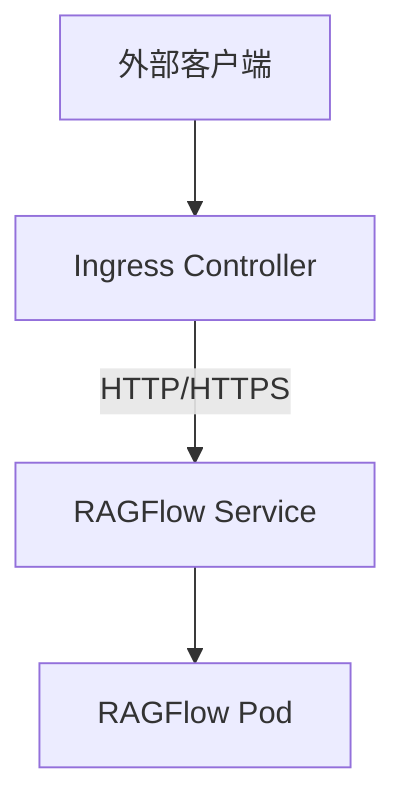
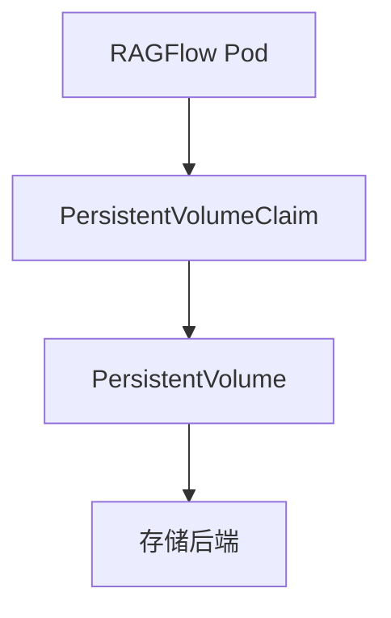

# Kubernetes 部署

<cite>
**本文档中引用的文件**  
- [Chart.yaml](file://helm/Chart.yaml)
- [values.yaml](file://helm/values.yaml)
- [ragflow.yaml](file://helm/templates/ragflow.yaml)
- [mysql.yaml](file://helm/templates/mysql.yaml)
- [minio.yaml](file://helm/templates/minio.yaml)
- [ingress.yaml](file://helm/templates/ingress.yaml)
- [redis.yaml](file://helm/templates/redis.yaml)
- [elasticsearch.yaml](file://helm/templates/elasticsearch.yaml)
- [opensearch.yaml](file://helm/templates/opensearch.yaml)
- [infinity.yaml](file://helm/templates/infinity.yaml)
- [env.yaml](file://helm/templates/env.yaml)
- [mysql-config.yaml](file://helm/templates/mysql-config.yaml)
- [ragflow_config.yaml](file://helm/templates/ragflow_config.yaml)
- [_helpers.tpl](file://helm/templates/_helpers.tpl)
</cite>

## 目录
1. [简介](#简介)
2. [Helm Chart 元数据](#helm-chart-元数据)
3. [可配置参数详解](#可配置参数详解)
4. [核心模板文件结构](#核心模板文件结构)
5. [Ingress 配置](#ingress-配置)
6. [持久化存储配置](#持久化存储配置)
7. [Helm 操作命令](#helm-操作命令)
8. [生产环境考虑](#生产环境考虑)

## 简介
RAGFlow 是一个基于 Kubernetes 的检索增强生成（RAG）平台，通过 Helm Chart 提供了完整的部署解决方案。本指南详细介绍了如何使用 Helm 在 Kubernetes 集群上部署 RAGFlow，涵盖了 Chart 元数据、可配置参数、核心模板文件结构、Ingress 配置、持久化存储设置以及 Helm 操作命令。同时，还讨论了在生产环境中部署时的高可用性和可扩展性考虑。

## Helm Chart 元数据
Helm Chart 的元数据定义在 `Chart.yaml` 文件中，包含了 Chart 的基本信息和版本控制。这些元数据对于 Chart 的管理和部署至关重要。

**Section sources**
- [Chart.yaml](file://helm/Chart.yaml#L1-L25)

## 可配置参数详解
`values.yaml` 文件定义了 RAGFlow Helm Chart 的所有可配置参数，包括全局配置、环境变量、各个组件的镜像、资源限制、存储配置等。这些参数允许用户根据具体需求定制部署。

### 全局配置
全局配置包括镜像拉取密钥等通用设置。

### 环境变量
环境变量部分定义了 RAGFlow 运行所需的各种配置，如文档引擎类型、数据库密码、时区等。

### 组件配置
每个组件（如 RAGFlow、Infinity、Elasticsearch、OpenSearch、MinIO、MySQL、Redis）都有独立的配置块，包括镜像仓库、标签、拉取策略、存储容量、资源请求等。

**Section sources**
- [values.yaml](file://helm/values.yaml#L1-L235)

## 核心模板文件结构
Helm Chart 的模板文件位于 `templates` 目录下，定义了 Kubernetes 资源的部署方式。每个模板文件对应一个或多个 Kubernetes 资源。

### RAGFlow 模板
`ragflow.yaml` 模板定义了 RAGFlow 应用的 Deployment 和 Service 资源。Deployment 负责管理 RAGFlow 容器的副本数、镜像、端口、卷挂载等，而 Service 负责提供网络访问。

### MySQL 模板
`mysql.yaml` 模板定义了 MySQL 数据库的 PersistentVolumeClaim、StatefulSet 和 Service 资源。StatefulSet 确保了 MySQL 实例的稳定网络标识和持久化存储。

### MinIO 模板
`minio.yaml` 模板定义了 MinIO 对象存储的 PersistentVolumeClaim、StatefulSet 和 Service 资源。MinIO 用于存储 RAGFlow 的各种文件和数据。

**Section sources**
- [ragflow.yaml](file://helm/templates/ragflow.yaml#L1-L120)
- [mysql.yaml](file://helm/templates/mysql.yaml#L1-L111)
- [minio.yaml](file://helm/templates/minio.yaml#L1-L106)

## Ingress 配置
Ingress 配置允许外部流量通过 Kubernetes Ingress 资源访问 RAGFlow 应用。通过启用 Ingress，可以实现基于域名的路由和 TLS 加密。



**Diagram sources**
- [ingress.yaml](file://helm/templates/ingress.yaml#L1-L44)

**Section sources**
- [ingress.yaml](file://helm/templates/ingress.yaml#L1-L44)

## 持久化存储配置
持久化存储通过 PersistentVolumeClaim (PVC) 和 StatefulSet 实现，确保数据在 Pod 重启或迁移时不会丢失。RAGFlow 的各个组件（如 MySQL、MinIO、Redis）都配置了独立的 PVC。



**Diagram sources**
- [mysql.yaml](file://helm/templates/mysql.yaml#L1-L111)
- [minio.yaml](file://helm/templates/minio.yaml#L1-L106)
- [redis.yaml](file://helm/templates/redis.yaml#L1-L134)

**Section sources**
- [mysql.yaml](file://helm/templates/mysql.yaml#L1-L111)
- [minio.yaml](file://helm/templates/minio.yaml#L1-L106)
- [redis.yaml](file://helm/templates/redis.yaml#L1-L134)

## Helm 操作命令
使用 Helm 命令可以方便地安装、升级和回滚 RAGFlow 部署。

### 安装
```bash
helm install ragflow ./helm
```

### 升级
```bash
helm upgrade ragflow ./helm -f custom-values.yaml
```

### 回滚
```bash
helm rollback ragflow 1
```

**Section sources**
- [values.yaml](file://helm/values.yaml#L1-L235)
- [Chart.yaml](file://helm/Chart.yaml#L1-L25)

## 生产环境考虑
在生产环境中部署 RAGFlow 时，需要考虑高可用性和可扩展性。建议配置多个副本、使用高可用的存储后端、设置合理的资源限制和监控告警。

**Section sources**
- [values.yaml](file://helm/values.yaml#L1-L235)
- [ragflow.yaml](file://helm/templates/ragflow.yaml#L1-L120)