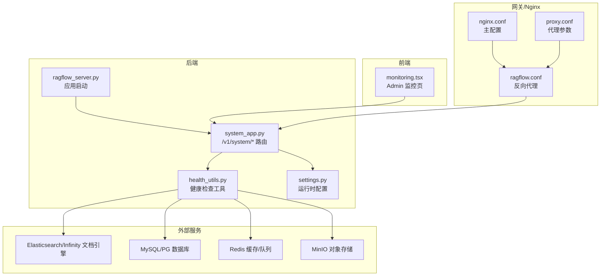
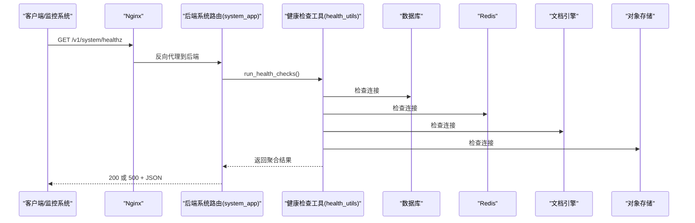
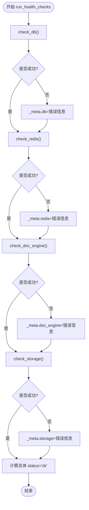
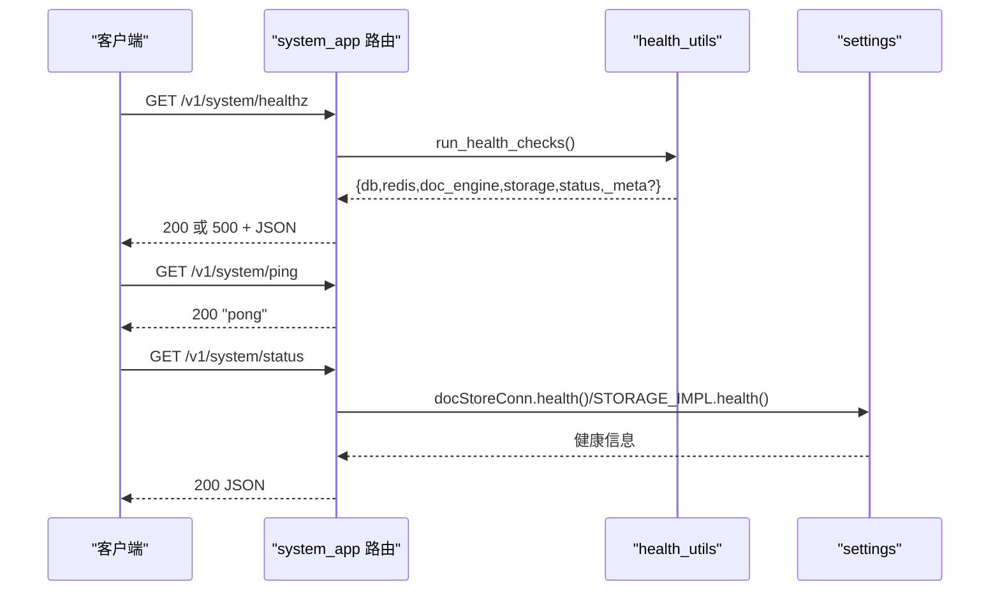
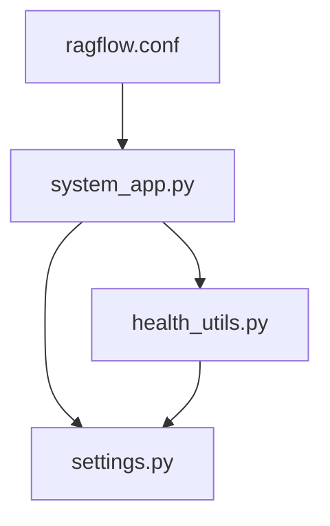

# 健康检查与监控

<cite>
**本文引用的文件**
- [run_health_check.md](file://docs/guides/run_health_check.md)
- [health_utils.py](file://api/utils/health_utils.py)
- [system_app.py](file://api/apps/system_app.py)
- [ragflow_server.py](file://api/ragflow_server.py)
- [ragflow.conf](file://docker/nginx/ragflow.conf)
- [nginx.conf](file://docker/nginx/nginx.conf)
- [proxy.conf](file://docker/nginx/proxy.conf)
- [settings.py](file://common/settings.py)
- [log_utils.py](file://common/log_utils.py)
- [signal_utils.py](file://common/signal_utils.py)
- [wait-for-it-http.sh](file://sandbox/scripts/wait-for-it-http.sh)
- [wait-for-it.sh](file://sandbox/scripts/wait-for-it.sh)
- [monitoring.tsx](file://web/src/pages/admin/monitoring.tsx)
</cite>

## 目录
1. [简介](#简介)
2. [项目结构](#项目结构)
3. [核心组件](#核心组件)
4. [架构总览](#架构总览)
5. [详细组件分析](#详细组件分析)
6. [依赖关系分析](#依赖关系分析)
7. [性能考虑](#性能考虑)
8. [故障排查指南](#故障排查指南)
9. [结论](#结论)
10. [附录](#附录)

## 简介
本指南面向运维与开发人员，系统性介绍 RAGFlow 的健康检查与监控实践，包括：
- 如何执行与配置系统健康检查
- 后端健康检查逻辑与 API 端点
- Nginx 配置与健康检查集成
- 日志查看、性能监控与告警设置建议

## 项目结构
围绕健康检查与监控的关键文件分布如下：
- 文档与指南：docs/guides/run_health_check.md
- 健康检查工具：api/utils/health_utils.py
- 系统路由与健康端点：api/apps/system_app.py
- 应用启动入口：api/ragflow_server.py
- Nginx 配置：docker/nginx/ragflow.conf、docker/nginx/nginx.conf、docker/nginx/proxy.conf
- 运行时配置：common/settings.py
- 日志与信号：common/log_utils.py、common/signal_utils.py
- 健康检查辅助脚本：sandbox/scripts/wait-for-it-http.sh、sandbox/scripts/wait-for-it.sh
- 前端监控页面：web/src/pages/admin/monitoring.tsx

图表来源
- [system_app.py](file://api/apps/system_app.py#L174-L183)
- [health_utils.py](file://api/utils/health_utils.py#L187-L223)
- [settings.py](file://common/settings.py#L240-L279)
- [ragflow.conf](file://docker/nginx/ragflow.conf#L1-L34)
- [nginx.conf](file://docker/nginx/nginx.conf#L1-L32)
- [proxy.conf](file://docker/nginx/proxy.conf#L1-L12)

章节来源
- [system_app.py](file://api/apps/system_app.py#L174-L183)
- [health_utils.py](file://api/utils/health_utils.py#L187-L223)
- [settings.py](file://common/settings.py#L240-L279)
- [ragflow.conf](file://docker/nginx/ragflow.conf#L1-L34)
- [nginx.conf](file://docker/nginx/nginx.conf#L1-L32)
- [proxy.conf](file://docker/nginx/proxy.conf#L1-L12)

## 核心组件
- 健康检查工具模块：封装对数据库、Redis、文档引擎、对象存储等依赖的探测逻辑，并汇总为统一结果。
- 系统路由模块：提供 /v1/system/healthz、/v1/system/ping 等端点；其中 healthz 返回聚合健康状态。
- Nginx 反向代理：将 /v1 与 /api 前缀流量转发到后端服务端口，便于统一接入健康检查。
- 运行时配置：根据环境变量选择文档引擎与存储实现，影响健康检查的具体探测方式。
- 日志与信号：统一根日志初始化、日志级别控制与性能诊断信号处理。
- 健康检查辅助脚本：用于容器编排或部署流程中等待后端可用。

章节来源
- [health_utils.py](file://api/utils/health_utils.py#L187-L223)
- [system_app.py](file://api/apps/system_app.py#L174-L183)
- [ragflow.conf](file://docker/nginx/ragflow.conf#L1-L34)
- [settings.py](file://common/settings.py#L240-L279)
- [log_utils.py](file://common/log_utils.py#L1-L84)
- [signal_utils.py](file://common/signal_utils.py#L1-L34)
- [wait-for-it-http.sh](file://sandbox/scripts/wait-for-it-http.sh#L1-L31)
- [wait-for-it.sh](file://sandbox/scripts/wait-for-it.sh#L1-L50)

## 架构总览
后端通过系统路由暴露健康检查端点，健康检查工具对四大依赖进行探测，返回统一 JSON 结果；Nginx 将 /v1 与 /api 前缀请求转发至后端，便于外部监控系统直接调用健康端点。

图表来源
- [system_app.py](file://api/apps/system_app.py#L174-L183)
- [health_utils.py](file://api/utils/health_utils.py#L187-L223)

章节来源
- [system_app.py](file://api/apps/system_app.py#L174-L183)
- [health_utils.py](file://api/utils/health_utils.py#L187-L223)

## 详细组件分析

### 健康检查工具（health_utils）
- 功能要点
  - 探测数据库：执行轻量 SQL 查询，记录耗时与异常信息。
  - 探测 Redis：调用健康接口，记录耗时与异常信息。
  - 探测文档引擎：根据运行时配置选择 ES/Infinity/OSS/OpenSearch/OceanBase 的健康接口。
  - 探测对象存储：根据 STORAGE_IMPL_TYPE 选择 MinIO/AWS S3/OSS/GCS 等实现的健康接口。
  - 聚合结果：按字段“db”“redis”“doc_engine”“storage”输出“ok/nok”，并在失败时附加元数据；最终“status”为“ok/nok”。

- 关键路径
  - run_health_checks：依次调用各组件检查函数，汇总结果与总体状态。
  - check_db/check_redis/check_doc_engine/check_storage：分别对对应依赖进行探测。
  - 其他细节接口：如 get_es_cluster_stats/get_infinity_status/get_mysql_status/check_minio_alive/get_redis_info/check_ragflow_server_alive/check_task_executor_alive 等，用于更细粒度的健康详情。

图表来源
- [health_utils.py](file://api/utils/health_utils.py#L187-L223)

章节来源
- [health_utils.py](file://api/utils/health_utils.py#L33-L69)
- [health_utils.py](file://api/utils/health_utils.py#L187-L223)

### 系统路由与健康端点（system_app）
- /v1/system/healthz：无鉴权，返回健康检查聚合结果；成功返回 200，任一依赖失败返回 500。
- /v1/system/ping：简单存活探针，返回“pong”。
- /v1/system/status：登录受保护，返回文档引擎、存储、数据库、Redis 的健康状态及耗时，同时包含任务执行器心跳信息。
- /v1/system/version/config/new_token/token_list 等：系统版本、配置与令牌管理相关接口。

图表来源
- [system_app.py](file://api/apps/system_app.py#L174-L183)
- [system_app.py](file://api/apps/system_app.py#L65-L172)
- [health_utils.py](file://api/utils/health_utils.py#L187-L223)
- [settings.py](file://common/settings.py#L240-L279)

章节来源
- [system_app.py](file://api/apps/system_app.py#L174-L183)
- [system_app.py](file://api/apps/system_app.py#L65-L172)

### 应用启动与运行（ragflow_server）
- 初始化日志、加载插件、初始化数据库与运行时配置。
- 启动 HTTP 服务器，监听 HOST_IP/HOST_PORT。
- 提供调试模式与信号处理，支持优雅退出。

章节来源
- [ragflow_server.py](file://api/ragflow_server.py#L1-L167)

### Nginx 配置与健康检查集成
- ragflow.conf 将 /api/v1/admin 与 /v1、/api 前缀的请求转发到本地后端端口，便于统一接入健康检查。
- nginx.conf 定义全局日志格式与访问日志，proxy.conf 提供代理头、超时与缓冲参数。
- 建议在外部负载均衡器或健康检查器中对 /v1/system/healthz 发起探测，以实现自动故障转移。

图表来源
- [ragflow.conf](file://docker/nginx/ragflow.conf#L1-L34)
- [nginx.conf](file://docker/nginx/nginx.conf#L1-L32)
- [proxy.conf](file://docker/nginx/proxy.conf#L1-L12)

章节来源
- [ragflow.conf](file://docker/nginx/ragflow.conf#L1-L34)
- [nginx.conf](file://docker/nginx/nginx.conf#L1-L32)
- [proxy.conf](file://docker/nginx/proxy.conf#L1-L12)

### 运行时配置与依赖选择（settings）
- 文档引擎：根据环境变量选择 ES/Infinity/OpenSearch/OceanBase，并实例化对应连接对象。
- 存储实现：根据 STORAGE_IMPL_TYPE 选择 MinIO/AWS S3/OSS/GCS 等实现。
- 主机与端口：从配置读取 HOST_IP/HOST_PORT，影响后端服务监听与内部健康检查调用。

章节来源
- [settings.py](file://common/settings.py#L65-L80)
- [settings.py](file://common/settings.py#L240-L279)
- [settings.py](file://common/settings.py#L221-L227)

### 日志与性能监控
- 日志初始化：统一根日志、轮转文件、标准输出、包级日志级别控制。
- 性能诊断：信号处理支持内存快照采集，便于定位性能问题。
- 前端监控：Admin 页面内嵌 Prometheus Alertmanager 界面，便于查看告警。

章节来源
- [log_utils.py](file://common/log_utils.py#L1-L84)
- [signal_utils.py](file://common/signal_utils.py#L1-L34)
- [monitoring.tsx](file://web/src/pages/admin/monitoring.tsx#L1-L19)

### 健康检查辅助脚本
- wait-for-it-http.sh：对指定 URL 发起 HTTP 探测，支持超时与静默模式。
- wait-for-it.sh：对主机端口进行 TCP 探测，支持超时与静默模式。

章节来源
- [wait-for-it-http.sh](file://sandbox/scripts/wait-for-it-http.sh#L1-L31)
- [wait-for-it.sh](file://sandbox/scripts/wait-for-it.sh#L1-L50)

## 依赖关系分析
- system_app 依赖 health_utils 执行具体探测，并依赖 settings 获取运行时配置。
- health_utils 依赖 settings 中的 docStoreConn、STORAGE_IMPL、REDIS_CONN 等连接对象。
- Nginx 通过 ragflow.conf 将 /v1 与 /api 前缀流量转发到后端，便于外部健康检查器直接调用。

图表来源
- [system_app.py](file://api/apps/system_app.py#L174-L183)
- [health_utils.py](file://api/utils/health_utils.py#L187-L223)
- [settings.py](file://common/settings.py#L240-L279)
- [ragflow.conf](file://docker/nginx/ragflow.conf#L1-L34)

章节来源
- [system_app.py](file://api/apps/system_app.py#L174-L183)
- [health_utils.py](file://api/utils/health_utils.py#L187-L223)
- [settings.py](file://common/settings.py#L240-L279)
- [ragflow.conf](file://docker/nginx/ragflow.conf#L1-L34)

## 性能考虑
- 健康检查应保持轻量：使用最小代价查询（如 SELECT 1），避免阻塞或长事务。
- 超时与重试：Nginx 代理层可设置合理的 proxy_read_timeout 与 proxy_send_timeout，避免长时间占用连接。
- 日志级别：通过环境变量调整包级日志级别，避免在高并发下产生过多 I/O。
- 任务执行器心跳：通过 Redis 集合与有序集合维护心跳，有助于快速判断任务执行器存活状态。

章节来源
- [health_utils.py](file://api/utils/health_utils.py#L187-L223)
- [proxy.conf](file://docker/nginx/proxy.conf#L1-L12)
- [log_utils.py](file://common/log_utils.py#L48-L73)

## 故障排查指南
- 使用 /v1/system/healthz 快速判断四大依赖状态；若返回 500，查看 _meta 字段中的具体错误信息。
- 使用 /v1/system/ping 确认后端进程存活。
- 使用 /v1/system/status 查看文档引擎、存储、数据库、Redis 的详细状态与耗时。
- 在 Nginx 层确认 /v1 与 /api 前缀已正确转发到后端端口。
- 查看后端日志：日志路径与级别由日志初始化逻辑决定，可通过环境变量调整。
- 使用 wait-for-it.sh/wait-for-it-http.sh 在容器编排中等待后端可用。
- 若需要性能诊断，发送信号触发内存快照采集。

章节来源
- [system_app.py](file://api/apps/system_app.py#L174-L183)
- [system_app.py](file://api/apps/system_app.py#L65-L172)
- [ragflow.conf](file://docker/nginx/ragflow.conf#L1-L34)
- [log_utils.py](file://common/log_utils.py#L1-L84)
- [wait-for-it-http.sh](file://sandbox/scripts/wait-for-it-http.sh#L1-L31)
- [wait-for-it.sh](file://sandbox/scripts/wait-for-it.sh#L1-L50)
- [signal_utils.py](file://common/signal_utils.py#L1-L34)

## 结论
通过统一的健康检查工具与系统路由端点，结合 Nginx 的前缀转发，RAGFlow 实现了对外部监控系统与运维脚本友好的健康检查能力。配合完善的日志与性能诊断机制，能够有效支撑生产环境的稳定性保障与快速故障定位。

## 附录
- 健康检查端点参考
  - GET /v1/system/healthz：无鉴权，返回聚合健康状态（200/500 + JSON）
  - GET /v1/system/ping：无鉴权，返回“pong”
  - GET /v1/system/status：登录受保护，返回各组件健康状态与耗时
- Nginx 建议
  - 将 /v1 与 /api 前缀转发到后端端口，便于外部健康检查器直接调用
  - 设置合理的代理超时与缓冲参数，避免长时间占用连接
- 告警与监控
  - 前端 Admin 页面内嵌 Alertmanager 界面，便于查看告警
  - 建议在外部监控系统中定期调用 /v1/system/healthz 并配置告警规则

章节来源
- [system_app.py](file://api/apps/system_app.py#L174-L183)
- [system_app.py](file://api/apps/system_app.py#L65-L172)
- [ragflow.conf](file://docker/nginx/ragflow.conf#L1-L34)
- [monitoring.tsx](file://web/src/pages/admin/monitoring.tsx#L1-L19)