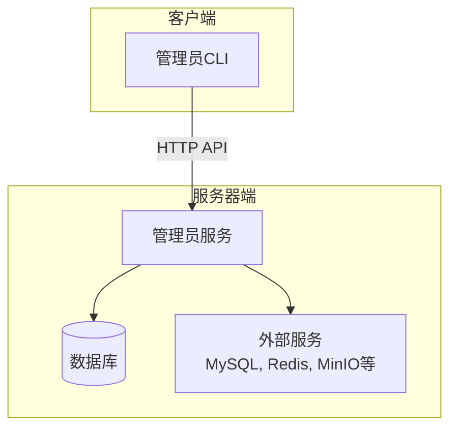
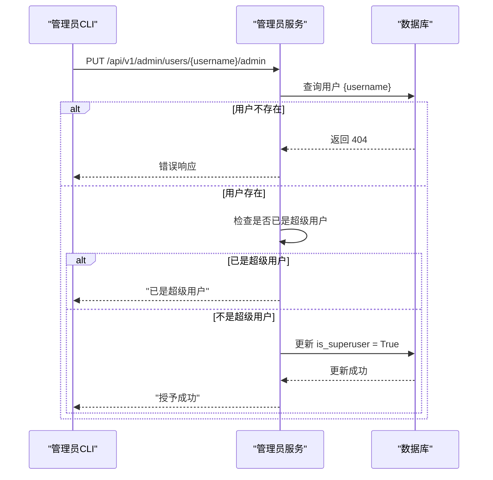
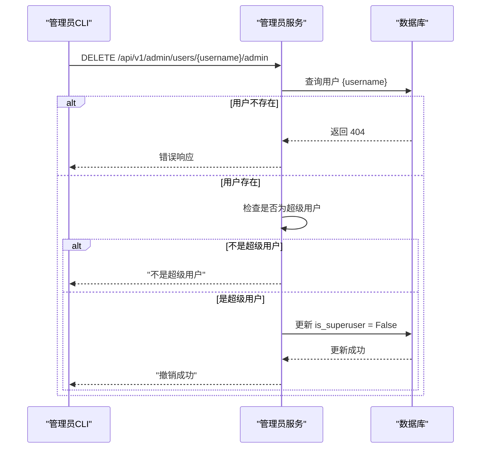
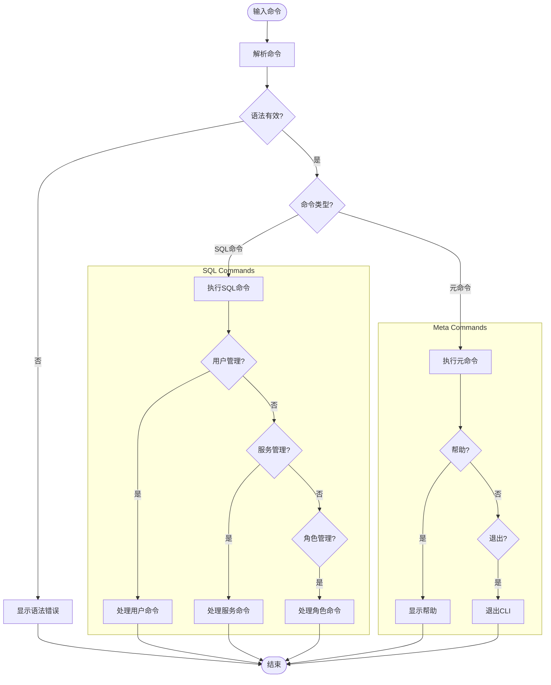
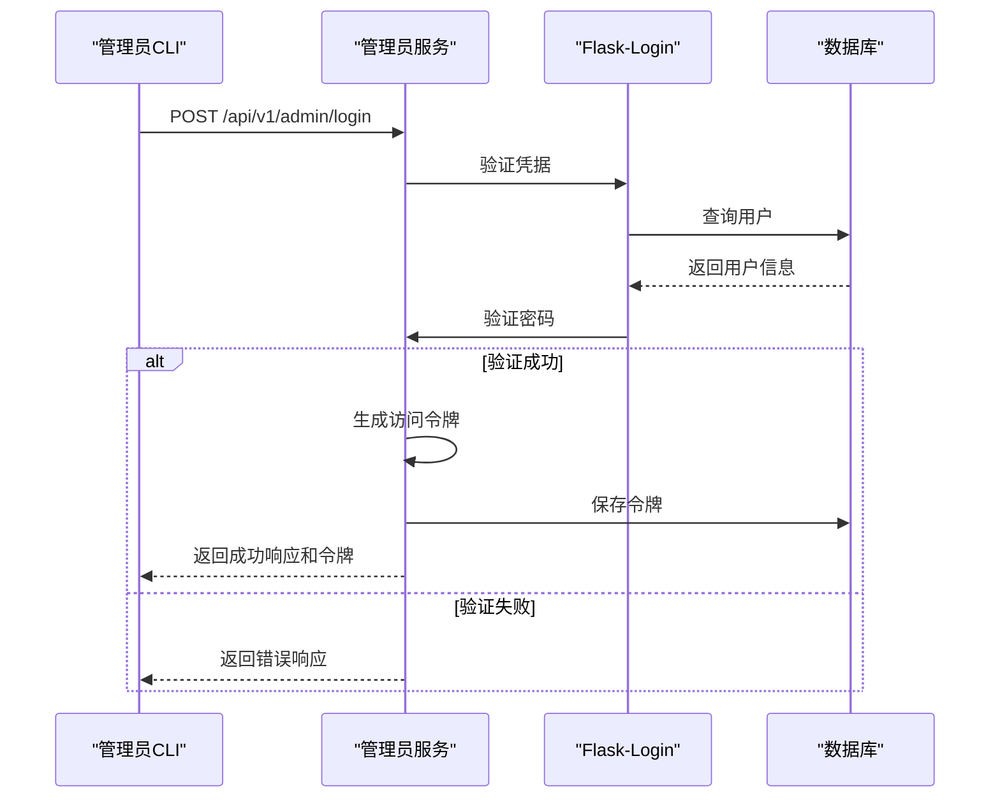
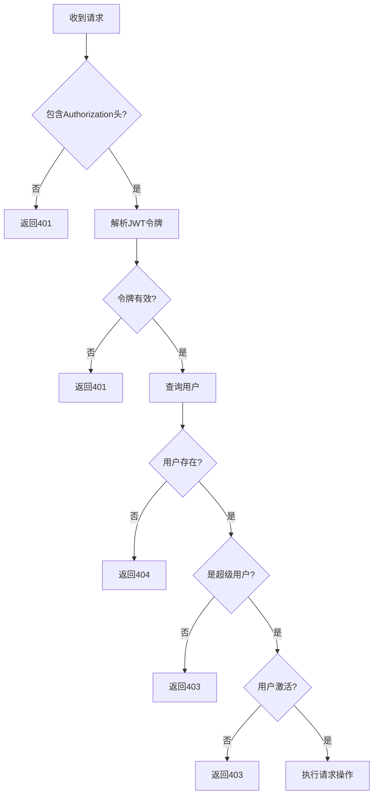
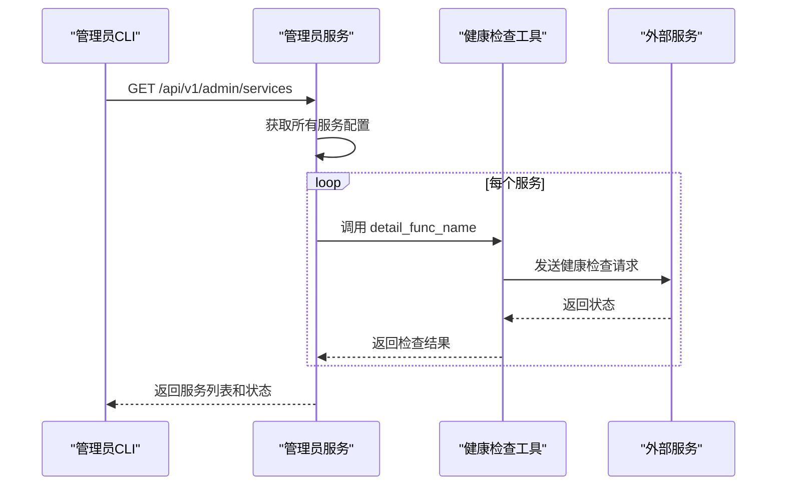
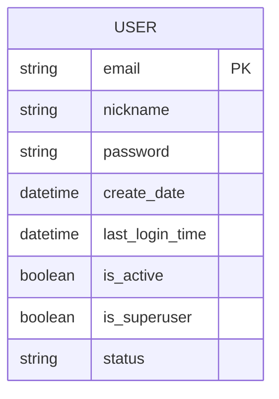
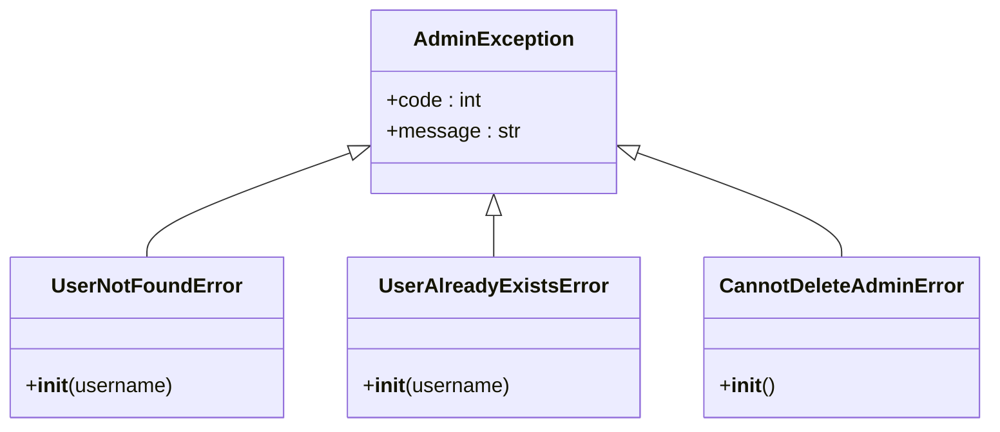

# 管理员CLI超级用户管理

<cite>
**本文档引用的文件**   
- [admin_client.py](file://admin/client/admin_client.py)
- [admin_server.py](file://admin/server/admin_server.py)
- [routes.py](file://admin/server/routes.py)
- [services.py](file://admin/server/services.py)
- [auth.py](file://admin/server/auth.py)
- [roles.py](file://admin/server/roles.py)
- [responses.py](file://admin/server/responses.py)
- [config.py](file://admin/server/config.py)
- [exceptions.py](file://admin/server/exceptions.py)
- [README.md](file://admin/client/README.md)
</cite>

## 目录
1. [简介](#简介)
2. [系统架构](#系统架构)
3. [核心组件](#核心组件)
4. [超级用户管理功能](#超级用户管理功能)
5. [命令语法与解析](#命令语法与解析)
6. [认证与授权机制](#认证与授权机制)
7. [服务管理功能](#服务管理功能)
8. [用户与角色管理](#用户与角色管理)
9. [数据流与交互流程](#数据流与交互流程)
10. [异常处理](#异常处理)
11. [使用示例](#使用示例)
12. [结论](#结论)

## 简介

RAGFlow管理员服务与命令行界面（CLI）是一个专用的管理组件，旨在监控、维护和管理RAGFlow系统。该系统由服务器端服务和命令行客户端组成，为系统管理员提供了一套完整的工具集，用于确保系统稳定性、执行运维任务以及高效地管理用户和权限。

管理员CLI允许超级用户通过类SQL语法与管理员服务进行交互，执行各种管理操作，包括服务监控、用户管理、权限分配等。系统设计注重可扩展性和可靠性，简化了维护工作流程，确保了系统的平稳运行。

**Section sources**
- [README.md](file://admin/client/README.md#L1-L137)

## 系统架构

RAGFlow管理员系统采用客户端-服务器（Client-Server）架构，由两个主要组件构成：管理员服务（Admin Service）和管理员CLI（Admin CLI）。



**Diagram sources**
- [admin_server.py](file://admin/server/admin_server.py#L1-L83)
- [routes.py](file://admin/server/routes.py#L1-L418)

## 核心组件

管理员系统的核心组件包括命令解析器、API路由、服务管理器和用户管理器。这些组件协同工作，处理来自CLI的请求并执行相应的操作。

```mermaid
classDiagram
class AdminCLI {
+host : str
+port : int
+access_token : str
+session : requests.Session
+run_interactive()
+run_single_command()
+execute_command()
+parse_command()
+verify_admin()
}
class AdminTransformer {
+list_services()
+show_user()
+create_user()
+grant_admin()
+revoke_admin()
+action_list()
}
class UserMgr {
+get_all_users()
+get_user_details()
+create_user()
+delete_user()
+update_user_password()
+update_user_activate_status()
+grant_admin()
+revoke_admin()
}
class ServiceMgr {
+get_all_services()
+get_service_details()
+shutdown_service()
+restart_service()
}
class RoleMgr {
+create_role()
+delete_role()
+update_role_description()
+list_roles()
+get_role_permission()
+grant_role_permission()
+revoke_role_permission()
+update_user_role()
+get_user_permission()
}
AdminCLI --> AdminTransformer : "使用"
AdminCLI --> UserMgr : "调用"
AdminCLI --> ServiceMgr : "调用"
AdminCLI --> RoleMgr : "调用"
UserMgr --> UserService : "数据访问"
ServiceMgr --> SERVICE_CONFIGS : "配置访问"
RoleMgr --> "未实现" : "占位"
```

**Diagram sources**
- [admin_client.py](file://admin/client/admin_client.py#L1-L997)
- [services.py](file://admin/server/services.py#L1-L266)
- [roles.py](file://admin/server/roles.py#L1-L77)

## 超级用户管理功能

管理员CLI提供了强大的超级用户管理功能，允许管理员对系统中的用户进行全生命周期的管理，包括创建、查看、修改、删除用户以及授予或撤销超级用户权限。

### 授予超级用户权限

`GRANT ADMIN` 命令用于将普通用户提升为超级用户。该操作会将用户的 `is_superuser` 标志设置为 `True`。



**Diagram sources**
- [admin_client.py](file://admin/client/admin_client.py#L757-L781)
- [routes.py](file://admin/server/routes.py#L161-L175)
- [services.py](file://admin/server/services.py#L140-L155)

### 撤销超级用户权限

`REVOKE ADMIN` 命令用于将超级用户降级为普通用户。该操作会将用户的 `is_superuser` 标志设置为 `False`。



**Diagram sources**
- [admin_client.py](file://admin/client/admin_client.py#L770-L781)
- [routes.py](file://admin/server/routes.py#L176-L189)
- [services.py](file://admin/server/services.py#L156-L171)

**Section sources**
- [admin_client.py](file://admin/client/admin_client.py#L757-L781)
- [routes.py](file://admin/server/routes.py#L161-L189)
- [services.py](file://admin/server/services.py#L140-L171)

## 命令语法与解析

管理员CLI使用Lark解析工具包来解析用户输入的命令。命令语法设计为类SQL风格，不区分大小写，并以分号（`;`）结尾。

### 语法规则

系统定义了一套完整的EBNF（扩展巴科斯-诺尔范式）语法规则，用于解析各种管理命令。



**Diagram sources**
- [admin_client.py](file://admin/client/admin_client.py#L28-L146)

### 支持的命令

| 命令类型 | 命令语法 | 描述 |
| :--- | :--- | :--- |
| **用户管理** | `GRANT ADMIN '<username>';` | 授予用户超级用户权限 |
| | `REVOKE ADMIN '<username>';` | 撤销用户的超级用户权限 |
| | `CREATE USER '<username>' '<password>';` | 创建新用户 |
| | `DROP USER '<username>';` | 删除用户 |
| | `ALTER USER PASSWORD '<username>' '<new_password>';` | 修改用户密码 |
| | `ALTER USER ACTIVE '<username>' <on/off>;` | 激活或停用用户 |
| **服务管理** | `LIST SERVICES;` | 列出所有服务 |
| | `SHOW SERVICE <id>;` | 显示指定服务的详细信息 |
| **角色管理** | `CREATE ROLE <role_name>;` | 创建新角色 |
| | `DROP ROLE <role_name>;` | 删除角色 |
| | `GRANT <action> ON <resource> TO ROLE <role_name>;` | 授予角色权限 |
| | `REVOKE <action> ON <resource> FROM ROLE <role_name>;` | 撤销角色权限 |
| **元命令** | `\?`, `\h`, `\help` | 显示帮助信息 |
| | `\q`, `\quit`, `\exit` | 退出CLI |

**Section sources**
- [README.md](file://admin/client/README.md#L68-L113)

## 认证与授权机制

管理员系统实现了基于JWT（JSON Web Token）的认证和基于角色的授权（RBAC）机制，确保只有经过验证的超级用户才能执行管理操作。

### 认证流程



**Diagram sources**
- [admin_server.py](file://admin/server/admin_server.py#L64-L65)
- [auth.py](file://admin/server/auth.py#L108-L133)
- [routes.py](file://admin/server/routes.py#L37-L47)

### 授权流程



**Diagram sources**
- [auth.py](file://admin/server/auth.py#L92-L105)
- [routes.py](file://admin/server/routes.py#L72-L73)

**Section sources**
- [auth.py](file://admin/server/auth.py#L38-L189)
- [routes.py](file://admin/server/routes.py#L37-L47)

## 服务管理功能

管理员CLI提供了对RAGFlow系统中各种服务的监控和管理功能，包括RAGFlow服务器、任务执行器、数据库、检索引擎等。

### 服务状态查询

`LIST SERVICES` 命令会查询所有配置的服务，并通过健康检查工具获取其运行状态。



**Diagram sources**
- [services.py](file://admin/server/services.py#L214-L238)
- [routes.py](file://admin/server/routes.py#L233-L242)

### 服务详细信息

`SHOW SERVICE <id>` 命令会显示指定服务的详细信息，包括主机、端口、配置参数和实时状态。

**Section sources**
- [admin_client.py](file://admin/client/admin_client.py#L629-L665)
- [routes.py](file://admin/server/routes.py#L255-L264)

## 用户与角色管理

系统提供了用户和角色管理的基本框架，尽管角色管理功能目前尚未完全实现。

### 用户管理

用户管理功能允许管理员对用户进行增删改查操作。用户信息存储在数据库中，包括邮箱、昵称、密码哈希、激活状态和超级用户标志。



**Diagram sources**
- [services.py](file://admin/server/services.py#L34-L47)

### 角色管理

角色管理功能目前在代码中作为占位符存在，所有方法都抛出“未实现”异常。这表明该功能是未来开发的规划。

**Section sources**
- [roles.py](file://admin/server/roles.py#L23-L77)

## 数据流与交互流程

从用户在CLI中输入命令到最终结果返回，整个过程涉及多个组件的协同工作。

```mermaid
sequenceDiagram
participant User as "用户"
participant CLI as "管理员CLI"
participant Parser as "Lark解析器"
participant Service as "管理员服务"
participant DB as "数据库"
User->>CLI : 输入命令 "GRANT ADMIN 'user@domain.com';"
CLI->>Parser : 解析命令
Parser-->>CLI : 返回解析树
CLI->>CLI : 验证管理员凭据
CLI->>Service : 发送HTTP请求 (PUT /api/v1/admin/users/user@domain.com/admin)
Service->>DB : 查询用户
DB-->>Service : 返回用户信息
Service->>Service : 检查权限
Service->>DB : 更新用户 is_superuser 字段
DB-->>Service : 返回更新结果
Service-->>CLI : 返回JSON响应
CLI-->>User : 显示结果 "授予成功"
```

**Diagram sources**
- [admin_client.py](file://admin/client/admin_client.py#L558-L627)
- [routes.py](file://admin/server/routes.py#L161-L175)

## 异常处理

系统定义了一套自定义异常，用于处理各种错误情况，确保错误信息清晰且具有针对性。



**Diagram sources**
- [exceptions.py](file://admin/server/exceptions.py#L1-L17)

**Section sources**
- [exceptions.py](file://admin/server/exceptions.py#L1-L17)

## 使用示例

以下是一些常见的使用场景示例：

### 启动CLI并登录

```bash
ragflow-cli -h 127.0.0.1 -p 9381
```

### 授予超级用户权限

```sql
GRANT ADMIN 'newadmin@ragflow.io';
```

### 撤销超级用户权限

```sql
REVOKE ADMIN 'formeradmin@ragflow.io';
```

### 列出所有用户

```sql
LIST USERS;
```

### 查看服务状态

```sql
LIST SERVICES;
```

**Section sources**
- [README.md](file://admin/client/README.md#L114-L136)

## 结论

RAGFlow管理员CLI为系统管理员提供了一个强大而直观的工具，用于管理超级用户和监控系统健康状况。通过类SQL的命令语法，管理员可以轻松地执行复杂的管理任务。系统架构清晰，组件职责分明，认证授权机制安全可靠。尽管角色管理功能尚未完全实现，但现有的用户和权限管理功能已经能够满足基本的运维需求。该系统是确保RAGFlow平台稳定、安全运行的关键组成部分。