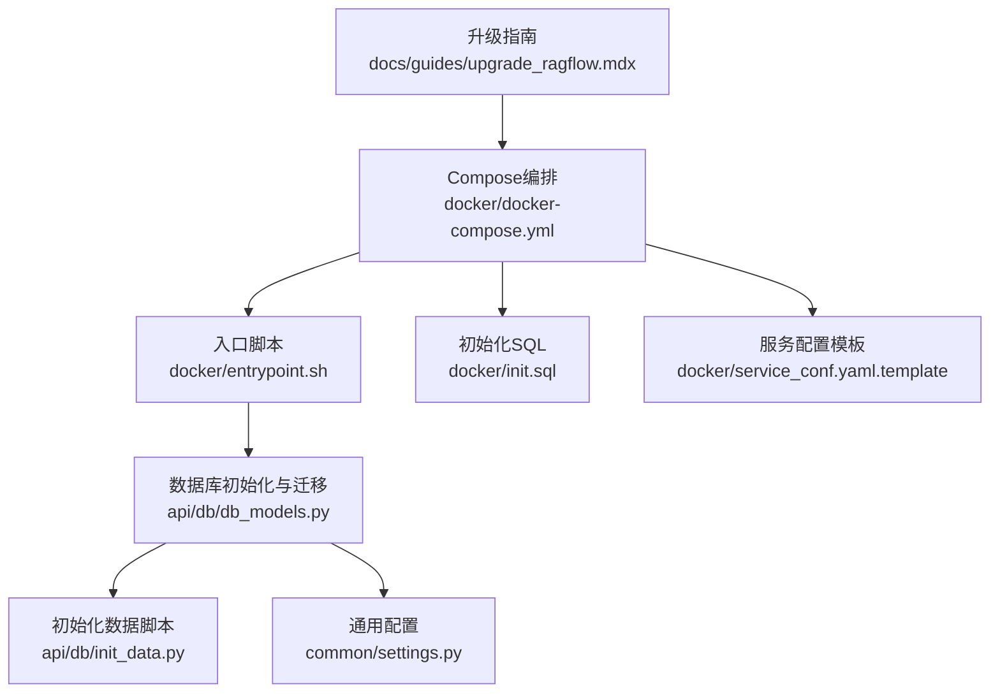
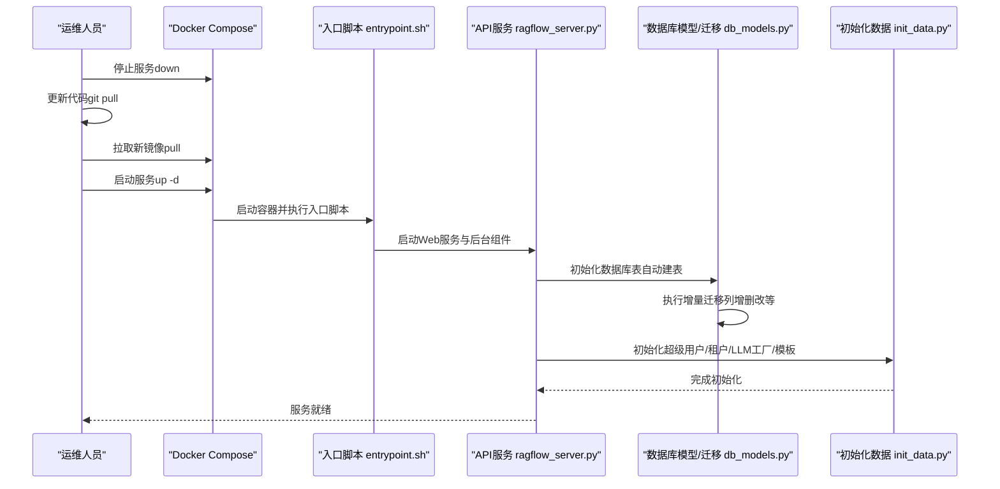
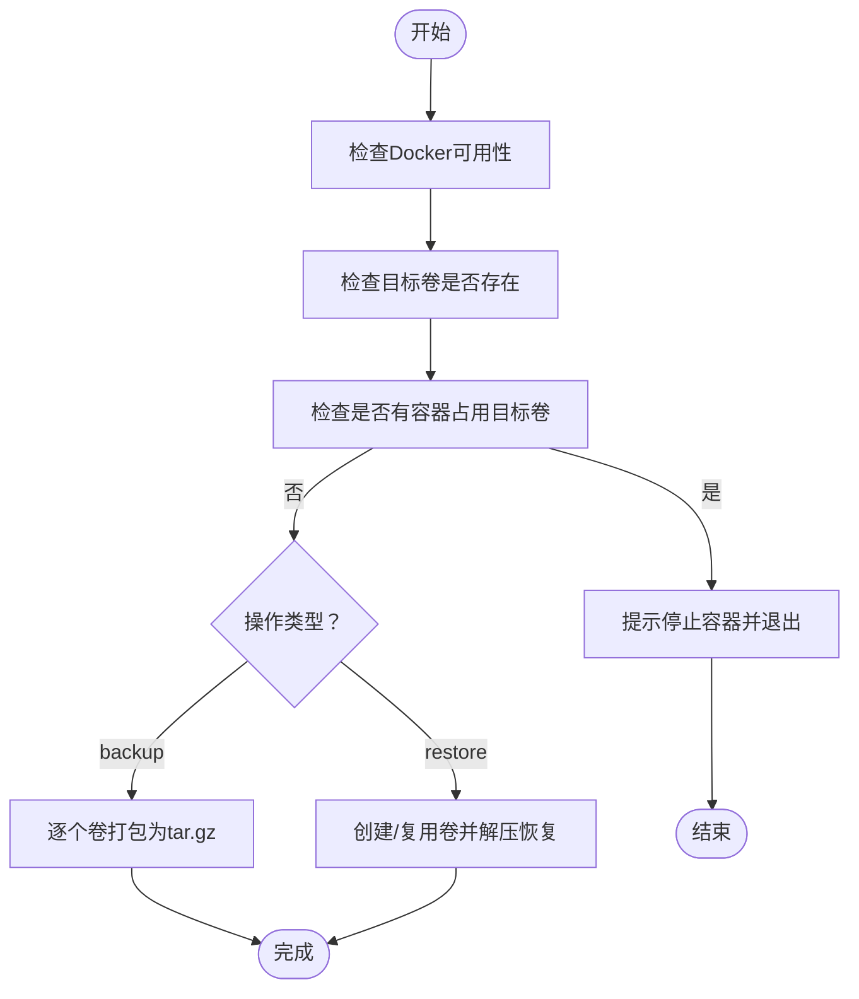
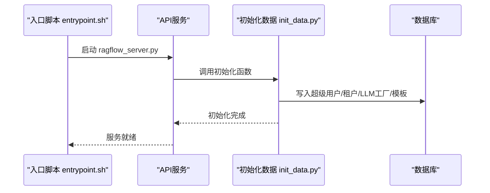
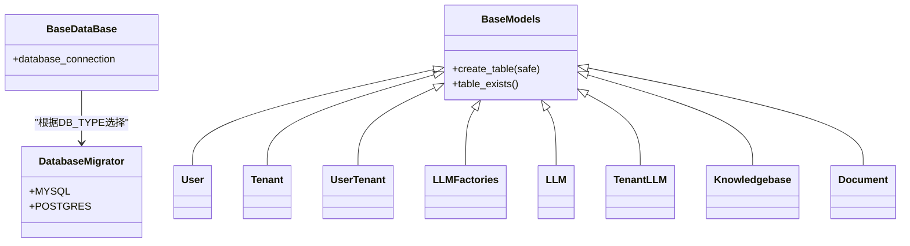
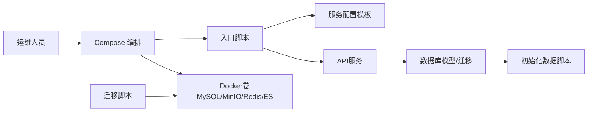

# 系统升级

<cite>
**本文引用的文件**
- [升级指南（upgrade_ragflow.mdx）](file://docs/guides/upgrade_ragflow.mdx)
- [迁移脚本（migration.sh）](file://docker/migration.sh)
- [初始化SQL（init.sql）](file://docker/init.sql)
- [初始化数据脚本（init_data.py）](file://api/db/init_data.py)
- [数据库模型与迁移（db_models.py）](file://api/db/db_models.py)
- [入口脚本（entrypoint.sh）](file://docker/entrypoint.sh)
- [Compose编排（docker-compose.yml）](file://docker/docker-compose.yml)
- [通用配置（settings.py）](file://common/settings.py)
- [服务配置模板（service_conf.yaml.template）](file://docker/service_conf.yaml.template)
</cite>

## 目录
1. [简介](#简介)
2. [项目结构](#项目结构)
3. [核心组件](#核心组件)
4. [架构总览](#架构总览)
5. [详细组件分析](#详细组件分析)
6. [依赖关系分析](#依赖关系分析)
7. [性能与停机时间考量](#性能与停机时间考量)
8. [故障排查指南](#故障排查指南)
9. [结论](#结论)
10. [附录：升级路径与注意事项](#附录升级路径与注意事项)

## 简介
本操作手册面向运维与开发人员，基于仓库中的升级指南与脚本，提供从旧版本平滑升级到新版本的完整流程说明。重点覆盖：
- 升级前准备与数据备份策略
- 升级过程中的停机时间管理
- 数据库模式迁移与初始化数据的作用与执行时机
- 升级后验证步骤
- 不同版本间的升级路径与常见问题处理

## 项目结构
围绕升级与数据库初始化的关键文件分布如下：
- 文档与升级指南：docs/guides/upgrade_ragflow.mdx
- Docker与迁移工具：docker/migration.sh、docker/init.sql、docker/entrypoint.sh、docker/docker-compose.yml、docker/service_conf.yaml.template
- 数据库模型与迁移：api/db/db_models.py
- 初始化数据：api/db/init_data.py
- 配置与运行时设置：common/settings.py

图表来源
- [升级指南（upgrade_ragflow.mdx）](file://docs/guides/upgrade_ragflow.mdx#L1-L100)
- [Compose编排（docker-compose.yml）](file://docker/docker-compose.yml#L1-L135)
- [入口脚本（entrypoint.sh）](file://docker/entrypoint.sh#L1-L297)
- [数据库模型与迁移（db_models.py）](file://api/db/db_models.py#L560-L620)
- [初始化数据脚本（init_data.py）](file://api/db/init_data.py#L164-L178)
- [初始化SQL（init.sql）](file://docker/init.sql#L1-L2)
- [服务配置模板（service_conf.yaml.template）](file://docker/service_conf.yaml.template)
- [通用配置（settings.py）](file://common/settings.py#L65-L67)

章节来源
- [升级指南（upgrade_ragflow.mdx）](file://docs/guides/upgrade_ragflow.mdx#L1-L100)
- [Compose编排（docker-compose.yml）](file://docker/docker-compose.yml#L1-L135)

## 核心组件
- 升级流程与停机管理：由升级指南定义，强调先停止服务再拉取镜像并重启。
- 迁移脚本（migration.sh）：用于备份与恢复Docker卷（MySQL、MinIO、Redis、Elasticsearch），支持交互确认与错误提示。
- 初始化SQL（init.sql）：在首次部署或容器初始化阶段创建数据库。
- 初始化数据脚本（init_data.py）：在应用启动时初始化超级用户、默认租户、LLM工厂与模板等。
- 数据库模型与迁移（db_models.py）：定义表结构、字段类型、自动建表与增量迁移逻辑。
- 入口脚本（entrypoint.sh）：负责渲染服务配置、启动Web服务、任务执行器、Admin服务等。
- 通用配置（settings.py）：读取数据库类型与连接参数，决定使用MySQL或PostgreSQL等。

章节来源
- [升级指南（upgrade_ragflow.mdx）](file://docs/guides/upgrade_ragflow.mdx#L16-L100)
- [迁移脚本（migration.sh）](file://docker/migration.sh#L1-L298)
- [初始化SQL（init.sql）](file://docker/init.sql#L1-L2)
- [初始化数据脚本（init_data.py）](file://api/db/init_data.py#L1-L178)
- [数据库模型与迁移（db_models.py）](file://api/db/db_models.py#L560-L620)
- [入口脚本（entrypoint.sh）](file://docker/entrypoint.sh#L1-L297)
- [通用配置（settings.py）](file://common/settings.py#L65-L67)

## 架构总览
下图展示升级与初始化的关键交互路径，突出“停止服务—更新代码与镜像—启动服务—数据库初始化与迁移”的顺序。

图表来源
- [升级指南（upgrade_ragflow.mdx）](file://docs/guides/upgrade_ragflow.mdx#L16-L80)
- [入口脚本（entrypoint.sh）](file://docker/entrypoint.sh#L244-L297)
- [数据库模型与迁移（db_models.py）](file://api/db/db_models.py#L560-L620)
- [初始化数据脚本（init_data.py）](file://api/db/init_data.py#L164-L178)

## 详细组件分析

### 组件一：升级流程与停机时间管理
- 升级步骤要点
  - 停止服务：使用Compose停止容器。
  - 更新代码：拉取最新代码。
  - 切换镜像：更新.env中的镜像标签为nightly或指定版本。
  - 拉取镜像并重启：pull后up -d启动。
- 停机时间
  - 升级指南明确为“停机”流程，建议在业务低峰期执行。
- 备份策略
  - 升级指南指出直接down -v会删除Docker卷导致数据丢失；推荐使用迁移脚本进行卷备份与恢复。

章节来源
- [升级指南（upgrade_ragflow.mdx）](file://docs/guides/upgrade_ragflow.mdx#L16-L80)
- [升级指南（upgrade_ragflow.mdx）](file://docs/guides/upgrade_ragflow.mdx#L82-L100)

### 组件二：迁移脚本（migration.sh）——数据库与对象存储卷备份/恢复
- 功能概述
  - 支持backup与restore两种操作，备份目标包括MySQL、MinIO、Redis、Elasticsearch卷。
  - 自动检查Docker可用性、目标卷是否存在、运行中容器是否占用目标卷。
  - 提供交互式确认与错误提示，避免误操作覆盖现有数据。
- 使用场景
  - 升级前：执行backup，生成压缩包保存至本地或外部介质。
  - 升级失败回滚：执行restore，将备份恢复到对应卷。
- 注意事项
  - 执行前需确保无容器正在使用目标卷。
  - restore前如卷已存在，脚本会警告并要求确认覆盖。

图表来源
- [迁移脚本（migration.sh）](file://docker/migration.sh#L45-L114)
- [迁移脚本（migration.sh）](file://docker/migration.sh#L127-L173)
- [迁移脚本（migration.sh）](file://docker/migration.sh#L175-L263)

章节来源
- [迁移脚本（migration.sh）](file://docker/migration.sh#L1-L298)

### 组件三：初始化SQL（init.sql）与初始化数据（init_data.py）
- init.sql
  - 在容器首次启动时创建数据库（若不存在），作为数据库层初始化的第一步。
- init_data.py
  - 在应用启动时调用，完成以下初始化：
    - 创建超级用户、默认租户、用户-租户关系与默认租户LLM配置。
    - 初始化LLM工厂与LLM列表，清理/更新部分历史配置。
    - 插入图模板（Agent画布模板）。
    - 计算并更新知识库文档数量等统计信息。
  - 该脚本通常由入口脚本在启动API服务时触发。

图表来源
- [入口脚本（entrypoint.sh）](file://docker/entrypoint.sh#L244-L254)
- [初始化数据脚本（init_data.py）](file://api/db/init_data.py#L164-L178)

章节来源
- [初始化SQL（init.sql）](file://docker/init.sql#L1-L2)
- [初始化数据脚本（init_data.py）](file://api/db/init_data.py#L1-L178)
- [入口脚本（entrypoint.sh）](file://docker/entrypoint.sh#L244-L254)

### 组件四：数据库模型与迁移（db_models.py）
- 表结构与字段
  - 定义了用户、租户、用户-租户、邀请码、LLM工厂、LLM、租户LLM、知识库、文档等核心表，并包含JSON/长文本字段、时间戳字段等。
- 自动建表与迁移
  - 启动时扫描所有继承自基础模型的类，对不存在的表进行安全创建。
  - 调用迁移函数执行列增删改、类型变更、新增字段等，保证数据库schema随版本演进保持兼容。
- 数据库类型选择
  - 通过通用配置读取数据库类型（DB_TYPE），决定使用MySQL或PostgreSQL的迁移器与连接池。

图表来源
- [数据库模型与迁移（db_models.py）](file://api/db/db_models.py#L560-L620)
- [数据库模型与迁移（db_models.py）](file://api/db/db_models.py#L1201-L1229)
- [通用配置（settings.py）](file://common/settings.py#L65-L67)

章节来源
- [数据库模型与迁移（db_models.py）](file://api/db/db_models.py#L560-L620)
- [数据库模型与迁移（db_models.py）](file://api/db/db_models.py#L1201-L1229)
- [通用配置（settings.py）](file://common/settings.py#L65-L67)

### 组件五：入口脚本（entrypoint.sh）与服务编排（docker-compose.yml）
- 入口脚本职责
  - 渲染服务配置模板为最终配置文件。
  - 可按参数启用/禁用Web服务、任务执行器、数据同步、Admin服务、MCP服务等。
  - 启动API服务与后台组件，支持初始化超级用户。
- Compose编排
  - 定义服务镜像、端口映射、挂载目录、环境变量与网络。
  - 通过env_file加载镜像版本，up -d启动。

章节来源
- [入口脚本（entrypoint.sh）](file://docker/entrypoint.sh#L151-L163)
- [入口脚本（entrypoint.sh）](file://docker/entrypoint.sh#L244-L297)
- [Compose编排（docker-compose.yml）](file://docker/docker-compose.yml#L1-L135)

## 依赖关系分析
- 升级流程依赖Compose与入口脚本，入口脚本依赖服务配置模板与通用配置。
- 数据库初始化依赖数据库模型与迁移脚本，迁移脚本依赖Docker卷与容器健康状态。
- 初始化数据脚本依赖数据库模型与通用配置，用于写入默认数据。

图表来源
- [Compose编排（docker-compose.yml）](file://docker/docker-compose.yml#L1-L135)
- [入口脚本（entrypoint.sh）](file://docker/entrypoint.sh#L151-L163)
- [数据库模型与迁移（db_models.py）](file://api/db/db_models.py#L560-L620)
- [初始化数据脚本（init_data.py）](file://api/db/init_data.py#L164-L178)
- [迁移脚本（migration.sh）](file://docker/migration.sh#L1-L298)

章节来源
- [Compose编排（docker-compose.yml）](file://docker/docker-compose.yml#L1-L135)
- [入口脚本（entrypoint.sh）](file://docker/entrypoint.sh#L151-L163)
- [数据库模型与迁移（db_models.py）](file://api/db/db_models.py#L560-L620)
- [初始化数据脚本（init_data.py）](file://api/db/init_data.py#L164-L178)
- [迁移脚本（migration.sh）](file://docker/migration.sh#L1-L298)

## 性能与停机时间考量
- 停机窗口
  - 升级指南明确为停机流程，建议在业务低峰期执行，以减少对用户的影响。
- 数据库迁移
  - 自动建表与增量迁移在服务启动时执行，通常耗时较短；若表规模较大，可考虑分批迁移或离线维护窗口。
- 对象存储与缓存
  - 迁移脚本对MinIO、Redis、Elasticsearch卷进行备份/恢复，建议提前评估卷大小与网络带宽，避免长时间中断。

[本节为通用建议，不涉及具体文件分析]

## 故障排查指南
- 升级后无法访问
  - 检查Compose日志与容器健康状态，确认端口映射与网络配置正确。
  - 若使用Admin服务或MCP服务，请确认入口脚本参数与配置模板渲染成功。
- 数据库连接异常
  - 确认通用配置中的数据库类型与连接参数正确，检查数据库服务健康状态。
  - 如需切换数据库类型，确保迁移器与连接池匹配。
- 卷占用导致备份/恢复失败
  - 使用迁移脚本前，确保没有容器占用目标卷；按脚本提示停止相关容器后再重试。
- 初始化失败
  - 检查初始化数据脚本输出的日志，确认超级用户、租户、LLM工厂等是否成功写入。
  - 如需重新初始化，可在入口脚本中添加初始化参数后重启服务。

章节来源
- [升级指南（upgrade_ragflow.mdx）](file://docs/guides/upgrade_ragflow.mdx#L16-L80)
- [迁移脚本（migration.sh）](file://docker/migration.sh#L127-L173)
- [入口脚本（entrypoint.sh）](file://docker/entrypoint.sh#L244-L297)
- [通用配置（settings.py）](file://common/settings.py#L65-L67)
- [数据库模型与迁移（db_models.py）](file://api/db/db_models.py#L560-L620)
- [初始化数据脚本（init_data.py）](file://api/db/init_data.py#L164-L178)

## 结论
通过遵循升级指南、使用迁移脚本进行卷备份/恢复、在入口脚本与服务配置模板的配合下完成数据库初始化与迁移，可以实现从旧版本到新版本的平滑升级。建议在升级前做好充分备份与演练，升级后进行功能与数据一致性验证，确保系统稳定运行。

[本节为总结性内容，不涉及具体文件分析]

## 附录：升级路径与注意事项
- 升级路径
  - nightly版本：更新镜像标签为nightly，按升级指南步骤执行。
  - 指定版本：切换到目标release分支，更新镜像标签为对应版本号，再执行升级。
- 备份策略
  - 使用迁移脚本进行卷备份；升级前务必完成备份。
  - 升级失败时使用相同备份进行恢复。
- 已知问题与规避
  - down -v会删除卷导致数据丢失，升级指南已明确提示。
  - 卷被占用会导致备份/恢复失败，需先停止相关容器。
  - 数据库迁移可能受网络/磁盘影响，建议在升级窗口内完成。

章节来源
- [升级指南（upgrade_ragflow.mdx）](file://docs/guides/upgrade_ragflow.mdx#L16-L100)
- [迁移脚本（migration.sh）](file://docker/migration.sh#L1-L298)