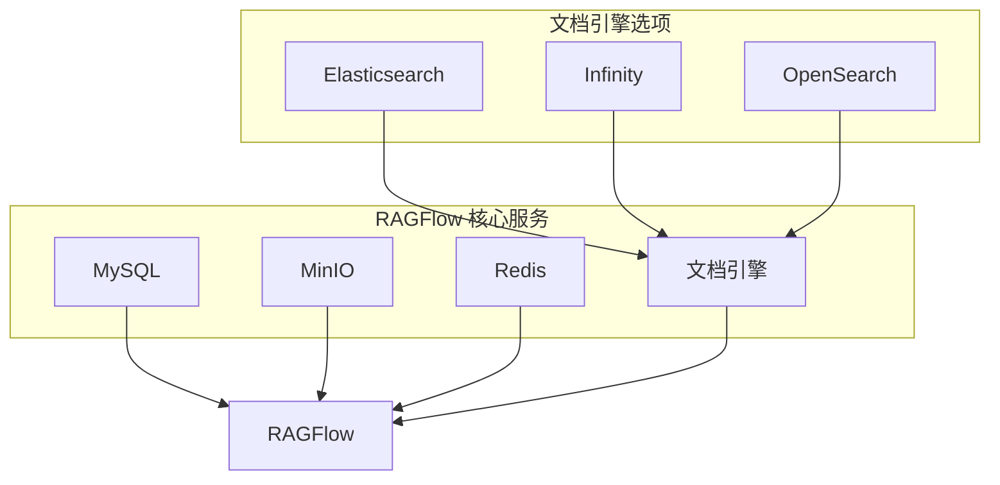
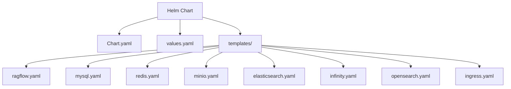
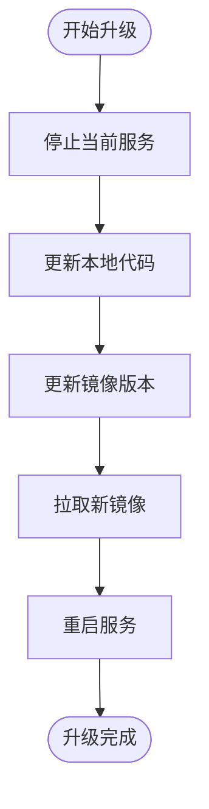
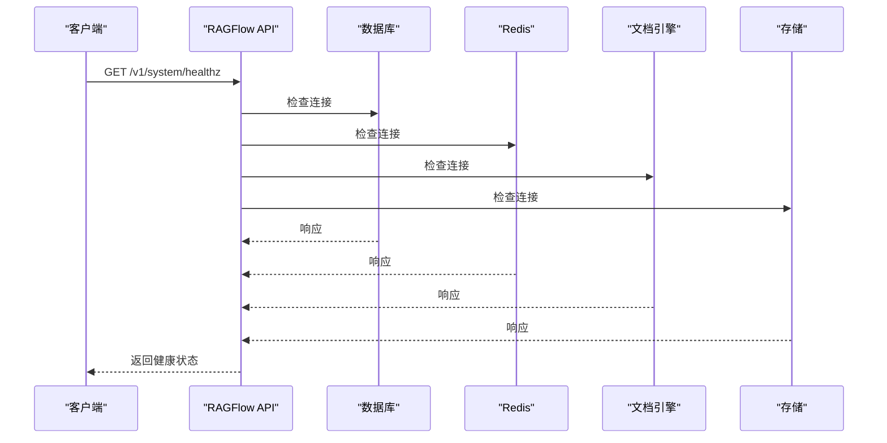
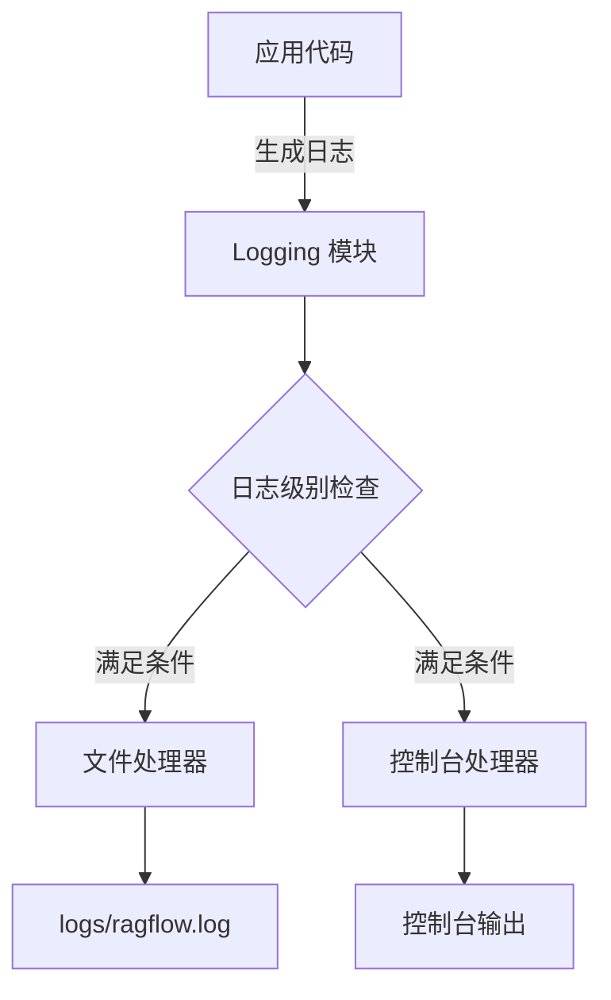

# 部署与运维

<cite>
**本文档引用的文件**   
- [docker-compose.yml](file://docker/docker-compose.yml)
- [docker-compose-base.yml](file://docker/docker-compose-base.yml)
- [docker-compose-macos.yml](file://docker/docker-compose-macos.yml)
- [docker/README.md](file://docker/README.md)
- [helm/Chart.yaml](file://helm/Chart.yaml)
- [helm/values.yaml](file://helm/values.yaml)
- [docs/guides/upgrade_ragflow.mdx](file://docs/guides/upgrade_ragflow.mdx)
- [docker/entrypoint.sh](file://docker/entrypoint.sh)
- [docker/launch_backend_service.sh](file://docker/launch_backend_service.sh)
- [docker/migration.sh](file://docker/migration.sh)
- [docker/service_conf.yaml.template](file://docker/service_conf.yaml.template)
- [docs/guides/run_health_check.md](file://docs/guides/run_health_check.md)
- [api/utils/health_utils.py](file://api/utils/health_utils.py)
- [common/log_utils.py](file://common/log_utils.py)
</cite>

## 目录
1. [简介](#简介)
2. [Docker Compose 部署](#docker-compose-部署)
3. [Kubernetes 部署](#kubernetes-部署)
4. [系统升级](#系统升级)
5. [健康检查](#健康检查)
6. [监控与日志](#监控与日志)
7. [部署模式比较](#部署模式比较)
8. [结论](#结论)

## 简介

RAGFlow 是一个先进的检索增强生成（RAG）平台，支持多种部署模式以适应不同的生产环境需求。本指南详细介绍了使用 Docker Compose 进行本地和生产环境部署的步骤，以及通过 Helm Chart 在 Kubernetes 集群上进行部署的方法。文档还涵盖了系统升级、健康检查、监控和日志查看等关键运维任务，帮助用户选择最适合其环境的部署方案。

## Docker Compose 部署

RAGFlow 提供了基于 Docker Compose 的部署方案，适用于本地开发和生产环境。主要的部署文件位于 `docker/` 目录下，包括 `docker-compose.yml`、`docker-compose-base.yml` 和 `docker-compose-macos.yml`。

### 核心服务配置

`docker-compose-base.yml` 文件定义了 RAGFlow 所需的核心依赖服务：

**Diagram sources**
- [docker-compose-base.yml](file://docker/docker-compose-base.yml#L1-L300)

**Section sources**
- [docker-compose-base.yml](file://docker/docker-compose-base.yml#L1-L300)
- [docker/README.md](file://docker/README.md#L1-L269)

### 本地与生产部署

`docker-compose.yml` 文件通过 `include` 指令引入 `docker-compose-base.yml`，并定义了 RAGFlow 主服务。该文件提供了 CPU 和 GPU 两种配置模式：

- **CPU 模式**：适用于大多数开发和测试环境
- **GPU 模式**：通过 `deploy.resources.reservations.devices` 配置，为需要 GPU 加速的场景提供支持

对于 macOS 用户，`docker-compose-macos.yml` 提供了特定的平台优化配置，包括 `platform: linux/amd64` 设置和必要的主机网络配置。

### 环境变量配置

所有部署相关的环境变量都定义在 `.env` 文件中，关键配置包括：

- **数据库配置**：`MYSQL_PASSWORD`, `MYSQL_PORT`
- **对象存储配置**：`MINIO_USER`, `MINIO_PASSWORD`, `MINIO_PORT`
- **缓存配置**：`REDIS_PASSWORD`, `REDIS_PORT`
- **文档引擎配置**：`ELASTIC_PASSWORD`, `ES_PORT`, `OPENSEARCH_PASSWORD`
- **RAGFlow 服务配置**：`SVR_HTTP_PORT`, `RAGFLOW_IMAGE`

这些环境变量在运行时会被注入到 `service_conf.yaml.template` 文件中，生成最终的 `service_conf.yaml` 配置文件。

**Section sources**
- [docker-compose.yml](file://docker/docker-compose.yml#L1-L135)
- [docker-compose-macos.yml](file://docker/docker-compose-macos.yml#L1-L47)
- [docker/service_conf.yaml.template](file://docker/service_conf.yaml.template#L1-L154)

## Kubernetes 部署

对于需要高可用性和弹性伸缩的生产环境，RAGFlow 提供了 Helm Chart 部署方案，位于 `helm/` 目录下。

### Helm Chart 结构

Helm Chart 的核心文件包括：

- **Chart.yaml**：定义了 Chart 的元数据，如名称、版本和描述
- **values.yaml**：包含了所有可配置的参数，允许用户根据需要定制部署
- **templates/**：包含了一系列 Kubernetes 资源模板，如 Deployment、Service 和 ConfigMap

**Diagram sources**
- [helm/Chart.yaml](file://helm/Chart.yaml#L1-L25)
- [helm/values.yaml](file://helm/values.yaml#L1-L235)

**Section sources**
- [helm/Chart.yaml](file://helm/Chart.yaml#L1-L25)
- [helm/values.yaml](file://helm/values.yaml#L1-L235)

### 部署配置

`values.yaml` 文件提供了详细的资源配置选项，包括：

- **全局配置**：镜像拉取密钥、环境变量
- **服务配置**：每个组件的镜像、标签、拉取策略
- **资源限制**：CPU 和内存请求与限制
- **存储配置**：持久卷的存储类和容量
- **网络配置**：服务类型（ClusterIP、LoadBalancer 等）

用户可以通过修改 `values.yaml` 文件或使用 `--set` 参数来覆盖默认配置，实现灵活的部署定制。

## 系统升级

RAGFlow 的系统升级流程需要同时更新代码和 Docker 镜像，确保系统的一致性和稳定性。

### 升级步骤

根据 `docs/guides/upgrade_ragflow.mdx` 文档，升级流程如下：

1. **停止服务**：使用 `docker compose -f docker/docker-compose.yml down` 命令停止当前运行的服务
2. **更新代码**：通过 `git pull` 获取最新的代码变更
3. **更新镜像**：修改 `.env` 文件中的 `RAGFLOW_IMAGE` 变量，指定目标版本
4. **拉取新镜像**：执行 `docker compose -f docker/docker-compose.yml pull` 下载新版本镜像
5. **重启服务**：使用 `docker compose -f docker/docker-compose.yml up -d` 启动更新后的服务

**Diagram sources**
- [docs/guides/upgrade_ragflow.mdx](file://docs/guides/upgrade_ragflow.mdx#L1-L100)

**Section sources**
- [docs/guides/upgrade_ragflow.mdx](file://docs/guides/upgrade_ragflow.mdx#L1-L100)

### 版本选择

用户可以选择升级到以下两种版本：

- **发布版本**：如 `v0.22.1`，经过充分测试的稳定版本
- **夜间构建版本**：`nightly`，包含最新功能但可能不够稳定的开发版本

升级过程中，用户的上传数据和历史数据不会被删除，但需要注意 `docker compose down -v` 命令会清除卷数据，导致数据丢失。

## 健康检查

RAGFlow 提供了完善的健康检查机制，确保系统各组件正常运行。

### API 健康检查

系统提供了一个无需登录的健康检查端点 `/v1/system/healthz`，返回 JSON 格式的健康状态：

**Diagram sources**
- [docs/guides/run_health_check.md](file://docs/guides/run_health_check.md#L1-L110)
- [api/utils/health_utils.py](file://api/utils/health_utils.py#L1-L223)

**Section sources**
- [docs/guides/run_health_check.md](file://docs/guides/run_health_check.md#L1-L110)
- [api/utils/health_utils.py](file://api/utils/health_utils.py#L1-L223)

### 健康检查指标

健康检查覆盖以下四个核心服务：

- **数据库**（MySQL/Postgres）：通过执行 `SELECT 1` 查询来验证连接
- **Redis**：检查缓存服务的连接状态
- **文档引擎**（Elasticsearch/Infinity）：验证文档存储和检索服务
- **对象存储**（MinIO）：确认文件存储服务的可用性

如果所有服务都健康，API 返回 HTTP 200 状态码；如果有任何服务异常，则返回 HTTP 500 状态码，并在响应体中包含详细的错误信息。

## 监控与日志

RAGFlow 提供了全面的监控和日志记录功能，帮助运维人员及时发现和解决问题。

### 日志管理

系统使用 Python 的 logging 模块进行日志记录，配置在 `common/log_utils.py` 中：

- **日志文件**：位于 `logs/` 目录下，按天轮转
- **日志级别**：可通过 `LOG_LEVELS` 环境变量配置不同模块的日志级别
- **日志格式**：包含时间戳、日志级别、进程ID和消息内容

**Diagram sources**
- [common/log_utils.py](file://common/log_utils.py#L1-L84)

**Section sources**
- [common/log_utils.py](file://common/log_utils.py#L1-L84)

### 监控工具

除了 API 健康检查，RAGFlow 还提供了以下监控功能：

- **UI 系统状态页面**：在用户界面中可视化显示各服务的健康状态
- **任务执行器监控**：跟踪文档解析任务的完成和失败情况
- **外部监控集成**：可以通过 `/v1/system/healthz` 端点与 Prometheus、Grafana 等外部监控系统集成

## 部署模式比较

不同的部署模式各有优缺点，适用于不同的使用场景。

### Docker Compose 模式

**优点**：
- 部署简单，适合开发和测试环境
- 配置直观，易于理解和修改
- 资源占用相对较少

**缺点**：
- 缺乏高可用性
- 扩展性有限
- 不适合大规模生产环境

### Kubernetes 模式

**优点**：
- 高可用性和弹性伸缩
- 完善的资源管理和调度
- 支持滚动更新和回滚
- 与云原生生态系统集成良好

**缺点**：
- 部署复杂，需要 Kubernetes 集群
- 学习曲线陡峭
- 资源开销较大

### 选择建议

- **开发和测试环境**：推荐使用 Docker Compose 模式，快速启动和迭代
- **生产环境**：推荐使用 Kubernetes 模式，确保系统的稳定性和可扩展性
- **资源受限环境**：可以考虑使用 Docker Compose 模式，并根据需要进行优化

## 结论

RAGFlow 提供了灵活多样的部署方案，从简单的 Docker Compose 到复杂的 Kubernetes Helm Chart，满足不同用户的需求。通过合理的配置和运维，可以确保系统的稳定运行和高效性能。建议用户根据自身的技术栈和业务需求，选择最适合的部署模式，并充分利用提供的健康检查和监控工具，确保系统的可靠性和可维护性。