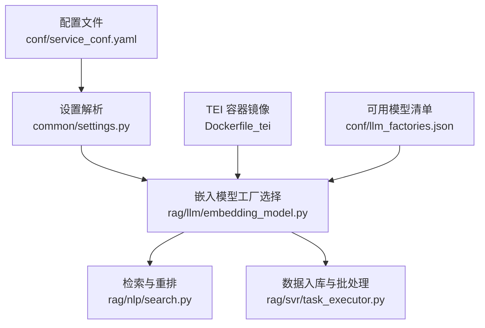
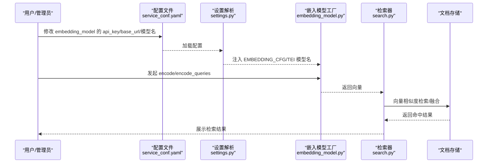
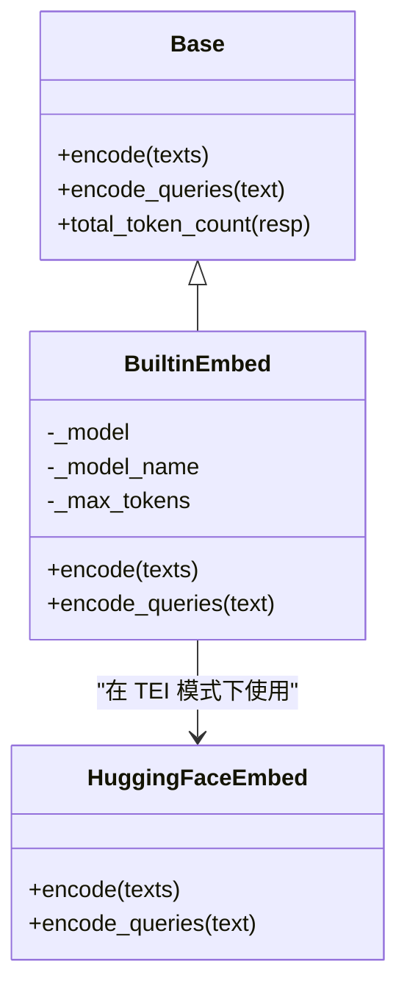
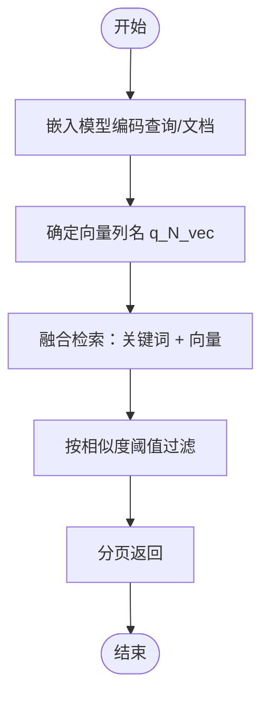
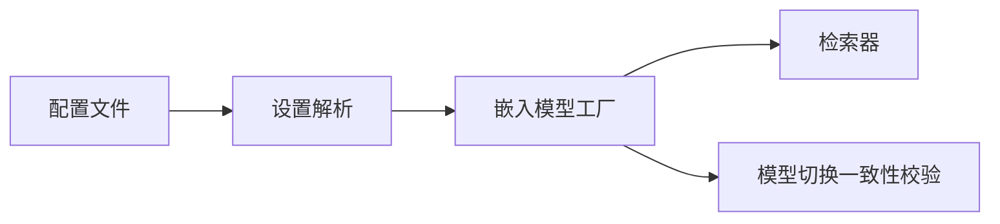

# 嵌入模型配置

<cite>
**本文引用的文件**
- [conf/service_conf.yaml](file://conf/service_conf.yaml)
- [docker/service_conf.yaml.template](file://docker/service_conf.yaml.template)
- [common/settings.py](file://common/settings.py)
- [rag/llm/embedding_model.py](file://rag/llm/embedding_model.py)
- [rag/nlp/search.py](file://rag/nlp/search.py)
- [rag/svr/task_executor.py](file://rag/svr/task_executor.py)
- [Dockerfile_tei](file://Dockerfile_tei)
- [conf/llm_factories.json](file://conf/llm_factories.json)
- [api/apps/kb_app.py](file://api/apps/kb_app.py)
- [test/testcases/test_sdk_api/test_dataset_mangement/test_update_dataset.py](file://test/testcases/test_sdk_api/test_dataset_mangement/test_update_dataset.py)
- [test/testcases/test_http_api/test_dataset_mangement/test_create_dataset.py](file://test/testcases/test_http_api/test_dataset_mangement/test_create_dataset.py)
</cite>

## 目录
1. [简介](#简介)
2. [项目结构](#项目结构)
3. [核心组件](#核心组件)
4. [架构总览](#架构总览)
5. [详细组件分析](#详细组件分析)
6. [依赖关系分析](#依赖关系分析)
7. [性能考虑](#性能考虑)
8. [故障排查指南](#故障排查指南)
9. [结论](#结论)
10. [附录](#附录)

## 简介
本指南聚焦于 RAGFlow 中“嵌入模型”的配置与使用，围绕以下目标展开：
- 在 service_conf.yaml 中为 user_default_llm 下的 embedding_model 配置 factory、api_key、base_url 与模型名称
- 特别说明内置 TEI（Text Embedding Inference）服务的特殊配置方式
- 解释嵌入模型在 RAG 流程中的作用及其对检索质量的影响
- 提供主流嵌入模型（如 text-embedding-ada-002、bge 系列）的配置示例与性能调优建议

## 项目结构
与嵌入模型配置直接相关的关键位置如下：
- 默认配置模板：docker/service_conf.yaml.template
- 运行时配置：conf/service_conf.yaml
- 设置解析与环境变量注入：common/settings.py
- 嵌入模型实现与工厂分发：rag/llm/embedding_model.py
- 检索与向量空间一致性校验：rag/nlp/search.py、api/apps/kb_app.py
- 批处理与并发控制：rag/svr/task_executor.py
- TEI 容器镜像与示例端点：Dockerfile_tei
- 可用模型清单：conf/llm_factories.json

图表来源
- [conf/service_conf.yaml](file://conf/service_conf.yaml#L45-L51)
- [docker/service_conf.yaml.template](file://docker/service_conf.yaml.template#L44-L49)
- [common/settings.py](file://common/settings.py#L198-L210)
- [rag/llm/embedding_model.py](file://rag/llm/embedding_model.py#L64-L100)
- [rag/nlp/search.py](file://rag/nlp/search.py#L52-L61)
- [rag/svr/task_executor.py](file://rag/svr/task_executor.py#L589-L604)
- [Dockerfile_tei](file://Dockerfile_tei#L1-L15)
- [conf/llm_factories.json](file://conf/llm_factories.json#L2163-L2191)

章节来源
- [conf/service_conf.yaml](file://conf/service_conf.yaml#L45-L51)
- [docker/service_conf.yaml.template](file://docker/service_conf.yaml.template#L44-L49)
- [common/settings.py](file://common/settings.py#L198-L210)

## 核心组件
- 配置入口
  - user_default_llm.default_models.embedding_model：包含 api_key、base_url 等字段
  - 当使用 TEI 时，base_url 指向 TEI 服务地址
- 设置解析
  - settings.py 将配置解析为 EMBEDDING_CFG，并在 COMPOSE_PROFILES 包含 “tei-” 时覆盖模型名
- 嵌入模型工厂
  - BuiltinEmbed 在 TEI 场景下通过 HuggingFaceEmbed 调用 TEI
  - 其他工厂支持 OpenAI、Azure-OpenAI、Qwen、Gemini、NVIDIA 等
- 检索与一致性
  - Dealer.get_vector 将查询编码为向量
  - kb_app 在切换嵌入模型时进行向量空间相似度校验，避免不兼容

章节来源
- [common/settings.py](file://common/settings.py#L198-L210)
- [rag/llm/embedding_model.py](file://rag/llm/embedding_model.py#L64-L100)
- [rag/nlp/search.py](file://rag/nlp/search.py#L52-L61)
- [api/apps/kb_app.py](file://api/apps/kb_app.py#L926-L938)

## 架构总览
嵌入模型在 RAG 流程中的关键路径：
- 配置阶段：service_conf.yaml 或 docker/service_conf.yaml.template 提供默认值
- 初始化阶段：settings.py 解析配置并注入环境变量
- 推理阶段：BuiltinEmbed/HuggingFaceEmbed 将文本编码为向量
- 检索阶段：Dealer 使用向量进行相似度匹配与融合检索
- 数据入库阶段：task_executor 对分块文本批量编码并写入向量字段

图表来源
- [conf/service_conf.yaml](file://conf/service_conf.yaml#L45-L51)
- [docker/service_conf.yaml.template](file://docker/service_conf.yaml.template#L44-L49)
- [common/settings.py](file://common/settings.py#L198-L210)
- [rag/llm/embedding_model.py](file://rag/llm/embedding_model.py#L64-L100)
- [rag/nlp/search.py](file://rag/nlp/search.py#L52-L61)

## 详细组件分析

### 配置项详解：user_default_llm 下的 embedding_model
- 字段说明
  - api_key：用于访问外部嵌入服务或本地 TEI 的密钥
  - base_url：外部服务或 TEI 服务的根地址
  - 模型名称：在 TEI 模式下由环境变量 TEI_MODEL 决定，非 TEI 模式下可直接指定
- 配置位置
  - 运行时配置：conf/service_conf.yaml
  - 模板配置：docker/service_conf.yaml.template（示例中 base_url 使用 TEI_HOST 环境变量）
- TEI 特殊性
  - 当 COMPOSE_PROFILES 包含 “tei-” 时，settings.py 会以 TEI_MODEL 作为最终模型名
  - BuiltinEmbed 在 TEI 场景下通过 HuggingFaceEmbed 调用 TEI

章节来源
- [conf/service_conf.yaml](file://conf/service_conf.yaml#L45-L51)
- [docker/service_conf.yaml.template](file://docker/service_conf.yaml.template#L44-L49)
- [common/settings.py](file://common/settings.py#L213-L216)
- [rag/llm/embedding_model.py](file://rag/llm/embedding_model.py#L64-L100)

### 嵌入模型工厂与 TEI 集成
- BuiltinEmbed
  - 在 TEI 场景下，初始化一次共享模型实例，使用 settings.EMBEDDING_MDL 与 EMBEDDING_CFG
  - encode/encode_queries 采用批处理与累加 token 统计
- HuggingFaceEmbed（间接由 BuiltinEmbed 使用）
  - 通过 TEI 提供的 OpenAI 兼容接口进行批量编码
- 其他工厂
  - OpenAIEmbed、AzureEmbed、QWenEmbed、GeminiEmbed、NVIDIAEmbed 等
  - 支持不同厂商的 base_url 与认证方式

图表来源
- [rag/llm/embedding_model.py](file://rag/llm/embedding_model.py#L37-L100)

章节来源
- [rag/llm/embedding_model.py](file://rag/llm/embedding_model.py#L64-L100)

### RAG 流程中的嵌入模型作用
- 查询向量化
  - Dealer.get_vector 将问题编码为向量，并构造向量列名 q_N_vec
- 向量检索与融合
  - Dealer.search 结合关键词与向量进行融合检索
  - 支持按相似度阈值过滤与分页
- 向量维度一致性
  - 检索前确保查询向量与文档向量维度一致
  - 切换嵌入模型时进行平均余弦相似度校验，避免向量空间不兼容

图表来源
- [rag/nlp/search.py](file://rag/nlp/search.py#L52-L61)
- [rag/nlp/search.py](file://rag/nlp/search.py#L118-L133)
- [rag/nlp/search.py](file://rag/nlp/search.py#L217-L225)
- [api/apps/kb_app.py](file://api/apps/kb_app.py#L926-L938)

章节来源
- [rag/nlp/search.py](file://rag/nlp/search.py#L52-L61)
- [rag/nlp/search.py](file://rag/nlp/search.py#L118-L133)
- [rag/nlp/search.py](file://rag/nlp/search.py#L217-L225)
- [api/apps/kb_app.py](file://api/apps/kb_app.py#L926-L938)

### 主流嵌入模型配置示例与性能调优建议
- 示例：OpenAI text-embedding-ada-002
  - factory：OpenAI
  - base_url：https://api.openai.com/v1
  - 模型名：text-embedding-ada-002
  - 注意：OpenAIEmbed 限制批量大小与输入长度
- 示例：BAAI bge 系列
  - factory：Builtin（或对应厂商工厂）
  - base_url：TEI 服务地址（如 http://tei:80）
  - 模型名：BAAI/bge-small-en-v1.5 或 BAAI/bge-m3 等
  - TEI 模式下由 TEI_MODEL 环境变量决定最终模型
- 性能调优要点
  - 批处理大小：EMBEDDING_BATCH_SIZE（默认 16），可结合下游吞吐与延迟权衡
  - 并发与限流：task_executor 使用 embed_limiter 控制并发
  - 输入截断：各工厂对输入长度有限制，需在上游预处理
  - 向量维度：确保查询与文档向量维度一致，避免检索异常

章节来源
- [conf/llm_factories.json](file://conf/llm_factories.json#L2163-L2191)
- [common/settings.py](file://common/settings.py#L299-L303)
- [rag/svr/task_executor.py](file://rag/svr/task_executor.py#L589-L604)
- [rag/llm/embedding_model.py](file://rag/llm/embedding_model.py#L102-L129)

## 依赖关系分析
- 配置到运行时
  - service_conf.yaml/docker/service_conf.yaml.template → settings.py → EMBEDDING_CFG/TEI_MODEL
- 运行时到实现
  - EMBEDDING_CFG → BuiltinEmbed/HuggingFaceEmbed
- 实现到检索
  - 向量 → Dealer.get_vector → 检索与融合
- 模型切换一致性
  - 切换嵌入模型后进行向量空间相似度校验，防止不兼容

图表来源
- [conf/service_conf.yaml](file://conf/service_conf.yaml#L45-L51)
- [docker/service_conf.yaml.template](file://docker/service_conf.yaml.template#L44-L49)
- [common/settings.py](file://common/settings.py#L198-L210)
- [rag/llm/embedding_model.py](file://rag/llm/embedding_model.py#L64-L100)
- [rag/nlp/search.py](file://rag/nlp/search.py#L52-L61)
- [api/apps/kb_app.py](file://api/apps/kb_app.py#L926-L938)

章节来源
- [conf/service_conf.yaml](file://conf/service_conf.yaml#L45-L51)
- [docker/service_conf.yaml.template](file://docker/service_conf.yaml.template#L44-L49)
- [common/settings.py](file://common/settings.py#L198-L210)
- [rag/llm/embedding_model.py](file://rag/llm/embedding_model.py#L64-L100)
- [rag/nlp/search.py](file://rag/nlp/search.py#L52-L61)
- [api/apps/kb_app.py](file://api/apps/kb_app.py#L926-L938)

## 性能考虑
- 批处理与并发
  - EMBEDDING_BATCH_SIZE 控制单次编码批次大小
  - embed_limiter 限制并发，避免资源争用
- 输入长度与截断
  - 不同工厂对输入长度有限制，需在上游进行截断或清洗
- 向量维度与存储
  - 确保查询与文档向量维度一致，避免检索失败
- 模型选择
  - 小模型（如 bge-small）适合大规模语料与快速检索
  - 大模型（如 bge-m3）可能提升召回质量但增加计算成本

章节来源
- [common/settings.py](file://common/settings.py#L299-L303)
- [rag/svr/task_executor.py](file://rag/svr/task_executor.py#L589-L604)
- [rag/llm/embedding_model.py](file://rag/llm/embedding_model.py#L102-L129)
- [rag/nlp/search.py](file://rag/nlp/search.py#L217-L225)

## 故障排查指南
- 模型格式错误
  - 当 embedding_model 不符合 <model_name>@<provider> 格式或字段为空白时，会触发错误
- 切换嵌入模型失败
  - 若新旧向量空间平均余弦相似度低于阈值（例如 0.9），系统会提示不兼容
- TEI 未正确加载
  - 确认 COMPOSE_PROFILES 包含 “tei-”，TEI_MODEL 环境变量已设置
  - 确认 TEI 服务可达且返回 v1/embeddings 端点

章节来源
- [test/testcases/test_sdk_api/test_dataset_mangement/test_update_dataset.py](file://test/testcases/test_sdk_api/test_dataset_mangement/test_update_dataset.py#L205-L233)
- [test/testcases/test_http_api/test_dataset_mangement/test_create_dataset.py](file://test/testcases/test_http_api/test_dataset_mangement/test_create_dataset.py#L259-L287)
- [api/apps/kb_app.py](file://api/apps/kb_app.py#L926-L938)
- [common/settings.py](file://common/settings.py#L213-L216)
- [Dockerfile_tei](file://Dockerfile_tei#L1-L15)

## 结论
- 在 service_conf.yaml 中为 embedding_model 配置 api_key、base_url 与模型名即可启用外部或内置嵌入服务
- 使用 TEI 时，通过 COMPOSE_PROFILES 与 TEI_MODEL 实现自动化的模型选择与服务对接
- 嵌入模型直接影响检索质量与向量空间一致性，切换模型需进行相似度校验
- 通过合理设置批处理大小、并发与输入截断策略，可在保证质量的同时提升整体性能

## 附录
- TEI 示例端点
  - 支持 /embed 与 /v1/embeddings 两种端点，便于验证服务连通性
- 可用模型参考
  - bge 系列、Qwen 系列等在 llm_factories.json 中列出，可直接作为模型名使用

章节来源
- [Dockerfile_tei](file://Dockerfile_tei#L1-L15)
- [conf/llm_factories.json](file://conf/llm_factories.json#L2163-L2191)