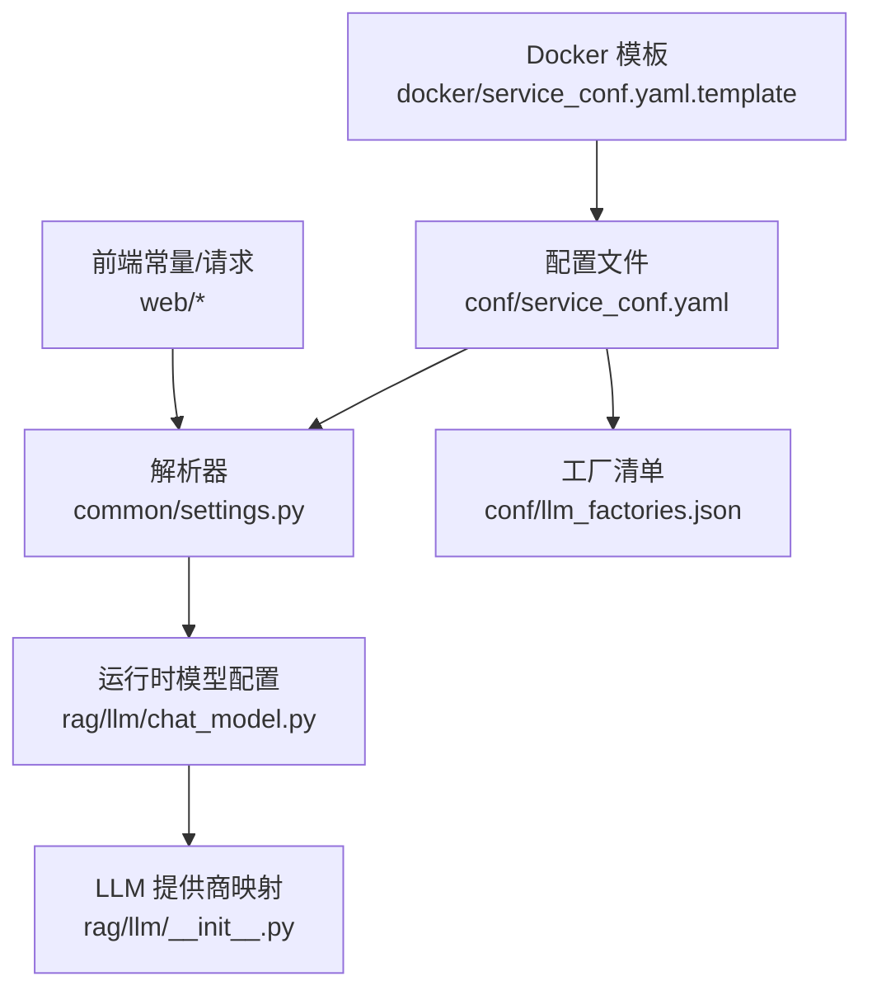
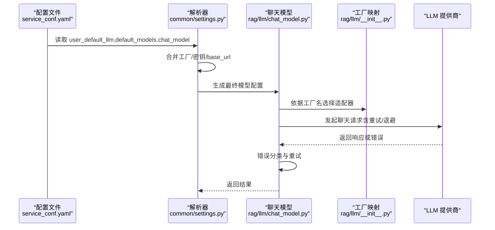
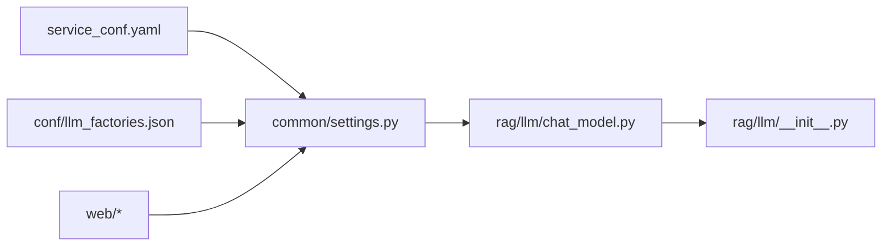

# 聊天模型配置

<cite>
**本文引用的文件**
- [conf/service_conf.yaml](file://conf/service_conf.yaml)
- [conf/llm_factories.json](file://conf/llm_factories.json)
- [rag/llm/chat_model.py](file://rag/llm/chat_model.py)
- [rag/llm/__init__.py](file://rag/llm/__init__.py)
- [common/settings.py](file://common/settings.py)
- [api/apps/llm_app.py](file://api/apps/llm_app.py)
- [web/src/constants/llm.ts](file://web/src/constants/llm.ts)
- [web/src/hooks/use-llm-request.tsx](file://web/src/hooks/use-llm-request.tsx)
- [web/src/pages/user-setting/setting-model/modal/api-key-modal/index.tsx](file://web/src/pages/user-setting/setting-model/modal/api-key-modal/index.tsx)
- [docker/service_conf.yaml.template](file://docker/service_conf.yaml.template)
</cite>

## 目录
1. [简介](#简介)
2. [项目结构](#项目结构)
3. [核心组件](#核心组件)
4. [架构总览](#架构总览)
5. [详细组件分析](#详细组件分析)
6. [依赖关系分析](#依赖关系分析)
7. [性能与可靠性](#性能与可靠性)
8. [故障排查指南](#故障排查指南)
9. [结论](#结论)
10. [附录：配置示例与最佳实践](#附录配置示例与最佳实践)

## 简介
本指南面向需要在 RAGFlow 中配置聊天模型的用户与管理员，围绕 service_conf.yaml 中 user_default_llm 下的 chat_model 配置展开，覆盖以下主题：
- 如何在 service_conf.yaml 中为 chat_model 指定 factory（如 OpenAI、Anthropic、通义千问等）、api_key、base_url 与模型名称
- 如何通过 llm_factories.json 扩展新的 LLM 提供商
- 常见主流服务商的 API 接入要点与配置建议
- 模型回退策略与 API 速率限制处理
- 从环境变量加载密钥的安全实践

## 项目结构
RAGFlow 的聊天模型配置涉及多个层次：
- 配置层：service_conf.yaml 定义默认 LLM 工厂、API 密钥与基础 URL；docker/service_conf.yaml.template 展示了基于环境变量的模板化配置
- 解析层：common/settings.py 将 YAML 配置解析为运行时参数，并合并到各模型配置
- 运行层：rag/llm/chat_model.py 使用 LiteLLM/第三方 SDK 访问 LLM，内置重试与错误分类逻辑
- 前端层：web/src/constants/llm.ts、web/src/hooks/use-llm-request.tsx、web/src/pages/user-setting/... 等负责工厂列表与 API Key 输入界面

图表来源
- [conf/service_conf.yaml](file://conf/service_conf.yaml#L46-L104)
- [common/settings.py](file://common/settings.py#L190-L210)
- [rag/llm/chat_model.py](file://rag/llm/chat_model.py#L65-L78)
- [rag/llm/__init__.py](file://rag/llm/__init__.py#L59-L116)
- [conf/llm_factories.json](file://conf/llm_factories.json#L1-L120)
- [docker/service_conf.yaml.template](file://docker/service_conf.yaml.template#L44-L49)

章节来源
- [conf/service_conf.yaml](file://conf/service_conf.yaml#L46-L104)
- [docker/service_conf.yaml.template](file://docker/service_conf.yaml.template#L44-L49)
- [common/settings.py](file://common/settings.py#L190-L210)
- [rag/llm/chat_model.py](file://rag/llm/chat_model.py#L65-L78)
- [rag/llm/__init__.py](file://rag/llm/__init__.py#L59-L116)
- [conf/llm_factories.json](file://conf/llm_factories.json#L1-L120)

## 核心组件
- 配置入口：service_conf.yaml 的 user_default_llm.default_models.chat_model 字段用于声明默认聊天模型的工厂、API Key 与基础 URL
- 解析与合并：common/settings.py 将 YAML 中的默认值与环境变量结合，生成最终的模型配置
- 运行时适配：rag/llm/chat_model.py 基于 LiteLLM/第三方 SDK 实现统一调用，并内置重试与错误分类
- 工厂与默认 Base URL：rag/llm/__init__.py 维护工厂名与默认 base_url 映射，便于快速接入
- 工厂清单：conf/llm_factories.json 列举受支持的工厂及其模型族谱，便于前端选择与后端校验
- 前端交互：web/* 提供工厂列表、API Key 输入与 base_url 提示

章节来源
- [conf/service_conf.yaml](file://conf/service_conf.yaml#L46-L104)
- [common/settings.py](file://common/settings.py#L190-L210)
- [rag/llm/chat_model.py](file://rag/llm/chat_model.py#L65-L78)
- [rag/llm/__init__.py](file://rag/llm/__init__.py#L59-L116)
- [conf/llm_factories.json](file://conf/llm_factories.json#L1-L120)
- [web/src/constants/llm.ts](file://web/src/constants/llm.ts#L1-L63)

## 架构总览
下图展示了从配置到调用的关键路径与错误处理：

图表来源
- [conf/service_conf.yaml](file://conf/service_conf.yaml#L46-L104)
- [common/settings.py](file://common/settings.py#L190-L210)
- [rag/llm/chat_model.py](file://rag/llm/chat_model.py#L182-L244)
- [rag/llm/__init__.py](file://rag/llm/__init__.py#L59-L116)

## 详细组件分析

### 配置入口：service_conf.yaml 中的 chat_model
- 结构要点
  - user_default_llm.default_models.chat_model 支持字段：name、factory、api_key、base_url
  - 若未显式指定，系统会使用 user_default_llm.factory、api_key、base_url 作为后备
- 参考路径
  - [conf/service_conf.yaml](file://conf/service_conf.yaml#L46-L104)

章节来源
- [conf/service_conf.yaml](file://conf/service_conf.yaml#L46-L104)

### 配置解析与合并：common/settings.py
- 关键流程
  - 读取 YAML 中的 user_default_llm 与 default_models
  - 解析 chat_model 条目（字符串或字典），并合并工厂、API Key、base_url
  - 若模型名不含工厂后缀，则自动拼接 factory@model 形式
- 参考路径
  - [common/settings.py](file://common/settings.py#L190-L210)
  - [common/settings.py](file://common/settings.py#L314-L343)

章节来源
- [common/settings.py](file://common/settings.py#L190-L210)
- [common/settings.py](file://common/settings.py#L314-L343)

### 运行时适配：rag/llm/chat_model.py
- 初始化与客户端
  - 从环境变量读取 LLM_TIMEOUT_SECONDS、LLM_MAX_RETRIES、LLM_BASE_DELAY 作为超时、最大重试次数与基础退避时间
  - 对 OpenAI/Azure/本地 LLM 等提供专门适配类
- 错误分类与重试
  - 内置错误类型（如限流、鉴权失败、服务器错误、超时、连接错误、内容过滤、配额耗尽、最大重试等）
  - 仅对可重试错误执行指数退避重试
- 参考路径
  - [rag/llm/chat_model.py](file://rag/llm/chat_model.py#L65-L78)
  - [rag/llm/chat_model.py](file://rag/llm/chat_model.py#L182-L244)
  - [rag/llm/chat_model.py](file://rag/llm/chat_model.py#L210-L212)

章节来源
- [rag/llm/chat_model.py](file://rag/llm/chat_model.py#L65-L78)
- [rag/llm/chat_model.py](file://rag/llm/chat_model.py#L182-L244)

### 工厂映射与默认 Base URL：rag/llm/__init__.py
- 工厂映射
  - 维护 SupportedLiteLLMProvider 与工厂名之间的映射，以及默认 base_url
- 默认 Base URL
  - 不同工厂（如通义千问、Anthropic、OpenRouter 等）有默认 base_url，便于快速接入
- 参考路径
  - [rag/llm/__init__.py](file://rag/llm/__init__.py#L59-L116)

章节来源
- [rag/llm/__init__.py](file://rag/llm/__init__.py#L59-L116)

### 工厂清单：conf/llm_factories.json
- 作用
  - 列出受支持的工厂及其模型族谱（名称、类型、最大 token、是否支持工具等）
  - 用于前端展示与后端校验
- 参考路径
  - [conf/llm_factories.json](file://conf/llm_factories.json#L1-L120)

章节来源
- [conf/llm_factories.json](file://conf/llm_factories.json#L1-L120)

### 前端交互：工厂列表与 API Key 输入
- 工厂枚举与图标映射
  - web/src/constants/llm.ts 定义了 LLMFactory 枚举与各工厂的图标映射
- 请求与数据加载
  - web/src/hooks/use-llm-request.tsx 提供工厂列表与我的模型列表的查询钩子
- API Key 输入与 base_url 提示
  - web/src/pages/user-setting/setting-model/modal/api-key-modal/index.tsx 提供 base_url 输入框与提示文案
- 参考路径
  - [web/src/constants/llm.ts](file://web/src/constants/llm.ts#L1-L63)
  - [web/src/hooks/use-llm-request.tsx](file://web/src/hooks/use-llm-request.tsx#L187-L273)
  - [web/src/pages/user-setting/setting-model/modal/api-key-modal/index.tsx](file://web/src/pages/user-setting/setting-model/modal/api-key-modal/index.tsx#L109-L144)

章节来源
- [web/src/constants/llm.ts](file://web/src/constants/llm.ts#L1-L63)
- [web/src/hooks/use-llm-request.tsx](file://web/src/hooks/use-llm-request.tsx#L187-L273)
- [web/src/pages/user-setting/setting-model/modal/api-key-modal/index.tsx](file://web/src/pages/user-setting/setting-model/modal/api-key-modal/index.tsx#L109-L144)

### 通过 llm_factories.json 扩展新 LLM 提供商
- 步骤
  - 在 conf/llm_factories.json 中新增一个工厂条目，包含工厂名、模型数组（llm_name、model_type、tags、max_tokens 等）
  - 确保模型类型（chat、embedding、speech2text、image2text、rerank 等）与实际接口一致
  - 若该工厂已有默认 base_url 映射，可在运行时直接使用；否则需在 service_conf.yaml 或前端传参中提供 base_url
- 参考路径
  - [conf/llm_factories.json](file://conf/llm_factories.json#L1-L120)
  - [rag/llm/__init__.py](file://rag/llm/__init__.py#L59-L116)

章节来源
- [conf/llm_factories.json](file://conf/llm_factories.json#L1-L120)
- [rag/llm/__init__.py](file://rag/llm/__init__.py#L59-L116)

### 从环境变量加载密钥的安全实践
- 环境变量优先级
  - 运行时会从环境变量读取 LLM_TIMEOUT_SECONDS、LLM_MAX_RETRIES、LLM_BASE_DELAY，用于控制超时与重试
- 建议做法
  - 在部署环境中通过环境变量注入敏感信息（如 API Key），避免将其硬编码在 YAML 文件中
  - 使用 Docker Compose 或 K8s Secret 管理密钥，确保最小权限与轮换机制
- 参考路径
  - [rag/llm/chat_model.py](file://rag/llm/chat_model.py#L65-L78)
  - [docker/service_conf.yaml.template](file://docker/service_conf.yaml.template#L44-L49)

章节来源
- [rag/llm/chat_model.py](file://rag/llm/chat_model.py#L65-L78)
- [docker/service_conf.yaml.template](file://docker/service_conf.yaml.template#L44-L49)

## 依赖关系分析
- 配置到运行时的依赖链
  - service_conf.yaml → common/settings.py → rag/llm/chat_model.py → rag/llm/__init__.py → LLM 提供商
- 前端到配置的依赖链
  - web/* → common/settings.py（通过后端 API 获取工厂与模型列表）

图表来源
- [conf/service_conf.yaml](file://conf/service_conf.yaml#L46-L104)
- [common/settings.py](file://common/settings.py#L190-L210)
- [rag/llm/chat_model.py](file://rag/llm/chat_model.py#L65-L78)
- [rag/llm/__init__.py](file://rag/llm/__init__.py#L59-L116)
- [conf/llm_factories.json](file://conf/llm_factories.json#L1-L120)
- [web/src/constants/llm.ts](file://web/src/constants/llm.ts#L1-L63)

## 性能与可靠性
- 重试与退避
  - 对限流与服务器错误进行指数退避重试，避免雪崩效应
- 超时与并发
  - 通过环境变量控制超时与最大重试次数，避免长时间阻塞
- 速率限制处理
  - 当出现限流或配额耗尽时，错误分类会触发退避重试；若达到最大重试次数则返回错误码
- 参考路径
  - [rag/llm/chat_model.py](file://rag/llm/chat_model.py#L182-L244)
  - [rag/llm/chat_model.py](file://rag/llm/chat_model.py#L210-L212)

章节来源
- [rag/llm/chat_model.py](file://rag/llm/chat_model.py#L182-L244)
- [rag/llm/chat_model.py](file://rag/llm/chat_model.py#L210-L212)

## 故障排查指南
- 常见错误与定位
  - 限流/配额耗尽：检查错误码与日志，确认是否触发退避重试
  - 鉴权失败：核对 api_key 是否正确、是否携带工厂后缀
  - 服务器错误：等待服务恢复或调整重试策略
  - 连接/超时：检查 base_url 与网络连通性
- 建议步骤
  - 查看运行日志中的错误分类码
  - 在前端确认工厂与模型是否匹配
  - 在 service_conf.yaml 中核对 factory、api_key、base_url
- 参考路径
  - [rag/llm/chat_model.py](file://rag/llm/chat_model.py#L82-L101)
  - [api/apps/llm_app.py](file://api/apps/llm_app.py#L104-L203)

章节来源
- [rag/llm/chat_model.py](file://rag/llm/chat_model.py#L82-L101)
- [api/apps/llm_app.py](file://api/apps/llm_app.py#L104-L203)

## 结论
通过 service_conf.yaml 的 user_default_llm.default_models.chat_model，配合 common/settings.py 的解析与合并、rag/llm/chat_model.py 的统一适配与重试机制，以及 conf/llm_factories.json 的工厂清单，RAGFlow 能够灵活地接入多种 LLM 提供商。建议在生产环境中采用环境变量管理密钥、合理设置重试与超时参数，并通过 llm_factories.json 扩展新工厂以满足业务需求。

## 附录：配置示例与最佳实践
- 示例：在 service_conf.yaml 中配置 chat_model
  - 指定 factory、api_key、base_url 与模型名称
  - 若未显式指定，系统会回退到 user_default_llm.factory、api_key、base_url
  - 参考路径：[conf/service_conf.yaml](file://conf/service_conf.yaml#L46-L104)
- 示例：通过 llm_factories.json 扩展新工厂
  - 新增工厂条目与模型族谱
  - 参考路径：[conf/llm_factories.json](file://conf/llm_factories.json#L1-L120)
- 示例：从环境变量加载密钥
  - 在部署环境中设置 LLM_TIMEOUT_SECONDS、LLM_MAX_RETRIES、LLM_BASE_DELAY
  - 参考路径：[rag/llm/chat_model.py](file://rag/llm/chat_model.py#L65-L78)
- 示例：前端工厂列表与 API Key 输入
  - 工厂枚举与图标映射：[web/src/constants/llm.ts](file://web/src/constants/llm.ts#L1-L63)
  - 工厂列表与我的模型列表钩子：[web/src/hooks/use-llm-request.tsx](file://web/src/hooks/use-llm-request.tsx#L187-L273)
  - API Key 与 base_url 输入框：[web/src/pages/user-setting/setting-model/modal/api-key-modal/index.tsx](file://web/src/pages/user-setting/setting-model/modal/api-key-modal/index.tsx#L109-L144)
- 回退策略与速率限制
  - 通过错误分类与退避重试实现回退
  - 参考路径：[rag/llm/chat_model.py](file://rag/llm/chat_model.py#L182-L244)