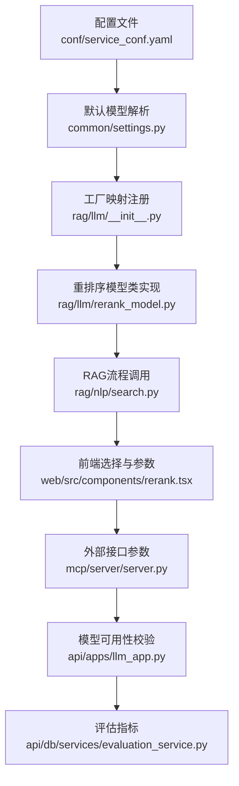
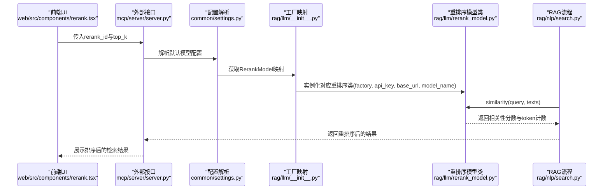
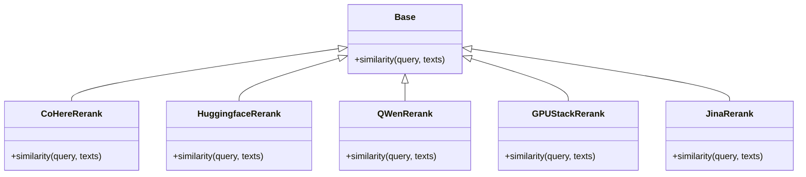
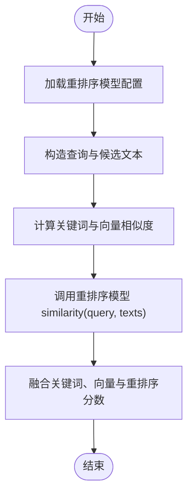
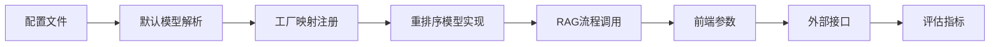

# 重排序模型配置

<cite>
**本文引用的文件**
- [conf/service_conf.yaml](file://conf/service_conf.yaml)
- [docker/service_conf.yaml.template](file://docker/service_conf.yaml.template)
- [rag/llm/rerank_model.py](file://rag/llm/rerank_model.py)
- [rag/llm/__init__.py](file://rag/llm/__init__.py)
- [api/apps/llm_app.py](file://api/apps/llm_app.py)
- [rag/nlp/search.py](file://rag/nlp/search.py)
- [web/src/components/rerank.tsx](file://web/src/components/rerank.tsx)
- [common/settings.py](file://common/settings.py)
- [mcp/server/server.py](file://mcp/server/server.py)
- [api/db/services/evaluation_service.py](file://api/db/services/evaluation_service.py)
</cite>

## 目录
1. [简介](#简介)
2. [项目结构](#项目结构)
3. [核心组件](#核心组件)
4. [架构总览](#架构总览)
5. [详细组件分析](#详细组件分析)
6. [依赖关系分析](#依赖关系分析)
7. [性能考量](#性能考量)
8. [故障排查指南](#故障排查指南)
9. [结论](#结论)
10. [附录](#附录)

## 简介
本指南面向RAGFlow用户与运维人员，系统讲解如何在service_conf.yaml中为user_default_llm配置重排序（rerank）模型，涵盖factory、api_key、base_url与模型名称的设置要点；阐明重排序模型在RAG流程中提升检索结果相关性与排序质量的关键作用；给出CoHERE、BAAI/bge-reranker等主流重排序模型的配置方法与最佳实践；并提供基于实际代码路径的配置步骤、调用链路与性能评估建议。

## 项目结构
围绕“重排序模型配置”的关键文件分布如下：
- 配置入口：conf/service_conf.yaml与docker/service_conf.yaml.template
- 模型实现：rag/llm/rerank_model.py
- 工厂映射：rag/llm/__init__.py
- 调用与验证：api/apps/llm_app.py
- RAG流程集成：rag/nlp/search.py
- 前端交互：web/src/components/rerank.tsx
- 默认模型解析：common/settings.py
- 外部接口参数：mcp/server/server.py
- 评估指标：api/db/services/evaluation_service.py

图表来源
- [conf/service_conf.yaml](file://conf/service_conf.yaml#L46-L104)
- [common/settings.py](file://common/settings.py#L198-L210)
- [rag/llm/__init__.py](file://rag/llm/__init__.py#L118-L177)
- [rag/llm/rerank_model.py](file://rag/llm/rerank_model.py#L1-L120)
- [rag/nlp/search.py](file://rag/nlp/search.py#L330-L357)
- [web/src/components/rerank.tsx](file://web/src/components/rerank.tsx#L1-L77)
- [mcp/server/server.py](file://mcp/server/server.py#L413-L441)
- [api/apps/llm_app.py](file://api/apps/llm_app.py#L81-L102)
- [api/db/services/evaluation_service.py](file://api/db/services/evaluation_service.py#L457-L515)

章节来源
- [conf/service_conf.yaml](file://conf/service_conf.yaml#L46-L104)
- [docker/service_conf.yaml.template](file://docker/service_conf.yaml.template#L44-L104)

## 核心组件
- 配置层：在user_default_llm.default_models下声明重排序模型的factory、api_key、base_url与模型名。
- 工厂映射层：通过模块自动扫描，将各厂商重排序实现类注册到RerankModel字典。
- 实现层：各厂商重排序类统一实现similarity(query, texts)接口，返回相关性分数与token计数。
- 流程层：RAG检索后可选调用重排序模型对候选块进行再排序。
- 前端层：知识库配置界面支持选择重排序模型与top_k参数。
- 接口层：对外接口定义rerank_id与top_k等参数，驱动重排序流程。
- 评估层：提供检索指标（precision、recall、f1、hit_rate、mrr），用于评估重排序效果。

章节来源
- [rag/llm/__init__.py](file://rag/llm/__init__.py#L118-L177)
- [rag/llm/rerank_model.py](file://rag/llm/rerank_model.py#L1-L120)
- [rag/nlp/search.py](file://rag/nlp/search.py#L330-L357)
- [web/src/components/rerank.tsx](file://web/src/components/rerank.tsx#L1-L77)
- [mcp/server/server.py](file://mcp/server/server.py#L413-L441)
- [api/db/services/evaluation_service.py](file://api/db/services/evaluation_service.py#L457-L515)

## 架构总览
重排序模型在RAG流程中的位置与调用链如下：

图表来源
- [web/src/components/rerank.tsx](file://web/src/components/rerank.tsx#L1-L77)
- [mcp/server/server.py](file://mcp/server/server.py#L413-L441)
- [common/settings.py](file://common/settings.py#L198-L210)
- [rag/llm/__init__.py](file://rag/llm/__init__.py#L118-L177)
- [rag/llm/rerank_model.py](file://rag/llm/rerank_model.py#L1-L120)
- [rag/nlp/search.py](file://rag/nlp/search.py#L330-L357)

## 详细组件分析

### 配置入口与字段说明
- user_default_llm.default_models.rerank_model：用于声明默认重排序模型的名称（模型名由factory与模型名共同决定，见下文工厂映射）。
- factory：指定重排序模型所属厂商或兼容API类型（如Cohere、BAAI、HuggingFace等）。
- api_key：访问重排序服务所需的密钥。
- base_url：重排序服务的API基础地址（部分厂商会自动拼接路径）。
- 模型名：在RerankModel映射中对应的模型标识，或直接使用模型名字符串。

章节来源
- [conf/service_conf.yaml](file://conf/service_conf.yaml#L46-L104)
- [docker/service_conf.yaml.template](file://docker/service_conf.yaml.template#L44-L104)

### 工厂映射与模型类
- 工厂映射通过模块扫描将各重排序实现类注册到RerankModel字典，键为厂商名（如Cohere、BAAI、HuggingFace等）。
- 各实现类均继承Base并实现similarity(query, texts)，返回相关性分数数组与token计数。
- 支持的常见厂商包括：Cohere、BAAI（HuggingFace）、Tongyi-Qianwen（Qwen）、GPUStack、SiliconFlow、Jina等。

图表来源
- [rag/llm/rerank_model.py](file://rag/llm/rerank_model.py#L1-L120)
- [rag/llm/rerank_model.py](file://rag/llm/rerank_model.py#L231-L260)
- [rag/llm/rerank_model.py](file://rag/llm/rerank_model.py#L387-L421)
- [rag/llm/rerank_model.py](file://rag/llm/rerank_model.py#L423-L470)
- [rag/llm/rerank_model.py](file://rag/llm/rerank_model.py#L40-L60)

章节来源
- [rag/llm/__init__.py](file://rag/llm/__init__.py#L118-L177)
- [rag/llm/rerank_model.py](file://rag/llm/rerank_model.py#L1-L120)

### RAG流程中的重排序调用
- 在RAG检索后，若配置了重排序模型，将调用rerank_by_model，先计算关键词相似度与向量相似度，再调用重排序模型对候选文本进行再排序，最终融合特征得到最终排序。
- 关键调用点位于rag/nlp/search.py的rerank_by_model方法。

图表来源
- [rag/nlp/search.py](file://rag/nlp/search.py#L330-L357)

章节来源
- [rag/nlp/search.py](file://rag/nlp/search.py#L330-L357)

### 前端与接口参数
- 前端提供重排序模型选择与top_k滑条，便于用户控制召回规模。
- 外部接口定义rerank_id与top_k等参数，驱动重排序流程。

章节来源
- [web/src/components/rerank.tsx](file://web/src/components/rerank.tsx#L1-L77)
- [mcp/server/server.py](file://mcp/server/server.py#L413-L441)

### 可用性校验与错误处理
- 后端在模型可用性校验时，会尝试调用RerankModel实例的similarity方法进行连通性测试，失败则记录错误信息。
- 若工厂不支持该模型或调用异常，将抛出相应错误提示。

章节来源
- [api/apps/llm_app.py](file://api/apps/llm_app.py#L81-L102)
- [api/apps/llm_app.py](file://api/apps/llm_app.py#L205-L242)

## 依赖关系分析
- 配置依赖：conf/service_conf.yaml与docker/service_conf.yaml.template提供默认模型配置模板，common/settings.py负责解析并生成RERANK_CFG。
- 运行时依赖：rag/llm/__init__.py动态注册RerankModel映射；rag/llm/rerank_model.py提供具体实现；rag/nlp/search.py在RAG流程中调用。
- 前端依赖：web/src/components/rerank.tsx提供模型选择与top_k参数；mcp/server/server.py接收并传递参数。
- 评估依赖：api/db/services/evaluation_service.py提供检索指标，辅助评估重排序效果。

图表来源
- [conf/service_conf.yaml](file://conf/service_conf.yaml#L46-L104)
- [docker/service_conf.yaml.template](file://docker/service_conf.yaml.template#L44-L104)
- [common/settings.py](file://common/settings.py#L198-L210)
- [rag/llm/__init__.py](file://rag/llm/__init__.py#L118-L177)
- [rag/llm/rerank_model.py](file://rag/llm/rerank_model.py#L1-L120)
- [rag/nlp/search.py](file://rag/nlp/search.py#L330-L357)
- [web/src/components/rerank.tsx](file://web/src/components/rerank.tsx#L1-L77)
- [mcp/server/server.py](file://mcp/server/server.py#L413-L441)
- [api/db/services/evaluation_service.py](file://api/db/services/evaluation_service.py#L457-L515)

章节来源
- [common/settings.py](file://common/settings.py#L198-L210)
- [rag/llm/__init__.py](file://rag/llm/__init__.py#L118-L177)
- [rag/llm/rerank_model.py](file://rag/llm/rerank_model.py#L1-L120)
- [rag/nlp/search.py](file://rag/nlp/search.py#L330-L357)
- [web/src/components/rerank.tsx](file://web/src/components/rerank.tsx#L1-L77)
- [mcp/server/server.py](file://mcp/server/server.py#L413-L441)
- [api/db/services/evaluation_service.py](file://api/db/services/evaluation_service.py#L457-L515)

## 性能考量
- 重排序模型通常需要网络请求与额外推理开销，建议在具备GPU加速的环境中部署以降低延迟。
- top_k参数影响召回规模与重排序成本，应结合业务场景权衡精度与速度。
- 对于大规模数据集，优先使用本地或内网部署的高性能重排序服务，避免跨域与网络抖动带来的不确定性。
- 评估阶段可使用检索指标（precision、recall、f1、hit_rate、mrr）对比启用/禁用重排序的效果，指导参数调优。

章节来源
- [api/db/services/evaluation_service.py](file://api/db/services/evaluation_service.py#L457-L515)
- [docs/guides/agent/best_practices/accelerate_agent_question_answering.md](file://docs/guides/agent/best_practices/accelerate_agent_question_answering.md#L32-L39)

## 故障排查指南
- 模型不可用：检查factory是否在RerankModel映射中存在，确认api_key与base_url正确。
- 连通性测试失败：参考后端可用性校验逻辑，定位网络、鉴权或模型名问题。
- 返回空分数：确认输入texts非空，检查模型返回格式与异常日志。
- 性能过慢：考虑减少top_k、启用GPU加速或更换更高效的重排序模型。

章节来源
- [api/apps/llm_app.py](file://api/apps/llm_app.py#L81-L102)
- [api/apps/llm_app.py](file://api/apps/llm_app.py#L205-L242)
- [rag/llm/rerank_model.py](file://rag/llm/rerank_model.py#L1-L120)

## 结论
通过在service_conf.yaml中正确配置user_default_llm下的重排序模型，结合工厂映射与RAG流程的再排序能力，可以显著提升检索结果的相关性与用户体验。建议根据业务场景选择合适的厂商与模型，配合top_k参数与评估指标进行持续优化。

## 附录

### 在service_conf.yaml中配置重排序模型的步骤
- 在user_default_llm.default_models下添加rerank_model字段，指定模型名。
- 设置factory为厂商名（如Cohere、BAAI、HuggingFace等）。
- 提供api_key与base_url，确保网络可达且鉴权有效。
- 如需在Docker环境使用，请参考docker/service_conf.yaml.template中的模板字段。

章节来源
- [conf/service_conf.yaml](file://conf/service_conf.yaml#L46-L104)
- [docker/service_conf.yaml.template](file://docker/service_conf.yaml.template#L44-L104)

### 常见重排序模型配置要点
- CoHERE
  - factory：Cohere
  - api_key：Cohere API密钥
  - base_url：可选，若为空则使用默认端点
  - 模型名：如rerank-english、rerank-multilingual等
- BAAI/bge-reranker
  - 方案一：HuggingFace兼容路径（factory为HuggingFace）
    - base_url：本地或内网部署的HuggingFace风格服务地址
    - 模型名：如BAAI/bge-reranker-v2-m3
  - 方案二：本地部署（factory为BAAI/HuggingFace）
    - base_url：本地服务地址
    - 模型名：如bge-reranker-v2

章节来源
- [rag/llm/rerank_model.py](file://rag/llm/rerank_model.py#L231-L260)
- [rag/llm/rerank_model.py](file://rag/llm/rerank_model.py#L387-L421)
- [rag/llm/rerank_model.py](file://rag/llm/rerank_model.py#L40-L60)

### 在RAG流程中启用重排序
- 在知识库配置界面选择重排序模型并设置top_k。
- 外部接口传入rerank_id与top_k，触发RAG流程中的rerank_by_model。
- 使用评估指标对比启用/禁用重排序的检索效果。

章节来源
- [web/src/components/rerank.tsx](file://web/src/components/rerank.tsx#L1-L77)
- [mcp/server/server.py](file://mcp/server/server.py#L413-L441)
- [rag/nlp/search.py](file://rag/nlp/search.py#L330-L357)
- [api/db/services/evaluation_service.py](file://api/db/services/evaluation_service.py#L457-L515)