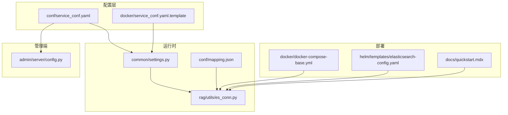
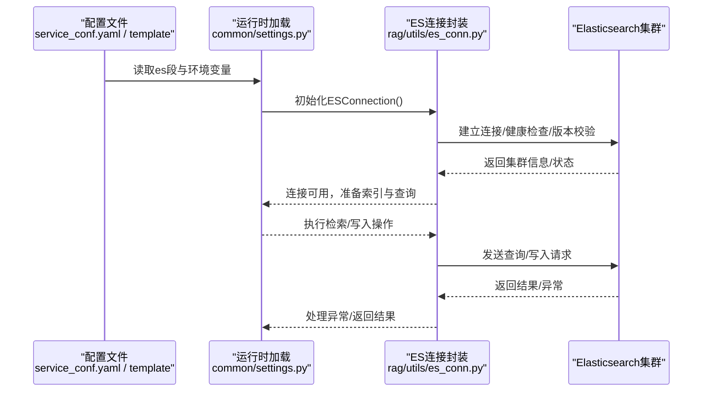
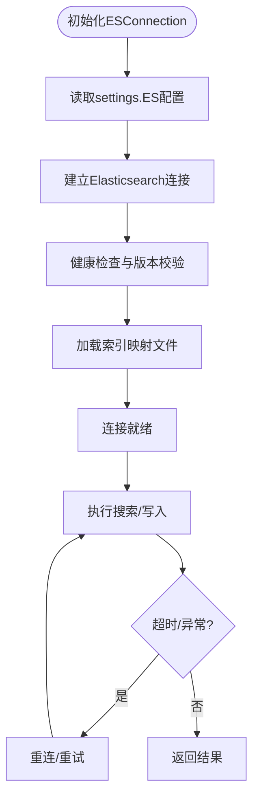
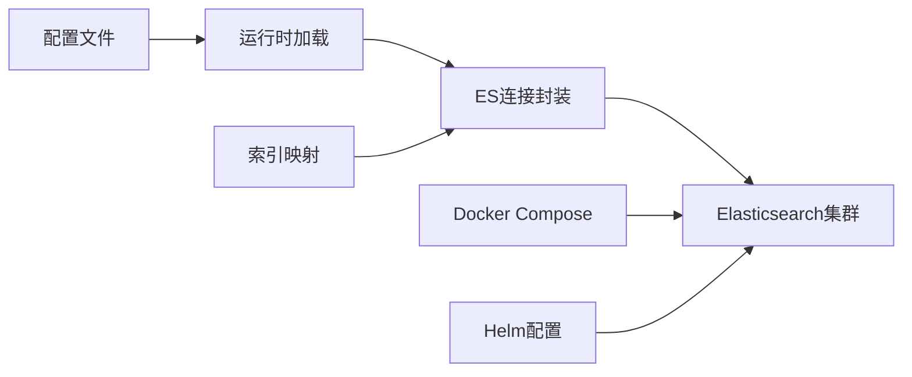
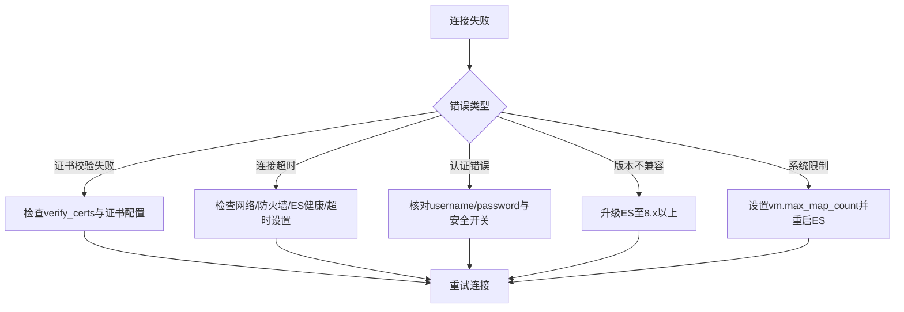

# Elasticsearch配置

<cite>
**本文引用的文件**
- [conf/service_conf.yaml](file://conf/service_conf.yaml)
- [docker/service_conf.yaml.template](file://docker/service_conf.yaml.template)
- [common/settings.py](file://common/settings.py)
- [rag/utils/es_conn.py](file://rag/utils/es_conn.py)
- [conf/mapping.json](file://conf/mapping.json)
- [docker/docker-compose-base.yml](file://docker/docker-compose-base.yml)
- [helm/templates/elasticsearch-config.yaml](file://helm/templates/elasticsearch-config.yaml)
- [docs/quickstart.mdx](file://docs/quickstart.mdx)
- [admin/server/config.py](file://admin/server/config.py)
</cite>

## 目录
1. [简介](#简介)
2. [项目结构](#项目结构)
3. [核心组件](#核心组件)
4. [架构总览](#架构总览)
5. [详细组件分析](#详细组件分析)
6. [依赖关系分析](#依赖关系分析)
7. [性能考虑](#性能考虑)
8. [故障排除指南](#故障排除指南)
9. [结论](#结论)

## 简介
本指南聚焦于在RAGFlow中配置Elasticsearch文档引擎，覆盖以下主题：
- 在本地配置文件中如何设置es部分（hosts、username、password、端口与协议）
- 在Docker环境中通过环境变量（ES_HOST、ES_USER、ELASTIC_PASSWORD等）进行配置
- 集群性能调优建议（分片数、副本、内存、刷新间隔等）
- 这些配置对RAG检索准确性与延迟的影响
- 常见连接问题的故障排除（证书校验失败、连接超时、认证错误）

## 项目结构
与Elasticsearch配置直接相关的文件分布如下：
- 配置文件：conf/service_conf.yaml（本地默认配置）、docker/service_conf.yaml.template（Docker模板）
- 运行时配置加载：common/settings.py（读取环境变量与配置文件，初始化ES连接）
- ES连接实现：rag/utils/es_conn.py（Elasticsearch客户端封装、健康检查、索引映射、查询与异常处理）
- 默认索引映射：conf/mapping.json（包含分片、副本、刷新间隔、字段映射等）
- 容器化部署：docker/docker-compose-base.yml（示例ES服务定义与环境变量）
- Helm部署：helm/templates/elasticsearch-config.yaml（ES配置项）
- 快速开始文档：docs/quickstart.mdx（系统限制与连接提示）
- 管理端配置解析：admin/server/config.py（从配置文件解析ES服务）

图表来源
- [conf/service_conf.yaml](file://conf/service_conf.yaml#L1-L153)
- [docker/service_conf.yaml.template](file://docker/service_conf.yaml.template#L1-L154)
- [common/settings.py](file://common/settings.py#L240-L258)
- [rag/utils/es_conn.py](file://rag/utils/es_conn.py#L42-L83)
- [conf/mapping.json](file://conf/mapping.json#L1-L20)
- [docker/docker-compose-base.yml](file://docker/docker-compose-base.yml#L1-L34)
- [helm/templates/elasticsearch-config.yaml](file://helm/templates/elasticsearch-config.yaml#L1-L17)
- [docs/quickstart.mdx](file://docs/quickstart.mdx#L65-L106)
- [admin/server/config.py](file://admin/server/config.py#L240-L253)

章节来源
- [conf/service_conf.yaml](file://conf/service_conf.yaml#L1-L153)
- [docker/service_conf.yaml.template](file://docker/service_conf.yaml.template#L1-L154)
- [common/settings.py](file://common/settings.py#L240-L258)
- [rag/utils/es_conn.py](file://rag/utils/es_conn.py#L42-L83)
- [conf/mapping.json](file://conf/mapping.json#L1-L20)
- [docker/docker-compose-base.yml](file://docker/docker-compose-base.yml#L1-L34)
- [helm/templates/elasticsearch-config.yaml](file://helm/templates/elasticsearch-config.yaml#L1-L17)
- [docs/quickstart.mdx](file://docs/quickstart.mdx#L65-L106)
- [admin/server/config.py](file://admin/server/config.py#L240-L253)

## 核心组件
- 配置文件与环境变量
  - 本地配置：conf/service_conf.yaml中的es段包含hosts、username、password等键值
  - Docker模板：docker/service_conf.yaml.template使用环境变量ES_HOST、ES_USER、ELASTIC_PASSWORD等
- 运行时加载
  - common/settings.py根据环境变量DOC_ENGINE选择文档引擎，并从配置文件读取es段，初始化ES连接
- 连接实现
  - rag/utils/es_conn.py负责建立连接、健康检查、版本校验、索引映射加载、查询与异常处理
- 默认索引映射
  - conf/mapping.json定义了分片数、副本数、刷新间隔、字段类型与向量维度等
- 部署与运维
  - docker/docker-compose-base.yml提供ES容器示例与环境变量
  - helm/templates/elasticsearch-config.yaml提供ES配置项（如安全开关、磁盘水位等）
  - docs/quickstart.mdx强调vm.max_map_count等系统限制
- 管理端解析
  - admin/server/config.py从配置文件解析ES主机、端口、用户名、密码等用于服务检测

章节来源
- [conf/service_conf.yaml](file://conf/service_conf.yaml#L1-L153)
- [docker/service_conf.yaml.template](file://docker/service_conf.yaml.template#L1-L154)
- [common/settings.py](file://common/settings.py#L240-L258)
- [rag/utils/es_conn.py](file://rag/utils/es_conn.py#L42-L83)
- [conf/mapping.json](file://conf/mapping.json#L1-L20)
- [docker/docker-compose-base.yml](file://docker/docker-compose-base.yml#L1-L34)
- [helm/templates/elasticsearch-config.yaml](file://helm/templates/elasticsearch-config.yaml#L1-L17)
- [docs/quickstart.mdx](file://docs/quickstart.mdx#L65-L106)
- [admin/server/config.py](file://admin/server/config.py#L240-L253)

## 架构总览
下图展示了从配置到连接再到查询的整体流程，以及关键依赖关系。

图表来源
- [common/settings.py](file://common/settings.py#L240-L258)
- [rag/utils/es_conn.py](file://rag/utils/es_conn.py#L42-L83)
- [conf/service_conf.yaml](file://conf/service_conf.yaml#L1-L153)
- [docker/service_conf.yaml.template](file://docker/service_conf.yaml.template#L1-L154)

## 详细组件分析

### 本地配置文件（conf/service_conf.yaml）中的es段
- 关键键值
  - hosts：Elasticsearch访问地址，支持多节点逗号分隔
  - username/password：认证凭据
  - 其他可选键：verify_certs（证书校验开关），scheme/port（在模板中体现）
- 作用
  - 作为默认配置被运行时加载，供ESConnection初始化使用

章节来源
- [conf/service_conf.yaml](file://conf/service_conf.yaml#L1-L153)

### Docker环境变量（docker/service_conf.yaml.template）
- 主要ES相关环境变量
  - ES_HOST：ES服务主机名或IP
  - ES_USER：用户名
  - ELASTIC_PASSWORD：密码
  - ES_PORT：ES对外端口（compose中映射）
- 作用
  - 通过环境变量动态替换模板中的默认值，便于容器化部署

章节来源
- [docker/service_conf.yaml.template](file://docker/service_conf.yaml.template#L1-L154)
- [docker/docker-compose-base.yml](file://docker/docker-compose-base.yml#L1-L34)

### 运行时加载与连接初始化（common/settings.py）
- 加载逻辑要点
  - 读取环境变量DOC_ENGINE，若为elasticsearch则从配置文件读取es段
  - 初始化ESConnection单例，内部完成健康检查、版本校验、映射文件加载
- 影响
  - 若配置缺失或不合法，将在启动阶段报错，避免后续运行期异常

章节来源
- [common/settings.py](file://common/settings.py#L240-L258)
- [rag/utils/es_conn.py](file://rag/utils/es_conn.py#L42-L83)

### ES连接封装与查询（rag/utils/es_conn.py）
- 连接与健康检查
  - 使用settings.ES["hosts"]（支持逗号分隔多节点）
  - 支持basic_auth（username/password）
  - verify_certs默认False（可在配置中调整）
  - 超时设置为600秒
  - 启动时进行ping与版本校验（要求>=8）
- 查询与异常处理
  - 搜索超时捕获并重连
  - 删除超时重试
  - 统一异常日志记录
- 集群状态
  - 提供集群统计接口，便于监控

图表来源
- [rag/utils/es_conn.py](file://rag/utils/es_conn.py#L42-L83)
- [rag/utils/es_conn.py](file://rag/utils/es_conn.py#L249-L271)

章节来源
- [rag/utils/es_conn.py](file://rag/utils/es_conn.py#L42-L83)
- [rag/utils/es_conn.py](file://rag/utils/es_conn.py#L249-L271)
- [rag/utils/es_conn.py](file://rag/utils/es_conn.py#L584-L631)

### 默认索引映射与性能参数（conf/mapping.json）
- 关键参数
  - number_of_shards：分片数
  - number_of_replicas：副本数
  - refresh_interval：索引刷新间隔
- 影响
  - 分片数影响并发与查询扩展性
  - 副本数影响高可用与查询吞吐
  - 刷新间隔影响写入后可见性与写入开销

章节来源
- [conf/mapping.json](file://conf/mapping.json#L1-L20)

### 部署与运维（docker/docker-compose-base.yml、helm/templates/elasticsearch-config.yaml）
- docker-compose
  - 提供es01服务示例，包含端口映射、环境变量（如ELASTIC_PASSWORD）、健康检查
- Helm
  - 提供ES配置项（如xpack.security.enabled、磁盘水位等）

章节来源
- [docker/docker-compose-base.yml](file://docker/docker-compose-base.yml#L1-L34)
- [helm/templates/elasticsearch-config.yaml](file://helm/templates/elasticsearch-config.yaml#L1-L17)

### 管理端配置解析（admin/server/config.py）
- 将配置文件中的es段解析为服务配置对象，提取主机、端口、用户名、密码等
- 用于服务检测与展示

章节来源
- [admin/server/config.py](file://admin/server/config.py#L240-L253)

## 依赖关系分析
- 配置到运行时
  - conf/service_conf.yaml/docker/service_conf.yaml.template → common/settings.py → rag/utils/es_conn.py
- 运行时到ES
  - rag/utils/es_conn.py → Elasticsearch集群
- 映射文件
  - conf/mapping.json → rag/utils/es_conn.py（创建索引时使用）
- 部署
  - docker/docker-compose-base.yml → Elasticsearch容器
  - helm/templates/elasticsearch-config.yaml → ES配置项

图表来源
- [common/settings.py](file://common/settings.py#L240-L258)
- [rag/utils/es_conn.py](file://rag/utils/es_conn.py#L42-L83)
- [conf/mapping.json](file://conf/mapping.json#L1-L20)
- [docker/docker-compose-base.yml](file://docker/docker-compose-base.yml#L1-L34)
- [helm/templates/elasticsearch-config.yaml](file://helm/templates/elasticsearch-config.yaml#L1-L17)

## 性能考虑
- 分片与副本
  - 分片数应与数据规模和查询并发匹配；过多分片会增加元数据开销
  - 副本数提升高可用与查询吞吐，但占用更多存储与内存
- 刷新间隔
  - 较短刷新间隔提升写入可见性，但增加写入成本；较长刷新间隔降低写入成本，但延迟更高
- 内存与JVM
  - ES需要足够的堆内存与锁内存；确保vm.max_map_count满足要求
- 索引映射
  - 文本字段的analyzer、相似度函数等会影响检索质量与性能
- 环境变量与部署
  - Docker中通过ES_HOST、ES_USER、ELASTIC_PASSWORD等控制连接参数
  - Helm中通过ConfigMap注入ES配置项

章节来源
- [conf/mapping.json](file://conf/mapping.json#L1-L20)
- [docs/quickstart.mdx](file://docs/quickstart.mdx#L65-L106)
- [docker/service_conf.yaml.template](file://docker/service_conf.yaml.template#L1-L154)
- [helm/templates/elasticsearch-config.yaml](file://helm/templates/elasticsearch-config.yaml#L1-L17)

## 故障排除指南
- 证书验证失败
  - 现象：连接时报SSL/TLS相关错误
  - 排查：确认verify_certs配置；在生产环境建议启用证书校验
  - 参考：ESConnection构造参数中verify_certs默认False
- 连接超时
  - 现象：搜索或删除请求超时
  - 排查：检查ES健康状态、网络连通性、防火墙；适当增大超时时间
  - 参考：ESConnection中timeout设置与异常重试逻辑
- 认证错误
  - 现象：401/403或认证失败
  - 排查：核对username/password；确认ES安全开关已开启且凭据正确
- 版本不兼容
  - 现象：启动阶段提示版本必须>=8
  - 排查：升级ES至8.x及以上
- 系统限制导致无法连接
  - 现象：启动阶段或运行期无法连接ES
  - 排查：设置vm.max_map_count；确保ES容器健康检查通过

图表来源
- [rag/utils/es_conn.py](file://rag/utils/es_conn.py#L42-L83)
- [rag/utils/es_conn.py](file://rag/utils/es_conn.py#L249-L271)
- [docs/quickstart.mdx](file://docs/quickstart.mdx#L65-L106)

章节来源
- [rag/utils/es_conn.py](file://rag/utils/es_conn.py#L42-L83)
- [rag/utils/es_conn.py](file://rag/utils/es_conn.py#L249-L271)
- [docs/quickstart.mdx](file://docs/quickstart.mdx#L65-L106)

## 结论
- 在本地与Docker环境中，通过conf/service_conf.yaml与docker/service_conf.yaml.template分别提供静态与动态配置入口
- 运行时由common/settings.py统一加载并初始化ESConnection，确保连接健康与版本合规
- conf/mapping.json定义了分片、副本与刷新间隔等关键性能参数
- 通过合理的分片/副本策略、刷新间隔与内存配置，可以在RAG检索的准确性与延迟之间取得平衡
- 遇到连接问题时，按证书、超时、认证、版本与系统限制逐项排查，通常可快速定位并解决