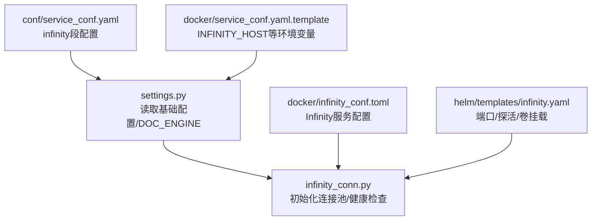
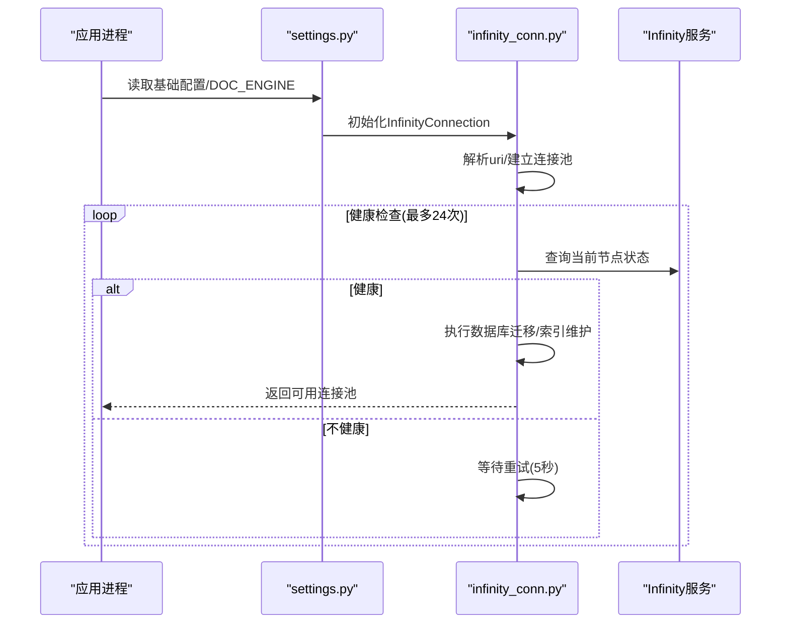
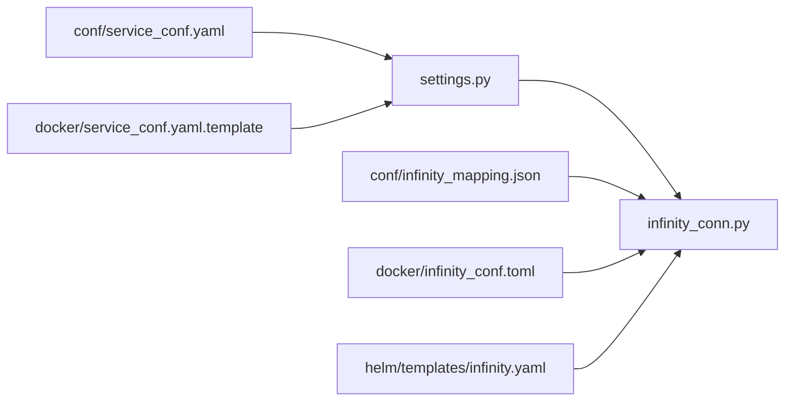

# Infinity配置

<cite>
**本文引用的文件**
- [service_conf.yaml](file://conf/service_conf.yaml)
- [service_conf.yaml.template](file://docker/service_conf.yaml.template)
- [infinity_conf.toml](file://docker/infinity_conf.toml)
- [settings.py](file://common/settings.py)
- [infinity_conn.py](file://rag/utils/infinity_conn.py)
- [infinity_mapping.json](file://conf/infinity_mapping.json)
- [infinity.yaml](file://helm/templates/infinity.yaml)
</cite>

## 目录
1. [简介](#简介)
2. [项目结构与入口](#项目结构与入口)
3. [核心组件](#核心组件)
4. [架构总览](#架构总览)
5. [详细组件解析](#详细组件解析)
6. [依赖关系分析](#依赖关系分析)
7. [性能调优建议](#性能调优建议)
8. [故障排查指南](#故障排查指南)
9. [结论](#结论)

## 简介
本指南聚焦于RagFlow中Infinity向量数据库的配置与使用，覆盖以下方面：
- 在conf/service_conf.yaml中配置infinity部分的参数（uri、db_name）。
- 在Docker环境中通过环境变量INFINITY_HOST等进行配置。
- Infinity专用配置文件docker/infinity_conf.toml中的网络、日志、存储、缓冲区、WAL与资源等关键参数。
- 基于代码实现的性能调优建议，包括向量索引类型选择与内存分配策略。

## 项目结构与入口
- 配置入口：后端通过common/settings.py读取基础配置，并根据DOC_ENGINE选择文档引擎；当DOC_ENGINE为infinity时，加载conf/service_conf.yaml中的infinity段并初始化rag/utils/infinity_conn.py中的连接池。
- 连接池初始化：infinity_conn.py会解析uri，建立连接池，并健康检查Infinity服务状态。
- Helm部署：helm/templates/infinity.yaml定义了Infinity容器端口映射与探活接口，便于Kubernetes环境下的部署与健康检查。

图表来源
- [settings.py](file://common/settings.py#L240-L258)
- [infinity_conn.py](file://rag/utils/infinity_conn.py#L174-L204)
- [service_conf.yaml](file://conf/service_conf.yaml#L28-L31)
- [service_conf.yaml.template](file://docker/service_conf.yaml.template#L28-L31)
- [infinity_conf.toml](file://docker/infinity_conf.toml#L5-L11)
- [infinity.yaml](file://helm/templates/infinity.yaml#L61-L99)

章节来源
- [settings.py](file://common/settings.py#L240-L258)
- [infinity_conn.py](file://rag/utils/infinity_conn.py#L174-L204)
- [service_conf.yaml](file://conf/service_conf.yaml#L28-L31)
- [service_conf.yaml.template](file://docker/service_conf.yaml.template#L28-L31)
- [infinity_conf.toml](file://docker/infinity_conf.toml#L5-L11)
- [infinity.yaml](file://helm/templates/infinity.yaml#L61-L99)

## 核心组件
- 配置加载与路由
  - settings.py根据环境变量DOC_ENGINE选择文档引擎，当值为infinity时，从基础配置中读取infinity段并初始化infinity_conn。
- 连接池与健康检查
  - infinity_conn.py负责解析uri、建立连接池、健康检查（轮询节点状态），并在成功后执行数据库迁移与表结构维护。
- 表结构与索引
  - 创建索引时默认使用HNSW向量索引，支持多种全文检索分析器；表结构由conf/infinity_mapping.json定义字段类型、默认值与分析器。
- Helm部署
  - helm/templates/infinity.yaml暴露Infinity的Thrift/HTTP/Postgres端口，配置探活路径与持久化卷，确保服务可用性。

章节来源
- [settings.py](file://common/settings.py#L240-L258)
- [infinity_conn.py](file://rag/utils/infinity_conn.py#L174-L204)
- [infinity_mapping.json](file://conf/infinity_mapping.json#L1-L39)
- [infinity.yaml](file://helm/templates/infinity.yaml#L61-L99)

## 架构总览
下图展示了RagFlow如何通过配置与代码集成Infinity服务，以及关键的健康检查流程。

图表来源
- [settings.py](file://common/settings.py#L240-L258)
- [infinity_conn.py](file://rag/utils/infinity_conn.py#L174-L204)

## 详细组件解析

### 1) conf/service_conf.yaml 中的infinity配置
- 关键字段
  - uri：Infinity客户端端口地址，格式为“主机:端口”。默认值为“localhost:23817”。
  - db_name：数据库名称，默认“default_db”。
- 配置位置参考
  - [service_conf.yaml](file://conf/service_conf.yaml#L28-L31)

章节来源
- [service_conf.yaml](file://conf/service_conf.yaml#L28-L31)

### 2) Docker环境变量配置（INFINITY_HOST等）
- 模板文件中使用环境变量INFINITY_HOST与端口拼接形成uri，默认端口为23817。
- 参考位置
  - [service_conf.yaml.template](file://docker/service_conf.yaml.template#L28-L31)

章节来源
- [service_conf.yaml.template](file://docker/service_conf.yaml.template#L28-L31)

### 3) Infinity专用配置文件 docker/infinity_conf.toml
- 网络
  - server_address、postgres_port、http_port、client_port、connection_pool_size。
- 日志
  - log_filename、log_dir、log_to_stdout、log_file_max_size、log_file_rotate_count、log_level。
- 存储
  - persistence_dir、data_dir、optimize_interval、cleanup_interval、compact_interval、storage_type。
- 缓冲区
  - buffer_manager_size、lru_num、temp_dir、result_cache、memindex_memory_quota。
- WAL
  - wal_dir。
- 资源
  - [resource]预留。
- 参考位置
  - [infinity_conf.toml](file://docker/infinity_conf.toml#L5-L11)
  - [infinity_conf.toml](file://docker/infinity_conf.toml#L12-L21)
  - [infinity_conf.toml](file://docker/infinity_conf.toml#L22-L34)
  - [infinity_conf.toml](file://docker/infinity_conf.toml#L46-L52)
  - [infinity_conf.toml](file://docker/infinity_conf.toml#L53-L55)

章节来源
- [infinity_conf.toml](file://docker/infinity_conf.toml#L5-L11)
- [infinity_conf.toml](file://docker/infinity_conf.toml#L12-L21)
- [infinity_conf.toml](file://docker/infinity_conf.toml#L22-L34)
- [infinity_conf.toml](file://docker/infinity_conf.toml#L46-L52)
- [infinity_conf.toml](file://docker/infinity_conf.toml#L53-L55)

### 4) 连接池与健康检查（infinity_conn.py）
- 初始化流程
  - 从settings.INFINITY读取db_name与uri；若uri包含冒号则拆分为host与port并封装为NetworkAddress。
  - 建立连接池，循环尝试获取连接并查询当前节点状态，直到健康或超时。
- 数据库迁移与索引维护
  - 读取conf/infinity_mapping.json，为现有表添加缺失列与全文索引；为向量列创建HNSW索引。
- 参考位置
  - [infinity_conn.py](file://rag/utils/infinity_conn.py#L174-L204)
  - [infinity_conn.py](file://rag/utils/infinity_conn.py#L206-L238)
  - [infinity_conn.py](file://rag/utils/infinity_conn.py#L264-L307)

章节来源
- [infinity_conn.py](file://rag/utils/infinity_conn.py#L174-L204)
- [infinity_conn.py](file://rag/utils/infinity_conn.py#L206-L238)
- [infinity_conn.py](file://rag/utils/infinity_conn.py#L264-L307)

### 5) 表结构与索引定义（infinity_mapping.json + infinity_conn.py）
- 字段映射
  - 字段类型、默认值、分析器（如“rag-coarse”、“rag-fine”、“rankfeatures”等）均来自infinity_mapping.json。
- 向量索引
  - 创建表时动态加入向量列，并以HNSW作为向量索引类型，支持M、ef_construction、metric、encode等参数。
- 全文索引
  - 对声明了analyzer的varchar字段创建对应全文索引。
- 参考位置
  - [infinity_mapping.json](file://conf/infinity_mapping.json#L1-L39)
  - [infinity_conn.py](file://rag/utils/infinity_conn.py#L264-L307)

章节来源
- [infinity_mapping.json](file://conf/infinity_mapping.json#L1-L39)
- [infinity_conn.py](file://rag/utils/infinity_conn.py#L264-L307)

### 6) Helm部署与健康检查（infinity.yaml）
- 端口
  - Thrift: 23817、HTTP: 23820、Postgres: 5432。
- 探活
  - HTTP GET /admin/node/current，初始延迟60秒，周期10秒，超时10秒，失败阈值120。
- 卷
  - 挂载/var/infinity目录至持久化卷，确保数据与日志持久化。
- 参考位置
  - [infinity.yaml](file://helm/templates/infinity.yaml#L61-L99)

章节来源
- [infinity.yaml](file://helm/templates/infinity.yaml#L61-L99)

## 依赖关系分析
- settings.py依赖基础配置加载器，按DOC_ENGINE分支选择文档引擎实现。
- infinity_conn.py依赖settings.INFINITY与conf/infinity_mapping.json，用于连接与建表。
- Helm模板依赖infinity_conf.toml中的端口与卷挂载配置，保证容器内服务与外部访问一致。

图表来源
- [settings.py](file://common/settings.py#L240-L258)
- [infinity_conn.py](file://rag/utils/infinity_conn.py#L174-L204)
- [service_conf.yaml](file://conf/service_conf.yaml#L28-L31)
- [service_conf.yaml.template](file://docker/service_conf.yaml.template#L28-L31)
- [infinity_mapping.json](file://conf/infinity_mapping.json#L1-L39)
- [infinity_conf.toml](file://docker/infinity_conf.toml#L5-L11)
- [infinity.yaml](file://helm/templates/infinity.yaml#L61-L99)

章节来源
- [settings.py](file://common/settings.py#L240-L258)
- [infinity_conn.py](file://rag/utils/infinity_conn.py#L174-L204)
- [service_conf.yaml](file://conf/service_conf.yaml#L28-L31)
- [service_conf.yaml.template](file://docker/service_conf.yaml.template#L28-L31)
- [infinity_mapping.json](file://conf/infinity_mapping.json#L1-L39)
- [infinity_conf.toml](file://docker/infinity_conf.toml#L5-L11)
- [infinity.yaml](file://helm/templates/infinity.yaml#L61-L99)

## 性能调优建议
- 向量索引类型与参数
  - 当前实现默认使用HNSW向量索引，参数包括M、ef_construction、metric、encode。可根据数据规模与查询需求调整这些参数以平衡召回与速度。
  - 参考位置：[infinity_conn.py](file://rag/utils/infinity_conn.py#L280-L293)
- 内存与缓冲区
  - buffer_manager_size与memindex_memory_quota控制内存使用上限；mem_index_capacity限制内存索引条目数量。结合数据量与并发查询峰值，适当提高buffer_manager_size与memindex_memory_quota可提升吞吐。
  - 参考位置：[infinity_conf.toml](file://docker/infinity_conf.toml#L46-L52)
- 存储与清理
  - optimize_interval、cleanup_interval、compact_interval控制后台优化节奏；storage_type为local时需关注磁盘IO与空间占用。
  - 参考位置：[infinity_conf.toml](file://docker/infinity_conf.toml#L22-L34)
- 日志级别与输出
  - log_level与log_to_stdout影响运行时开销与可观测性；生产环境建议适度降低日志级别。
  - 参考位置：[infinity_conf.toml](file://docker/infinity_conf.toml#L12-L21)
- 连接池与并发
  - connection_pool_size与infinity_conn中的max_size共同决定并发能力；过小会导致排队，过大可能增加上下文切换成本。
  - 参考位置：[infinity_conf.toml](file://docker/infinity_conf.toml#L5-L11)、[infinity_conn.py](file://rag/utils/infinity_conn.py#L186-L187)
- 健康检查与可用性
  - Helm探活路径与超时参数需与实际负载匹配；长时间不健康的节点应被及时隔离。
  - 参考位置：[infinity.yaml](file://helm/templates/infinity.yaml#L85-L92)

章节来源
- [infinity_conn.py](file://rag/utils/infinity_conn.py#L280-L293)
- [infinity_conf.toml](file://docker/infinity_conf.toml#L46-L52)
- [infinity_conf.toml](file://docker/infinity_conf.toml#L22-L34)
- [infinity_conf.toml](file://docker/infinity_conf.toml#L12-L21)
- [infinity_conf.toml](file://docker/infinity_conf.toml#L5-L11)
- [infinity_conn.py](file://rag/utils/infinity_conn.py#L186-L187)
- [infinity.yaml](file://helm/templates/infinity.yaml#L85-L92)

## 故障排查指南
- 连接失败或超时
  - 检查conf/service_conf.yaml或Docker环境变量是否正确设置INFINITY_HOST与端口；确认Infinity服务已启动且端口可达。
  - 参考位置：[service_conf.yaml](file://conf/service_conf.yaml#L28-L31)、[service_conf.yaml.template](file://docker/service_conf.yaml.template#L28-L31)
- 健康检查失败
  - 查看infinity_conn.py的健康检查循环与错误日志；确认Infinity节点状态为started或alive。
  - 参考位置：[infinity_conn.py](file://rag/utils/infinity_conn.py#L184-L204)
- 索引未创建或字段缺失
  - 确认infinity_mapping.json存在且字段定义完整；检查infinity_conn.py的迁移逻辑是否执行成功。
  - 参考位置：[infinity_mapping.json](file://conf/infinity_mapping.json#L1-L39)、[infinity_conn.py](file://rag/utils/infinity_conn.py#L206-L238)
- Helm部署异常
  - 检查端口映射、探活路径与持久化卷挂载；确认容器内日志输出到标准输出且日志目录存在。
  - 参考位置：[infinity.yaml](file://helm/templates/infinity.yaml#L61-L99)、[infinity_conf.toml](file://docker/infinity_conf.toml#L12-L21)

章节来源
- [service_conf.yaml](file://conf/service_conf.yaml#L28-L31)
- [service_conf.yaml.template](file://docker/service_conf.yaml.template#L28-L31)
- [infinity_conn.py](file://rag/utils/infinity_conn.py#L184-L204)
- [infinity_mapping.json](file://conf/infinity_mapping.json#L1-L39)
- [infinity_conn.py](file://rag/utils/infinity_conn.py#L206-L238)
- [infinity.yaml](file://helm/templates/infinity.yaml#L61-L99)
- [infinity_conf.toml](file://docker/infinity_conf.toml#L12-L21)

## 结论
- 在conf/service_conf.yaml中配置infinity的uri与db_name即可启用Infinity作为文档引擎。
- Docker环境下可通过INFINITY_HOST等环境变量灵活替换主机名与端口。
- docker/infinity_conf.toml提供了完善的网络、日志、存储、缓冲与WAL配置，是性能调优的关键入口。
- 代码层面默认采用HNSW向量索引与多分析器的全文索引，配合合理的内存与清理策略可获得稳定性能。
- 建议结合业务数据规模与查询特征，逐步调整索引参数、内存配额与清理周期，以达到最佳吞吐与延迟平衡。