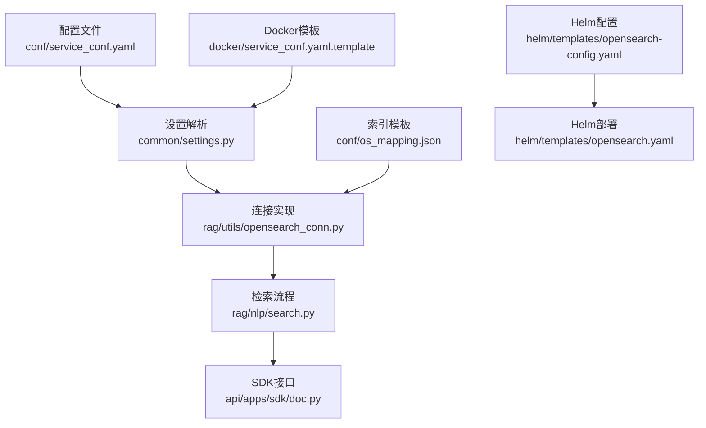
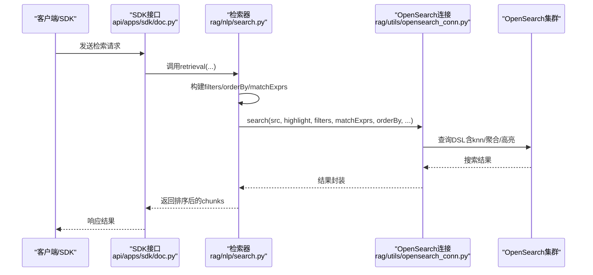
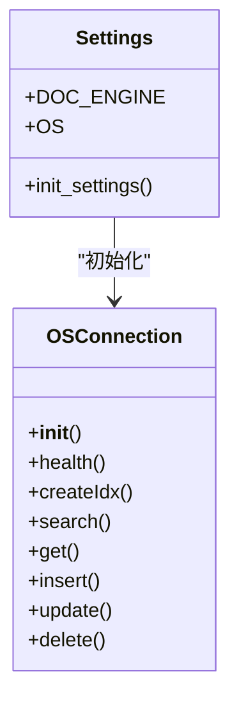
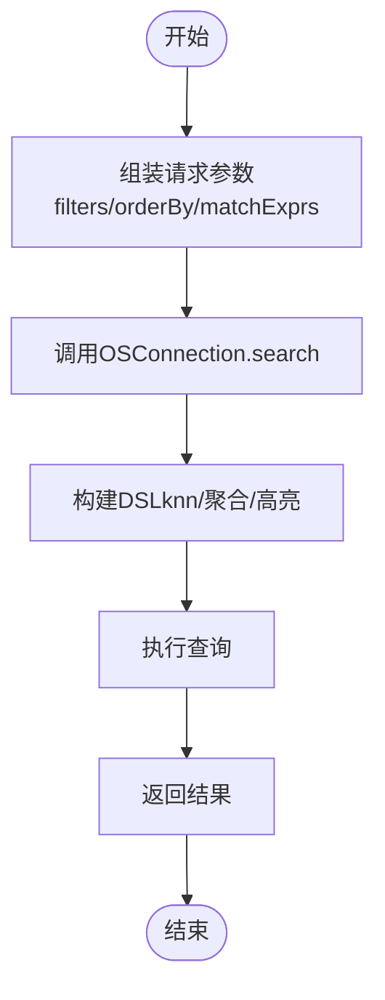
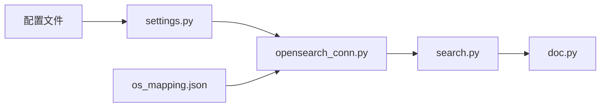
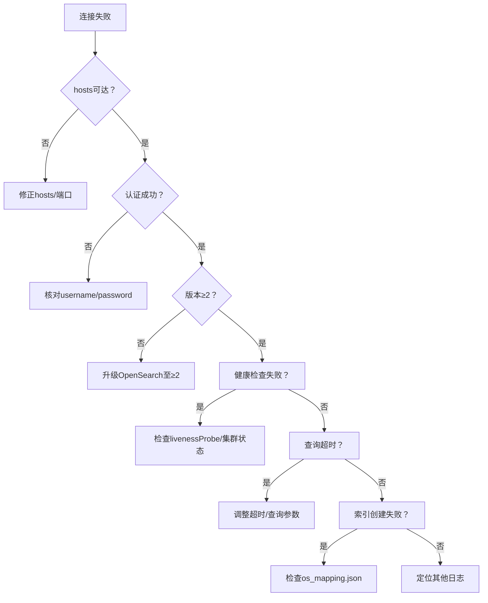

# OpenSearch配置

<cite>
**本文引用的文件**
- [service_conf.yaml](file://conf/service_conf.yaml)
- [service_conf.yaml.template](file://docker/service_conf.yaml.template)
- [settings.py](file://common/settings.py)
- [opensearch_conn.py](file://rag/utils/opensearch_conn.py)
- [os_mapping.json](file://conf/os_mapping.json)
- [opensearch-config.yaml](file://helm/templates/opensearch-config.yaml)
- [opensearch.yaml](file://helm/templates/opensearch.yaml)
- [search.py](file://rag/nlp/search.py)
- [doc.py](file://api/apps/sdk/doc.py)
</cite>

## 目录
1. [简介](#简介)
2. [项目结构](#项目结构)
3. [核心组件](#核心组件)
4. [架构总览](#架构总览)
5. [详细组件分析](#详细组件分析)
6. [依赖关系分析](#依赖关系分析)
7. [性能考虑](#性能考虑)
8. [故障排查指南](#故障排查指南)
9. [结论](#结论)
10. [附录](#附录)

## 简介
本指南面向在RAGFlow中使用OpenSearch作为文档引擎的用户，提供从配置到性能优化的完整说明。内容涵盖：
- 在/conf/service_conf.yaml中配置os部分的参数（hosts、username、password、port、scheme）
- 在Docker环境中通过环境变量（OS_HOST、OS_USER、OPENSEARCH_PASSWORD等）进行配置
- OpenSearch集群的性能调优建议（分片策略、缓存设置、索引模板）
- 配置如何与RAGFlow检索流程集成
- 连接问题与性能瓶颈的诊断与解决方案

## 项目结构
RAGFlow通过统一的配置入口加载OpenSearch参数，并在运行时初始化连接。关键位置如下：
- 配置文件：conf/service_conf.yaml（本地开发）、docker/service_conf.yaml.template（Docker环境）
- 设置解析：common/settings.py（根据DOC_ENGINE选择OS并初始化连接）
- 连接实现：rag/utils/opensearch_conn.py（OSConnection类负责连接、健康检查、索引与查询）
- 索引模板：conf/os_mapping.json（定义分片、副本、向量字段等）
- Helm部署：helm/templates/opensearch-config.yaml、helm/templates/opensearch.yaml（Kubernetes环境下的OpenSearch配置）

图表来源
- [service_conf.yaml](file://conf/service_conf.yaml#L1-L153)
- [service_conf.yaml.template](file://docker/service_conf.yaml.template#L1-L154)
- [settings.py](file://common/settings.py#L240-L258)
- [opensearch_conn.py](file://rag/utils/opensearch_conn.py#L40-L77)
- [os_mapping.json](file://conf/os_mapping.json#L1-L64)
- [opensearch-config.yaml](file://helm/templates/opensearch-config.yaml#L1-L18)
- [opensearch.yaml](file://helm/templates/opensearch.yaml#L87-L135)
- [search.py](file://rag/nlp/search.py#L359-L407)
- [doc.py](file://api/apps/sdk/doc.py#L1466-L1503)

章节来源
- [service_conf.yaml](file://conf/service_conf.yaml#L1-L153)
- [service_conf.yaml.template](file://docker/service_conf.yaml.template#L1-L154)
- [settings.py](file://common/settings.py#L240-L258)

## 核心组件
- OpenSearch配置参数
  - hosts：OpenSearch服务地址，支持逗号分隔的多个节点
  - username/password：认证凭据
  - port/scheme：在配置中通常通过hosts字段体现，或由模板中的http.port控制容器端口
- 设置解析与连接
  - settings.py根据DOC_ENGINE选择OS并初始化OSConnection
  - OSConnection读取settings.OS并建立连接，执行健康检查与版本校验
- 索引模板
  - os_mapping.json定义分片数、副本数、刷新间隔、knn开关、相似度脚本、动态模板与knn向量字段

章节来源
- [service_conf.yaml](file://conf/service_conf.yaml#L20-L31)
- [service_conf.yaml.template](file://docker/service_conf.yaml.template#L21-L27)
- [settings.py](file://common/settings.py#L240-L258)
- [opensearch_conn.py](file://rag/utils/opensearch_conn.py#L40-L77)
- [os_mapping.json](file://conf/os_mapping.json#L1-L64)

## 架构总览
RAGFlow的检索链路自上而下：
- SDK/API接收请求，构造检索参数
- Dealer根据参数构建查询表达式（关键词、向量、融合权重）
- OSConnection执行搜索、聚合、高亮等操作
- 返回结果供后续重排、高亮与输出

图表来源
- [doc.py](file://api/apps/sdk/doc.py#L1466-L1503)
- [search.py](file://rag/nlp/search.py#L359-L407)
- [opensearch_conn.py](file://rag/utils/opensearch_conn.py#L131-L266)

## 详细组件分析

### 1) 配置文件与参数详解
- conf/service_conf.yaml（本地）
  - os部分包含hosts、username、password等键值
  - hosts示例为http://localhost:1201，表示协议、主机与端口
- docker/service_conf.yaml.template（Docker）
  - 使用环境变量OS_HOST、OS_USER、OPENSEARCH_PASSWORD
  - hosts默认为http://${OS_HOST:-opensearch01}:9201，端口来自容器内http.port
- 端口与协议
  - 容器端口在Helm模板中固定为9201，需与hosts保持一致
  - scheme由hosts决定（http/https），若使用https需确保证书与安全配置

章节来源
- [service_conf.yaml](file://conf/service_conf.yaml#L20-L31)
- [service_conf.yaml.template](file://docker/service_conf.yaml.template#L21-L27)
- [opensearch-config.yaml](file://helm/templates/opensearch-config.yaml#L1-L18)
- [opensearch.yaml](file://helm/templates/opensearch.yaml#L87-L135)

### 2) 运行时设置解析与连接初始化
- settings.py
  - 依据DOC_ENGINE选择OS并填充settings.OS
  - 初始化docStoreConn为OSConnection
- OSConnection
  - 从settings.OS读取hosts、username、password
  - 分割hosts为多节点列表
  - 建立连接后执行info/ping/版本校验
  - 加载os_mapping.json作为索引模板

图表来源
- [settings.py](file://common/settings.py#L240-L258)
- [opensearch_conn.py](file://rag/utils/opensearch_conn.py#L40-L77)

章节来源
- [settings.py](file://common/settings.py#L240-L258)
- [opensearch_conn.py](file://rag/utils/opensearch_conn.py#L40-L77)

### 3) 索引模板与分片策略
- os_mapping.json
  - settings.index.number_of_shards：分片数量
  - settings.index.number_of_replicas：副本数量
  - settings.refresh_interval：刷新间隔
  - settings.knn：启用knn
  - dynamic_templates：按字段后缀自动映射类型（*_int/*_flt/*_kwd等）
  - knn_vector：按维度定义knn向量字段（如*_vec系列）
- 建议
  - 分片数与副本数需结合数据量与查询负载评估
  - 刷新间隔影响写入延迟与可见性权衡
  - 合理设置knn向量维度与空间类型

章节来源
- [os_mapping.json](file://conf/os_mapping.json#L1-L64)

### 4) 检索流程与OpenSearch集成
- Dealer.retrieval
  - 组装filters、orderBy、matchExprs（关键词、向量、融合权重）
  - 调用OSConnection.search执行查询
  - 支持高亮、聚合、排序与重排
- SDK接口
  - api/apps/sdk/doc.py调用settings.retriever.retrieval完成端到端检索

图表来源
- [search.py](file://rag/nlp/search.py#L359-L407)
- [opensearch_conn.py](file://rag/utils/opensearch_conn.py#L131-L266)
- [doc.py](file://api/apps/sdk/doc.py#L1466-L1503)

章节来源
- [search.py](file://rag/nlp/search.py#L359-L407)
- [opensearch_conn.py](file://rag/utils/opensearch_conn.py#L131-L266)
- [doc.py](file://api/apps/sdk/doc.py#L1466-L1503)

## 依赖关系分析
- 配置到连接
  - conf/service_conf.yaml与docker/service_conf.yaml.template提供OS配置
  - common/settings.py解析配置并注入settings.OS
  - rag/utils/opensearch_conn.py使用settings.OS建立连接
- 索引模板到查询
  - conf/os_mapping.json定义索引结构
  - OSConnection在创建索引时应用该模板
  - 检索时基于模板字段进行查询与高亮

图表来源
- [service_conf.yaml](file://conf/service_conf.yaml#L20-L31)
- [service_conf.yaml.template](file://docker/service_conf.yaml.template#L21-L27)
- [settings.py](file://common/settings.py#L240-L258)
- [opensearch_conn.py](file://rag/utils/opensearch_conn.py#L94-L103)
- [os_mapping.json](file://conf/os_mapping.json#L1-L64)
- [search.py](file://rag/nlp/search.py#L359-L407)
- [doc.py](file://api/apps/sdk/doc.py#L1466-L1503)

章节来源
- [settings.py](file://common/settings.py#L240-L258)
- [opensearch_conn.py](file://rag/utils/opensearch_conn.py#L94-L103)

## 性能考虑
- 分片与副本
  - 将分片数与副本数与节点数、磁盘容量匹配，避免热点分片
  - 复制副本提升可用性但增加写放大
- 刷新间隔
  - 更短刷新间隔降低写入延迟，但提高CPU与IO开销
- KNN向量
  - 选择合适的向量维度与空间类型（cosinesimil）
  - 控制knn.topk与similarity阈值平衡召回与性能
- 缓存与聚合
  - 合理使用聚合桶大小与字段统计，避免过大的聚合内存占用
- 查询优化
  - 使用最小匹配百分比与融合权重平衡关键词与向量检索
  - 高亮字段仅对必要字段开启，减少响应体大小
- 索引模板
  - 动态模板按字段后缀映射，减少手动映射成本
  - 为常用过滤字段设置keyword类型，提升过滤性能

章节来源
- [os_mapping.json](file://conf/os_mapping.json#L1-L64)
- [opensearch_conn.py](file://rag/utils/opensearch_conn.py#L131-L266)
- [search.py](file://rag/nlp/search.py#L359-L407)

## 故障排查指南
- 连接失败
  - hosts不可达：确认容器端口（9201）与hosts一致
  - 认证失败：核对username/password是否正确
  - 版本不兼容：OSConnection要求OpenSearch版本≥2
- 健康检查失败
  - 容器未就绪：等待探针通过（Helm模板中包含livenessProbe）
  - 集群状态异常：查看cluster.health
- 查询超时
  - 提升超时时间或降低topk
  - 优化DSL（减少高亮字段、聚合桶大小）
- 索引创建失败
  - 确认os_mapping.json存在且格式正确
  - 检查权限与磁盘水位线

图表来源
- [opensearch_conn.py](file://rag/utils/opensearch_conn.py#L40-L77)
- [opensearch.yaml](file://helm/templates/opensearch.yaml#L87-L135)

章节来源
- [opensearch_conn.py](file://rag/utils/opensearch_conn.py#L40-L77)
- [opensearch.yaml](file://helm/templates/opensearch.yaml#L87-L135)

## 结论
- 在本地与Docker环境下，通过conf/service_conf.yaml与docker/service_conf.yaml.template分别配置OpenSearch参数
- settings.py与OSConnection确保配置被正确解析并建立连接
- os_mapping.json定义了分片、副本、knn与动态模板，直接影响检索性能与稳定性
- 检索流程通过Dealer与OSConnection紧密耦合，支持关键词、向量与融合检索
- 针对连接与性能问题，建议从hosts/认证/版本/集群健康/查询参数与索引模板等方面逐项排查

## 附录
- 环境变量参考（Docker）
  - OS_HOST：OpenSearch主机名，默认opensearch01
  - OS_USER：用户名，默认admin
  - OPENSEARCH_PASSWORD：密码
- 端口参考（Helm）
  - http.port：9201（容器端口）
- 关键路径参考
  - 配置解析：[settings.py](file://common/settings.py#L240-L258)
  - 连接初始化：[opensearch_conn.py](file://rag/utils/opensearch_conn.py#L40-L77)
  - 索引模板：[os_mapping.json](file://conf/os_mapping.json#L1-L64)
  - 检索流程：[search.py](file://rag/nlp/search.py#L359-L407)
  - SDK接口：[doc.py](file://api/apps/sdk/doc.py#L1466-L1503)