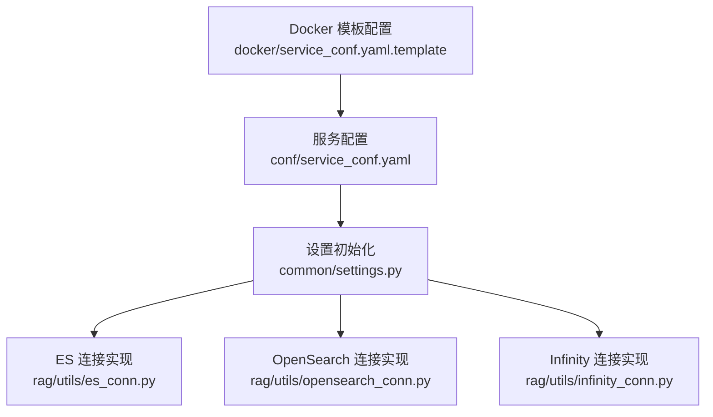
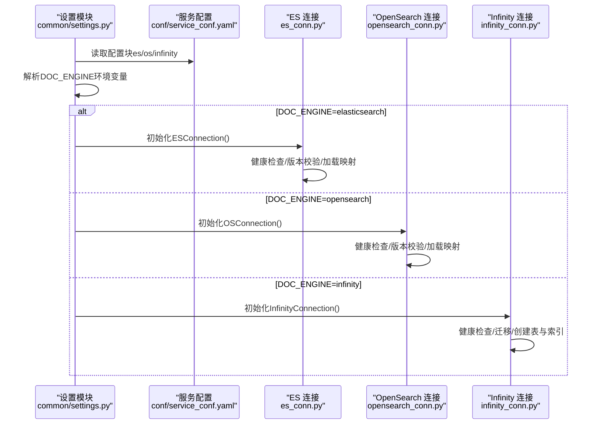
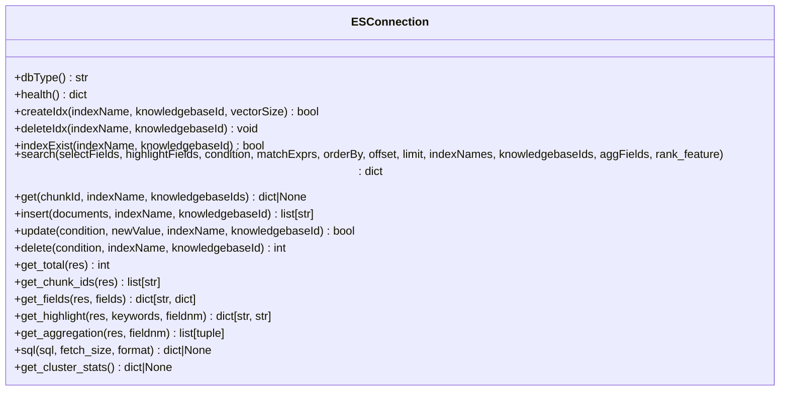
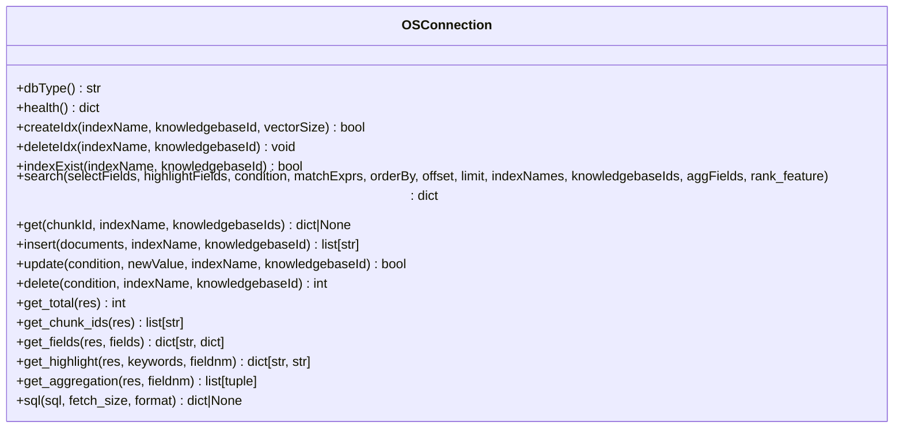
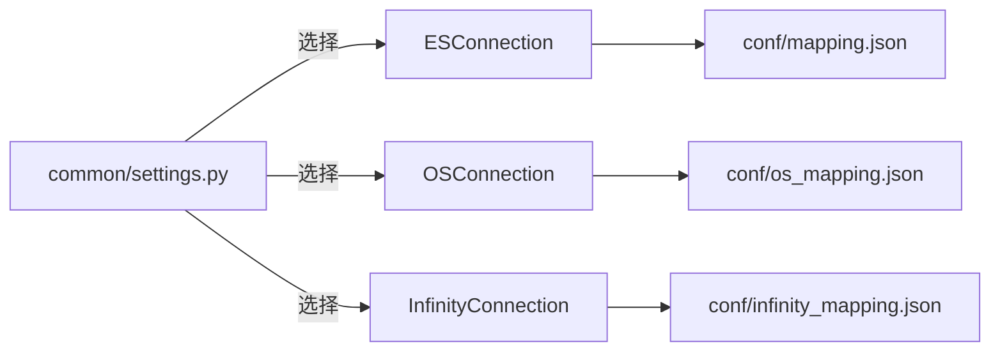

# 向量数据库配置

<cite>
**本文引用的文件**
- [conf/service_conf.yaml](file://conf/service_conf.yaml)
- [docker/service_conf.yaml.template](file://docker/service_conf.yaml.template)
- [common/settings.py](file://common/settings.py)
- [rag/utils/es_conn.py](file://rag/utils/es_conn.py)
- [rag/utils/opensearch_conn.py](file://rag/utils/opensearch_conn.py)
- [rag/utils/infinity_conn.py](file://rag/utils/infinity_conn.py)
- [conf/mapping.json](file://conf/mapping.json)
- [conf/os_mapping.json](file://conf/os_mapping.json)
- [conf/infinity_mapping.json](file://conf/infinity_mapping.json)
- [docs/configurations.md](file://docs/configurations.md)
- [docker/README.md](file://docker/README.md)
</cite>

## 目录
1. [简介](#简介)
2. [项目结构与入口](#项目结构与入口)
3. [核心组件：向量与全文检索引擎](#核心组件向量与全文检索引擎)
4. [架构总览](#架构总览)
5. [详细组件解析](#详细组件解析)
6. [依赖关系分析](#依赖关系分析)
7. [性能调优建议](#性能调优建议)
8. [故障排除指南](#故障排除指南)
9. [结论](#结论)

## 简介
本指南面向需要在RAGFlow中配置向量与全文检索引擎（Elasticsearch、OpenSearch、Infinity）的用户与运维人员。内容覆盖：
- 配置文件与环境变量的使用方式
- es、os、infinity配置块的关键参数说明
- Docker环境下ES_HOST、OS_HOST、INFINITY_HOST等环境变量的作用
- 不同向量数据库的性能调优要点
- 影响RAG查询准确率与延迟的关键因素
- 常见连接问题的排查方法

## 项目结构与入口
RAGFlow通过统一的设置模块加载服务配置，并根据DOC_ENGINE选择具体的文档存储连接实现。向量与全文检索引擎的配置位于服务配置文件中，容器化部署时由模板文件注入环境变量生成最终配置。

图表来源
- [common/settings.py](file://common/settings.py#L240-L258)
- [conf/service_conf.yaml](file://conf/service_conf.yaml#L1-L80)
- [docker/service_conf.yaml.template](file://docker/service_conf.yaml.template#L1-L60)

章节来源
- [common/settings.py](file://common/settings.py#L240-L258)
- [conf/service_conf.yaml](file://conf/service_conf.yaml#L1-L80)
- [docker/service_conf.yaml.template](file://docker/service_conf.yaml.template#L1-L60)

## 核心组件：向量与全文检索引擎
- Elasticsearch
  - hosts：集群或节点地址列表
  - username/password：认证凭据
  - 使用映射文件conf/mapping.json定义索引settings与mappings，支持多种字段类型与向量维度
- OpenSearch
  - hosts：集群或节点地址列表
  - username/password：认证凭据
  - 使用映射文件conf/os_mapping.json定义索引settings与knn_vector字段
- Infinity
  - uri：主机与端口字符串
  - db_name：数据库名
  - 使用conf/infinity_mapping.json定义表结构与全文索引分析器

章节来源
- [conf/service_conf.yaml](file://conf/service_conf.yaml#L18-L35)
- [conf/mapping.json](file://conf/mapping.json#L1-L212)
- [conf/os_mapping.json](file://conf/os_mapping.json#L1-L268)
- [conf/infinity_mapping.json](file://conf/infinity_mapping.json#L1-L39)

## 架构总览
RAGFlow在启动时读取服务配置，依据DOC_ENGINE选择对应的文档存储连接类。连接类负责健康检查、索引创建、搜索与CRUD操作。

图表来源
- [common/settings.py](file://common/settings.py#L240-L258)
- [rag/utils/es_conn.py](file://rag/utils/es_conn.py#L42-L110)
- [rag/utils/opensearch_conn.py](file://rag/utils/opensearch_conn.py#L40-L110)
- [rag/utils/infinity_conn.py](file://rag/utils/infinity_conn.py#L174-L210)

## 详细组件解析

### Elasticsearch 配置与连接
- 配置项
  - hosts：以逗号分隔的节点地址列表
  - username/password：可选认证
  - verify_certs：证书校验开关（默认关闭）
- 连接与健康检查
  - 初始化时尝试连接并获取集群信息
  - 校验版本是否满足最低要求
  - 加载映射文件conf/mapping.json用于创建索引
- 索引与搜索
  - 支持文本查询、向量KNN、排序、聚合、高亮等
  - 支持融合权重调整向量与文本的贡献度
- 错误处理
  - 超时重试、连接异常处理、超时异常抛出

图表来源
- [rag/utils/es_conn.py](file://rag/utils/es_conn.py#L42-L632)

章节来源
- [conf/service_conf.yaml](file://conf/service_conf.yaml#L18-L26)
- [conf/mapping.json](file://conf/mapping.json#L1-L212)
- [rag/utils/es_conn.py](file://rag/utils/es_conn.py#L42-L110)

### OpenSearch 配置与连接
- 配置项
  - hosts：以逗号分隔的节点地址列表
  - username/password：可选认证
- 连接与健康检查
  - 初始化时尝试连接并获取集群信息
  - 校验版本是否满足最低要求
  - 加载映射文件conf/os_mapping.json用于创建索引
- 索引与搜索
  - 文本查询、向量KNN（通过DSL拼装）、排序、聚合、高亮
  - 支持融合权重调整向量与文本的贡献度
- 错误处理
  - 超时重试、连接异常处理、超时异常抛出

图表来源
- [rag/utils/opensearch_conn.py](file://rag/utils/opensearch_conn.py#L40-L562)

章节来源
- [conf/service_conf.yaml](file://conf/service_conf.yaml#L24-L28)
- [conf/os_mapping.json](file://conf/os_mapping.json#L1-L268)
- [rag/utils/opensearch_conn.py](file://rag/utils/opensearch_conn.py#L40-L110)

### Infinity 配置与连接
- 配置项
  - uri：主机:端口字符串
  - db_name：数据库名（默认default_db）
- 连接与健康检查
  - 通过连接池建立连接，检测节点状态
  - 自动迁移数据库与表结构，按需添加列与全文索引
- 索引与搜索
  - 动态推断向量维度并创建表与HNSW向量索引
  - 支持全文匹配、稠密向量匹配、融合排序、排序、聚合
- 错误处理
  - 表不存在自动创建、字段转换、批量插入去重、更新与删除

图表来源
- [rag/utils/infinity_conn.py](file://rag/utils/infinity_conn.py#L174-L939)
- [conf/infinity_mapping.json](file://conf/infinity_mapping.json#L1-L39)

章节来源
- [conf/service_conf.yaml](file://conf/service_conf.yaml#L28-L31)
- [conf/infinity_mapping.json](file://conf/infinity_mapping.json#L1-L39)
- [rag/utils/infinity_conn.py](file://rag/utils/infinity_conn.py#L174-L308)

### Docker 环境变量与模板配置
- 模板文件docker/service_conf.yaml.template通过环境变量动态生成最终配置
- 关键环境变量（示例）
  - ES_HOST：Elasticsearch服务主机名或IP
  - OS_HOST：OpenSearch服务主机名或IP
  - INFINITY_HOST：Infinity服务主机名或IP
  - 其他如ES_USER、ELASTIC_PASSWORD、OS_USER、OPENSEARCH_PASSWORD等
- 容器化部署时，.env文件中的变量会替换模板中的占位符

章节来源
- [docker/service_conf.yaml.template](file://docker/service_conf.yaml.template#L1-L60)
- [docs/configurations.md](file://docs/configurations.md#L1-L120)
- [docker/README.md](file://docker/README.md#L1-L120)

## 依赖关系分析
- 设置模块根据DOC_ENGINE选择具体连接类
- 连接类依赖各自映射文件完成索引创建
- 搜索流程包含条件过滤、文本/向量匹配、排序与聚合

图表来源
- [common/settings.py](file://common/settings.py#L240-L258)
- [conf/mapping.json](file://conf/mapping.json#L1-L212)
- [conf/os_mapping.json](file://conf/os_mapping.json#L1-L268)
- [conf/infinity_mapping.json](file://conf/infinity_mapping.json#L1-L39)

章节来源
- [common/settings.py](file://common/settings.py#L240-L258)

## 性能调优建议
以下建议基于各连接实现与映射配置的特性总结，旨在提升RAG查询的准确性与延迟表现。

- 分片与副本
  - Elasticsearch/OpenSearch映射中定义了分片数与副本数，以及刷新间隔。合理设置分片数量与副本数可平衡写入吞吐与查询并发；刷新间隔越短，写入可见性越快但CPU与磁盘开销越大。
  - 参考路径：[conf/mapping.json](file://conf/mapping.json#L1-L20)、[conf/os_mapping.json](file://conf/os_mapping.json#L1-L20)

- 向量索引参数
  - Elasticsearch：动态模板定义了多种向量维度（如512/768/1024/1536），并指定相似度为余弦。向量维度越高，精度可能越好但内存与计算成本更高。
  - OpenSearch：knn_vector字段支持cosinesimil空间类型，维度范围更广。
  - Infinity：自动创建HNSW向量索引，参数包含M、ef_construction、metric、encode等，可通过调整这些参数优化召回与速度。
  - 参考路径：[conf/mapping.json](file://conf/mapping.json#L158-L210)、[conf/os_mapping.json](file://conf/os_mapping.json#L159-L257)、[rag/utils/infinity_conn.py](file://rag/utils/infinity_conn.py#L280-L295)

- 查询融合权重
  - ES/OS连接均支持融合表达式，允许通过权重调整文本与向量的贡献度，从而在准确性与召回之间取得平衡。
  - 参考路径：[rag/utils/es_conn.py](file://rag/utils/es_conn.py#L183-L216)、[rag/utils/opensearch_conn.py](file://rag/utils/opensearch_conn.py#L173-L211)

- 排序与聚合
  - 对排序字段类型与模式进行合理设置，避免unmapped_type导致的性能损耗。
  - 聚合桶大小应结合业务数据分布设定，过大可能导致内存压力。
  - 参考路径：[rag/utils/es_conn.py](file://rag/utils/es_conn.py#L222-L243)、[rag/utils/opensearch_conn.py](file://rag/utils/opensearch_conn.py#L222-L240)

- 内存与资源
  - Elasticsearch/OpenSearch对JVM堆大小敏感，需确保容器内存限制充足。
  - Infinity通过连接池管理连接，合理设置最大连接数与节点资源。
  - 参考路径：[rag/utils/es_conn.py](file://rag/utils/es_conn.py#L60-L70)、[rag/utils/infinity_conn.py](file://rag/utils/infinity_conn.py#L174-L205)

- 索引策略
  - 将知识库ID作为过滤条件的一部分，减少扫描范围。
  - 对高频过滤字段使用keyword类型，降低分析成本。
  - 参考路径：[conf/mapping.json](file://conf/mapping.json#L93-L110)、[conf/os_mapping.json](file://conf/os_mapping.json#L93-L110)

## 故障排除指南
- 连接失败
  - 检查hosts/uri是否正确，确认网络连通性与端口开放情况
  - 确认用户名密码或认证方式正确
  - 参考路径：[conf/service_conf.yaml](file://conf/service_conf.yaml#L18-L31)

- 版本不兼容
  - Elasticsearch/OpenSearch在初始化时会校验版本，若低于最低要求将报错
  - 参考路径：[rag/utils/es_conn.py](file://rag/utils/es_conn.py#L58-L70)、[rag/utils/opensearch_conn.py](file://rag/utils/opensearch_conn.py#L60-L76)

- 映射文件缺失
  - ES/OS在初始化时会检查映射文件是否存在，缺失将直接报错
  - 参考路径：[rag/utils/es_conn.py](file://rag/utils/es_conn.py#L64-L71)、[rag/utils/opensearch_conn.py](file://rag/utils/opensearch_conn.py#L68-L76)

- 超时与重试
  - 连接超时会触发重试逻辑，若多次失败请检查网络与资源
  - 参考路径：[rag/utils/es_conn.py](file://rag/utils/es_conn.py#L249-L271)、[rag/utils/opensearch_conn.py](file://rag/utils/opensearch_conn.py#L244-L267)

- Docker环境变量未生效
  - 确认模板文件中的占位符已被正确替换，且容器内环境变量已注入
  - 参考路径：[docker/service_conf.yaml.template](file://docker/service_conf.yaml.template#L1-L60)、[docs/configurations.md](file://docs/configurations.md#L1-L120)

- Infinity表不存在或列缺失
  - 连接类会在插入前自动创建表与索引，若仍报错请检查数据库权限与节点状态
  - 参考路径：[rag/utils/infinity_conn.py](file://rag/utils/infinity_conn.py#L537-L566)

## 结论
通过合理配置Elasticsearch、OpenSearch与Infinity的连接参数与索引映射，结合Docker环境变量的动态注入，可以有效提升RAGFlow在向量与全文检索场景下的准确性与延迟表现。建议在生产环境中根据数据规模与查询特征，逐步调优分片、向量索引参数与融合权重，并持续监控资源使用与错误日志，以获得稳定可靠的检索体验。