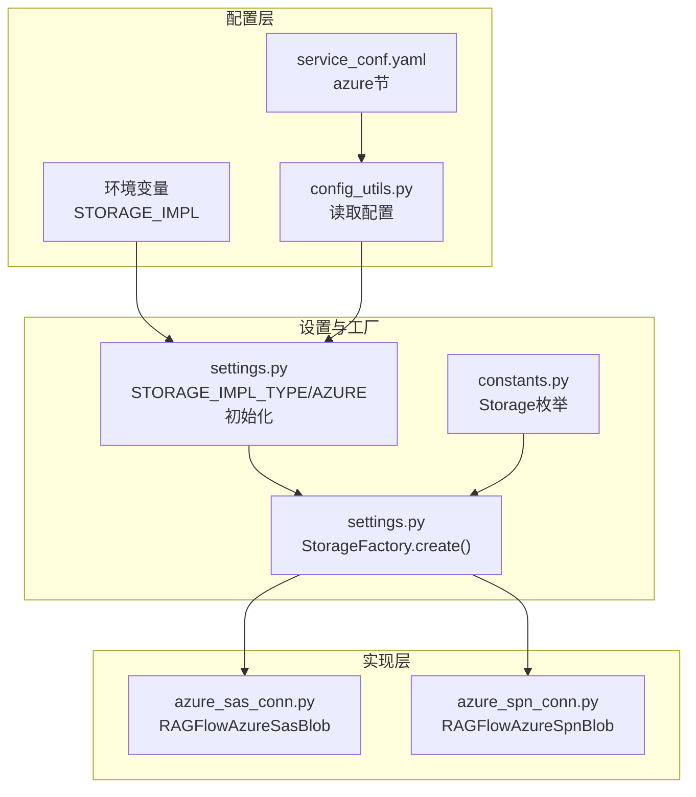
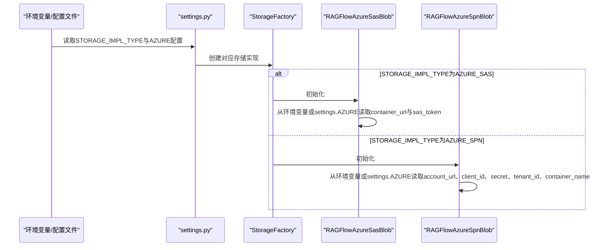
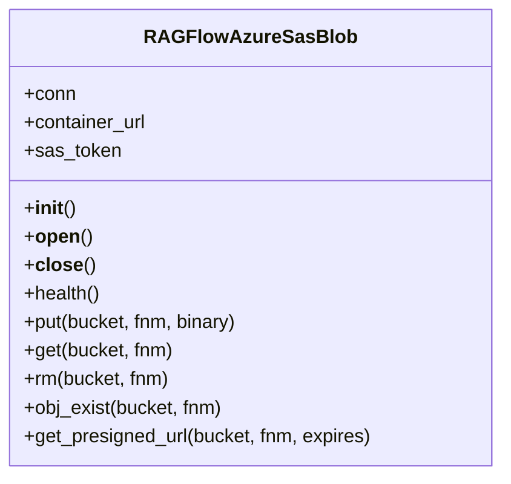
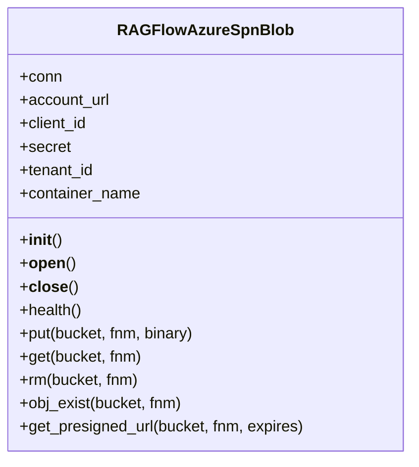
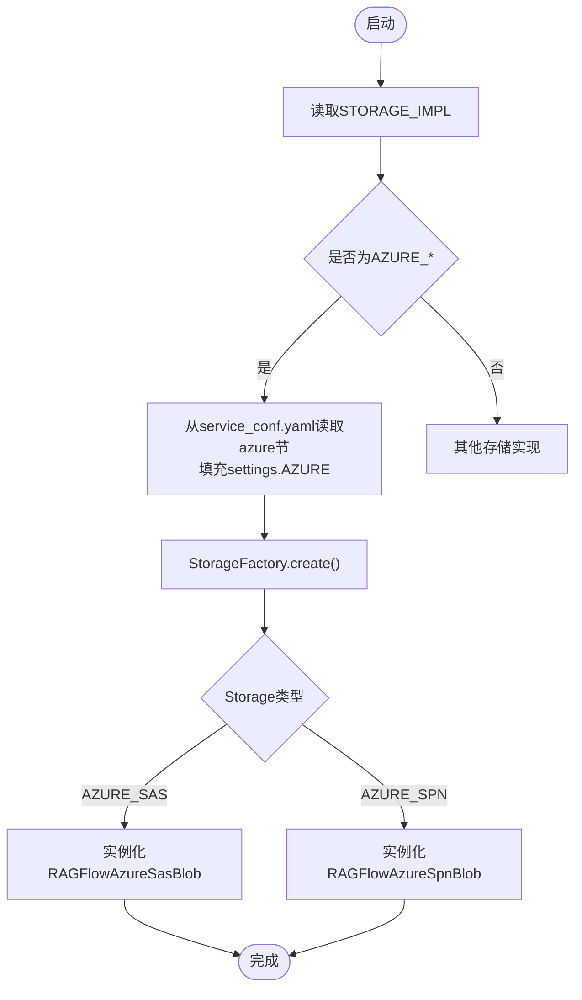
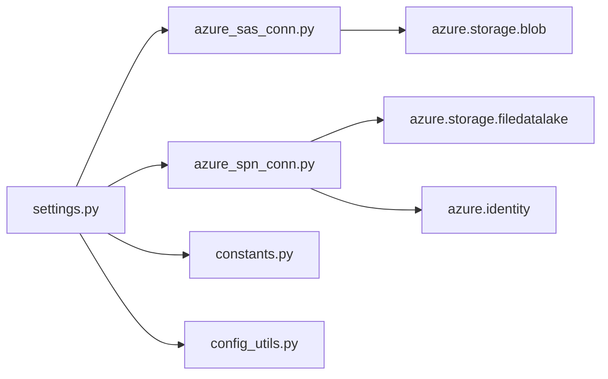

# Azure Blob Storage配置

<cite>
**本文引用的文件**
- [azure_sas_conn.py](file://rag/utils/azure_sas_conn.py)
- [azure_spn_conn.py](file://rag/utils/azure_spn_conn.py)
- [settings.py](file://common/settings.py)
- [constants.py](file://common/constants.py)
- [service_conf.yaml](file://conf/service_conf.yaml)
- [config_utils.py](file://common/config_utils.py)
</cite>

## 目录
1. [简介](#简介)
2. [项目结构与定位](#项目结构与定位)
3. [核心组件](#核心组件)
4. [架构总览](#架构总览)
5. [详细组件解析](#详细组件解析)
6. [依赖关系分析](#依赖关系分析)
7. [性能与可用性考量](#性能与可用性考量)
8. [故障排查指南](#故障排查指南)
9. [结论](#结论)
10. [附录：Azure门户角色与最佳实践](#附录azure门户角色与最佳实践)

## 简介
本指南面向需要在系统中使用Azure Blob Storage作为对象存储后端的用户，聚焦于两种认证方式：
- 共享访问签名（SAS）
- Azure服务主体（SPN）

文档将说明如何配置关键参数（如account_name、sas_token或tenant_id、client_id、client_secret等），如何在Azure门户创建具备适当权限的角色分配，并给出存储账户类型选择、访问层（热/冷/归档）以及网络访问限制的最佳实践建议。同时，结合代码仓库中的实现，帮助你理解参数来源、初始化流程与错误处理策略。

## 项目结构与定位
- Azure Blob Storage相关实现位于RAGFlow的通用设置与工具模块中：
  - 认证实现：SAS与SPN两类客户端封装
  - 设置加载：从环境变量与service_conf.yaml读取配置
  - 存储工厂：根据STORAGE_IMPL_TYPE动态选择具体实现

图表来源
- [settings.py](file://common/settings.py#L119-L269)
- [constants.py](file://common/constants.py#L145-L153)
- [azure_sas_conn.py](file://rag/utils/azure_sas_conn.py#L1-L96)
- [azure_spn_conn.py](file://rag/utils/azure_spn_conn.py#L1-L107)

章节来源
- [settings.py](file://common/settings.py#L119-L269)
- [constants.py](file://common/constants.py#L145-L153)

## 核心组件
- Storage枚举定义了支持的存储实现类型，包括AZURE_SPN与AZURE_SAS。
- StorageFactory根据STORAGE_IMPL_TYPE选择具体实现类。
- RAGFlowAzureSasBlob：基于SAS的容器客户端封装，支持上传、下载、删除、存在性检查与预签名URL生成。
- RAGFlowAzureSpnBlob：基于SPN的文件系统客户端封装，支持创建/写入/删除/存在性检查与预签名URL生成。

章节来源
- [constants.py](file://common/constants.py#L145-L153)
- [settings.py](file://common/settings.py#L149-L163)
- [azure_sas_conn.py](file://rag/utils/azure_sas_conn.py#L1-L96)
- [azure_spn_conn.py](file://rag/utils/azure_spn_conn.py#L1-L107)

## 架构总览
下图展示了从配置到连接Azure Blob Storage的关键路径，以及两种认证方式的差异点。

图表来源
- [settings.py](file://common/settings.py#L119-L269)
- [azure_sas_conn.py](file://rag/utils/azure_sas_conn.py#L1-L96)
- [azure_spn_conn.py](file://rag/utils/azure_spn_conn.py#L1-L107)

## 详细组件解析

### 组件A：RAGFlowAzureSasBlob（SAS认证）
- 关键职责
  - 基于SAS Token连接Azure Blob容器
  - 提供上传、下载、删除、存在性检查、健康检查与预签名URL生成能力
- 参数来源
  - 容器URL：优先从环境变量CONTAINER_URL，其次从settings.AZURE["container_url"]
  - SAS Token：优先从环境变量SAS_TOKEN，其次从settings.AZURE["sas_token"]
- 连接与重试
  - 首次连接失败会记录异常；上传/下载/存在性检查等操作在异常时尝试重新打开连接并短暂休眠后重试
- 使用场景
  - 适合对安全性要求较高但又希望简化部署的场景；通过SAS Token限定权限范围

图表来源
- [azure_sas_conn.py](file://rag/utils/azure_sas_conn.py#L1-L96)

章节来源
- [azure_sas_conn.py](file://rag/utils/azure_sas_conn.py#L1-L96)

### 组件B：RAGFlowAzureSpnBlob（SPN认证）
- 关键职责
  - 基于服务主体（SPN）凭据连接Azure Data Lake Gen2文件系统
  - 提供创建/写入/删除/存在性检查、健康检查与预签名URL生成能力
- 参数来源
  - 账户URL：优先从环境变量ACCOUNT_URL，其次从settings.AZURE["account_url"]
  - 租户ID：优先从环境变量TENANT_ID，其次从settings.AZURE["tenant_id"]
  - 客户端ID：优先从环境变量CLIENT_ID，其次从settings.AZURE["client_id"]
  - 客户端密钥：优先从环境变量SECRET，其次从settings.AZURE["secret"]
  - 容器名：优先从环境变量CONTAINER_NAME，其次从settings.AZURE["container_name"]
- 连接与重试
  - 首次连接失败会记录异常；写入/读取/存在性检查等操作在异常时尝试重新打开连接并短暂休眠后重试
- 使用场景
  - 适合需要细粒度权限控制与长期稳定运行的场景；通过Azure角色分配最小权限

图表来源
- [azure_spn_conn.py](file://rag/utils/azure_spn_conn.py#L1-L107)

章节来源
- [azure_spn_conn.py](file://rag/utils/azure_spn_conn.py#L1-L107)

### 组件C：配置加载与工厂选择
- STORAGE_IMPL_TYPE
  - 通过环境变量STORAGE_IMPL决定当前使用的存储实现类型
- AZURE配置
  - 当STORAGE_IMPL_TYPE为AZURE_SPN或AZURE_SAS时，settings.py会从service_conf.yaml读取azure节并填充settings.AZURE
- StorageFactory
  - 根据Storage枚举映射到具体实现类，从而实例化RAGFlowAzureSasBlob或RAGFlowAzureSpnBlob

图表来源
- [settings.py](file://common/settings.py#L119-L269)
- [constants.py](file://common/constants.py#L145-L153)

章节来源
- [settings.py](file://common/settings.py#L119-L269)
- [constants.py](file://common/constants.py#L145-L153)

## 依赖关系分析
- 外部依赖
  - azure.storage.blob（SAS模式）
  - azure.storage.filedatalake（SPN模式）
  - azure.identity（SPN模式）
- 内部依赖
  - settings.py负责读取配置并初始化AZURE字典
  - config_utils.py负责从service_conf.yaml读取配置并进行脱敏输出
  - constants.py提供Storage枚举，用于工厂映射

图表来源
- [azure_sas_conn.py](file://rag/utils/azure_sas_conn.py#L1-L96)
- [azure_spn_conn.py](file://rag/utils/azure_spn_conn.py#L1-L107)
- [settings.py](file://common/settings.py#L119-L269)
- [constants.py](file://common/constants.py#L145-L153)
- [config_utils.py](file://common/config_utils.py#L71-L116)

章节来源
- [azure_sas_conn.py](file://rag/utils/azure_sas_conn.py#L1-L96)
- [azure_spn_conn.py](file://rag/utils/azure_spn_conn.py#L1-L107)
- [settings.py](file://common/settings.py#L119-L269)
- [constants.py](file://common/constants.py#L145-L153)
- [config_utils.py](file://common/config_utils.py#L71-L116)

## 性能与可用性考量
- 连接复用与重试
  - 两个实现均在连接失败时尝试重新打开连接并短暂休眠后重试，有助于提升弱网络下的可用性
- 预签名URL
  - SAS模式支持直接生成预签名URL，便于前端直传/直取
  - SPN模式同样提供预签名URL生成能力，适合需要临时授权的场景
- 并发与批量
  - 代码未显式展示并发控制；在高并发场景建议结合业务侧限流与重试策略

章节来源
- [azure_sas_conn.py](file://rag/utils/azure_sas_conn.py#L50-L96)
- [azure_spn_conn.py](file://rag/utils/azure_spn_conn.py#L54-L107)

## 故障排查指南
- 常见问题与定位
  - 连接失败：查看日志中“Fail to connect”异常信息，确认容器URL/SAS Token或账户URL/租户ID/客户端ID/客户端密钥是否正确
  - 权限不足：SPN模式需确保服务主体已绑定相应角色；SAS模式需确认SAS Token权限范围与有效期
  - 环境变量覆盖：确认环境变量CONTAINER_URL/SAS_TOKEN或ACCOUNT_URL/TENANT_ID/CLIENT_ID/SECRET/CONTAINER_NAME是否按预期注入
  - 配置脱敏：敏感字段在配置输出时会被脱敏显示，避免泄露
- 排查步骤
  - 检查STORAGE_IMPL_TYPE是否为AZURE_*，确认settings.AZURE是否被正确加载
  - 在SAS模式下验证container_url与sas_token组合是否有效
  - 在SPN模式下验证tenant_id、client_id、secret与account_url、container_name是否匹配
  - 尝试调用health方法进行连通性测试

章节来源
- [azure_sas_conn.py](file://rag/utils/azure_sas_conn.py#L41-L44)
- [azure_spn_conn.py](file://rag/utils/azure_spn_conn.py#L44-L49)
- [config_utils.py](file://common/config_utils.py#L78-L110)

## 结论
- 两种认证方式均可在本项目中无缝集成，选择依据主要在于安全需求与运维复杂度偏好
- SAS适合快速部署与临时授权场景；SPN适合长期稳定且需要精细化权限控制的场景
- 正确配置STORAGE_IMPL_TYPE与AZURE相关参数，结合Azure门户的角色分配，可实现安全、可控的对象存储访问

## 附录：Azure门户角色与最佳实践

### 一、参数配置要点
- SAS模式
  - 必填项：container_url、sas_token
  - 优先级：环境变量 > settings.AZURE["container_url"/"sas_token"]
- SPN模式
  - 必填项：account_url、tenant_id、client_id、secret、container_name
  - 优先级：环境变量 > settings.AZURE["account_url"/"tenant_id"/"client_id"/"secret"/"container_name"]

章节来源
- [azure_sas_conn.py](file://rag/utils/azure_sas_conn.py#L28-L33)
- [azure_spn_conn.py](file://rag/utils/azure_spn_conn.py#L28-L35)
- [settings.py](file://common/settings.py#L259-L269)

### 二、Azure门户角色分配（概念性说明）
- 角色选择
  - 仅读取：Reader（或自定义只读角色）
  - 读写：Contributor（或自定义读写角色）
  - 最小权限：自定义角色，仅授予必要操作（如读取、写入、删除、列出）
- 分配范围
  - 资源组级别：便于集中管理
  - 存储账户级别：更精细的权限控制
  - 容器级别：针对特定容器的最小权限
- 注意事项
  - 避免使用Owner角色
  - 定期轮换客户端密钥
  - 启用条件访问与多因素认证（MFA）

[本节为概念性指导，不直接分析具体文件，故无章节来源]

### 三、存储账户类型与访问层（概念性说明）
- 存储账户类型
  - 通用V2：推荐用于大多数场景，支持Blob、文件、队列、表
  - Blob存储：专用于Blob存储，成本更低但功能较少
- 访问层
  - 热层：高频访问数据
  - 冷层：低频访问数据
  - 归档层：极低频访问数据
- 最佳实践
  - 根据访问频率选择合适层级，平衡成本与性能
  - 对大文件采用块Blob，小文件采用页Blob或追加Blob
  - 启用生命周期管理策略，自动迁移数据至更低成本层级

[本节为概念性指导，不直接分析具体文件，故无章节来源]

### 四、网络访问限制（概念性说明）
- 仅允许受信任网络：通过虚拟网络（VNet）与网络安全组（NSG）限制访问
- 仅允许HTTPS：强制使用TLS加密传输
- 有条件访问：启用条件访问策略，限制IP白名单与设备合规性
- 日志审计：开启存储账户访问日志，定期审计访问行为

[本节为概念性指导，不直接分析具体文件，故无章节来源]