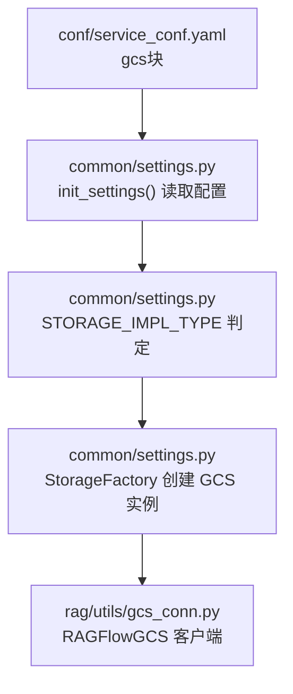
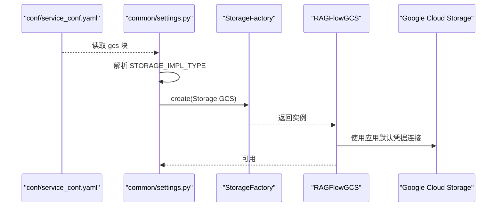
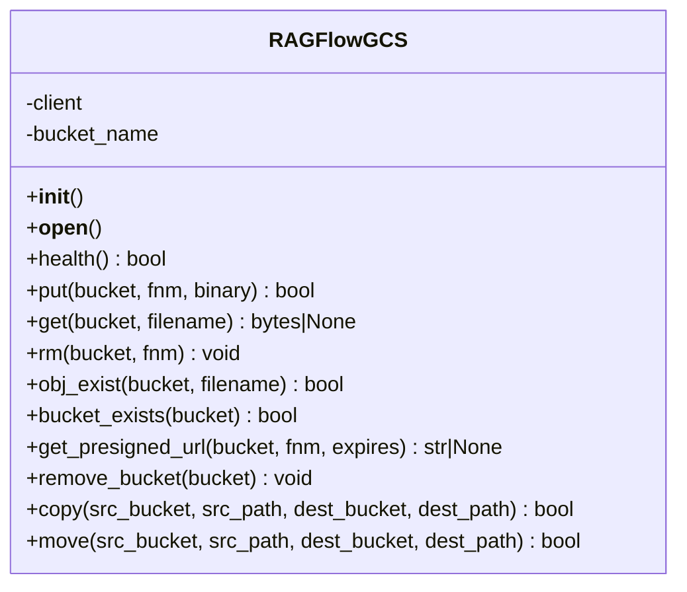

# Google Cloud Storage配置

<cite>
**本文引用的文件**
- [conf/service_conf.yaml](file://conf/service_conf.yaml)
- [common/settings.py](file://common/settings.py)
- [rag/utils/gcs_conn.py](file://rag/utils/gcs_conn.py)
- [common/data_source/google_util/util.py](file://common/data_source/google_util/util.py)
- [common/data_source/google_util/auth.py](file://common/data_source/google_util/auth.py)
- [common/data_source/blob_connector.py](file://common/data_source/blob_connector.py)
- [docker/service_conf.yaml.template](file://docker/service_conf.yaml.template)
</cite>

## 目录
1. [简介](#简介)
2. [项目结构与入口](#项目结构与入口)
3. [核心组件](#核心组件)
4. [架构总览](#架构总览)
5. [详细组件分析](#详细组件分析)
6. [依赖关系分析](#依赖关系分析)
7. [性能与可用性考虑](#性能与可用性考虑)
8. [故障排查指南](#故障排查指南)
9. [结论](#结论)
10. [附录：GCS配置清单与最佳实践](#附录gcs配置清单与最佳实践)

## 简介
本指南面向在RAGFlow中使用Google Cloud Storage（GCS）作为统一对象存储后端的用户，围绕/conf/service_conf.yaml中的gcs块进行配置说明，并结合运行时settings加载逻辑、GCS客户端封装以及认证方式，给出从“如何配置”到“如何验证”的完整路径。同时，针对服务账号密钥文件、统一存储桶级与精细访问控制（IAM）策略、跨地域复制与生命周期管理等运维主题，提供可操作的参考建议，帮助在保证安全的前提下优化成本与可用性。

## 项目结构与入口
- 配置入口位于 conf/service_conf.yaml 中的 gcs 块，用于声明GCS相关参数。
- 运行时通过 common/settings.py 的初始化流程读取该配置，并根据 STORAGE_IMPL_TYPE 决定是否启用GCS实现。
- 对象存储的具体能力由 rag/utils/gcs_conn.py 提供，包含上传、下载、删除、存在性检查、预签名URL生成、虚拟桶清理、复制与移动等方法。

图表来源
- [conf/service_conf.yaml](file://conf/service_conf.yaml#L63-L82)
- [common/settings.py](file://common/settings.py#L259-L273)
- [rag/utils/gcs_conn.py](file://rag/utils/gcs_conn.py#L26-L45)

章节来源
- [conf/service_conf.yaml](file://conf/service_conf.yaml#L63-L82)
- [common/settings.py](file://common/settings.py#L259-L273)

## 核心组件
- GCS配置块（conf/service_conf.yaml）
  - 当前仓库模板中 gcs 块被注释，需按需取消注释并填写参数。
  - 关键参数：
    - bucket：统一主存储桶名称（系统会以此桶为根进行虚拟子桶/目录组织）。
    - 其他字段（如project_id、credentials_path）在当前模板未出现，但后续可按需扩展。
- 运行时配置加载（common/settings.py）
  - 依据 STORAGE_IMPL_TYPE 选择存储实现；当为 GCS 时，读取 conf/service_conf.yaml 中的 gcs 块并赋值至 GCS 变量。
- GCS客户端封装（rag/utils/gcs_conn.py）
  - 单例客户端，基于 google-cloud-storage SDK。
  - 主要能力：健康检查、上传、下载、删除、存在性检查、预签名URL、虚拟桶清理、复制与移动。
  - 认证方式：默认使用应用默认凭据（Application Default Credentials），无需显式传入密钥文件路径。

章节来源
- [conf/service_conf.yaml](file://conf/service_conf.yaml#L63-L82)
- [common/settings.py](file://common/settings.py#L259-L273)
- [rag/utils/gcs_conn.py](file://rag/utils/gcs_conn.py#L26-L45)

## 架构总览
下图展示了从配置到运行时GCS客户端的调用链路，以及认证与权限的关系。

图表来源
- [conf/service_conf.yaml](file://conf/service_conf.yaml#L63-L82)
- [common/settings.py](file://common/settings.py#L149-L163)
- [rag/utils/gcs_conn.py](file://rag/utils/gcs_conn.py#L26-L45)

## 详细组件分析

### 组件一：conf/service_conf.yaml 中的 gcs 块
- 作用：声明GCS统一存储桶名称（bucket），作为系统所有数据的根容器。
- 当前状态：模板中 gcs 块被注释，需手动取消注释并填写 bucket 名称。
- 扩展建议：若需要显式指定服务账号密钥文件路径或项目ID，可在后续版本中新增 credentials_path、project_id 等字段，并在 settings 初始化时读取。

章节来源
- [conf/service_conf.yaml](file://conf/service_conf.yaml#L63-L82)

### 组件二：common/settings.py 中的GCS配置加载
- 关键点：
  - 通过 get_base_config("gcs", {}) 读取 conf/service_conf.yaml 中的 gcs 块。
  - 将其赋值给全局变量 GCS，供后续模块使用。
  - STORAGE_IMPL_TYPE 控制是否启用 GCS 实现；当为 GCS 时，创建 RAGFlowGCS 实例。
- 影响范围：影响对象存储实现的选择与初始化。

章节来源
- [common/settings.py](file://common/settings.py#L259-L273)

### 组件三：rag/utils/gcs_conn.py 中的RAGFlowGCS客户端
- 认证与连接：
  - 默认使用 Application Default Credentials（ADC），无需显式传入密钥文件路径。
  - 通过 storage.Client() 获取客户端，bucket_name 来自 settings.GCS["bucket"]。
- 能力概览：
  - 健康检查：上传健康检查文件，验证桶存在与写入能力。
  - 文件操作：put/get/rm/exists。
  - 预签名URL：生成带过期时间的临时访问链接。
  - 虚拟桶清理：按前缀批量删除。
  - 复制与移动：在同一存储桶内复制/移动对象。
- 错误处理：对常见异常进行捕获与重试/降级处理（例如连接失败后的重建尝试）。

图表来源
- [rag/utils/gcs_conn.py](file://rag/utils/gcs_conn.py#L26-L207)

章节来源
- [rag/utils/gcs_conn.py](file://rag/utils/gcs_conn.py#L26-L207)

### 组件四：认证与权限（服务账号与OAuth）
- 服务账号密钥文件（JSON）：
  - 通常通过环境变量 GOOGLE_APPLICATION_CREDENTIALS 指向服务账号密钥文件路径，使 ADC 自动生效。
  - 在当前代码中，RAGFlowGCS直接使用 storage.Client()，默认走ADC；无需在 conf/service_conf.yaml 显式声明 credentials_path。
- OAuth令牌（适用于其他Google服务场景）：
  - 仓库中存在Google OAuth工具链（用于Google Drive/Gmail），可作为参考理解OAuth令牌的获取与持久化方式。
  - 本项目GCS对象存储实现默认使用ADC，不强制要求OAuth令牌。

章节来源
- [rag/utils/gcs_conn.py](file://rag/utils/gcs_conn.py#L26-L45)
- [common/data_source/google_util/util.py](file://common/data_source/google_util/util.py#L160-L192)
- [common/data_source/google_util/auth.py](file://common/data_source/google_util/auth.py#L37-L127)

### 组件五：统一存储桶级与精细访问控制（IAM）策略
- 统一存储桶级策略：
  - 在GCS侧为统一主存储桶设置访问控制，限制对桶内所有对象的读写权限。
  - 推荐最小权限原则：仅授予必要角色（如 Storage Object Viewer/Creator/Editor）。
- 精细访问控制（IAM）：
  - 可针对特定对象前缀或标签设置条件策略，实现更细粒度的访问控制。
  - 结合预签名URL使用场景，可通过缩短过期时间与限定HTTP方法降低风险。
- 与RAGFlow的关系：
  - RAGFlow通过ADC访问GCS，因此需确保运行环境的服务账号具备相应IAM权限。
  - 若部署于非GCP环境（如Kubernetes），可通过挂载服务账号密钥文件或使用Workload Identity等方式注入ADC。

章节来源
- [rag/utils/gcs_conn.py](file://rag/utils/gcs_conn.py#L26-L45)

### 组件六：跨地域复制与生命周期管理（成本优化）
- 跨地域复制：
  - 在GCS侧为统一主存储桶配置跨区域/多区域复制，提升可用性与容灾能力。
  - 建议将热数据置于高性能区域，冷数据迁移至标准/近线/归档存储类别。
- 生命周期管理：
  - 通过生命周期规则自动转换对象存储类别（如从热到冷），或在达到保留期限后删除对象。
  - 结合RAGFlow的预签名URL与虚拟桶清理能力，可实现“冷热分层+自动清理”的成本优化方案。
- 注意事项：
  - 复制与生命周期规则的配置在GCS侧完成，RAGFlow无需额外改动。
  - 规则变更可能影响现有对象的访问行为，请在低峰期执行。

章节来源
- [rag/utils/gcs_conn.py](file://rag/utils/gcs_conn.py#L136-L158)

## 依赖关系分析
- 配置依赖：conf/service_conf.yaml 的 gcs 块依赖 common/settings.py 的 init_settings 流程。
- 实现依赖：RAGFlowGCS 依赖 google-cloud-storage SDK 与 ADC。
- 认证依赖：服务账号密钥文件通过环境变量注入ADC；OAuth工具链存在于其他Google服务模块中，不影响GCS对象存储实现。

图表来源
- [conf/service_conf.yaml](file://conf/service_conf.yaml#L63-L82)
- [common/settings.py](file://common/settings.py#L259-L273)
- [rag/utils/gcs_conn.py](file://rag/utils/gcs_conn.py#L26-L45)

章节来源
- [conf/service_conf.yaml](file://conf/service_conf.yaml#L63-L82)
- [common/settings.py](file://common/settings.py#L259-L273)
- [rag/utils/gcs_conn.py](file://rag/utils/gcs_conn.py#L26-L45)

## 性能与可用性考虑
- 连接与重试：
  - RAGFlowGCS在部分操作中包含有限重试与重建客户端的逻辑，有助于应对瞬时网络波动。
- 预签名URL：
  - 通过生成短期有效的URL，减少服务端直连压力，提高并发吞吐。
- 存储类别与复制：
  - 合理选择存储类别与开启跨区域复制，可平衡延迟、成本与可用性。
- 生命周期管理：
  - 自动化冷热分层与过期清理，显著降低长期存储成本。

章节来源
- [rag/utils/gcs_conn.py](file://rag/utils/gcs_conn.py#L76-L114)
- [rag/utils/gcs_conn.py](file://rag/utils/gcs_conn.py#L136-L158)

## 故障排查指南
- 无法连接GCS
  - 检查运行环境是否正确注入ADC（如 GOOGLE_APPLICATION_CREDENTIALS 或Workload Identity）。
  - 确认 conf/service_conf.yaml 中已取消注释并填写正确的 bucket 名称。
- 上传/下载失败
  - 查看日志中是否存在 NotFound 异常（桶不存在或对象不存在）。
  - 检查IAM权限是否允许写入/读取目标桶或对象。
- 预签名URL无效
  - 确认过期时间参数类型与范围；检查生成URL的HTTP方法与权限。
- 虚拟桶清理失败
  - 确认前缀匹配是否正确；检查是否有足够权限批量删除对象。

章节来源
- [rag/utils/gcs_conn.py](file://rag/utils/gcs_conn.py#L76-L114)
- [rag/utils/gcs_conn.py](file://rag/utils/gcs_conn.py#L136-L158)
- [rag/utils/gcs_conn.py](file://rag/utils/gcs_conn.py#L160-L172)

## 结论
- 当前仓库中，GCS对象存储通过ADC默认认证，无需在 conf/service_conf.yaml 中显式声明 credentials_path。
- 配置重点在于统一主存储桶名称（bucket），并确保运行环境具备相应IAM权限。
- 成本优化与可用性提升可通过GCS侧的跨区域复制与生命周期管理策略配合RAGFlow的预签名URL与虚拟桶清理能力共同实现。

## 附录：GCS配置清单与最佳实践

### 配置清单（基于当前仓库现状）
- conf/service_conf.yaml
  - 取消注释 gcs 块并填写 bucket 字段（统一主存储桶名称）。
  - 如需扩展，可在后续版本新增 credentials_path、project_id 等字段，并在 settings 初始化时读取。
- common/settings.py
  - 确保 STORAGE_IMPL_TYPE 设置为 GCS，以便启用 RAGFlowGCS 实现。
- 运行环境
  - 通过环境变量 GOOGLE_APPLICATION_CREDENTIALS 指向服务账号密钥文件，或使用Workload Identity等机制注入ADC。
  - 确保服务账号具备对统一主存储桶的读写权限。

章节来源
- [conf/service_conf.yaml](file://conf/service_conf.yaml#L63-L82)
- [common/settings.py](file://common/settings.py#L259-L273)
- [rag/utils/gcs_conn.py](file://rag/utils/gcs_conn.py#L26-L45)

### 最佳实践
- 服务账号密钥文件
  - 使用最小权限原则，仅授予必要的GCS角色。
  - 定期轮换密钥，避免长期暴露。
- 统一存储桶级与精细访问控制（IAM）
  - 在桶级别设置基础访问控制，在对象前缀/标签层面细化权限。
  - 与预签名URL结合时，严格控制过期时间与HTTP方法。
- 跨地域复制与生命周期管理
  - 热数据放高性能区域，冷数据自动迁移到标准/近线/归档类别。
  - 设置合理的保留期限与自动清理规则，降低长期存储成本。
- 验证与监控
  - 使用健康检查接口验证桶存在与写入能力。
  - 结合日志与监控告警，及时发现权限、配额与网络问题。

章节来源
- [rag/utils/gcs_conn.py](file://rag/utils/gcs_conn.py#L52-L66)
- [common/data_source/google_util/util.py](file://common/data_source/google_util/util.py#L160-L192)
- [common/data_source/google_util/auth.py](file://common/data_source/google_util/auth.py#L37-L127)