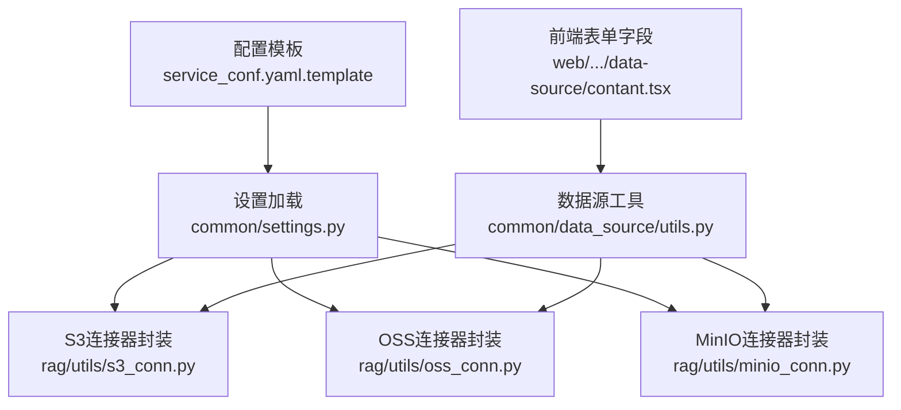
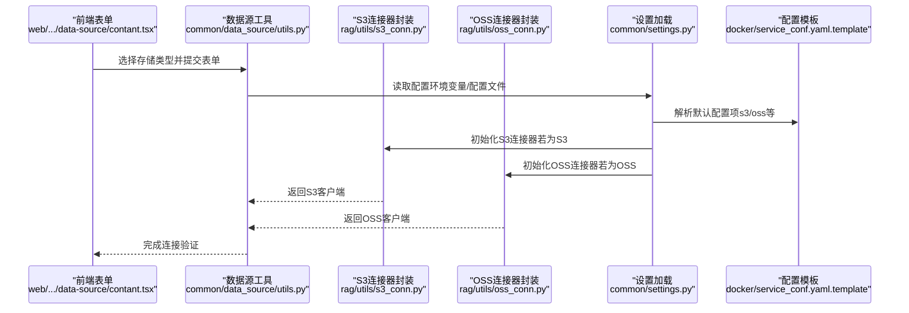
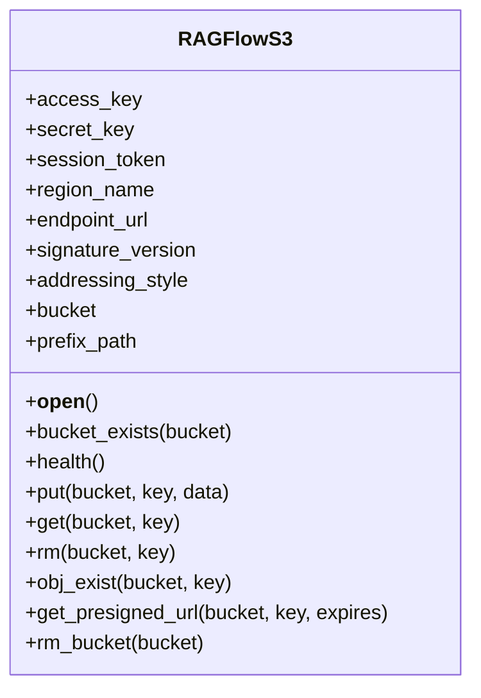
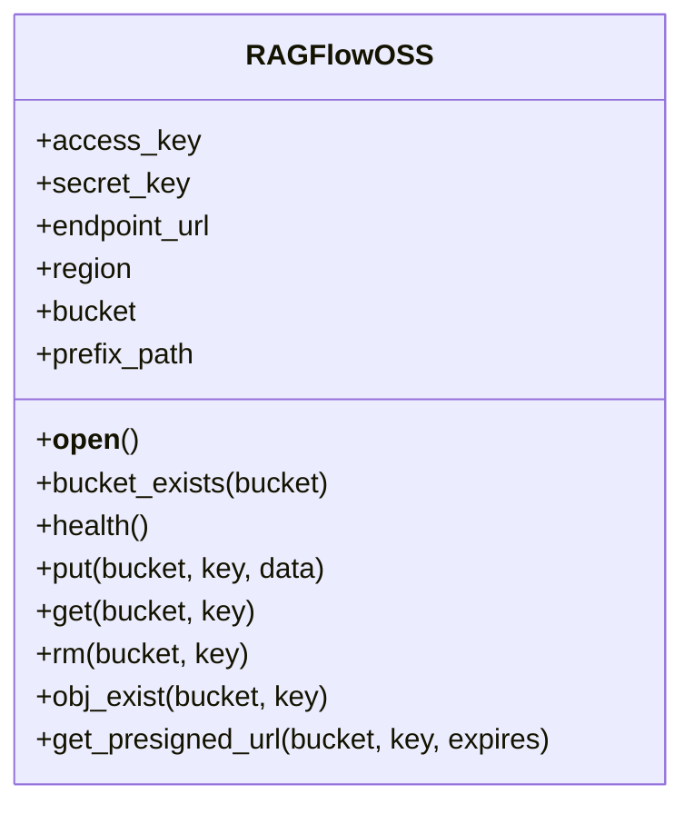
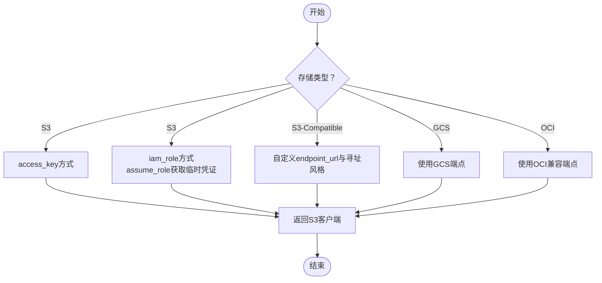
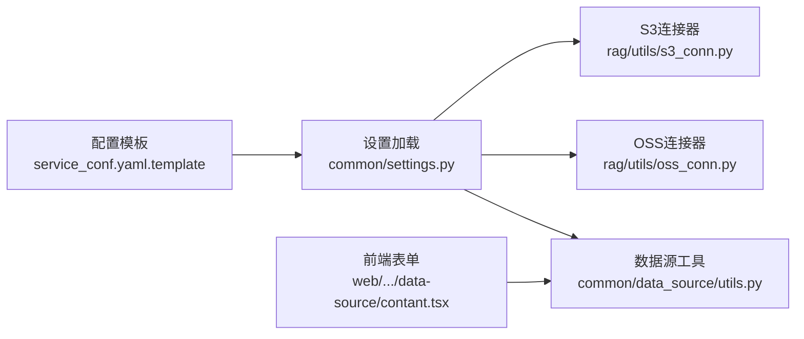

# S3兼容服务配置

<cite>
**本文引用的文件**
- [docker/README.md](file://docker/README.md)
- [docker/service_conf.yaml.template](file://docker/service_conf.yaml.template)
- [common/settings.py](file://common/settings.py)
- [common/data_source/utils.py](file://common/data_source/utils.py)
- [common/data_source/config.py](file://common/data_source/config.py)
- [rag/utils/s3_conn.py](file://rag/utils/s3_conn.py)
- [rag/utils/oss_conn.py](file://rag/utils/oss_conn.py)
- [rag/utils/minio_conn.py](file://rag/utils/minio_conn.py)
- [web/src/pages/user-setting/data-source/contant.tsx](file://web/src/pages/user-setting/data-source/contant.tsx)
</cite>

## 目录
1. [简介](#简介)
2. [项目结构与定位](#项目结构与定位)
3. [核心组件](#核心组件)
4. [架构总览](#架构总览)
5. [详细组件分析](#详细组件分析)
6. [依赖关系分析](#依赖关系分析)
7. [性能与成本优化建议](#性能与成本优化建议)
8. [故障排查指南](#故障排查指南)
9. [结论](#结论)
10. [附录：配置清单与最佳实践](#附录配置清单与最佳实践)

## 简介
本指南面向需要在系统中使用S3兼容对象存储（包括AWS S3、阿里云OSS、腾讯云COS等）的用户，提供从配置项到运行时行为的完整说明。内容涵盖：
- 如何配置 access_key、secret_key、endpoint_url、bucket、region、signature_version、addressing_style 等关键参数
- 如何通过 IAM 角色或环境变量进行凭证管理
- 跨区域存储桶访问、传输加密与成本优化的实践建议
- 前端表单字段与后端连接器的映射关系

## 项目结构与定位
本项目通过统一的设置加载机制与数据源工具函数，支持多种对象存储后端（S3、OSS、MinIO、GCS等）。S3兼容能力由以下模块协同实现：
- 配置模板与文档：用于定义可选的S3/OSS配置项及默认值
- 设置加载：根据环境变量与配置文件动态注入S3/OSS等配置
- 连接器封装：对 boto3 客户端进行统一封装，支持签名版本、寻址风格、前缀路径等
- 数据源工具：按存储类型创建客户端，支持S3、R2、GCS、OCI以及S3兼容服务

图表来源
- [docker/service_conf.yaml.template](file://docker/service_conf.yaml.template#L57-L83)
- [common/settings.py](file://common/settings.py#L259-L272)
- [rag/utils/s3_conn.py](file://rag/utils/s3_conn.py#L27-L41)
- [rag/utils/oss_conn.py](file://rag/utils/oss_conn.py#L26-L37)
- [rag/utils/minio_conn.py](file://rag/utils/minio_conn.py#L27-L46)
- [common/data_source/utils.py](file://common/data_source/utils.py#L239-L327)
- [web/src/pages/user-setting/data-source/contant.tsx](file://web/src/pages/user-setting/data-source/contant.tsx#L104-L148)

章节来源
- [docker/service_conf.yaml.template](file://docker/service_conf.yaml.template#L57-L83)
- [common/settings.py](file://common/settings.py#L259-L272)

## 核心组件
- S3连接器封装（RAGFlowS3）
  - 支持 access_key、secret_key、session_token、region_name、endpoint_url、signature_version、addressing_style、bucket、prefix_path
  - 使用 boto3.client 创建S3客户端，并通过 Config 对签名版本与寻址风格进行配置
- OSS连接器封装（RAGFlowOSS）
  - 支持 access_key、secret_key、endpoint_url、region、bucket、prefix_path
  - 默认使用 virtual-hosted 风格与 v4 签名
- 数据源工具（create_s3_client）
  - 按存储类型创建客户端，支持 S3、R2、GCS、OCI、S3-Compatible
  - 支持通过 IAM 角色临时凭证刷新
- 前端表单字段
  - 提供 S3/OSS/R2/GCS/OCI/S3-Compatible 的表单项，含寻址风格选择

章节来源
- [rag/utils/s3_conn.py](file://rag/utils/s3_conn.py#L27-L41)
- [rag/utils/oss_conn.py](file://rag/utils/oss_conn.py#L26-L37)
- [common/data_source/utils.py](file://common/data_source/utils.py#L239-L327)
- [web/src/pages/user-setting/data-source/contant.tsx](file://web/src/pages/user-setting/data-source/contant.tsx#L104-L148)

## 架构总览
下图展示从配置到连接器再到数据源工具的整体流程，以及与前端表单的关系。

图表来源
- [web/src/pages/user-setting/data-source/contant.tsx](file://web/src/pages/user-setting/data-source/contant.tsx#L104-L148)
- [common/data_source/utils.py](file://common/data_source/utils.py#L239-L327)
- [common/settings.py](file://common/settings.py#L259-L272)
- [docker/service_conf.yaml.template](file://docker/service_conf.yaml.template#L57-L83)

## 详细组件分析

### S3连接器封装（RAGFlowS3）
- 关键配置项
  - access_key、secret_key、session_token：用于身份认证
  - region_name：指定区域，影响请求路由与签名
  - endpoint_url：S3兼容服务端点（当使用非AWS S3时必填）
  - signature_version：签名版本（如 v4），用于兼容不同服务端点
  - addressing_style：寻址风格（virtual/path），用于兼容不同服务端点
  - bucket、prefix_path：默认桶与前缀路径，便于组织对象
- 运行时行为
  - 构造 boto3.client 时，将上述参数传入
  - 若未显式提供 AK/SK，boto3 将尝试其他凭证来源（如环境变量、EC2实例元数据、容器身份等）
  - 支持健康检查、上传/下载/删除/存在性检测、预签名URL生成等操作
- 错误处理
  - 连接失败会记录异常日志
  - 对于403/401/404等错误进行分类处理，便于定位权限、凭证或桶不存在等问题

图表来源
- [rag/utils/s3_conn.py](file://rag/utils/s3_conn.py#L27-L41)
- [rag/utils/s3_conn.py](file://rag/utils/s3_conn.py#L62-L100)
- [rag/utils/s3_conn.py](file://rag/utils/s3_conn.py#L102-L210)

章节来源
- [rag/utils/s3_conn.py](file://rag/utils/s3_conn.py#L27-L41)
- [rag/utils/s3_conn.py](file://rag/utils/s3_conn.py#L62-L100)
- [rag/utils/s3_conn.py](file://rag/utils/s3_conn.py#L102-L210)

### OSS连接器封装（RAGFlowOSS）
- 关键配置项
  - access_key、secret_key、endpoint_url、region、bucket、prefix_path
- 运行时行为
  - 默认使用 virtual-hosted 风格与 v4 签名
  - 其他能力与S3类似（健康检查、上传/下载/删除/存在性检测、预签名URL）

图表来源
- [rag/utils/oss_conn.py](file://rag/utils/oss_conn.py#L26-L37)
- [rag/utils/oss_conn.py](file://rag/utils/oss_conn.py#L55-L77)
- [rag/utils/oss_conn.py](file://rag/utils/oss_conn.py#L79-L175)

章节来源
- [rag/utils/oss_conn.py](file://rag/utils/oss_conn.py#L26-L37)
- [rag/utils/oss_conn.py](file://rag/utils/oss_conn.py#L55-L77)
- [rag/utils/oss_conn.py](file://rag/utils/oss_conn.py#L79-L175)

### 数据源工具（create_s3_client）
- 支持的存储类型
  - S3、R2、Google Cloud Storage、OCI Storage、S3-Compatible
- 凭证与角色
  - S3：支持 access_key 方式与 iam_role 方式；iam_role 通过 assume_role 获取临时凭证并自动刷新
  - S3-Compatible：支持自定义 endpoint_url 与寻址风格
- 区域检测
  - 可通过 head_bucket 获取桶所在区域，便于后续跨区域访问

图表来源
- [common/data_source/utils.py](file://common/data_source/utils.py#L239-L327)

章节来源
- [common/data_source/utils.py](file://common/data_source/utils.py#L239-L327)

### 前端表单字段与后端映射
- 表单字段覆盖 S3、R2、GCS、OCI、S3-Compatible 等类型
- 地址寻址风格支持 virtual 与 path 两种
- 与 create_s3_client 的 credentials 字段保持一致

章节来源
- [web/src/pages/user-setting/data-source/contant.tsx](file://web/src/pages/user-setting/data-source/contant.tsx#L104-L148)

## 依赖关系分析
- 配置来源
  - docker/service_conf.yaml.template 中定义了 s3 与 oss 的可选配置项与默认注释
  - common/settings.py 在启动时读取配置并注入到 S3/OSS 等全局配置字典
- 运行时依赖
  - RAGFlowS3/RAGFlowOSS 依赖 boto3 客户端
  - 数据源工具依赖 boto3 与 botocore 的 Config、RefreshableCredentials 等能力
- 前后端映射
  - 前端表单字段与后端 create_s3_client 的 credentials 字段一一对应

图表来源
- [docker/service_conf.yaml.template](file://docker/service_conf.yaml.template#L57-L83)
- [common/settings.py](file://common/settings.py#L259-L272)
- [rag/utils/s3_conn.py](file://rag/utils/s3_conn.py#L27-L41)
- [rag/utils/oss_conn.py](file://rag/utils/oss_conn.py#L26-L37)
- [common/data_source/utils.py](file://common/data_source/utils.py#L239-L327)
- [web/src/pages/user-setting/data-source/contant.tsx](file://web/src/pages/user-setting/data-source/contant.tsx#L104-L148)

章节来源
- [docker/service_conf.yaml.template](file://docker/service_conf.yaml.template#L57-L83)
- [common/settings.py](file://common/settings.py#L259-L272)

## 性能与成本优化建议
- 传输加密
  - 建议始终使用 HTTPS 端点（endpoint_url 以 https:// 开头），确保传输加密
- 寻址风格
  - S3-Compatible 服务通常推荐使用 virtual-hosted 风格，以减少路径冲突与兼容性问题
- 区域就近
  - 优先选择与应用服务器同区域的桶，降低延迟与带宽成本
- 前缀路径
  - 使用 prefix_path 对对象进行逻辑分层，便于管理与清理
- 大文件与流式处理
  - 对大对象采用流式读取与分块策略，避免一次性加载导致内存压力
- 预签名URL
  - 对外分享场景使用预签名URL，避免暴露长期凭证

[本节为通用建议，不直接分析具体文件]

## 故障排查指南
- 常见错误与定位
  - 认证失败（403/401/签名不匹配）：检查 access_key/secret_key 是否正确、是否过期、是否具备相应权限
  - 桶不存在（404/NoSuchBucket）：确认桶名称拼写与区域设置
  - 权限不足（AccessDenied）：检查桶策略与IAM策略
- 日志与重试
  - 连接器内部包含异常日志记录与有限次重试逻辑，便于快速定位问题
- 角色与临时凭证
  - 使用 iam_role 时，确认 assume_role 权限与角色信任策略配置正确

章节来源
- [rag/utils/s3_conn.py](file://rag/utils/s3_conn.py#L102-L210)
- [common/data_source/utils.py](file://common/data_source/utils.py#L239-L327)

## 结论
本项目通过统一的配置加载、连接器封装与数据源工具，实现了对S3兼容对象存储的灵活接入。结合前端表单与后端工具链，用户可以便捷地完成凭证配置、区域与寻址风格选择，并在生产环境中实现安全、稳定与低成本的对象存储访问。

[本节为总结，不直接分析具体文件]

## 附录：配置清单与最佳实践

- S3/OSS 配置项清单
  - access_key、secret_key：凭证
  - session_token：可选，用于临时凭证
  - region_name/region：区域
  - endpoint_url：S3兼容端点（非AWS S3时必填）
  - bucket：桶名
  - prefix_path：可选，对象前缀
  - signature_version：可选，默认 v4
  - addressing_style：可选，virtual 或 path
- 配置来源
  - docker/service_conf.yaml.template 中提供了 s3 与 oss 的示例与注释
  - common/settings.py 在启动时读取配置并注入到全局配置字典
- 凭证管理最佳实践
  - 优先使用 IAM 角色（iam_role）与 assume_role 获取临时凭证，避免长期密钥泄露风险
  - 通过环境变量注入敏感信息，避免硬编码在代码或配置文件中
- 跨区域访问
  - 使用数据源工具的区域检测能力，或在创建客户端时明确 region_name
- 传输加密
  - 确保 endpoint_url 使用 https 协议
- 成本优化
  - 合理使用前缀路径与生命周期策略
  - 对大文件采用分块与流式处理
  - 使用预签名URL进行对外分享

章节来源
- [docker/service_conf.yaml.template](file://docker/service_conf.yaml.template#L57-L83)
- [common/settings.py](file://common/settings.py#L259-L272)
- [common/data_source/utils.py](file://common/data_source/utils.py#L239-L327)
- [rag/utils/s3_conn.py](file://rag/utils/s3_conn.py#L62-L100)
- [rag/utils/oss_conn.py](file://rag/utils/oss_conn.py#L55-L77)