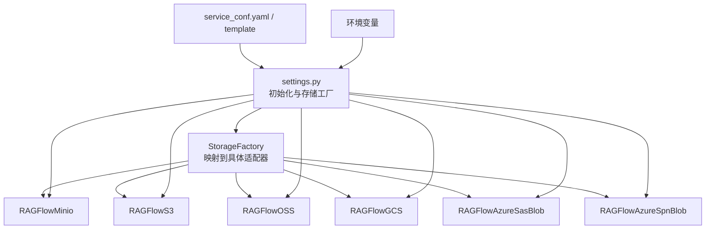
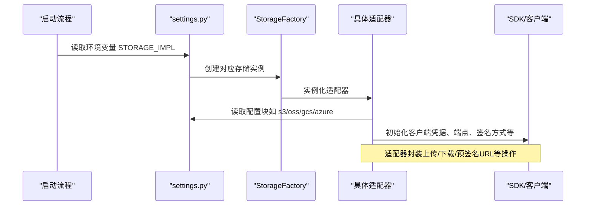
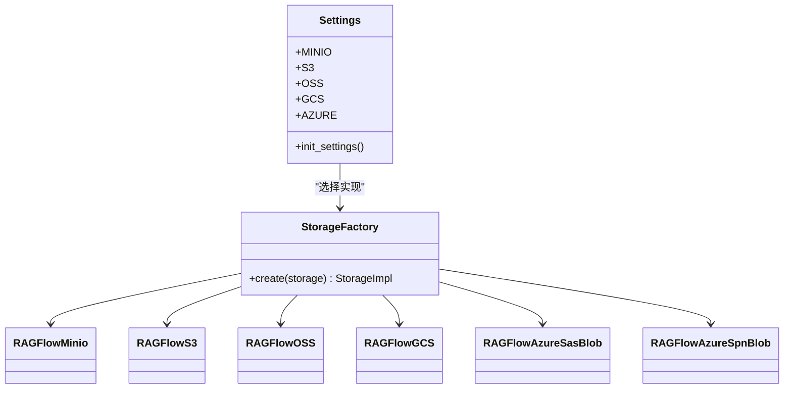

# 对象存储配置

<cite>
**本文引用的文件**
- [conf/service_conf.yaml](file://conf/service_conf.yaml)
- [docker/service_conf.yaml.template](file://docker/service_conf.yaml.template)
- [common/settings.py](file://common/settings.py)
- [common/config_utils.py](file://common/config_utils.py)
- [rag/utils/minio_conn.py](file://rag/utils/minio_conn.py)
- [rag/utils/s3_conn.py](file://rag/utils/s3_conn.py)
- [rag/utils/oss_conn.py](file://rag/utils/oss_conn.py)
- [rag/utils/gcs_conn.py](file://rag/utils/gcs_conn.py)
- [rag/utils/azure_sas_conn.py](file://rag/utils/azure_sas_conn.py)
- [rag/utils/azure_spn_conn.py](file://rag/utils/azure_spn_conn.py)
- [common/data_source/blob_connector.py](file://common/data_source/blob_connector.py)
- [common/data_source/utils.py](file://common/data_source/utils.py)
- [web/src/pages/user-setting/data-source/contant.tsx](file://web/src/pages/user-setting/data-source/contant.tsx)
- [docker/README.md](file://docker/README.md)
</cite>

## 目录
1. [简介](#简介)
2. [项目结构与对象存储相关模块](#项目结构与对象存储相关模块)
3. [核心组件与配置项总览](#核心组件与配置项总览)
4. [架构概览](#架构概览)
5. [详细组件分析](#详细组件分析)
6. [依赖关系分析](#依赖关系分析)
7. [性能与成本考量](#性能与成本考量)
8. [故障排查指南](#故障排查指南)
9. [结论](#结论)
10. [附录：Docker 环境变量与最佳实践](#附录docker-环境变量与最佳实践)

## 简介
本指南面向需要在 RAGFlow 中配置对象存储（MinIO、S3、阿里云 OSS、Google Cloud Storage、Azure Blob Storage）的用户与运维人员。内容涵盖：
- 在配置文件中如何为各对象存储服务设置参数（如 access_key、secret_key、endpoint_url、bucket 等）
- 在 Docker 部署中通过环境变量安全地注入密钥与端点
- 各对象存储服务的优缺点与成本考量
- 跨区域访问与权限管理的最佳实践

## 项目结构与对象存储相关模块
RAGFlow 的对象存储能力由统一的存储工厂与各后端适配器构成：
- 存储工厂与类型映射：根据环境变量选择具体存储实现
- 各存储适配器：分别封装 MinIO、S3、OSS、GCS、Azure 的客户端初始化、健康检查、上传下载、预签名 URL 生成等操作
- 配置加载：从 YAML 配置文件与环境变量中读取参数，并在运行时注入到适配器

图表来源
- [common/settings.py](file://common/settings.py#L149-L168)
- [rag/utils/minio_conn.py](file://rag/utils/minio_conn.py#L1-L178)
- [rag/utils/s3_conn.py](file://rag/utils/s3_conn.py#L1-L210)
- [rag/utils/oss_conn.py](file://rag/utils/oss_conn.py#L1-L175)
- [rag/utils/gcs_conn.py](file://rag/utils/gcs_conn.py#L1-L207)
- [rag/utils/azure_sas_conn.py](file://rag/utils/azure_sas_conn.py#L1-L96)
- [rag/utils/azure_spn_conn.py](file://rag/utils/azure_spn_conn.py#L1-L107)

章节来源
- [common/settings.py](file://common/settings.py#L149-L168)
- [conf/service_conf.yaml](file://conf/service_conf.yaml#L15-L82)
- [docker/service_conf.yaml.template](file://docker/service_conf.yaml.template#L16-L83)

## 核心组件与配置项总览
- 存储实现类型选择
  - 通过环境变量 STORAGE_IMPL 控制，默认值为 MINIO；可选值包括 AWS_S3、OSS、GCS、AZURE_SAS、AZURE_SPN 等
- 配置文件中的对象存储块
  - minio：包含 user、password、host
  - s3：包含 access_key、secret_key、region、endpoint_url、bucket、prefix_path、signature_version、addressing_style
  - oss：包含 access_key、secret_key、endpoint_url、region、bucket、prefix_path
  - gcs：包含 bucket
  - azure：包含 auth_type、container_url/sas_token 或 account_url、client_id、secret、tenant_id、container_name
- Docker 模板中的环境变量
  - MINIO_USER、MINIO_PASSWORD、MINIO_HOST
  - ACCESS_KEY、SECRET_KEY、ENDPOINT、REGION、BUCKET、OSS_PREFIX_PATH
  - SAS_TOKEN、CONTAINER_URL、ACCOUNT_URL、CLIENT_ID、TENANT_ID
  - TENCENT_SECRET_ID、TENCENT_SECRET_KEY、TENCENT_REGION（用于其他云服务）

章节来源
- [common/settings.py](file://common/settings.py#L121-L122)
- [conf/service_conf.yaml](file://conf/service_conf.yaml#L15-L82)
- [docker/service_conf.yaml.template](file://docker/service_conf.yaml.template#L16-L83)

## 架构概览
RAGFlow 在启动时根据 STORAGE_IMPL 选择对应的存储适配器，并从配置文件或环境变量中读取相应参数，完成客户端初始化。上传/下载/预签名 URL 等操作通过适配器调用底层 SDK 完成。

图表来源
- [common/settings.py](file://common/settings.py#L149-L168)
- [common/settings.py](file://common/settings.py#L259-L273)
- [rag/utils/s3_conn.py](file://rag/utils/s3_conn.py#L62-L97)
- [rag/utils/oss_conn.py](file://rag/utils/oss_conn.py#L55-L74)
- [rag/utils/gcs_conn.py](file://rag/utils/gcs_conn.py#L33-L45)
- [rag/utils/azure_sas_conn.py](file://rag/utils/azure_sas_conn.py#L26-L45)
- [rag/utils/azure_spn_conn.py](file://rag/utils/azure_spn_conn.py#L26-L49)

## 详细组件分析

### MinIO 配置与使用
- 配置块（YAML）
  - minio.user、minio.password、minio.host
- 运行时参数来源
  - settings.MINIO 来自解密后的数据库配置（在 MINIO 类型下）
- 关键能力
  - 健康检查、桶存在性判断、对象存在性、上传/删除/下载、预签名 URL、复制/移动、删除桶
- Docker 环境变量
  - MINIO_USER、MINIO_PASSWORD、MINIO_HOST

章节来源
- [conf/service_conf.yaml](file://conf/service_conf.yaml#L15-L20)
- [common/settings.py](file://common/settings.py#L265-L265)
- [rag/utils/minio_conn.py](file://rag/utils/minio_conn.py#L40-L63)
- [rag/utils/minio_conn.py](file://rag/utils/minio_conn.py#L64-L111)
- [rag/utils/minio_conn.py](file://rag/utils/minio_conn.py#L125-L134)
- [docker/service_conf.yaml.template](file://docker/service_conf.yaml.template#L16-L20)

### S3 配置与使用
- 配置块（YAML）
  - s3.access_key、s3.secret_key、s3.region、s3.endpoint_url、s3.bucket、s3.prefix_path、s3.signature_version、s3.addressing_style
- 运行时参数来源
  - settings.S3
- 关键能力
  - 桶/对象存在性检测、上传/删除/下载、预签名 URL、默认桶与前缀路径支持
- 认证方式
  - 支持通过 access_key/secret_key 或 IAM 角色（在数据源连接器中体现）
- Docker 环境变量
  - ACCESS_KEY、SECRET_KEY、ENDPOINT、REGION、BUCKET、OSS_PREFIX_PATH

章节来源
- [conf/service_conf.yaml](file://conf/service_conf.yaml#L57-L66)
- [docker/service_conf.yaml.template](file://docker/service_conf.yaml.template#L57-L73)
- [common/data_source/blob_connector.py](file://common/data_source/blob_connector.py#L83-L110)
- [common/data_source/utils.py](file://common/data_source/utils.py#L254-L315)
- [rag/utils/s3_conn.py](file://rag/utils/s3_conn.py#L30-L41)
- [rag/utils/s3_conn.py](file://rag/utils/s3_conn.py#L62-L97)
- [rag/utils/s3_conn.py](file://rag/utils/s3_conn.py#L130-L146)
- [rag/utils/s3_conn.py](file://rag/utils/s3_conn.py#L183-L196)

### 阿里云 OSS 配置与使用
- 配置块（YAML）
  - oss.access_key、oss.secret_key、oss.endpoint_url、oss.region、oss.bucket、oss.prefix_path
- 运行时参数来源
  - settings.OSS
- 关键能力
  - 桶/对象存在性检测、上传/删除/下载、预签名 URL、默认桶与前缀路径支持
- Docker 环境变量
  - ACCESS_KEY、SECRET_KEY、ENDPOINT、REGION、BUCKET、OSS_PREFIX_PATH

章节来源
- [conf/service_conf.yaml](file://conf/service_conf.yaml#L63-L71)
- [docker/service_conf.yaml.template](file://docker/service_conf.yaml.template#L63-L73)
- [rag/utils/oss_conn.py](file://rag/utils/oss_conn.py#L26-L38)
- [rag/utils/oss_conn.py](file://rag/utils/oss_conn.py#L55-L74)
- [rag/utils/oss_conn.py](file://rag/utils/oss_conn.py#L107-L123)
- [rag/utils/oss_conn.py](file://rag/utils/oss_conn.py#L160-L173)

### Google Cloud Storage 配置与使用
- 配置块（YAML）
  - gcs.bucket
- 运行时参数来源
  - settings.GCS
- 关键能力
  - 健康检查、上传/删除/下载、对象/桶存在性检测、预签名 URL、复制/移动、删除“虚拟桶”（以文件夹形式组织）
- Docker 环境变量
  - 无专用模板变量，需在配置文件中设置

章节来源
- [conf/service_conf.yaml](file://conf/service_conf.yaml#L63-L65)
- [rag/utils/gcs_conn.py](file://rag/utils/gcs_conn.py#L26-L45)
- [rag/utils/gcs_conn.py](file://rag/utils/gcs_conn.py#L68-L85)
- [rag/utils/gcs_conn.py](file://rag/utils/gcs_conn.py#L136-L158)

### Azure Blob Storage 配置与使用（SAS 与 SPN）
- 配置块（YAML）
  - azure.auth_type 可为 sas 或 spn
  - sas：container_url、sas_token
  - spn：account_url、client_id、secret、tenant_id、container_name
- 运行时参数来源
  - settings.AZURE
- 关键能力
  - 健康检查、上传/删除/下载、对象存在性检测、预签名 URL
- Docker 环境变量
  - SAS_TOKEN、CONTAINER_URL、ACCOUNT_URL、CLIENT_ID、TENANT_ID

章节来源
- [conf/service_conf.yaml](file://conf/service_conf.yaml#L71-L82)
- [docker/service_conf.yaml.template](file://docker/service_conf.yaml.template#L73-L83)
- [rag/utils/azure_sas_conn.py](file://rag/utils/azure_sas_conn.py#L26-L45)
- [rag/utils/azure_spn_conn.py](file://rag/utils/azure_spn_conn.py#L26-L49)

### 数据源连接器中的对象存储认证
- 支持的桶类型与认证方式
  - S3：access_key/iam_role/assume_role
  - Google Cloud Storage：通过 S3 兼容端点访问
  - OCI Storage：通过 S3 兼容端点访问
  - S3 兼容：endpoint_url、access_key、secret_key、addressing_style
- Web 表单字段
  - S3：AWS Access Key ID、AWS Secret Access Key、Bucket Name、Bucket Type（含 S3、R2、Google Cloud Storage、OCI Storage、S3 Compatible）、Addressing Style

章节来源
- [common/data_source/blob_connector.py](file://common/data_source/blob_connector.py#L83-L110)
- [common/data_source/utils.py](file://common/data_source/utils.py#L254-L315)
- [web/src/pages/user-setting/data-source/contant.tsx](file://web/src/pages/user-setting/data-source/contant.tsx#L104-L148)

## 依赖关系分析
- 配置加载链路
  - 读取 YAML 配置文件
  - 读取环境变量（优先级高于配置文件）
  - settings.init_settings() 将配置注入到各存储命名空间（MINIO/S3/OSS/GCS/AZURE）
  - StorageFactory 根据 STORAGE_IMPL 创建具体适配器实例
- 适配器对 SDK 的依赖
  - MinIO：minio SDK
  - S3：boto3
  - OSS：boto3（S3 兼容）
  - GCS：google-cloud-storage
  - Azure：azure.storage.blob / azure.storage.filedatalake

图表来源
- [common/settings.py](file://common/settings.py#L149-L168)
- [common/settings.py](file://common/settings.py#L259-L273)
- [rag/utils/minio_conn.py](file://rag/utils/minio_conn.py#L1-L178)
- [rag/utils/s3_conn.py](file://rag/utils/s3_conn.py#L1-L210)
- [rag/utils/oss_conn.py](file://rag/utils/oss_conn.py#L1-L175)
- [rag/utils/gcs_conn.py](file://rag/utils/gcs_conn.py#L1-L207)
- [rag/utils/azure_sas_conn.py](file://rag/utils/azure_sas_conn.py#L1-L96)
- [rag/utils/azure_spn_conn.py](file://rag/utils/azure_spn_conn.py#L1-L107)

## 性能与成本考量
- 传输与延迟
  - 选择与应用同区域的存储端点，减少跨区域网络往返
  - 使用就近的 CDN 或预签名 URL 提升下载性能
- 成本优化
  - 分层存储：热/温/归档对象采用不同存储类别
  - 生命周期策略：自动迁移至低成本存储
  - 并发与批量：合理设置并发度与批量大小，避免过度请求
- 可靠性
  - 多副本与跨可用区部署
  - 预签名 URL 有效期控制与轮换策略
- 安全
  - 最小权限原则：为每个租户/知识库分配独立桶或前缀
  - 使用短期凭证（如 STS 角色、SAS Token）与加密传输

[本节为通用建议，不直接分析具体文件]

## 故障排查指南
- 健康检查失败
  - MinIO：检查 host、user、password 是否正确
  - S3：确认 access_key/secret_key、region、endpoint_url、signature_version/addressing_style
  - OSS：确认 access_key/secret_key、endpoint_url、region
  - GCS：确认 bucket 名称与服务账号权限
  - Azure：确认 auth_type 与对应凭据（SAS 或 SPN）
- 对象不存在或无法访问
  - 检查桶是否存在与权限是否允许
  - 检查前缀路径与默认桶配置
- 预签名 URL 无效
  - 检查过期时间与签名算法
  - 确认端点与区域配置一致
- Docker 环境变量未生效
  - 确认变量名大小写与模板一致
  - 确认容器内已注入环境变量

章节来源
- [rag/utils/minio_conn.py](file://rag/utils/minio_conn.py#L54-L63)
- [rag/utils/s3_conn.py](file://rag/utils/s3_conn.py#L113-L122)
- [rag/utils/oss_conn.py](file://rag/utils/oss_conn.py#L90-L99)
- [rag/utils/gcs_conn.py](file://rag/utils/gcs_conn.py#L52-L67)
- [rag/utils/azure_sas_conn.py](file://rag/utils/azure_sas_conn.py#L50-L53)
- [rag/utils/azure_spn_conn.py](file://rag/utils/azure_spn_conn.py#L54-L59)
- [docker/service_conf.yaml.template](file://docker/service_conf.yaml.template#L16-L83)

## 结论
- RAGFlow 通过统一的存储工厂与适配器抽象，支持多种对象存储后端
- 在生产环境中，建议通过 Docker 环境变量注入敏感信息，并结合最小权限与短期凭证策略提升安全性
- 配置时应关注区域、端点、签名版本与地址样式等细节，确保与后端兼容

[本节为总结，不直接分析具体文件]

## 附录：Docker 环境变量与最佳实践

### Docker 环境变量一览
- MinIO
  - MINIO_USER、MINIO_PASSWORD、MINIO_HOST
- S3/OSS
  - ACCESS_KEY、SECRET_KEY、ENDPOINT、REGION、BUCKET、OSS_PREFIX_PATH
- Azure
  - SAS_TOKEN、CONTAINER_URL、ACCOUNT_URL、CLIENT_ID、TENANT_ID
- 其他
  - TENCENT_SECRET_ID、TENCENT_SECRET_KEY、TENCENT_REGION

章节来源
- [docker/service_conf.yaml.template](file://docker/service_conf.yaml.template#L16-L83)
- [docker/README.md](file://docker/README.md#L50-L93)

### 最佳实践
- 跨区域访问
  - 选择就近的 endpoint_url 或 region
  - 对于 S3，根据桶所在区域设置 region 与 addressing_style
- 权限管理
  - 为不同租户/知识库划分独立桶或前缀
  - 使用短期凭证（STS、SAS Token），定期轮换
- 安全配置
  - 通过环境变量注入密钥，避免硬编码
  - 使用 HTTPS 端点与 TLS 加密
- 配置验证
  - 启动后执行健康检查，验证连接与权限
  - 在 UI 中配置数据源时，先测试连接再导入数据

[本节为通用建议，不直接分析具体文件]