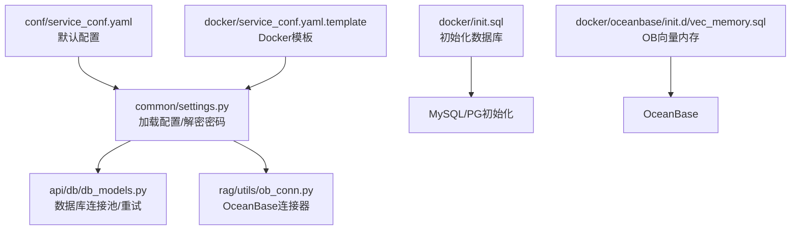
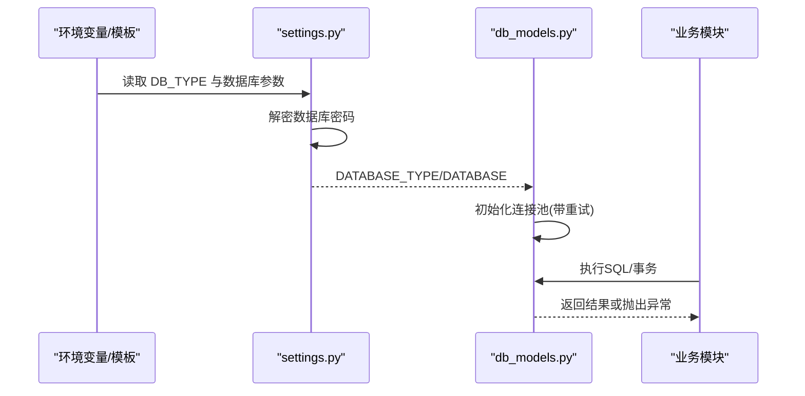
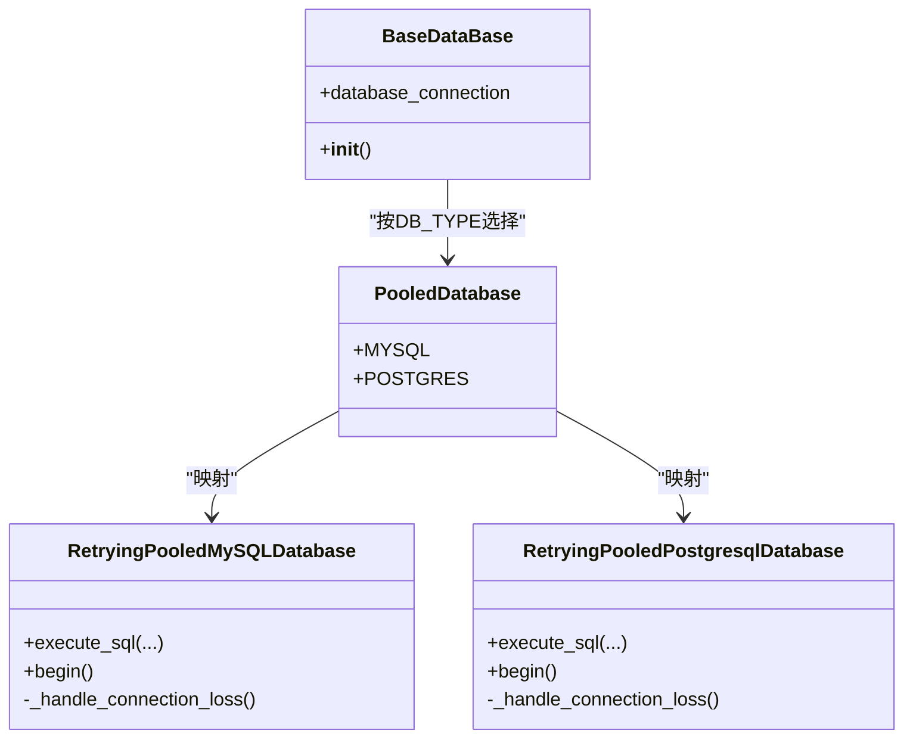
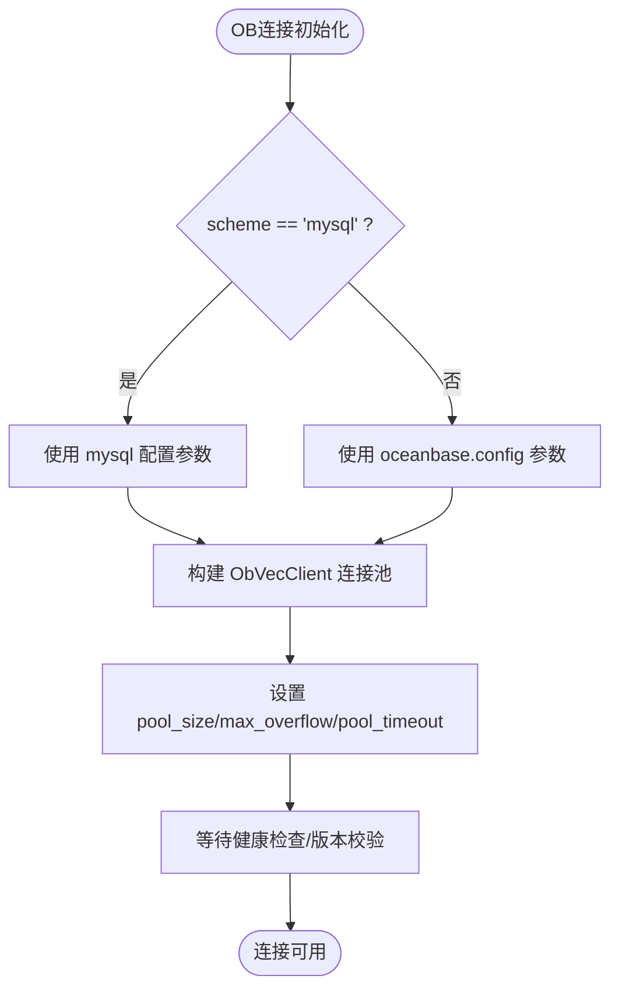
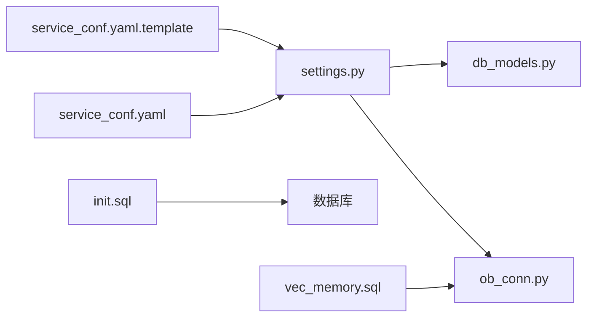

# 数据库配置

<cite>
**本文引用的文件**
- [conf/service_conf.yaml](file://conf/service_conf.yaml)
- [docker/service_conf.yaml.template](file://docker/service_conf.yaml.template)
- [docker/init.sql](file://docker/init.sql)
- [docker/oceanbase/init.d/vec_memory.sql](file://docker/oceanbase/init.d/vec_memory.sql)
- [common/settings.py](file://common/settings.py)
- [api/db/db_models.py](file://api/db/db_models.py)
- [rag/utils/ob_conn.py](file://rag/utils/ob_conn.py)
- [common/config_utils.py](file://common/config_utils.py)
- [api/apps/canvas_app.py](file://api/apps/canvas_app.py)
</cite>

## 目录
1. [简介](#简介)
2. [项目结构与配置入口](#项目结构与配置入口)
3. [核心组件与配置要点](#核心组件与配置要点)
4. [架构总览](#架构总览)
5. [详细组件解析](#详细组件解析)
6. [依赖关系分析](#依赖关系分析)
7. [性能与连接池配置](#性能与连接池配置)
8. [故障排查指南](#故障排查指南)
9. [结论](#结论)
10. [附录：连接字符串与最佳实践](#附录：连接字符串与最佳实践)

## 简介
本指南面向运维与开发人员，系统性讲解 RAGFlow 的数据库配置，覆盖 MySQL、PostgreSQL、OceanBase 三类关系型数据库。重点说明：
- conf/service_conf.yaml 中 mysql、postgres、oceanbase 配置块的参数含义与作用
- Docker 部署下通过环境变量覆盖 service_conf.yaml.template 默认值的方法
- 不同数据库的连接字符串示例与最佳实践（含连接池与安全建议）
- init.sql 在初始化数据库中的作用
- 连接池参数 max_connections、stale_timeout 的影响与调优

## 项目结构与配置入口
- 服务级配置文件位于 conf/service_conf.yaml，定义默认数据库参数
- Docker 部署模板位于 docker/service_conf.yaml.template，支持通过环境变量覆盖默认值
- 初始化脚本 docker/init.sql 负责创建默认数据库
- OceanBase 初始化额外脚本 docker/oceanbase/init.d/vec_memory.sql 设置向量内存参数

图表来源
- [conf/service_conf.yaml](file://conf/service_conf.yaml#L1-L153)
- [docker/service_conf.yaml.template](file://docker/service_conf.yaml.template#L1-L154)
- [docker/init.sql](file://docker/init.sql#L1-L2)
- [docker/oceanbase/init.d/vec_memory.sql](file://docker/oceanbase/init.d/vec_memory.sql#L1-L1)
- [common/settings.py](file://common/settings.py#L65-L67)
- [api/db/db_models.py](file://api/db/db_models.py#L240-L439)
- [rag/utils/ob_conn.py](file://rag/utils/ob_conn.py#L344-L507)

章节来源
- [conf/service_conf.yaml](file://conf/service_conf.yaml#L1-L153)
- [docker/service_conf.yaml.template](file://docker/service_conf.yaml.template#L1-L154)
- [docker/init.sql](file://docker/init.sql#L1-L2)
- [docker/oceanbase/init.d/vec_memory.sql](file://docker/oceanbase/init.d/vec_memory.sql#L1-L1)
- [common/settings.py](file://common/settings.py#L65-L67)
- [api/db/db_models.py](file://api/db/db_models.py#L240-L439)
- [rag/utils/ob_conn.py](file://rag/utils/ob_conn.py#L344-L507)

## 核心组件与配置要点
- 数据库类型选择
  - 通过环境变量 DB_TYPE 指定数据库类型（mysql/postgres），默认 mysql
- 数据库参数来源
  - 优先从 docker/service_conf.yaml.template 读取，未设置则回退到 conf/service_conf.yaml
  - 密码可通过加密模块解密后注入运行时配置
- 连接池与重试
  - MySQL/PG 使用带重试的连接池封装类，自动处理断连与指数退避
  - OceanBase 通过 ObVecClient 构建连接池，并支持环境变量控制池大小与超时
- 初始化脚本
  - docker/init.sql 创建默认数据库 rag_flow
  - OceanBase 额外设置向量内存百分比

章节来源
- [common/settings.py](file://common/settings.py#L65-L67)
- [common/config_utils.py](file://common/config_utils.py#L119-L145)
- [api/db/db_models.py](file://api/db/db_models.py#L240-L439)
- [docker/init.sql](file://docker/init.sql#L1-L2)
- [docker/oceanbase/init.d/vec_memory.sql](file://docker/oceanbase/init.d/vec_memory.sql#L1-L1)

## 架构总览
RAGFlow 的数据库层由“配置加载—连接池—业务访问”三层构成：
- 配置加载：settings 从 YAML/模板读取并解密密码，生成 DATABASE_TYPE 与 DATABASE
- 连接池：根据 DATABASE_TYPE 选择对应池化实现（MySQL/PG），统一异常重试
- 业务访问：DB 实例作为 peewee 的 Meta.database，贯穿各模型层

图表来源
- [common/settings.py](file://common/settings.py#L65-L67)
- [common/config_utils.py](file://common/config_utils.py#L119-L145)
- [api/db/db_models.py](file://api/db/db_models.py#L388-L439)

## 详细组件解析

### 1) 配置文件与参数说明
- 全局配置文件 conf/service_conf.yaml
  - 包含 ragflow/admin 服务、mysql、minio、es、os、infinity、oceanbase、redis 等配置
  - mysql 块包含 name、user、password、host、port、max_connections、stale_timeout、max_allowed_packet 等
  - oceanbase 块包含 scheme 与 config（db_name、user、password、host、port）
  - postgres 块为注释示例，展示字段结构
- Docker 模板 docker/service_conf.yaml.template
  - 通过 ${ENV_VAR:-default} 形式覆盖默认值，便于容器编排
  - 支持 MYSQL_*、POSTGRES_*、OCEANBASE_*、REDIS_* 等前缀的环境变量
  - postgres 块仍为注释，需取消注释后启用

章节来源
- [conf/service_conf.yaml](file://conf/service_conf.yaml#L1-L153)
- [docker/service_conf.yaml.template](file://docker/service_conf.yaml.template#L1-L154)

### 2) 配置加载与密码解密
- settings.init_settings() 会：
  - 读取 DB_TYPE，默认 mysql
  - 从 YAML/模板读取对应数据库配置
  - 调用 decrypt_database_config 解密密码（若开启加密）
- 该流程确保运行时 DATABASE 字典包含用户名、密码、主机、端口等完整信息

章节来源
- [common/settings.py](file://common/settings.py#L65-L67)
- [common/config_utils.py](file://common/config_utils.py#L119-L145)

### 3) 连接池与重试机制（MySQL/PG）
- db_models.py 定义了带重试的连接池包装类：
  - RetryingPooledMySQLDatabase/RetryingPooledPostgresqlDatabase
  - 自动捕获常见断连错误码/消息，执行指数退避重连
  - 提供 with_retry 装饰器，用于对单次操作增加重试策略
- BaseDataBase 根据 DATABASE_TYPE 动态选择池化实现并初始化

图表来源
- [api/db/db_models.py](file://api/db/db_models.py#L240-L439)

章节来源
- [api/db/db_models.py](file://api/db/db_models.py#L240-L439)

### 4) OceanBase 连接与池化
- OBConnection 支持两种模式：
  - scheme: "mysql"：复用 mysql 配置块参数
  - scheme: "oceanbase"：使用 oceanbase.config 参数
- 连接池参数：
  - pool_size 来自 max_connections
  - max_overflow 由环境变量 OB_MAX_OVERFLOW 控制（默认约一半 pool_size，至少 10）
  - pool_timeout 由环境变量 OB_POOL_TIMEOUT 控制（默认 30 秒）
- 启动时检查 OB 版本（>= 4.3.5.1），并尝试设置全局查询超时（ob_query_timeout）

图表来源
- [rag/utils/ob_conn.py](file://rag/utils/ob_conn.py#L344-L507)

章节来源
- [rag/utils/ob_conn.py](file://rag/utils/ob_conn.py#L344-L507)

### 5) 初始化脚本与数据库准备
- docker/init.sql
  - 创建默认数据库 rag_flow 并切换至该库
  - 适用于首次部署时的数据库初始化
- docker/oceanbase/init.d/vec_memory.sql
  - 设置 OceanBase 向量内存上限百分比（示例：30%）
  - 用于提升向量检索性能与稳定性

章节来源
- [docker/init.sql](file://docker/init.sql#L1-L2)
- [docker/oceanbase/init.d/vec_memory.sql](file://docker/oceanbase/init.d/vec_memory.sql#L1-L1)

### 6) 测试数据库连接（Web 管理端）
- canvas_app 提供测试数据库连接接口，支持 mysql/mariadb/postgres/mssql/ibm db2
- 接口会根据请求参数构造连接并执行简单查询以验证连通性

章节来源
- [api/apps/canvas_app.py](file://api/apps/canvas_app.py#L310-L340)

## 依赖关系分析
- 配置依赖
  - settings 依赖 common/config_utils 的解密能力
  - DB 类型与配置来自 conf/service_conf.yaml 或 docker/service_conf.yaml.template
- 运行时依赖
  - db_models 依赖 settings 的 DATABASE_TYPE 与 DATABASE
  - OBConnection 依赖 settings.OB 与环境变量
- 初始化依赖
  - docker/init.sql 与 docker/oceanbase/init.d/vec_memory.sql 由部署流程触发

图表来源
- [docker/service_conf.yaml.template](file://docker/service_conf.yaml.template#L1-L154)
- [conf/service_conf.yaml](file://conf/service_conf.yaml#L1-L153)
- [common/settings.py](file://common/settings.py#L65-L67)
- [api/db/db_models.py](file://api/db/db_models.py#L388-L439)
- [rag/utils/ob_conn.py](file://rag/utils/ob_conn.py#L344-L507)
- [docker/init.sql](file://docker/init.sql#L1-L2)
- [docker/oceanbase/init.d/vec_memory.sql](file://docker/oceanbase/init.d/vec_memory.sql#L1-L1)

## 性能与连接池配置
- MySQL/PG
  - max_connections：决定池大小
  - stale_timeout：用于清理长时间未使用的连接（在池层生效）
  - max_allowed_packet：控制最大包大小，避免大文档入库失败
  - 重试策略：断连自动重试，指数退避，降低瞬时抖动影响
- OceanBase
  - pool_size：与 max_connections 对应
  - max_overflow：池外溢出连接数，建议根据峰值并发动态调整
  - pool_timeout：获取连接超时时间
  - ob_query_timeout：通过环境变量设置全局查询超时，必要时刷新连接池

章节来源
- [conf/service_conf.yaml](file://conf/service_conf.yaml#L7-L16)
- [docker/service_conf.yaml.template](file://docker/service_conf.yaml.template#L7-L16)
- [api/db/db_models.py](file://api/db/db_models.py#L240-L439)
- [rag/utils/ob_conn.py](file://rag/utils/ob_conn.py#L344-L507)

## 故障排查指南
- 无法连接数据库
  - 检查 DB_TYPE 是否正确（mysql/postgres）
  - 确认 docker/service_conf.yaml.template 中的 MYSQL_HOST/POSTGRES_HOST/OCEANBASE_HOST 是否可达
  - 使用 Web 管理端的“测试数据库连接”功能快速验证
- 连接频繁断开
  - 调整 max_connections 与 stale_timeout
  - 观察是否出现 2013/2006（MySQL）或特定 PG 错误码，确认池化重试是否生效
- OceanBase 报错版本过低
  - 确保版本满足 4.3.5.1 及以上
  - 如需，设置 OB_QUERY_TIMEOUT 并刷新连接池
- 初始化失败
  - 确认 docker/init.sql 已执行
  - OceanBase 需要 vec_memory.sql 设置向量内存参数

章节来源
- [api/apps/canvas_app.py](file://api/apps/canvas_app.py#L310-L340)
- [api/db/db_models.py](file://api/db/db_models.py#L240-L439)
- [rag/utils/ob_conn.py](file://rag/utils/ob_conn.py#L344-L507)
- [docker/init.sql](file://docker/init.sql#L1-L2)
- [docker/oceanbase/init.d/vec_memory.sql](file://docker/oceanbase/init.d/vec_memory.sql#L1-L1)

## 结论
- RAGFlow 的数据库配置以 YAML/模板为中心，结合环境变量实现灵活部署
- MySQL/PG 采用带重试的连接池，OceanBase 通过专用客户端与环境变量精细控制池化与查询行为
- 初始化脚本负责基础数据库准备，OceanBase 额外需要向量内存参数
- 建议在生产环境为数据库密码启用加密，并结合监控与日志持续优化连接池参数

## 附录：连接字符串与最佳实践

- 连接字符串示例（不直接粘贴，仅给出路径与要点）
  - MySQL：参考 docker/service_conf.yaml.template 中的 MYSQL_* 环境变量与 max_allowed_packet
    - 路径参考：[docker/service_conf.yaml.template](file://docker/service_conf.yaml.template#L7-L16)
  - PostgreSQL：参考 docker/service_conf.yaml.template 中的 POSTGRES_* 环境变量
    - 路径参考：[docker/service_conf.yaml.template](file://docker/service_conf.yaml.template#L49-L56)
  - OceanBase：
    - 当 scheme: "mysql" 时，复用 mysql 配置；当 scheme: "oceanbase" 时，使用 oceanbase.config
    - 关键参数：host/port/user/password/db_name
    - 路径参考：[conf/service_conf.yaml](file://conf/service_conf.yaml#L31-L39)，[docker/service_conf.yaml.template](file://docker/service_conf.yaml.template#L31-L39)

- 最佳实践
  - 安全
    - 使用强密码，启用密码加密（见 common/config_utils）
    - 限制最小权限，仅授予必要数据库与表权限
  - 连接池
    - 根据并发与峰值合理设置 max_connections
    - 适当增大 max_overflow 以应对突发流量
    - 设置合理的 pool_timeout，避免阻塞
  - OceanBase
    - 确保版本满足最低要求
    - 通过环境变量设置 OB_QUERY_TIMEOUT 并刷新连接池
    - 配置 vec_memory.sql 提升向量检索性能

章节来源
- [docker/service_conf.yaml.template](file://docker/service_conf.yaml.template#L7-L16)
- [docker/service_conf.yaml.template](file://docker/service_conf.yaml.template#L49-L56)
- [docker/service_conf.yaml.template](file://docker/service_conf.yaml.template#L31-L39)
- [conf/service_conf.yaml](file://conf/service_conf.yaml#L31-L39)
- [common/config_utils.py](file://common/config_utils.py#L119-L145)
- [rag/utils/ob_conn.py](file://rag/utils/ob_conn.py#L344-L507)