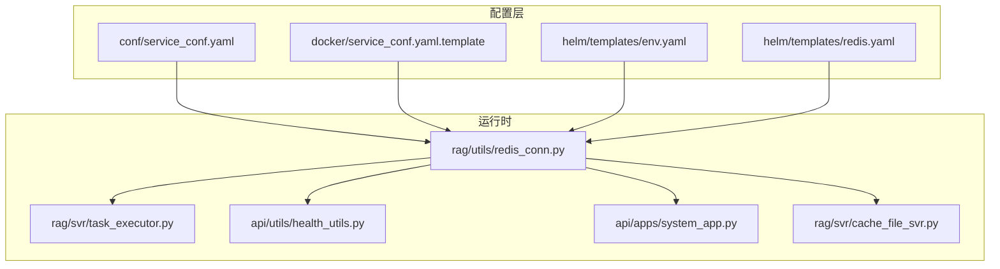
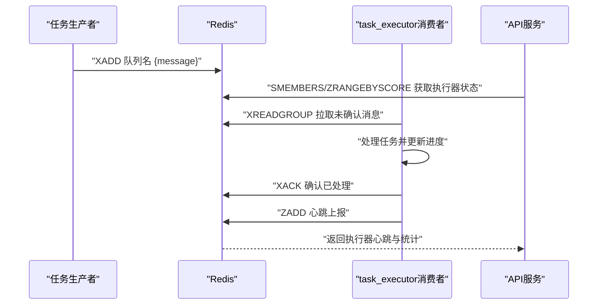
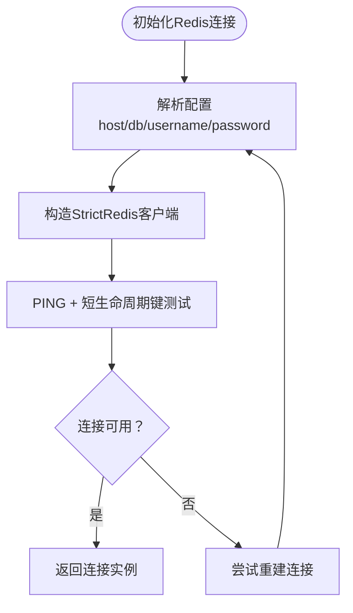
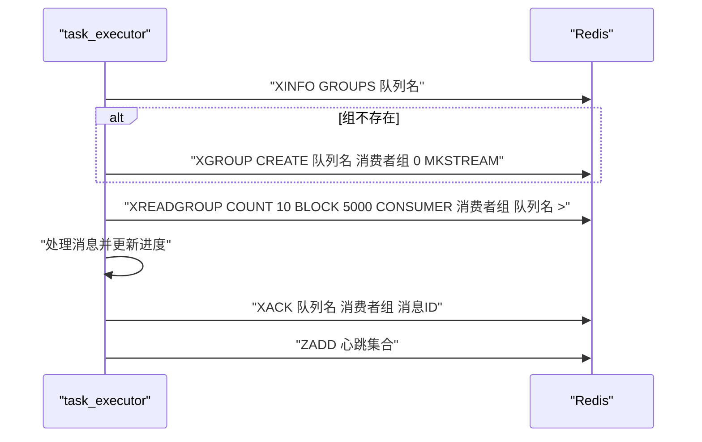
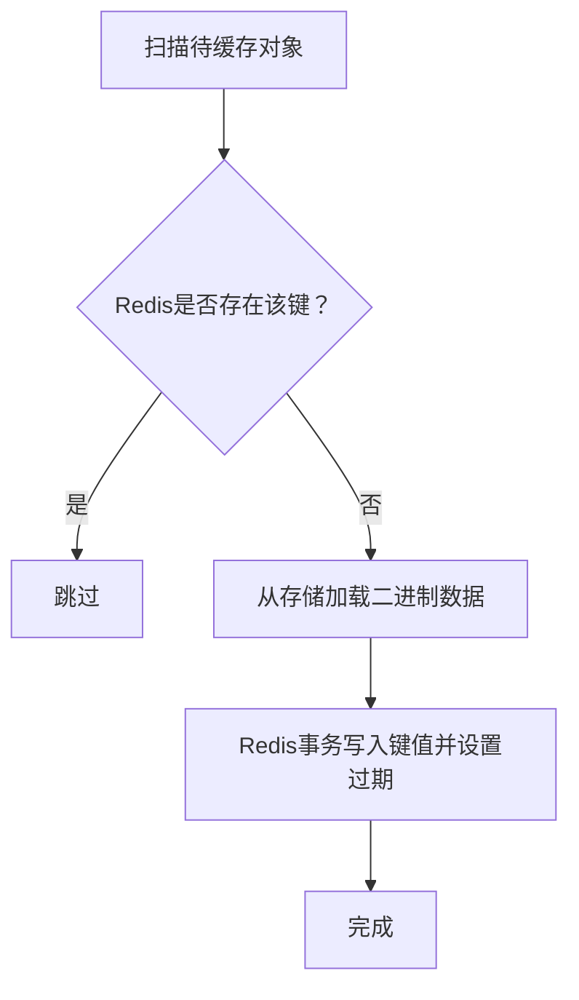
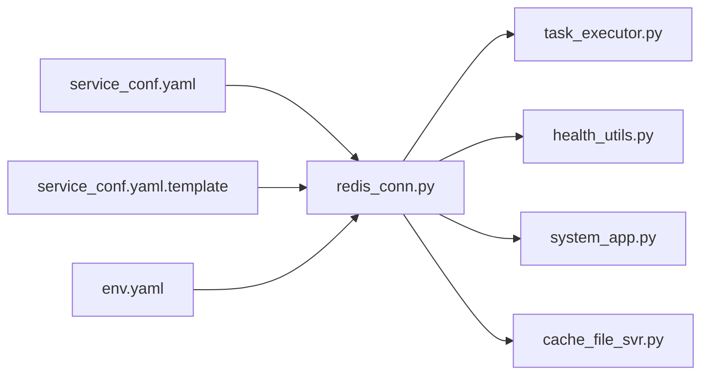

# 缓存配置

<cite>
**本文引用的文件**
- [conf/service_conf.yaml](file://conf/service_conf.yaml)
- [docker/service_conf.yaml.template](file://docker/service_conf.yaml.template)
- [rag/utils/redis_conn.py](file://rag/utils/redis_conn.py)
- [rag/svr/task_executor.py](file://rag/svr/task_executor.py)
- [api/utils/health_utils.py](file://api/utils/health_utils.py)
- [api/apps/system_app.py](file://api/apps/system_app.py)
- [docs/configurations.md](file://docs/configurations.md)
- [helm/templates/env.yaml](file://helm/templates/env.yaml)
- [helm/templates/redis.yaml](file://helm/templates/redis.yaml)
- [rag/svr/cache_file_svr.py](file://rag/svr/cache_file_svr.py)
</cite>

## 目录
1. [简介](#简介)
2. [项目结构](#项目结构)
3. [核心组件](#核心组件)
4. [架构总览](#架构总览)
5. [详细组件分析](#详细组件分析)
6. [依赖关系分析](#依赖关系分析)
7. [性能考量](#性能考量)
8. [故障排查指南](#故障排查指南)
9. [结论](#结论)
10. [附录](#附录)

## 简介
本指南聚焦于RAGFlow的缓存系统配置，重点说明如何将Redis同时用于两方面：
- 作为应用缓存（例如文件内容缓存），提升API响应性能与吞吐能力
- 作为task_executor的消息队列（message_queue_type: 'redis'），承载异步任务分发与消费

文档将逐层解析配置项db、password、host的含义，说明Docker环境下通过REDIS_HOST、REDIS_PASSWORD进行注入的方式，并给出Redis内存优化、持久化与集群部署建议。

## 项目结构
围绕Redis配置与使用的关键位置如下：
- 配置文件
  - 根目录配置：conf/service_conf.yaml
  - Docker模板配置：docker/service_conf.yaml.template
  - Helm环境变量模板：helm/templates/env.yaml
  - Helm Redis部署模板：helm/templates/redis.yaml
- 运行时连接与消息队列
  - Redis连接封装：rag/utils/redis_conn.py
  - 任务执行器（消费者/生产者）：rag/svr/task_executor.py
  - 健康检查与状态上报：api/utils/health_utils.py、api/apps/system_app.py
- 缓存使用示例
  - 文件内容缓存服务：rag/svr/cache_file_svr.py

图表来源
- [conf/service_conf.yaml](file://conf/service_conf.yaml#L39-L46)
- [docker/service_conf.yaml.template](file://docker/service_conf.yaml.template#L39-L43)
- [helm/templates/env.yaml](file://helm/templates/env.yaml#L19-L25)
- [helm/templates/redis.yaml](file://helm/templates/redis.yaml#L60-L62)
- [rag/utils/redis_conn.py](file://rag/utils/redis_conn.py#L81-L110)
- [rag/svr/task_executor.py](file://rag/svr/task_executor.py#L165-L190)
- [api/utils/health_utils.py](file://api/utils/health_utils.py#L166-L201)
- [api/apps/system_app.py](file://api/apps/system_app.py#L159-L171)
- [rag/svr/cache_file_svr.py](file://rag/svr/cache_file_svr.py#L35-L60)

章节来源
- [conf/service_conf.yaml](file://conf/service_conf.yaml#L39-L46)
- [docker/service_conf.yaml.template](file://docker/service_conf.yaml.template#L39-L43)
- [helm/templates/env.yaml](file://helm/templates/env.yaml#L19-L25)
- [helm/templates/redis.yaml](file://helm/templates/redis.yaml#L60-L62)

## 核心组件
- Redis连接与消息队列
  - 连接参数解析与健康检查：host、db、username、password
  - 消息队列使用Stream与XREADGROUP实现可靠投递与重试
- 任务执行器
  - 从Redis队列拉取任务并执行，周期性上报心跳与统计
- 健康检查与状态展示
  - 通过Redis集合与有序集合维护执行器存活信息
- 应用缓存
  - 文件内容缓存服务基于Redis事务键值存储，减少重复读取

章节来源
- [rag/utils/redis_conn.py](file://rag/utils/redis_conn.py#L81-L110)
- [rag/utils/redis_conn.py](file://rag/utils/redis_conn.py#L245-L367)
- [rag/svr/task_executor.py](file://rag/svr/task_executor.py#L165-L190)
- [api/utils/health_utils.py](file://api/utils/health_utils.py#L166-L201)
- [api/apps/system_app.py](file://api/apps/system_app.py#L159-L171)
- [rag/svr/cache_file_svr.py](file://rag/svr/cache_file_svr.py#L35-L60)

## 架构总览
Redis在系统中的双重角色：
- 应用缓存：通过文件内容缓存服务将热点数据写入Redis，降低后端存储压力
- 消息队列：task_executor通过Redis Stream消费异步任务，实现高吞吐与可靠性

图表来源
- [rag/utils/redis_conn.py](file://rag/utils/redis_conn.py#L245-L367)
- [rag/svr/task_executor.py](file://rag/svr/task_executor.py#L165-L190)
- [api/utils/health_utils.py](file://api/utils/health_utils.py#L166-L201)
- [api/apps/system_app.py](file://api/apps/system_app.py#L159-L171)

## 详细组件分析

### Redis配置项详解
- db
  - 含义：Redis数据库索引，用于隔离不同业务或租户的数据
  - 默认值：1
  - 参考路径：conf/service_conf.yaml、docker/service_conf.yaml.template
- password
  - 含义：Redis访问密码；当配置了用户名时，通常与用户名配合使用
  - 默认值：infini_rag_flow
  - 参考路径：conf/service_conf.yaml、docker/service_conf.yaml.template
- host
  - 含义：Redis主机地址与端口，格式为“IP:PORT”
  - 默认值：localhost:6379 或 redis:6379
  - 参考路径：conf/service_conf.yaml、docker/service_conf.yaml.template

Docker环境变量注入
- REDIS_HOST：覆盖redis.host，默认指向redis容器
- REDIS_PASSWORD：覆盖redis.password
- 参考路径：docker/service_conf.yaml.template、helm/templates/env.yaml

章节来源
- [conf/service_conf.yaml](file://conf/service_conf.yaml#L39-L46)
- [docker/service_conf.yaml.template](file://docker/service_conf.yaml.template#L39-L43)
- [docs/configurations.md](file://docs/configurations.md#L88-L96)
- [docs/configurations.md](file://docs/configurations.md#L165-L170)
- [helm/templates/env.yaml](file://helm/templates/env.yaml#L19-L25)

### Redis连接与健康检查
- 参数解析
  - 从配置中读取host、db、username、password，并拆分host为IP与端口
- 健康检查
  - 使用PING与短生命周期键值测试，确保连接可用
- 参考路径：rag/utils/redis_conn.py

图表来源
- [rag/utils/redis_conn.py](file://rag/utils/redis_conn.py#L81-L110)

章节来源
- [rag/utils/redis_conn.py](file://rag/utils/redis_conn.py#L81-L110)

### 消息队列与任务执行器
- 队列类型
  - 使用Redis Stream，通过XADD/XREADGROUP实现可靠投递
- 组与消费者
  - 自动创建消费者组，支持Pending消息重试与重新入队
- 心跳与状态
  - 执行器周期性向Redis写入心跳，API侧通过集合与有序集合查询
- 参考路径：rag/svr/task_executor.py、api/utils/health_utils.py、api/apps/system_app.py

图表来源
- [rag/svr/task_executor.py](file://rag/svr/task_executor.py#L165-L190)
- [rag/utils/redis_conn.py](file://rag/utils/redis_conn.py#L245-L367)
- [api/utils/health_utils.py](file://api/utils/health_utils.py#L166-L201)
- [api/apps/system_app.py](file://api/apps/system_app.py#L159-L171)

章节来源
- [rag/svr/task_executor.py](file://rag/svr/task_executor.py#L165-L190)
- [rag/utils/redis_conn.py](file://rag/utils/redis_conn.py#L245-L367)
- [api/utils/health_utils.py](file://api/utils/health_utils.py#L166-L201)
- [api/apps/system_app.py](file://api/apps/system_app.py#L159-L171)

### 应用缓存（文件内容）
- 缓存策略
  - 使用Redis事务键值存储，键格式为“知识库ID/对象路径”，带过期时间
  - 避免重复读取，提升吞吐
- 参考路径：rag/svr/cache_file_svr.py

图表来源
- [rag/svr/cache_file_svr.py](file://rag/svr/cache_file_svr.py#L35-L60)

章节来源
- [rag/svr/cache_file_svr.py](file://rag/svr/cache_file_svr.py#L35-L60)

## 依赖关系分析
- 配置到连接
  - conf/service_conf.yaml与docker/service_conf.yaml.template共同决定运行时Redis连接参数
  - Helm模板通过env.yaml注入REDIS_HOST与REDIS_PASSWORD
- 连接到功能
  - redis_conn.py提供统一连接与消息队列操作
  - task_executor.py依赖Redis进行任务消费与心跳上报
  - 健康检查模块通过Redis读取执行器状态
  - cache_file_svr.py依赖Redis进行应用级缓存

图表来源
- [conf/service_conf.yaml](file://conf/service_conf.yaml#L39-L46)
- [docker/service_conf.yaml.template](file://docker/service_conf.yaml.template#L39-L43)
- [helm/templates/env.yaml](file://helm/templates/env.yaml#L19-L25)
- [rag/utils/redis_conn.py](file://rag/utils/redis_conn.py#L81-L110)
- [rag/svr/task_executor.py](file://rag/svr/task_executor.py#L165-L190)
- [api/utils/health_utils.py](file://api/utils/health_utils.py#L166-L201)
- [api/apps/system_app.py](file://api/apps/system_app.py#L159-L171)
- [rag/svr/cache_file_svr.py](file://rag/svr/cache_file_svr.py#L35-L60)

章节来源
- [conf/service_conf.yaml](file://conf/service_conf.yaml#L39-L46)
- [docker/service_conf.yaml.template](file://docker/service_conf.yaml.template#L39-L43)
- [helm/templates/env.yaml](file://helm/templates/env.yaml#L19-L25)
- [rag/utils/redis_conn.py](file://rag/utils/redis_conn.py#L81-L110)
- [rag/svr/task_executor.py](file://rag/svr/task_executor.py#L165-L190)
- [api/utils/health_utils.py](file://api/utils/health_utils.py#L166-L201)
- [api/apps/system_app.py](file://api/apps/system_app.py#L159-L171)
- [rag/svr/cache_file_svr.py](file://rag/svr/cache_file_svr.py#L35-L60)

## 性能考量
- Redis内存优化
  - 在Helm模板中，Redis通过命令行参数设置了最大内存与淘汰策略，适合小规模演示或开发环境
  - 生产建议：根据实际QPS与数据体量调整maxmemory与maxmemory-policy，优先保留热键
  - 参考路径：helm/templates/redis.yaml
- 持久化设置
  - Helm模板未启用AOF/RDB持久化，如需数据安全，请结合业务场景开启RDB快照或AOF追加
  - 参考路径：helm/templates/redis.yaml
- 集群配置
  - 当前模板为单实例Redis，若需水平扩展，可考虑Redis Sentinel或Redis Cluster
  - 集群部署需同步调整连接参数与客户端路由策略
  - 参考路径：helm/templates/redis.yaml

章节来源
- [helm/templates/redis.yaml](file://helm/templates/redis.yaml#L60-L62)

## 故障排查指南
- 连接失败
  - 检查REDIS_HOST与REDIS_PASSWORD是否正确注入
  - 确认Redis服务可达且端口开放
  - 参考路径：docker/service_conf.yaml.template、helm/templates/env.yaml
- 消息堆积
  - 查看消费者组Pending数量与lag指标，必要时增加消费者实例
  - 参考路径：rag/svr/task_executor.py、api/utils/health_utils.py
- 执行器离线
  - 通过API查询TASKEXE集合与各执行器的心跳有序集合，定位超时节点
  - 参考路径：api/apps/system_app.py、api/utils/health_utils.py
- 缓存命中率低
  - 检查缓存键格式与过期时间，避免频繁失效
  - 参考路径：rag/svr/cache_file_svr.py

章节来源
- [docker/service_conf.yaml.template](file://docker/service_conf.yaml.template#L39-L43)
- [helm/templates/env.yaml](file://helm/templates/env.yaml#L19-L25)
- [rag/svr/task_executor.py](file://rag/svr/task_executor.py#L1109-L1161)
- [api/utils/health_utils.py](file://api/utils/health_utils.py#L166-L201)
- [api/apps/system_app.py](file://api/apps/system_app.py#L159-L171)
- [rag/svr/cache_file_svr.py](file://rag/svr/cache_file_svr.py#L35-L60)

## 结论
- Redis在RAGFlow中承担双重职责：应用缓存与任务队列
- 配置项db、password、host分别控制命名空间、认证与网络接入
- Docker/Helm提供了灵活的环境变量注入方式，便于在不同环境中快速切换
- 生产部署建议结合业务规模调整内存策略、持久化与集群方案

## 附录
- 配置项速查
  - db：Redis数据库索引
  - password：Redis访问密码
  - host：Redis主机与端口
  - REDIS_HOST/REDIS_PASSWORD：Docker/Helm注入参数
- 参考文档
  - 配置说明与最佳实践：docs/configurations.md

章节来源
- [docs/configurations.md](file://docs/configurations.md#L88-L96)
- [docs/configurations.md](file://docs/configurations.md#L165-L170)