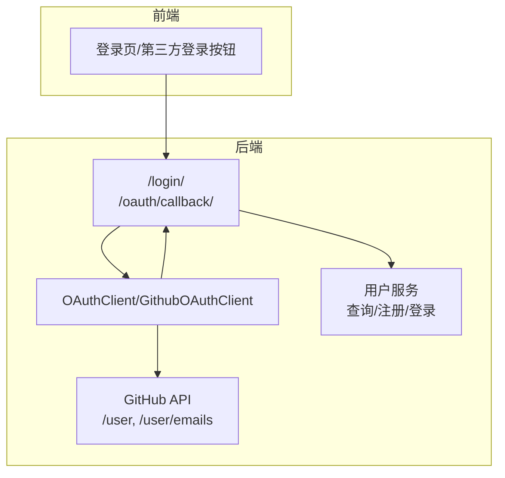
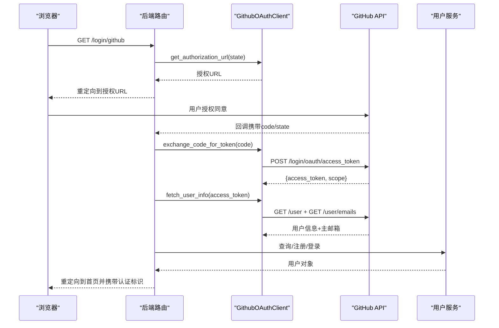
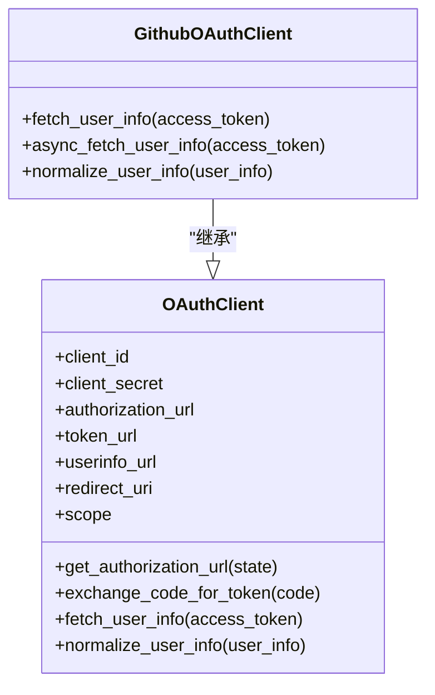
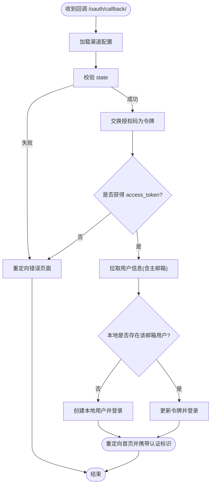
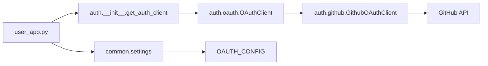

# GitHub 认证配置

<cite>
**本文引用的文件**
- [conf/service_conf.yaml](file://conf/service_conf.yaml)
- [docker/service_conf.yaml.template](file://docker/service_conf.yaml.template)
- [api/apps/auth/__init__.py](file://api/apps/auth/__init__.py)
- [api/apps/auth/oauth.py](file://api/apps/auth/oauth.py)
- [api/apps/auth/github.py](file://api/apps/auth/github.py)
- [api/apps/user_app.py](file://api/apps/user_app.py)
- [common/settings.py](file://common/settings.py)
- [docs/configurations.md](file://docs/configurations.md)
</cite>

## 目录
1. [简介](#简介)
2. [项目结构与入口](#项目结构与入口)
3. [核心组件](#核心组件)
4. [架构总览](#架构总览)
5. [详细组件解析](#详细组件解析)
6. [依赖关系分析](#依赖关系分析)
7. [性能与安全考量](#性能与安全考量)
8. [故障排除指南](#故障排除指南)
9. [结论](#结论)
10. [附录：配置清单与最佳实践](#附录配置清单与最佳实践)

## 简介
本指南面向希望在 RAGFlow 中启用 GitHub 第三方登录的管理员与开发者，提供从 GitHub 开发者平台创建 OAuth 应用、到在 RAGFlow 中配置 service_conf.yaml 的完整流程；解释 GitHub 配置块参数（client_id、client_secret、redirect_uri）的正确格式；说明 RAGFlow 如何通过 GitHub API 获取用户信息并创建本地账户；给出权限范围（scope）配置建议；并提供常见问题的排查方法，如回调 URL 验证失败、API 速率限制等。

## 项目结构与入口
RAGFlow 的 OAuth/GitHub 认证由后端路由与认证客户端共同实现：
- 路由层负责接收授权码、交换令牌、拉取用户信息、创建或登录本地用户。
- 认证客户端抽象了 OAuth 协议细节，GitHub 客户端在此基础上补充 GitHub 特定的端点与默认 scope。
- 配置通过 conf/service_conf.yaml 或 docker/service_conf.yaml.template 注入，运行时由 common/settings.py 加载。

图表来源
- [api/apps/user_app.py](file://api/apps/user_app.py#L161-L205)
- [api/apps/auth/oauth.py](file://api/apps/auth/oauth.py#L48-L62)
- [api/apps/auth/github.py](file://api/apps/auth/github.py#L21-L33)

章节来源
- [api/apps/user_app.py](file://api/apps/user_app.py#L161-L205)
- [api/apps/auth/__init__.py](file://api/apps/auth/__init__.py#L17-L40)
- [api/apps/auth/oauth.py](file://api/apps/auth/oauth.py#L32-L62)
- [api/apps/auth/github.py](file://api/apps/auth/github.py#L21-L33)

## 核心组件
- OAuthClient：通用 OAuth2 客户端，负责生成授权 URL、交换授权码为访问令牌、拉取用户信息。
- GithubOAuthClient：继承自 OAuthClient，内置 GitHub 授权、令牌、用户信息端点及默认 scope。
- 用户回调处理：接收授权码，换取令牌，校验 scope，拉取用户邮箱，创建或登录本地用户。
- 配置加载：从 conf/service_conf.yaml 读取 oauth 配置，运行时注入到 settings.OAUTH_CONFIG。

章节来源
- [api/apps/auth/oauth.py](file://api/apps/auth/oauth.py#L32-L152)
- [api/apps/auth/github.py](file://api/apps/auth/github.py#L21-L89)
- [api/apps/user_app.py](file://api/apps/user_app.py#L161-L205)
- [common/settings.py](file://common/settings.py#L230-L239)

## 架构总览
下图展示 GitHub 登录的关键调用序列：从点击“使用 GitHub 登录”开始，到最终完成本地登录或注册。

图表来源
- [api/apps/user_app.py](file://api/apps/user_app.py#L161-L205)
- [api/apps/auth/github.py](file://api/apps/auth/github.py#L21-L89)
- [api/apps/auth/oauth.py](file://api/apps/auth/oauth.py#L65-L112)

## 详细组件解析

### GitHub OAuth 客户端（GithubOAuthClient）
- 默认端点与默认 scope
  - 授权端点：https://github.com/login/oauth/authorize
  - 令牌端点：https://github.com/login/oauth/access_token
  - 用户信息端点：https://api.github.com/user
  - 默认 scope：user:email
- 用户信息拉取
  - 先请求 /user 获取基础信息，再请求 /user/emails 获取主邮箱，最终标准化为统一的用户模型。
- 异步/同步两种实现，均支持超时控制。

图表来源
- [api/apps/auth/oauth.py](file://api/apps/auth/oauth.py#L32-L152)
- [api/apps/auth/github.py](file://api/apps/auth/github.py#L21-L89)

章节来源
- [api/apps/auth/github.py](file://api/apps/auth/github.py#L21-L89)
- [api/apps/auth/oauth.py](file://api/apps/auth/oauth.py#L32-L152)

### 用户回调与本地账户创建（user_app.py）
- 动态通道回调
  - /oauth/callback/<channel>：根据 channel 从配置加载对应客户端，完成授权码换令牌、拉取用户信息、创建或登录本地用户。
- 旧版 GitHub 回调（兼容）
  - /user/github_callback：直接使用 settings.GITHUB_OAUTH 配置换取令牌并校验 scope，随后拉取用户邮箱并创建/登录本地用户。
- 关键逻辑
  - 校验 state 防止 CSRF。
  - 校验返回的 scope 是否包含 user:email。
  - 拉取用户邮箱后创建本地用户，或直接登录已存在的用户。

图表来源
- [api/apps/user_app.py](file://api/apps/user_app.py#L161-L205)
- [api/apps/user_app.py](file://api/apps/user_app.py#L270-L355)

章节来源
- [api/apps/user_app.py](file://api/apps/user_app.py#L161-L205)
- [api/apps/user_app.py](file://api/apps/user_app.py#L270-L355)

### 配置加载与注入（common/settings.py）
- 运行时从配置中读取 oauth 配置并注入全局变量 OAUTH_CONFIG。
- 同时支持 GITHUB_OAUTH（用于旧版回调路径）。

章节来源
- [common/settings.py](file://common/settings.py#L230-L239)

## 依赖关系分析
- 组件耦合
  - 路由层依赖认证客户端工厂函数 get_auth_client，按 channel 类型选择 OAuthClient 或 GithubOAuthClient。
  - 认证客户端依赖通用 HTTP 工具进行网络请求。
  - 用户服务依赖数据库层进行用户查询与创建。
- 外部依赖
  - GitHub 提供授权、令牌、用户信息接口。
  - 前端通过重定向到授权 URL 并接收回调完成认证流程。

图表来源
- [api/apps/auth/__init__.py](file://api/apps/auth/__init__.py#L17-L40)
- [api/apps/auth/oauth.py](file://api/apps/auth/oauth.py#L32-L62)
- [api/apps/auth/github.py](file://api/apps/auth/github.py#L21-L33)
- [api/apps/user_app.py](file://api/apps/user_app.py#L161-L205)
- [common/settings.py](file://common/settings.py#L230-L239)

章节来源
- [api/apps/auth/__init__.py](file://api/apps/auth/__init__.py#L17-L40)
- [api/apps/auth/oauth.py](file://api/apps/auth/oauth.py#L32-L62)
- [api/apps/auth/github.py](file://api/apps/auth/github.py#L21-L33)
- [api/apps/user_app.py](file://api/apps/user_app.py#L161-L205)
- [common/settings.py](file://common/settings.py#L230-L239)

## 性能与安全考量
- 超时与重试
  - 认证客户端对网络请求设置了固定超时时间，避免阻塞；建议在高并发场景下结合外部限流策略。
- 速率限制
  - GitHub API 对未认证请求有严格速率限制；启用 OAuth 后，令牌请求与用户信息请求均需在受控环境中进行。
- CSRF 防护
  - 回调前生成并存储 state，回调时进行比对，防止跨站请求伪造。
- 敏感信息
  - client_secret 不应暴露在前端；仅在后端安全存储与传输。

[本节为通用指导，不直接分析具体文件]

## 故障排除指南
- 回调 URL 验证失败
  - 现象：回调携带 error=invalid_state 或 scope 缺失 user:email。
  - 排查要点：
    - 确认 redirect_uri 与 GitHub 应用中注册的回调地址完全一致（包含协议、域名、端口与路径）。
    - 确认 scope 包含 user:email，否则会触发错误重定向。
    - 确认 state 在回调时与发起时一致。
  - 参考路径：
    - [api/apps/user_app.py](file://api/apps/user_app.py#L161-L205)
    - [api/apps/user_app.py](file://api/apps/user_app.py#L270-L305)

- 令牌交换失败
  - 现象：回调后无法获得 access_token。
  - 排查要点：
    - 检查 client_id 与 client_secret 是否正确。
    - 检查 redirect_uri 是否与 GitHub 应用中注册的一致。
    - 检查网络连通性与超时设置。
  - 参考路径：
    - [api/apps/auth/oauth.py](file://api/apps/auth/oauth.py#L65-L112)

- 用户信息拉取失败
  - 现象：无法获取用户邮箱或昵称。
  - 排查要点：
    - 确认 access_token 有效且具有 user:email 权限。
    - 检查 GitHub API 可达性与速率限制。
  - 参考路径：
    - [api/apps/auth/github.py](file://api/apps/auth/github.py#L35-L89)
    - [api/apps/user_app.py](file://api/apps/user_app.py#L472-L483)

- 本地用户创建异常
  - 现象：注册失败或邮箱重复。
  - 排查要点：
    - 检查数据库中是否已有相同邮箱用户。
    - 检查头像下载与保存流程是否异常。
  - 参考路径：
    - [api/apps/user_app.py](file://api/apps/user_app.py#L310-L355)

## 结论
通过以上配置与流程，RAGFlow 可以稳定地集成 GitHub 第三方登录。关键在于：
- 在 GitHub 开发者平台正确创建 OAuth 应用并配置回调地址；
- 在 service_conf.yaml 中正确填写 client_id、client_secret、redirect_uri；
- 使用默认 scope user:email 以确保可获取用户邮箱；
- 严格校验 state 与 scope，保障安全性；
- 在高并发与受限网络环境下关注超时与速率限制。

[本节为总结性内容，不直接分析具体文件]

## 附录：配置清单与最佳实践

### 在 GitHub 开发者平台创建 OAuth 应用
- 登录 GitHub，进入个人设置 -> 开发者设置 -> OAuth Apps。
- 点击 New OAuth App，填写：
  - Application name：任意名称
  - Homepage URL：你的前端站点地址
  - Authorization callback URL：形如 https://your-app.com/v1/user/oauth/callback/github
- 创建后记录 client_id 与 client_secret。

[本小节为操作指引，不直接分析具体文件]

### 在 RAGFlow 中配置 service_conf.yaml
- 在 oauth.github 下填写：
  - type：github
  - icon：github
  - display_name：显示名称
  - client_id：GitHub 应用的 client_id
  - client_secret：GitHub 应用的 client_secret
  - redirect_uri：必须与 GitHub 应用中注册的回调地址一致，格式参考下方“最佳实践”
- 参考模板位置：
  - [docker/service_conf.yaml.template](file://docker/service_conf.yaml.template#L121-L127)
  - [conf/service_conf.yaml](file://conf/service_conf.yaml#L120-L127)

章节来源
- [docker/service_conf.yaml.template](file://docker/service_conf.yaml.template#L121-L127)
- [conf/service_conf.yaml](file://conf/service_conf.yaml#L120-L127)

### service_conf.yaml 中 github 配置块参数说明
- type：认证类型，github
- icon：图标标识，github
- display_name：渠道显示名
- client_id：客户端 ID（必填）
- client_secret：客户端密钥（必填）
- redirect_uri：回调地址（必填），格式示例：
  - https://your-app.com/v1/user/oauth/callback/github
  - 本地开发可用 http://127.0.0.1:80/v1/user/oauth/callback/github
- 参考文档：
  - [docs/configurations.md](file://docs/configurations.md#L172-L190)

章节来源
- [docs/configurations.md](file://docs/configurations.md#L172-L190)

### RAGFlow 如何通过 GitHub API 获取用户信息并创建本地账户
- 流程概览：
  - 发起授权：/login/<channel> -> 生成授权 URL 并重定向。
  - 回调处理：/oauth/callback/<channel> -> 交换授权码为令牌 -> 拉取用户信息 -> 创建或登录本地用户。
- 关键实现：
  - 生成授权 URL：OAuthClient.get_authorization_url
  - 交换令牌：OAuthClient.exchange_code_for_token
  - 拉取用户信息：GithubOAuthClient.fetch_user_info（含主邮箱）
  - 本地用户创建/登录：user_app.py 中的回调逻辑
- 参考路径：
  - [api/apps/auth/oauth.py](file://api/apps/auth/oauth.py#L48-L62)
  - [api/apps/auth/oauth.py](file://api/apps/auth/oauth.py#L65-L112)
  - [api/apps/auth/github.py](file://api/apps/auth/github.py#L35-L89)
  - [api/apps/user_app.py](file://api/apps/user_app.py#L161-L205)

章节来源
- [api/apps/auth/oauth.py](file://api/apps/auth/oauth.py#L48-L62)
- [api/apps/auth/oauth.py](file://api/apps/auth/oauth.py#L65-L112)
- [api/apps/auth/github.py](file://api/apps/auth/github.py#L35-L89)
- [api/apps/user_app.py](file://api/apps/user_app.py#L161-L205)

### 权限范围（scope）配置建议
- 必须包含 user:email，以获取用户的主邮箱。
- 若需要更多用户信息，可在 GitHub 应用中增加其他 scope，但需评估隐私与合规要求。
- 参考默认 scope：
  - [api/apps/auth/github.py](file://api/apps/auth/github.py#L30-L31)

章节来源
- [api/apps/auth/github.py](file://api/apps/auth/github.py#L30-L31)

### 常见问题与解决方案速查
- 回调地址不匹配：检查 redirect_uri 与 GitHub 应用注册项完全一致。
- scope 缺少 user:email：在 GitHub 应用中勾选用户邮箱权限。
- 令牌交换失败：核对 client_id/client_secret 与 redirect_uri。
- 用户信息为空：确认 access_token 有效且具备所需 scope。
- 本地注册失败：检查邮箱唯一性与头像下载流程。

章节来源
- [api/apps/user_app.py](file://api/apps/user_app.py#L161-L205)
- [api/apps/user_app.py](file://api/apps/user_app.py#L270-L355)
- [api/apps/auth/oauth.py](file://api/apps/auth/oauth.py#L65-L112)
- [api/apps/auth/github.py](file://api/apps/auth/github.py#L35-L89)