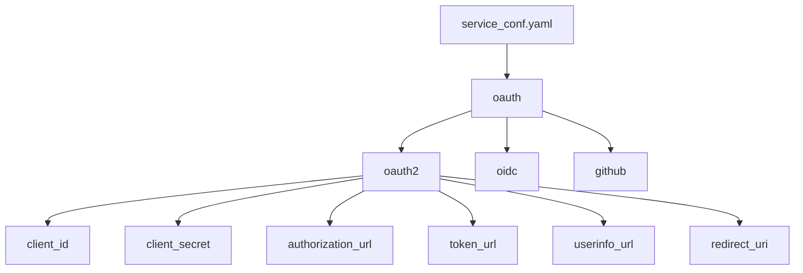
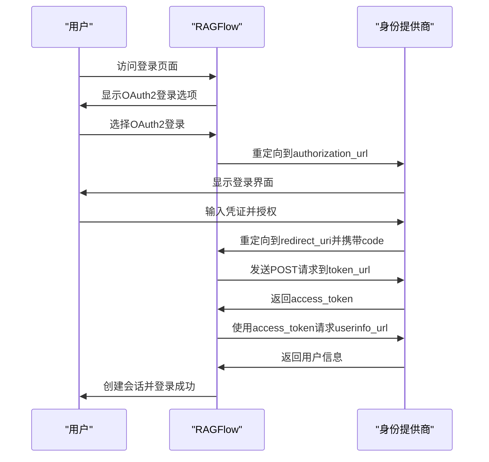
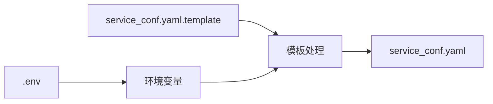

# OAuth2 配置

<cite>
**本文档中引用的文件**  
- [service_conf.yaml](file://conf/service_conf.yaml)
- [oauth.py](file://api/apps/auth/oauth.py)
- [oidc.py](file://api/apps/auth/oidc.py)
- [user_app.py](file://api/apps/user_app.py)
- [config_utils.py](file://common/config_utils.py)
- [service_conf.yaml.template](file://docker/service_conf.yaml.template)
</cite>

## 目录
1. [简介](#简介)
2. [配置文件结构](#配置文件结构)
3. [OAuth2参数详解](#oauth2参数详解)
4. [认证流程实现](#认证流程实现)
5. [开发与生产环境配置](#开发与生产环境配置)
6. [常见问题排查](#常见问题排查)
7. [安全最佳实践](#安全最佳实践)

## 简介

RAGFlow支持通过OAuth2协议集成通用的身份提供商，实现安全的用户认证。本指南详细说明了如何在RAGFlow中配置和使用OAuth2，包括`service_conf.yaml`配置文件中各个参数的含义、认证流程的实现细节以及常见问题的解决方案。

**Section sources**
- [service_conf.yaml](file://conf/service_conf.yaml)
- [oauth.py](file://api/apps/auth/oauth.py)

## 配置文件结构

RAGFlow的OAuth2配置主要位于`conf/service_conf.yaml`文件中，该文件定义了系统中所有可用的身份认证渠道。配置结构采用YAML格式，支持多种认证类型，包括OAuth2、OIDC和特定提供商（如GitHub）。



**Diagram sources**
- [service_conf.yaml](file://conf/service_conf.yaml)

**Section sources**
- [service_conf.yaml](file://conf/service_conf.yaml)
- [config_utils.py](file://common/config_utils.py)

## OAuth2参数详解

### 基础参数

在`service_conf.yaml`文件中，OAuth2配置节包含以下关键参数：

- **client_id**: 身份提供商分配给RAGFlow应用的客户端ID，用于标识应用身份
- **client_secret**: 与client_id配对的密钥，用于在令牌交换时验证应用身份
- **authorization_url**: 身份提供商的授权端点URL，用户将被重定向至此地址进行登录
- **token_url**: 身份提供商的令牌端点URL，用于交换授权码获取访问令牌
- **userinfo_url**: 身份提供商的用户信息端点URL，用于获取已认证用户的信息
- **redirect_uri**: RAGFlow应用的回调地址，身份提供商在认证完成后将用户重定向至此地址

```yaml
oauth:
  oauth2:
    display_name: "OAuth2"
    client_id: "your_client_id"
    client_secret: "your_client_secret"
    authorization_url: "https://your-oauth-provider.com/oauth/authorize"
    token_url: "https://your-oauth-provider.com/oauth/token"
    userinfo_url: "https://your-oauth-provider.com/oauth/userinfo"
    redirect_uri: "https://your-app.com/v1/user/oauth/callback/oauth2"
```

### 可选参数

- **scope**: 请求的权限范围，多个范围用空格分隔
- **display_name**: 在登录界面显示的提供商名称
- **icon**: 在登录界面显示的图标标识

**Section sources**
- [service_conf.yaml](file://conf/service_conf.yaml)
- [oauth.py](file://api/apps/auth/oauth.py)

## 认证流程实现

RAGFlow的OAuth2认证流程遵循标准的授权码模式，包含以下步骤：



**Diagram sources**
- [oauth.py](file://api/apps/auth/oauth.py)
- [user_app.py](file://api/apps/user_app.py)

**Section sources**
- [oauth.py](file://api/apps/auth/oauth.py)
- [user_app.py](file://api/apps/user_app.py)

## 开发与生产环境配置

### 配置文件管理

RAGFlow使用`service_conf.yaml.template`作为模板文件，在容器启动时根据环境变量生成最终的`service_conf.yaml`文件。这种机制允许在不同环境中使用不同的配置。



**Diagram sources**
- [service_conf.yaml.template](file://docker/service_conf.yaml.template)

### 安全凭证管理

在生产环境中，建议使用环境变量来管理敏感信息，而不是直接在配置文件中明文存储：

```yaml
oauth:
  oauth2:
    client_id: "${OAUTH2_CLIENT_ID}"
    client_secret: "${OAUTH2_CLIENT_SECRET}"
    authorization_url: "https://your-oauth-provider.com/oauth/authorize"
    token_url: "https://your-oauth-provider.com/oauth/token"
    userinfo_url: "https://your-oauth-provider.com/oauth/userinfo"
    redirect_uri: "https://your-app.com/v1/user/oauth/callback/oauth2"
```

**Section sources**
- [service_conf.yaml.template](file://docker/service_conf.yaml.template)
- [config_utils.py](file://common/config_utils.py)

## 常见问题排查

### 回调URL不匹配

当出现回调URL不匹配错误时，请检查：

1. `redirect_uri`配置是否与身份提供商注册的应用回调URL完全一致
2. 协议（http/https）、域名和端口是否匹配
3. 路径是否正确，包括版本号和认证通道标识

### 令牌失效

处理令牌失效问题的策略：

- 实现刷新令牌机制（如果身份提供商支持）
- 在访问令牌失效时重新启动认证流程
- 捕获令牌相关的异常并进行适当处理

### 权限不足

当用户信息获取失败或权限不足时：

1. 检查`scope`参数是否包含了必要的权限
2. 确认用户已授权所有请求的权限
3. 验证身份提供商的API权限设置

**Section sources**
- [oauth.py](file://api/apps/auth/oauth.py)
- [user_app.py](file://api/apps/user_app.py)

## 安全最佳实践

### 凭证保护

- 使用环境变量或密钥管理服务存储`client_secret`
- 定期轮换`client_secret`
- 限制`client_secret`的访问权限

### 配置验证

RAGFlow在加载配置时会自动对敏感信息进行脱敏处理，确保日志中不会泄露凭证：

```python
def show_configs():
    msg = f"Current configs, from {conf_realpath(SERVICE_CONF)}:"
    for k, v in CONFIGS.items():
        if isinstance(v, dict):
            if "password" in v:
                v = copy.deepcopy(v)
                v["password"] = "*" * 8
            if "client_secret" in v:
                v = copy.deepcopy(v)
                v["client_secret"] = "*" * 8
```

**Section sources**
- [config_utils.py](file://common/config_utils.py)