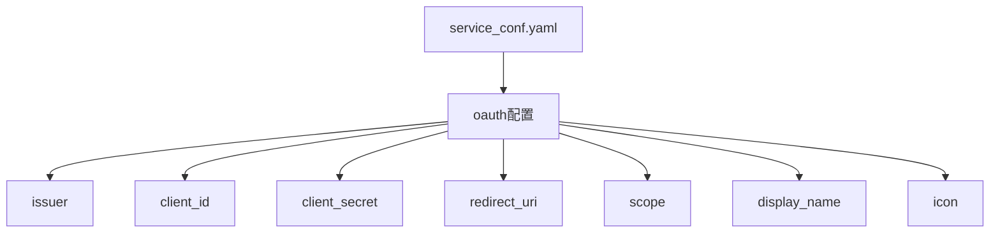
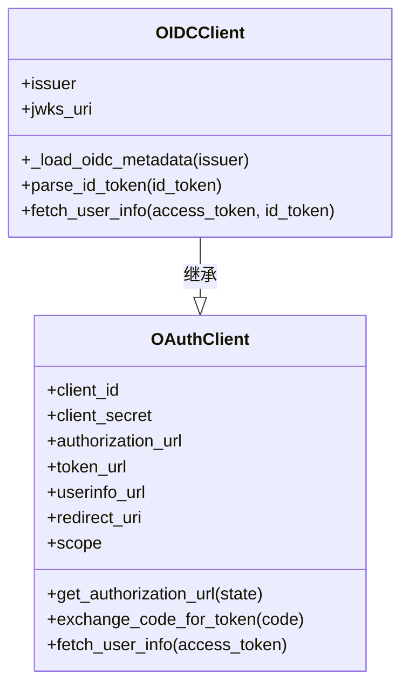
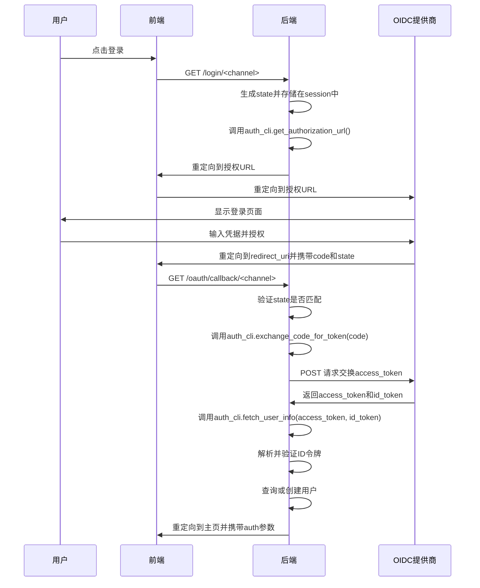

# OIDC 配置

<cite>
**本文档中引用的文件**   
- [service_conf.yaml](file://conf/service_conf.yaml)
- [oidc.py](file://api/apps/auth/oidc.py)
- [oauth.py](file://api/apps/auth/oauth.py)
- [auth/__init__.py](file://api/apps/auth/__init__.py)
- [user_app.py](file://api/apps/user_app.py)
- [config_utils.py](file://common/config_utils.py)
- [constants.py](file://common/constants.py)
- [settings.py](file://common/settings.py)
- [ragflow_server.py](file://api/ragflow_server.py)
</cite>

## 目录
1. [简介](#简介)
2. [配置文件详解](#配置文件详解)
3. [OIDC 客户端实现](#oidc-客户端实现)
4. [认证流程分析](#认证流程分析)
5. [与主流OIDC提供商集成](#与主流oidc提供商集成)
6. [安全注意事项](#安全注意事项)

## 简介
本文档详细介绍了如何在RAGFlow中配置OpenID Connect (OIDC) 认证。文档涵盖了在`service_conf.yaml`中设置关键参数的方法，包括issuer、client_id、client_secret和redirect_uri等。同时，文档还解释了OIDC发现端点的使用方法、ID令牌的签名验证机制，以及与主流OIDC提供商（如Auth0、Keycloak）的集成示例。此外，文档还描述了系统如何处理用户声明映射和会话管理，并提供了重要的安全注意事项。

## 配置文件详解

在RAGFlow中，OIDC配置主要通过`conf/service_conf.yaml`文件进行。该文件定义了系统与OIDC提供商通信所需的所有必要参数。



**配置参数说明：**

- **issuer**: 身份提供商的基URL。OIDC客户端可以通过`/.well-known/openid-configuration`端点动态获取身份提供商的元数据（如`authorization_url`、`token_url`、`userinfo_url`）。
- **client_id**: 分配给客户端应用程序的唯一标识符。
- **client_secret**: 客户端应用程序的密钥，用于与认证服务器通信。
- **redirect_uri**: 认证服务器在认证流程中重定向以返回结果的URI。必须与在认证服务器上注册的回调URI匹配。
- **scope**: 请求的权限范围，以空格分隔的字符串。例如，`openid profile email`。
- **display_name**: 通道名称，默认为通道ID的标题格式。
- **icon**: 图标ID，选项包括`github`、`sso`，默认为`sso`。

**Diagram sources**
- [service_conf.yaml](file://conf/service_conf.yaml#L104-L120)

**Section sources**
- [service_conf.yaml](file://conf/service_conf.yaml#L104-L120)

## OIDC 客户端实现

RAGFlow的OIDC功能通过`api/apps/auth/oidc.py`文件中的`OIDCClient`类实现。该类继承自`OAuthClient`，并利用OIDC发现机制自动获取配置。



`OIDCClient`的初始化过程如下：
1. 检查配置中是否提供了`issuer`参数。
2. 通过`issuer`的`/.well-known/openid-configuration`端点加载OIDC元数据。
3. 使用元数据中的信息（如`authorization_endpoint`、`token_endpoint`等）更新配置。
4. 调用父类`OAuthClient`的初始化方法。

ID令牌的解析和验证是通过`parse_id_token`方法实现的，该方法使用PyJWT库验证JWT签名，并检查`audience`和`issuer`等声明。

**Diagram sources**
- [oidc.py](file://api/apps/auth/oidc.py#L22-L108)
- [oauth.py](file://api/apps/auth/oauth.py#L32-L152)

**Section sources**
- [oidc.py](file://api/apps/auth/oidc.py#L22-L108)

## 认证流程分析

RAGFlow的OIDC认证流程由`api/apps/user_app.py`中的路由处理。流程包括用户登录、回调处理和用户信息获取。



**Diagram sources**
- [user_app.py](file://api/apps/user_app.py#L161-L205)
- [oidc.py](file://api/apps/auth/oidc.py#L88-L103)
- [oauth.py](file://api/apps/auth/oauth.py#L65-L86)

**Section sources**
- [user_app.py](file://api/apps/user_app.py#L161-L205)

## 与主流OIDC提供商集成

RAGFlow支持与多种主流OIDC提供商集成，如Auth0和Keycloak。集成的关键是正确配置`service_conf.yaml`文件中的参数。

### Auth0 集成示例
```yaml
oauth:
  auth0:
    type: "oidc"
    issuer: "https://your-domain.auth0.com"
    client_id: "your_client_id"
    client_secret: "your_client_secret"
    scope: "openid profile email"
    redirect_uri: "https://your-app.com/v1/user/oauth/callback/auth0"
    display_name: "Auth0"
    icon: "sso"
```

### Keycloak 集成示例
```yaml
oauth:
  keycloak:
    type: "oidc"
    issuer: "https://your-keycloak-server/auth/realms/your-realm"
    client_id: "your_client_id"
    client_secret: "your_client_secret"
    scope: "openid profile email"
    redirect_uri: "https://your-app.com/v1/user/oauth/callback/keycloak"
    display_name: "Keycloak"
    icon: "sso"
```

在配置时，需要确保`redirect_uri`与在OIDC提供商管理控制台中注册的回调URL完全匹配。

**Section sources**
- [service_conf.yaml](file://conf/service_conf.yaml#L104-L120)

## 安全注意事项

在配置和使用OIDC认证时，需要注意以下安全事项：

1. **令牌验证**: 系统必须验证ID令牌的签名，确保令牌来自可信的身份提供商。RAGFlow使用PyJWT的`PyJWKClient`从`jwks_uri`获取公钥并验证签名。

2. **防重放攻击**: 使用`state`参数来防止CSRF攻击。系统在生成授权URL时生成一个随机的`state`值并存储在session中，在回调时验证返回的`state`是否匹配。

3. **作用域请求**: 只请求必要的作用域，遵循最小权限原则。例如，如果只需要用户的基本信息，不要请求`email`作用域。

4. **客户端密钥保护**: `client_secret`是敏感信息，不应在客户端代码中暴露。确保配置文件的访问权限受到严格控制。

5. **HTTPS**: 所有与OIDC提供商的通信都应通过HTTPS进行，以防止中间人攻击。

6. **会话管理**: 系统在用户登录后创建会话，并在用户注销时正确销毁会话。

**Section sources**
- [oidc.py](file://api/apps/auth/oidc.py#L60-L85)
- [user_app.py](file://api/apps/user_app.py#L185-L189)