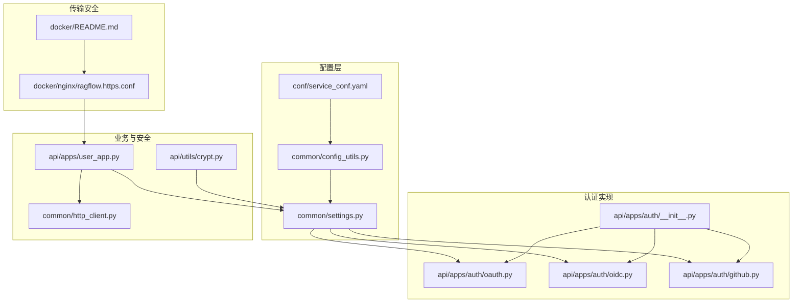
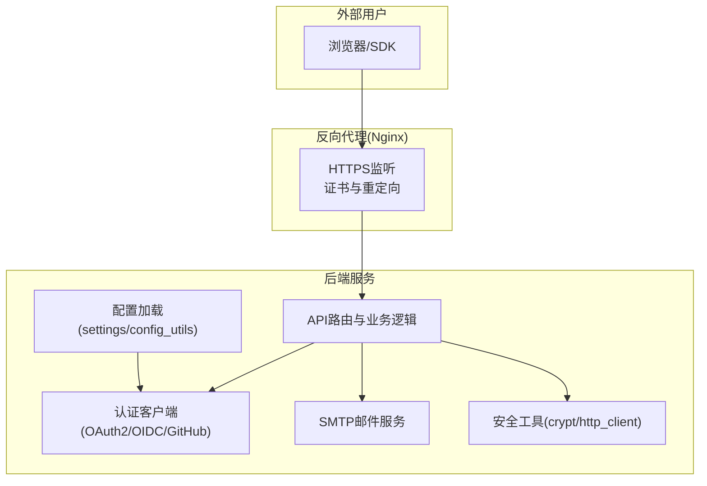
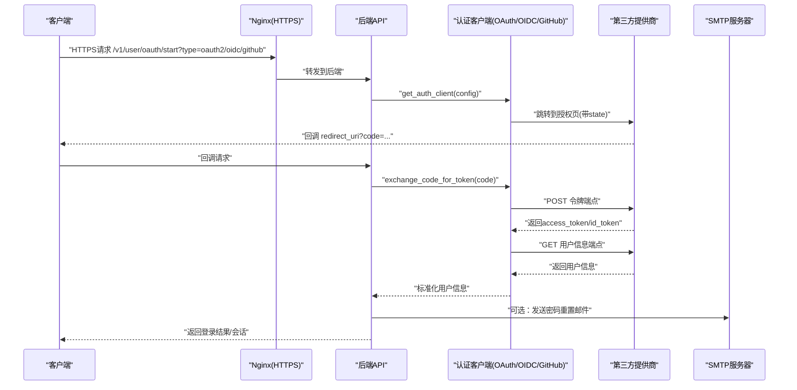
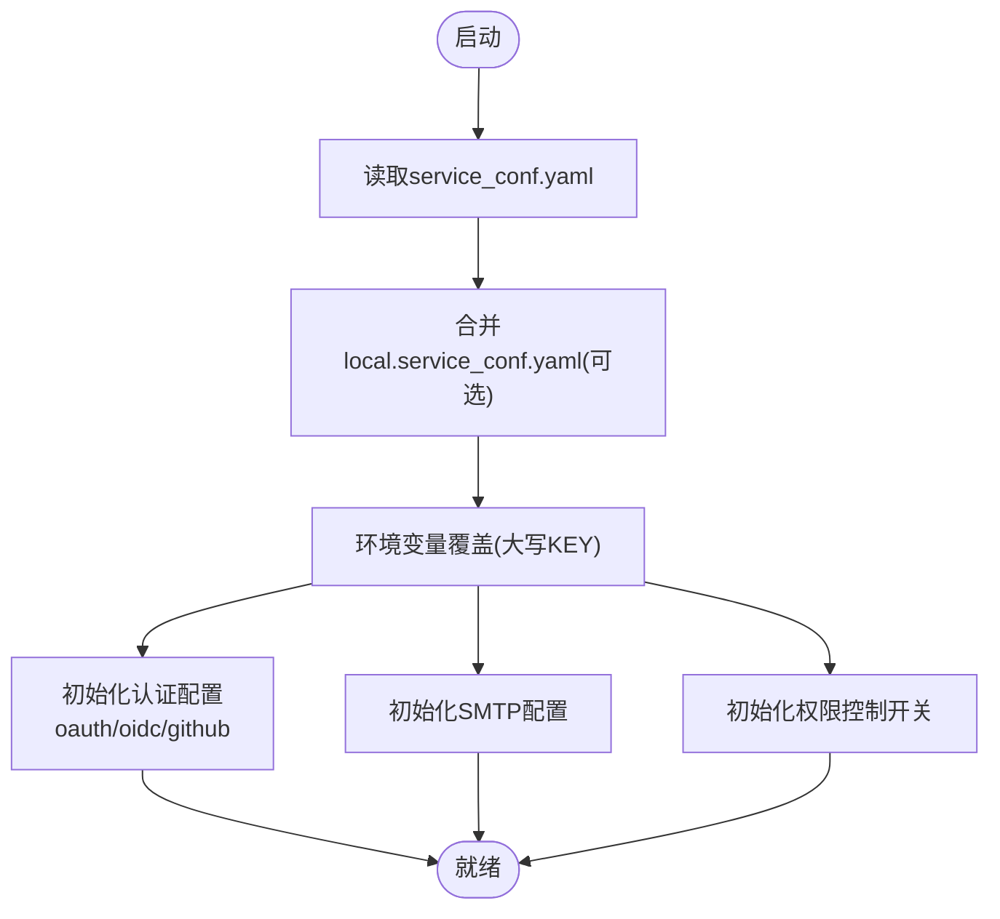
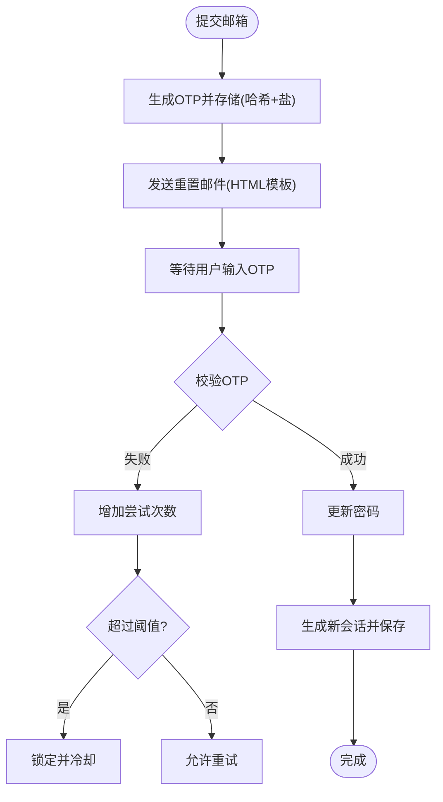
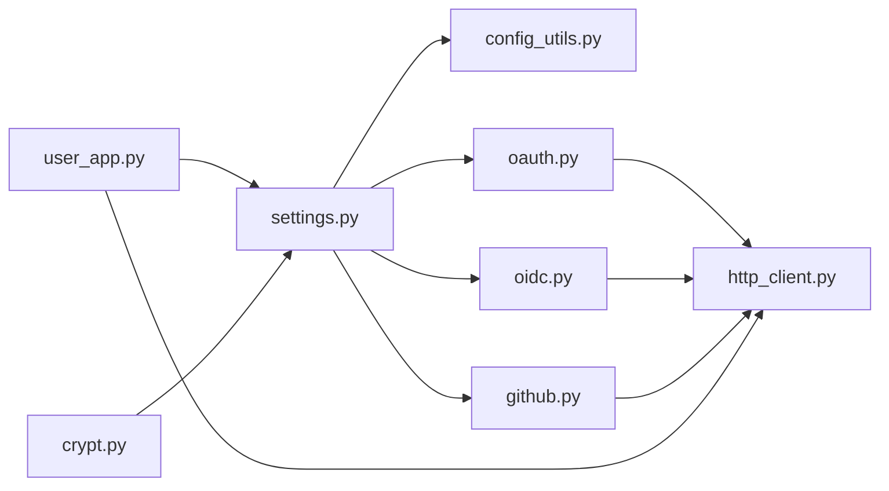

# 认证与安全配置

<cite>
**本文引用的文件**
- [service_conf.yaml](file://conf/service_conf.yaml)
- [oauth.py](file://api/apps/auth/oauth.py)
- [oidc.py](file://api/apps/auth/oidc.py)
- [github.py](file://api/apps/auth/github.py)
- [__init__.py](file://api/apps/auth/__init__.py)
- [settings.py](file://common/settings.py)
- [config_utils.py](file://common/config_utils.py)
- [crypt.py](file://api/utils/crypt.py)
- [user_app.py](file://api/apps/user_app.py)
- [http_client.py](file://common/http_client.py)
- [ragflow.https.conf](file://docker/nginx/ragflow.https.conf)
- [docker/README.md](file://docker/README.md)
</cite>

## 目录
1. [简介](#简介)
2. [项目结构](#项目结构)
3. [核心组件](#核心组件)
4. [架构总览](#架构总览)
5. [详细组件分析](#详细组件分析)
6. [依赖关系分析](#依赖关系分析)
7. [性能与安全考量](#性能与安全考量)
8. [故障排查指南](#故障排查指南)
9. [结论](#结论)

## 简介
本指南聚焦于RAGFlow的认证与安全配置，覆盖以下主题：
- 第三方认证：OAuth2、OIDC、GitHub登录的配置要点与流程
- 在配置文件与环境变量中安全地管理client_id、client_secret、redirect_uri等敏感参数
- SMTP邮件服务配置（用于密码重置等场景）
- 安全最佳实践：使用HTTPS、定期轮换密钥、权限控制开关（permission.switch）

## 项目结构
围绕认证与安全的关键目录与文件：
- 配置文件：conf/service_conf.yaml
- 认证客户端实现：api/apps/auth/oauth.py、api/apps/auth/oidc.py、api/apps/auth/github.py
- 认证入口与类型分发：api/apps/auth/__init__.py
- 运行时配置加载与环境变量解析：common/settings.py、common/config_utils.py
- 密码加密/解密工具：api/utils/crypt.py
- SMTP与密码重置流程：api/apps/user_app.py
- 安全传输：docker/nginx/ragflow.https.conf、docker/README.md
- HTTP请求日志脱敏：common/http_client.py

图表来源
- [service_conf.yaml](file://conf/service_conf.yaml#L104-L149)
- [config_utils.py](file://common/config_utils.py#L55-L116)
- [settings.py](file://common/settings.py#L229-L303)
- [oauth.py](file://api/apps/auth/oauth.py#L32-L62)
- [oidc.py](file://api/apps/auth/oidc.py#L22-L44)
- [github.py](file://api/apps/auth/github.py#L21-L33)
- [__init__.py](file://api/apps/auth/__init__.py#L22-L40)
- [user_app.py](file://api/apps/user_app.py#L900-L1015)
- [http_client.py](file://common/http_client.py#L52-L74)
- [crypt.py](file://api/utils/crypt.py#L25-L42)
- [ragflow.https.conf](file://docker/nginx/ragflow.https.conf#L1-L46)
- [docker/README.md](file://docker/README.md#L208-L269)

章节来源
- [service_conf.yaml](file://conf/service_conf.yaml#L104-L149)
- [config_utils.py](file://common/config_utils.py#L55-L116)
- [settings.py](file://common/settings.py#L229-L303)

## 核心组件
- OAuth2/OIDC/GitHub客户端
  - OAuthClient：封装通用OAuth2流程（授权URL生成、交换令牌、获取用户信息）
  - OIDCClient：基于issuer自动发现元数据，支持ID Token签名验证
  - GithubOAuthClient：针对GitHub的特殊用户信息与邮箱拉取
- 认证入口与类型分发
  - get_auth_client：根据配置类型或issuer自动选择OAuth2/OIDC/GitHub
- 运行时配置与环境变量
  - settings：从service_conf.yaml与环境变量读取认证、SMTP、权限等配置
  - config_utils：统一读取、合并、展示配置，并对敏感字段进行脱敏显示
- 密码加密/解密
  - crypt：RSA加解密，用于前端/管理端与后端之间的安全交互
- SMTP与密码重置
  - user_app：OTP生成、存储、校验与邮件发送；失败锁定与冷却
- 传输安全
  - Nginx HTTPS配置与证书部署指引

章节来源
- [oauth.py](file://api/apps/auth/oauth.py#L32-L152)
- [oidc.py](file://api/apps/auth/oidc.py#L22-L108)
- [github.py](file://api/apps/auth/github.py#L21-L89)
- [__init__.py](file://api/apps/auth/__init__.py#L22-L40)
- [settings.py](file://common/settings.py#L229-L303)
- [config_utils.py](file://common/config_utils.py#L78-L116)
- [crypt.py](file://api/utils/crypt.py#L25-L42)
- [user_app.py](file://api/apps/user_app.py#L900-L1015)
- [ragflow.https.conf](file://docker/nginx/ragflow.https.conf#L1-L46)
- [docker/README.md](file://docker/README.md#L208-L269)

## 架构总览
下图展示了认证与安全配置在系统中的位置与交互关系。

图表来源
- [ragflow.https.conf](file://docker/nginx/ragflow.https.conf#L1-L46)
- [settings.py](file://common/settings.py#L229-L303)
- [config_utils.py](file://common/config_utils.py#L55-L116)
- [oauth.py](file://api/apps/auth/oauth.py#L32-L152)
- [oidc.py](file://api/apps/auth/oidc.py#L22-L108)
- [github.py](file://api/apps/auth/github.py#L21-L89)
- [user_app.py](file://api/apps/user_app.py#L900-L1015)
- [http_client.py](file://common/http_client.py#L52-L74)
- [crypt.py](file://api/utils/crypt.py#L25-L42)

## 详细组件分析

### OAuth2/OIDC/GitHub认证流程
- OAuth2
  - 初始化：client_id、client_secret、authorization_url、token_url、userinfo_url、redirect_uri、scope
  - 授权URL生成：拼接client_id、redirect_uri、response_type、可选scope与state
  - 交换令牌：使用client_id、client_secret、code、redirect_uri、grant_type
  - 获取用户信息：携带Bearer Token访问userinfo_url，标准化为email、username、nickname、avatar_url
- OIDC
  - 基于issuer自动发现元数据（authorization_endpoint、token_endpoint、userinfo_endpoint、jwks_uri）
  - 解析并验证ID Token：使用PyJWKClient从jwks_uri获取签名密钥，验证签名校验、audience与issuer
  - 合并用户信息：优先从ID Token提取，再叠加access_token获取到的用户信息
- GitHub
  - 固定授权/令牌/用户信息端点与默认scope
  - 拉取用户信息后，额外调用邮箱列表接口以确定主邮箱

图表来源
- [oauth.py](file://api/apps/auth/oauth.py#L48-L152)
- [oidc.py](file://api/apps/auth/oidc.py#L22-L108)
- [github.py](file://api/apps/auth/github.py#L21-L89)
- [__init__.py](file://api/apps/auth/__init__.py#L22-L40)
- [user_app.py](file://api/apps/user_app.py#L900-L1015)

章节来源
- [oauth.py](file://api/apps/auth/oauth.py#L32-L152)
- [oidc.py](file://api/apps/auth/oidc.py#L22-L108)
- [github.py](file://api/apps/auth/github.py#L21-L89)
- [__init__.py](file://api/apps/auth/__init__.py#L22-L40)

### 配置文件与环境变量管理
- 配置文件位置与结构
  - conf/service_conf.yaml包含oauth、authentication、permission、smtp等块
  - oauth块下支持oauth2、oidc、github三类配置
  - authentication块包含client与site两类开关与密钥
  - permission块包含全局开关与资源级权限控制开关
  - smtp块包含邮件服务器、端口、SSL/TLS、用户名、密码、默认发件人、前端地址等
- 运行时加载与环境变量覆盖
  - settings从service_conf.yaml读取基础配置，并优先从环境变量覆盖
  - config_utils提供统一读取、合并、展示配置的能力，并对敏感字段进行脱敏显示
  - 支持通过update_config写回配置文件（受文件锁保护）

图表来源
- [service_conf.yaml](file://conf/service_conf.yaml#L104-L149)
- [config_utils.py](file://common/config_utils.py#L55-L116)
- [settings.py](file://common/settings.py#L229-L303)

章节来源
- [service_conf.yaml](file://conf/service_conf.yaml#L104-L149)
- [config_utils.py](file://common/config_utils.py#L55-L116)
- [settings.py](file://common/settings.py#L229-L303)

### SMTP邮件服务配置与密码重置
- SMTP配置项
  - mail_server、mail_port、mail_use_ssl、mail_use_tls、mail_username、mail_password、mail_default_sender、mail_frontend_url
- 密码重置流程
  - 生成OTP并哈希存储于Redis，设置TTL与尝试次数上限
  - 发送HTML模板邮件（包含OTP与有效期提示）
  - 校验OTP（大小写不敏感）、成功后更新密码并自动登录
  - 失败达到阈值进行临时锁定与冷却

图表来源
- [user_app.py](file://api/apps/user_app.py#L900-L1015)

章节来源
- [user_app.py](file://api/apps/user_app.py#L900-L1015)

### 安全最佳实践
- 使用HTTPS
  - 通过Nginx HTTPS配置与证书部署，强制HTTPS访问并启用证书链
  - 参考docker/nginx/ragflow.https.conf与docker/README.md中的证书获取与挂载步骤
- 环境变量管理敏感信息
  - 将client_id、client_secret、http_app_key、http_secret_key、mail_password等置于环境变量
  - settings与config_utils优先从环境变量读取，避免明文写入配置文件
- 轮换与最小暴露
  - 定期轮换client_secret与SMTP密码
  - 对外仅暴露必要域名与端口，限制回调地址范围
- 权限控制
  - permission.switch与资源级开关（component/dataset）用于精细化权限治理
  - 结合角色与资源权限模型进行最小权限授权

章节来源
- [ragflow.https.conf](file://docker/nginx/ragflow.https.conf#L1-L46)
- [docker/README.md](file://docker/README.md#L208-L269)
- [config_utils.py](file://common/config_utils.py#L78-L116)
- [settings.py](file://common/settings.py#L229-L303)
- [service_conf.yaml](file://conf/service_conf.yaml#L127-L149)

## 依赖关系分析
- 组件耦合
  - 认证客户端依赖HTTP客户端进行第三方调用
  - settings依赖config_utils进行配置读取与环境变量覆盖
  - user_app依赖SMTP配置与Redis进行密码重置流程
- 外部依赖
  - OIDC依赖PyJWT与PyJWKClient进行ID Token验证
  - 加解密依赖RSA公私钥对（conf/public.pem、conf/private.pem）

图表来源
- [settings.py](file://common/settings.py#L229-L303)
- [config_utils.py](file://common/config_utils.py#L55-L116)
- [oauth.py](file://api/apps/auth/oauth.py#L17-L20)
- [oidc.py](file://api/apps/auth/oidc.py#L17-L20)
- [github.py](file://api/apps/auth/github.py#L17-L20)
- [user_app.py](file://api/apps/user_app.py#L900-L1015)
- [http_client.py](file://common/http_client.py#L52-L74)
- [crypt.py](file://api/utils/crypt.py#L25-L42)

章节来源
- [settings.py](file://common/settings.py#L229-L303)
- [config_utils.py](file://common/config_utils.py#L55-L116)
- [oauth.py](file://api/apps/auth/oauth.py#L17-L20)
- [oidc.py](file://api/apps/auth/oidc.py#L17-L20)
- [github.py](file://api/apps/auth/github.py#L17-L20)
- [user_app.py](file://api/apps/user_app.py#L900-L1015)
- [http_client.py](file://common/http_client.py#L52-L74)
- [crypt.py](file://api/utils/crypt.py#L25-L42)

## 性能与安全考量
- 认证调用超时与重试
  - OAuth客户端内部设置HTTP请求超时，避免阻塞
  - HTTP客户端对敏感URL参数进行脱敏记录，降低泄露风险
- 密码重置防刷
  - Redis计数与锁定机制，限制尝试次数与冷却时间
- 传输安全
  - 强制HTTPS，使用完整证书链，避免自签名在生产环境使用
- 配置安全
  - 敏感字段在日志与展示中进行脱敏
  - 通过环境变量注入密钥，减少磁盘暴露面

章节来源
- [oauth.py](file://api/apps/auth/oauth.py#L45-L62)
- [http_client.py](file://common/http_client.py#L52-L74)
- [user_app.py](file://api/apps/user_app.py#L900-L1015)
- [ragflow.https.conf](file://docker/nginx/ragflow.https.conf#L1-L46)

## 故障排查指南
- OAuth/OIDC/GitHub回调失败
  - 检查redirect_uri是否与第三方应用配置一致
  - 确认client_id、client_secret正确且未过期
  - 查看回调URL是否被Nginx正确转发至后端
- OIDC ID Token验证失败
  - 确认issuer可达且/.well-known/openid-configuration可访问
  - 检查jwks_uri是否可正常获取公钥
  - 校验audience与issuer匹配
- SMTP无法发送邮件
  - 检查mail_server、mail_port、SSL/TLS配置
  - 校验mail_username、mail_password是否正确
  - 确认防火墙与网络策略允许出站SMTP端口
- 密码重置失败
  - 检查Redis连通性与键空间
  - 核对邮件模板与前端URL配置
  - 关注失败锁定与冷却时间

章节来源
- [oauth.py](file://api/apps/auth/oauth.py#L65-L152)
- [oidc.py](file://api/apps/auth/oidc.py#L46-L108)
- [github.py](file://api/apps/auth/github.py#L35-L89)
- [user_app.py](file://api/apps/user_app.py#L900-L1015)
- [settings.py](file://common/settings.py#L284-L303)

## 结论
通过将敏感配置置于环境变量、采用HTTPS传输、结合严格的权限控制与防刷机制，RAGFlow能够在保证易用性的同时提升整体安全性。建议在生产环境中：
- 全面启用HTTPS并使用可信证书
- 使用环境变量管理所有client_secret与SMTP密码
- 定期轮换密钥与检查权限策略
- 对回调地址与域名进行严格白名单控制
- 在日志与监控中持续观察认证异常与重试行为